# 2.5. Strategic-Level Domain-Driven Design
## 2.5.1 EventStorming 

El equipo realizó una sesión utilizando Miro con el objetivo de comprender los principales procesos del dominio de AniTec. Durante la actividad se identificaron actores, comandos, eventos de dominio y políticas relacionadas con la gestión de animales, historial sanitario, colaboración veterinaria, recordatorios, suscripciones y sincronización de información.
La sesión permitió obtener una visión global del negocio.
**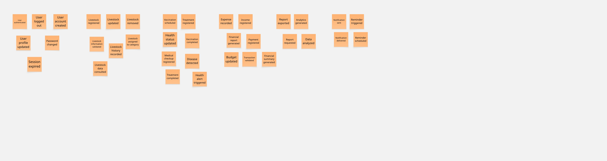**
**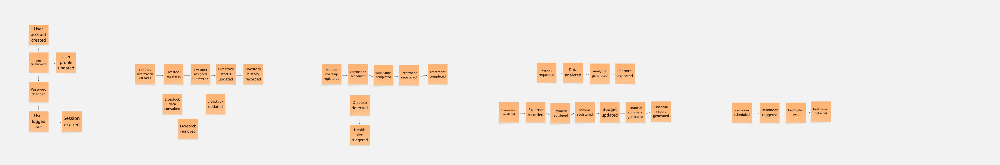** 
**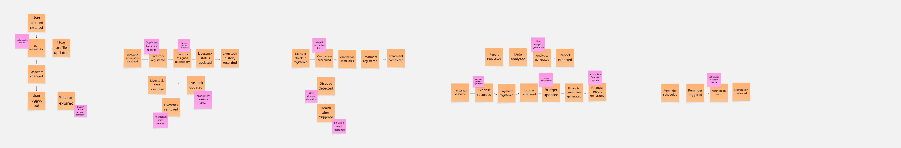** Event Storming del dominio AniTec realizado en Miro.

## 2.5.1.1 Candidate Context Discovery

rtir del Event Storming realizado en Miro, se llevó a cabo una sesión de Candidate Context Discovery con el objetivo de identificar los posibles Bounded Contexts del dominio de AniTec. Para ello, se utilizó la estrategia Start-with-Value, agrupando los eventos de negocio según las responsabilidades y funcionalidades que aportan valor a los usuarios del sistema.

Durante la sesión se analizaron los eventos identificados en el Event Storming y se organizaron en áreas funcionales con reglas de negocio y objetivos específicos. Este proceso permitió delimitar los principales contextos del dominio y comprender mejor la separación de responsabilidades dentro de la solución.

**Figura X.** Agrupación de eventos realizada durante la sesión de Candidate Context Discovery.

### Bounded Contexts identificados
#### Gestión de Usuarios y Acceso

Responsable de la autenticación, administración de perfiles y gestión de sesiones de los usuarios.

**Eventos asociados:**

- User account created

- User authenticated 

- User profile updated

- Password changed

- User logged out
 
- Session expired

 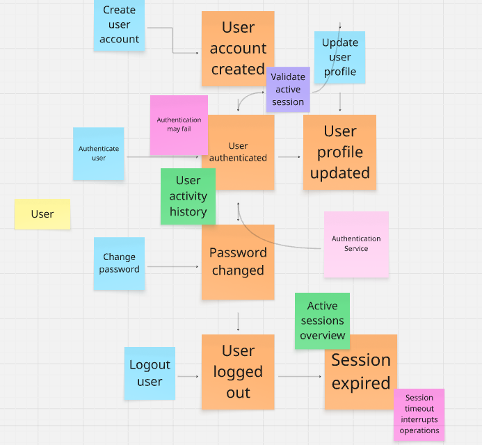

#### Gestión de Animales

Responsable del registro y administración de la información de los animales.

**Eventos asociados:**
- Liveestock information validated
 
- Livestock registered
  
- Livestock assigned to category
  
- Livestock status updated
  
- Livestock history recorded
  
- Livestock data consulted
  
- Livestock updated
  
- Livestock removed
 
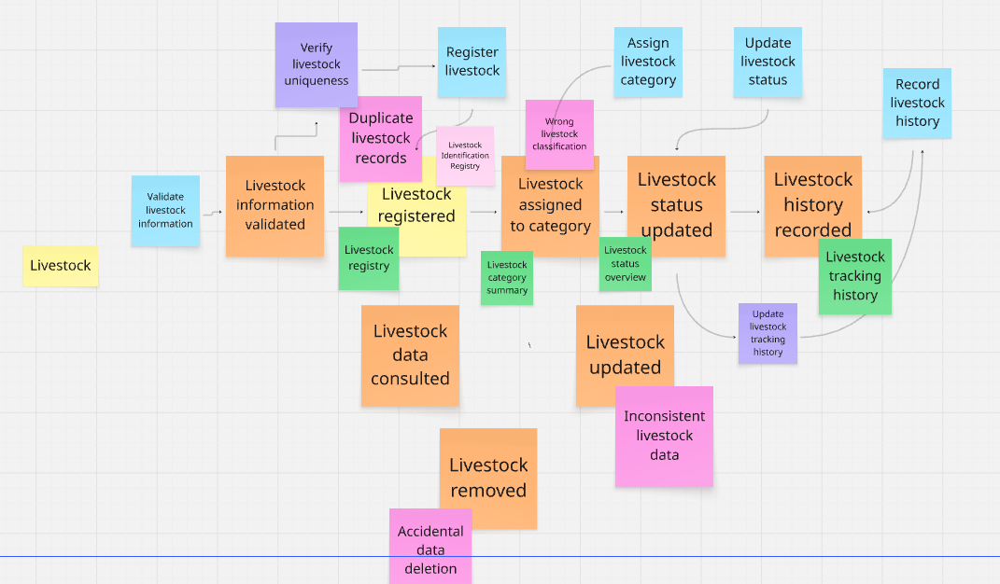

#### Salud Animal

Responsable del seguimiento sanitario de los animales y del control de tratamientos y vacunaciones.

**Eventos asociados:**

- Medical checkup registered
  
- Vaccination scheduled
  
- Vaccination completed
  
- Treatment registered
  
- Treatment completed
  
- Disease detected
  
- Health alert triggered

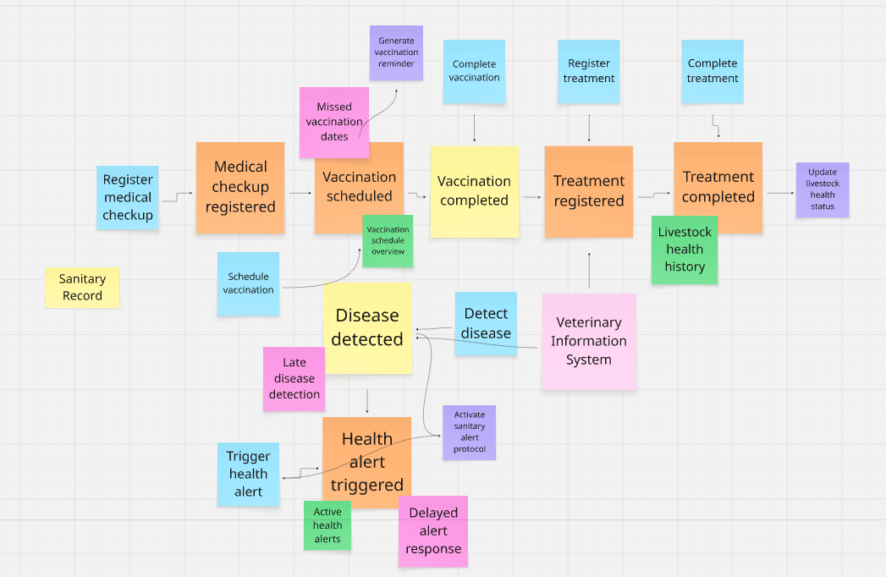

#### Analítica y Reportes

Responsable de la generación de indicadores, análisis y reportes para apoyar la toma de decisiones.

**Eventos asociados:**

- Report requested
  
- Data analyzed

- Analytics generated

- Report exported

 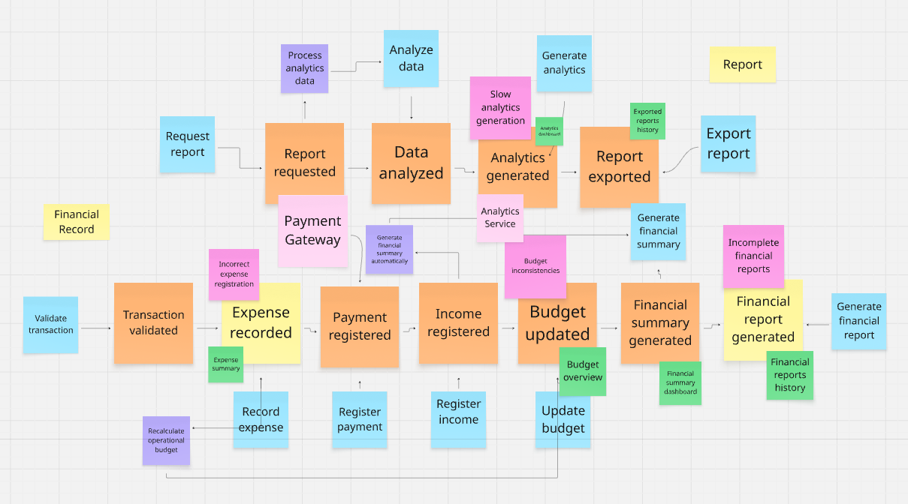

#### Finanzas
Responsable de la gestión de ingresos, gastos y control financiero de la explotación ganadera.

## 2.5.1.2 Domain Message Flows Modeling

Una vez identificados los Candidate Bounded Contexts, se realizó el modelado de los Domain Message Flows mediante la técnica de Domain Storytelling. El objetivo fue visualizar cómo colaboran los diferentes bounded contexts para atender los principales procesos de negocio de AniTec y satisfacer las necesidades de los ganaderos y veterinarios.

Los diagramas elaborados permitieron identificar el intercambio de información entre contextos, así como las responsabilidades de cada uno dentro de los flujos principales del sistema.

---

### Historia 1: Registro de animales

Este flujo representa el proceso mediante el cual un ganadero registra un nuevo animal en el sistema.

**Contextos involucrados:**

- Gestión de Animales

- Sincronización Offline
  
  **Flujo principal:**
  
1. El ganadero registra un nuevo animal.
   
2. Gestión de Animales valida la información.
  
3. El animal es almacenado en el sistema.
  
4. La información se sincroniza o queda almacenada localmente si no existe conexión.
 
   **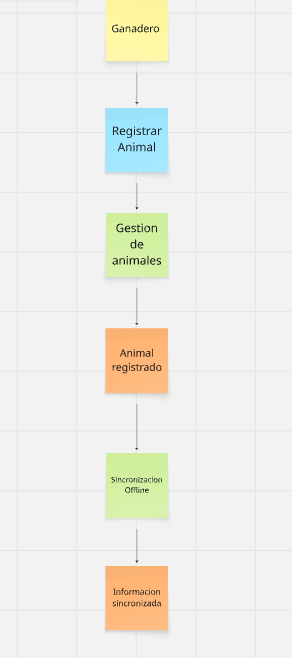** Domain Storytelling del proceso de registro de animales.
 
---

### Historia 2: Seguimiento sanitario

Este flujo representa el registro de vacunaciones y tratamientos realizados a un animal.

**Contextos involucrados:**

- Gestión de Animales
  
- Salud Animal
 
- Recordatorios y Notificaciones
 
  **Flujo principal:**
 
1. El ganadero selecciona un animal.

2. Registra una vacunación o tratamiento.
  
3. Salud Animal actualiza el historial sanitario.
 
4. Se programa un recordatorio de seguimiento.
 
5. El sistema envía una notificación cuando corresponde.

   **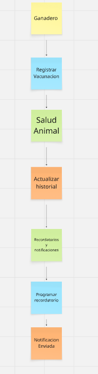** Domain Storytelling del proceso de seguimiento sanitario.
 
---

### Historia 3: Atención veterinaria

Este flujo representa la colaboración entre el ganadero y el veterinario autorizado.

**Contextos involucrados:**

- Colaboración Veterinaria
 
- Salud Animal
 
  **Flujo principal:**
 
1. El veterinario consulta el historial sanitario.
 
2. Salud Animal proporciona la información requerida.
 
3. El veterinario registra una atención o tratamiento.
 
4. El historial sanitario se actualiza.

   **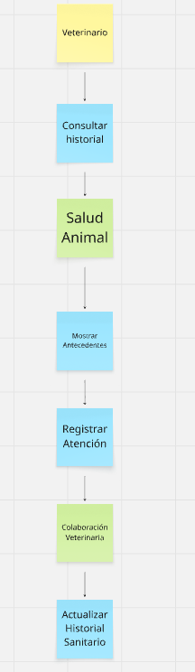** Domain Storytelling del proceso de atención veterinaria.
 
---

### Historia 4: Reportes e indicadores

Este flujo representa la generación de indicadores y reportes para la toma de decisiones.

**Contextos involucrados:**

- Gestión de Animales
 
- Salud Animal
  
- Finanzas
  
- Analítica y Reportes
  **Flujo principal:**
 
1. El usuario solicita un reporte o dashboard.
 
2. Analítica y Reportes recopila información de los demás contextos.

3. Los datos son procesados y analizados.
 
4. Se generan indicadores y reportes para el usuario.
 
   **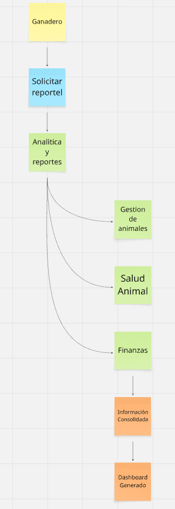** Domain Storytelling del proceso de generación de reportes e indicadores.

## 2.5.1.3 Bounded Context Canvases

Una vez identificados los Candidate Bounded Contexts, se procedió a documentarlos mediante la técnica **Bounded Context Canvas**. Esta actividad permitió definir aspectos relevantes de cada contexto, como su propósito, clasificación estratégica, roles del dominio, lenguaje ubicuo, comunicaciones, decisiones de negocio, supuestos, métricas de validación y preguntas abiertas.

Para la elaboración de los canvases se siguió un proceso iterativo compuesto por las etapas de **Context Overview Definition**, **Business Rules Distillation & Ubiquitous Language Capture**, **Capability Analysis**, **Dependencies Capture** y **Design Critique**.

Como resultado, se definieron los siguientes bounded contexts principales:

- Gestión de Hato (Livestock Management).
  
- Salud Animal (Animal Health).
  
- Finanzas (Financial Control).
 
- Analítica y Reportes (Analytics/Dashboard).

  Cada canvas permitió delimitar responsabilidades específicas dentro del dominio y establecer las relaciones de comunicación entre contextos, facilitando una mejor comprensión de la arquitectura del negocio y de los procesos principales de AniTec.
 
  **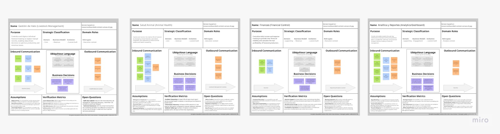** Bounded Context Canvases elaborados para los contextos Gestión de Hato, Salud Animal, Finanzas y Analítica y Reportes.

