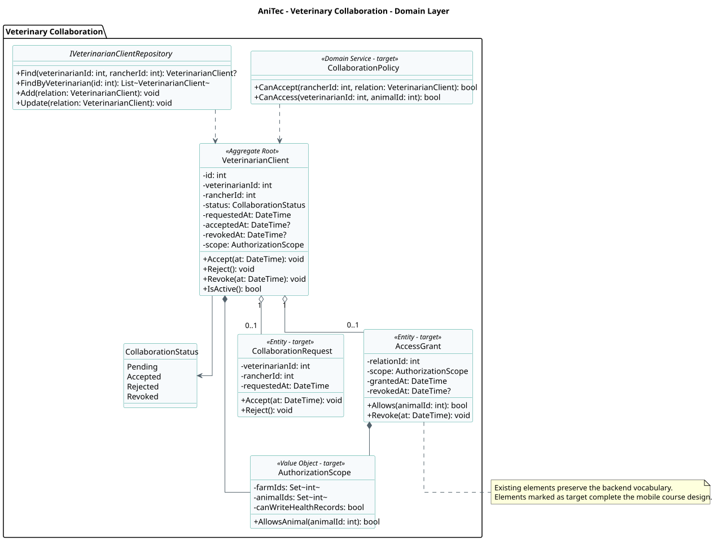
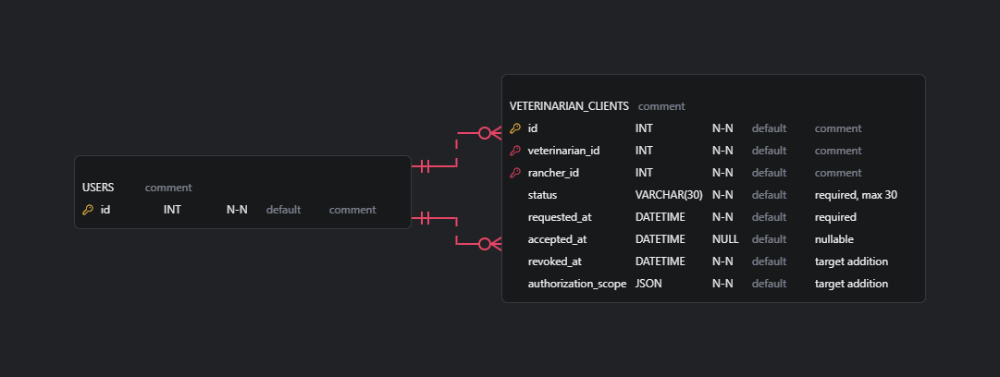
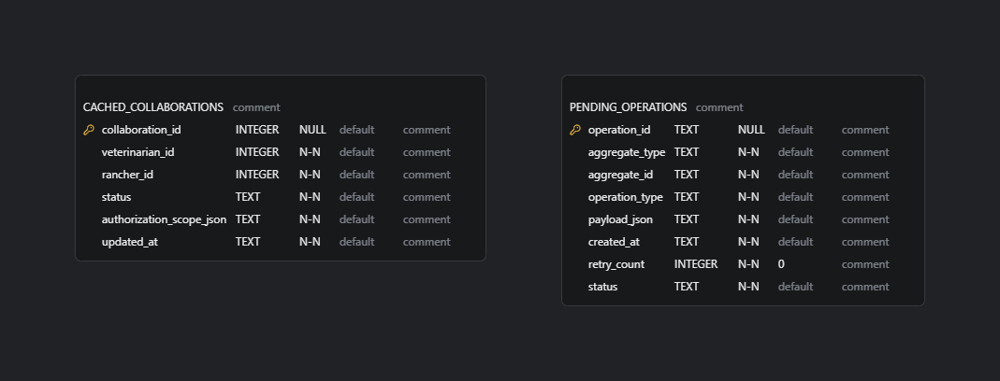

# 2.6.5. Bounded Context: Veterinary Collaboration

Administrar solicitudes y autorizaciones entre ganaderos y veterinarios, delimitando clientes, pacientes y alcance de acceso.

La base implementada se encuentra en el módulo `Clients` de la API ASP.NET Core. El diseño móvil de Android y Flutter se presenta como **diseño objetivo** porque esos clientes todavía no existen en el workspace. Los tres productos comparten contratos REST y lenguaje ubicuo, mientras la API conserva las reglas autoritativas.

## 2.6.5.1. Domain Layer

Esta capa representa el núcleo de Veterinary Collaboration. Los elementos existentes se conservarán como punto de partida; los elementos objetivo completan las invariantes identificadas en EventStorming y en el Bounded Context Canvas.

<table>
  <thead>
    <tr><th>Clase o componente</th><th>Tipo</th><th>Producto</th><th>Propósito</th><th>Responsabilidades</th></tr>
  </thead>
  <tbody>
    <tr><td>VeterinarianClient</td><td>Clase de dominio existente</td><td>Backend / módulo Clients</td><td>Representar VeterinarianClient dentro de Veterinary Collaboration.</td><td>Conservar las invariantes actualmente implementadas y servir como evidencia trazable.</td></tr>
    <tr><td>IVeterinarianClientRepository</td><td>Repository Interface existente</td><td>Backend / módulo Clients</td><td>Representar IVeterinarianClientRepository dentro de Veterinary Collaboration.</td><td>Conservar las invariantes actualmente implementadas y servir como evidencia trazable.</td></tr>
    <tr><td>CollaborationRequest</td><td>Diseño objetivo</td><td>Modelo canónico compartido</td><td>Completar el lenguaje ubicuo de Veterinary Collaboration.</td><td>Expresar reglas o conceptos requeridos por el alcance móvil que aún no están implementados en el backend heredado.</td></tr>
    <tr><td>AccessGrant</td><td>Diseño objetivo</td><td>Modelo canónico compartido</td><td>Completar el lenguaje ubicuo de Veterinary Collaboration.</td><td>Expresar reglas o conceptos requeridos por el alcance móvil que aún no están implementados en el backend heredado.</td></tr>
    <tr><td>CollaborationStatus</td><td>Diseño objetivo</td><td>Modelo canónico compartido</td><td>Completar el lenguaje ubicuo de Veterinary Collaboration.</td><td>Expresar reglas o conceptos requeridos por el alcance móvil que aún no están implementados en el backend heredado.</td></tr>
    <tr><td>AuthorizationScope</td><td>Diseño objetivo</td><td>Modelo canónico compartido</td><td>Completar el lenguaje ubicuo de Veterinary Collaboration.</td><td>Expresar reglas o conceptos requeridos por el alcance móvil que aún no están implementados en el backend heredado.</td></tr>
  </tbody>
</table>

## 2.6.5.2. Interface Layer

La Interface Layer traduce acciones de usuarios y contratos externos. En el backend utiliza controllers, resources y assemblers; en los clientes móviles utiliza pantallas y controladores de estado específicos de cada plataforma.

<table>
  <thead>
    <tr><th>Clase o componente</th><th>Tipo</th><th>Producto</th><th>Propósito</th><th>Responsabilidades</th></tr>
  </thead>
  <tbody>
    <tr><td>VeterinarianClientsController</td><td>REST Controller existente</td><td>Backend ASP.NET Core</td><td>Exponer solicitud, aceptación, revocación y consulta de clientes y pacientes.</td><td>Validar el contrato HTTP, traducir resources y delegar el caso de uso.</td></tr>
    <tr><td>AvailableRancherResource</td><td>Resource/Assembler existente</td><td>Backend ASP.NET Core</td><td>Definir el contrato público de entrada o salida.</td><td>Evitar exponer directamente entidades del dominio.</td></tr>
    <tr><td>VeterinarianClientResource</td><td>Resource/Assembler existente</td><td>Backend ASP.NET Core</td><td>Definir el contrato público de entrada o salida.</td><td>Evitar exponer directamente entidades del dominio.</td></tr>
    <tr><td>VeterinarianClientScreen</td><td>Composable objetivo</td><td>Android / Jetpack Compose</td><td>Presentar solicitud, aceptación, revocación y consulta de clientes y pacientes.</td><td>Renderizar estado, recibir acciones y mostrar errores recuperables.</td></tr>
    <tr><td>VeterinarianClientViewModel</td><td>Presentation Model objetivo</td><td>Android / Kotlin</td><td>Coordinar el estado observable de la pantalla.</td><td>Invocar casos de uso y convertir resultados en UI state.</td></tr>
    <tr><td>VeterinarianClientPage</td><td>Widget objetivo</td><td>Flutter / Dart</td><td>Presentar solicitud, aceptación, revocación y consulta de clientes y pacientes.</td><td>Renderizar estado y enviar intenciones del usuario.</td></tr>
    <tr><td>VeterinarianClientController</td><td>State Controller objetivo</td><td>Flutter / Dart</td><td>Coordinar el estado de presentación.</td><td>Invocar casos de uso y publicar estados de carga, éxito y error.</td></tr>
  </tbody>
</table>

## 2.6.5.3. Application Layer

La Application Layer orquesta comandos, consultas y sincronización. Los casos de uso móviles consultan primero el read model local, solicitan actualización remota cuando existe conectividad y procesan operaciones pendientes mediante un outbox idempotente.

<table>
  <thead>
    <tr><th>Clase o componente</th><th>Tipo</th><th>Producto</th><th>Propósito</th><th>Responsabilidades</th></tr>
  </thead>
  <tbody>
    <tr><td>VeterinarianClientCommandService</td><td>Application Service existente</td><td>Backend ASP.NET Core</td><td>Orquestar solicitud, aceptación, revocación y consulta de clientes y pacientes.</td><td>Coordinar repositorios, reglas del dominio y Unit of Work.</td></tr>
    <tr><td>VeterinarianClientQueryService</td><td>Application Service existente</td><td>Backend ASP.NET Core</td><td>Orquestar solicitud, aceptación, revocación y consulta de clientes y pacientes.</td><td>Coordinar repositorios, reglas del dominio y Unit of Work.</td></tr>
    <tr><td>CreateVeterinarianClientCommand</td><td>Command/Query existente</td><td>Backend ASP.NET Core</td><td>Representar una intención o consulta explícita.</td><td>Transportar datos tipados hacia el servicio de aplicación correspondiente.</td></tr>
    <tr><td>DeleteVeterinarianClientCommand</td><td>Command/Query existente</td><td>Backend ASP.NET Core</td><td>Representar una intención o consulta explícita.</td><td>Transportar datos tipados hacia el servicio de aplicación correspondiente.</td></tr>
    <tr><td>GetVeterinarianClientsByVeterinarianIdQuery</td><td>Command/Query existente</td><td>Backend ASP.NET Core</td><td>Representar una intención o consulta explícita.</td><td>Transportar datos tipados hacia el servicio de aplicación correspondiente.</td></tr>
    <tr><td>VeterinarianClientCommandHandler</td><td>Command Handler objetivo</td><td>Backend ASP.NET Core</td><td>Ejecutar comandos mediante una unidad de aplicación explícita.</td><td>Cargar el agregado, aplicar sus reglas, persistirlo y publicar el resultado.</td></tr>
    <tr><td>VeterinarianClientEventHandler</td><td>Event Handler objetivo</td><td>Backend ASP.NET Core</td><td>Reaccionar a cambios confirmados en el contexto.</td><td>Actualizar proyecciones o solicitar integraciones sin acoplarlas al agregado.</td></tr>
    <tr><td>ObserveVeterinarianClientUseCase</td><td>Use Case objetivo</td><td>Android y Flutter</td><td>Consultar el read model local y actualizar la UI.</td><td>Combinar caché local con actualización remota.</td></tr>
    <tr><td>SyncVeterinarianClientUseCase</td><td>Use Case objetivo</td><td>Android y Flutter</td><td>Sincronizar cambios pendientes.</td><td>Procesar el outbox de forma idempotente y resolver resultados del servidor.</td></tr>
  </tbody>
</table>

## 2.6.5.4. Infrastructure Layer

La Infrastructure Layer conecta el dominio con IAM, Profiles y Livestock. Los adapters implementan interfaces definidas hacia el interior y traducen errores técnicos a resultados comprendidos por los casos de uso.

<table>
  <thead>
    <tr><th>Clase o componente</th><th>Tipo</th><th>Producto</th><th>Propósito</th><th>Responsabilidades</th></tr>
  </thead>
  <tbody>
    <tr><td>VeterinarianClientRepository</td><td>Repository Adapter existente</td><td>Backend / Entity Framework Core</td><td>Implementar los puertos de persistencia del dominio.</td><td>Consultar y guardar las entidades mediante AppDbContext y MySQL.</td></tr>
    <tr><td>ModelBuilderExtensions</td><td>Persistence Configuration existente</td><td>Backend / Entity Framework Core</td><td>Configurar tablas, columnas, constraints y conversiones.</td><td>Mantener el modelo relacional alineado con las entidades.</td></tr>
    <tr><td>VeterinarianClientApiDataSource</td><td>Remote Adapter objetivo</td><td>Android / Kotlin</td><td>Consumir los endpoints REST del contexto.</td><td>Enviar JWT, serializar JSON y normalizar errores HTTP.</td></tr>
    <tr><td>VeterinarianClientDao</td><td>Room Adapter objetivo</td><td>Android / Room</td><td>Acceder al almacenamiento local.</td><td>Mantener caché, estado de sincronización y operaciones pendientes.</td></tr>
    <tr><td>VeterinarianClientRemoteDataSource</td><td>Remote Adapter objetivo</td><td>Flutter / Dart</td><td>Consumir los mismos contratos REST.</td><td>Serializar DTOs y traducir errores de red.</td></tr>
    <tr><td>VeterinarianClientLocalDataSource</td><td>SQLite Adapter objetivo</td><td>Flutter / Dart</td><td>Acceder a la persistencia local equivalente.</td><td>Mantener el mismo comportamiento offline que Android.</td></tr>
    <tr><td>IAM, Profiles y Livestock</td><td>Integración/ACL</td><td>Infraestructura compartida</td><td>Conectar el contexto con capacidades externas.</td><td>Traducir contratos técnicos sin contaminar el modelo del dominio.</td></tr>
  </tbody>
</table>

## 2.6.5.5. Bounded Context Software Architecture Component Level Diagrams

El archivo [`component-level.dsl`](<../../assets/codefordiagrams/2.6.5. Bounded Context Veterinary Collaboration/component-level.dsl>) contiene las vistas `BC5-ApiComponents`, `BC5-AndroidComponents` y `BC5-FlutterComponents`. Las tres parten del mismo modelo C4 y muestran la separación entre presentación, aplicación, dominio y adaptadores.

  <!-- Placeholder: exportar la vista BC5-ApiComponents. -->
  
  
<i>Figura 2.6.5.1. Componentes de la API para Veterinary Collaboration. Fuente: elaboración propia con Structurizr DSL.</i>

  <!-- Placeholder: exportar la vista BC5-AndroidComponents. -->
  
  
<i>Figura 2.6.5.2. Componentes Android para Veterinary Collaboration. Fuente: elaboración propia con Structurizr DSL.</i>

  <!-- Placeholder: exportar la vista BC5-FlutterComponents. -->
  
  
<i>Figura 2.6.5.3. Componentes Flutter para Veterinary Collaboration. Fuente: elaboración propia con Structurizr DSL.</i>

## 2.6.5.6. Bounded Context Software Architecture Code Level Diagrams

Los diagramas de código detallan el modelo del dominio y los objetos de persistencia. El UML diferencia los elementos existentes de las incorporaciones objetivo, mientras los esquemas SQL señalan mediante comentarios las columnas propuestas. Los archivos ERD quedan disponibles para completar la importación manual.

### 2.6.5.6.1. Bounded Context Domain Layer Class Diagrams

El Class Diagram incluye agregados, entidades, value objects, enumeraciones, servicios de dominio e interfaces de repositorio con atributos, operaciones, visibilidad y multiplicidades.

  
  
<i>Figura 2.6.5.4. Domain Layer Class Diagram de Veterinary Collaboration. Fuente: elaboración propia con PlantUML.</i>

### 2.6.5.6.2. Bounded Context Database Design Diagram

MySQL mantiene la persistencia autoritativa. Room y SQLite contienen únicamente caché, metadatos de sincronización y operaciones pendientes; no sustituyen las reglas ni la fuente de verdad del backend. En IAM, las credenciales y tokens permanecen fuera de las tablas locales y se almacenan mediante mecanismos seguros del sistema operativo.

  
  
<i>Figura 2.6.5.5. MySQL Database Design de Veterinary Collaboration. Fuente: elaboración propia a partir del esquema SQL.</i>

  
  
<i>Figura 2.6.5.6. Android Room Database Design de Veterinary Collaboration. Fuente: elaboración propia a partir del esquema SQL.</i>

