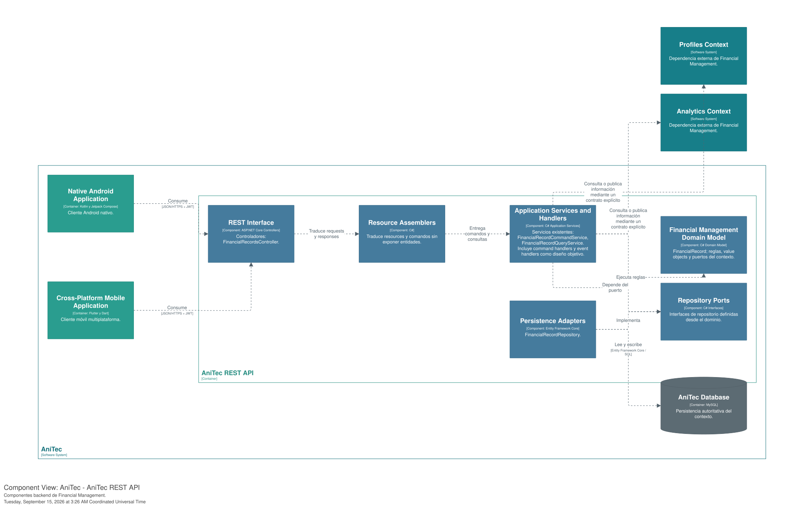
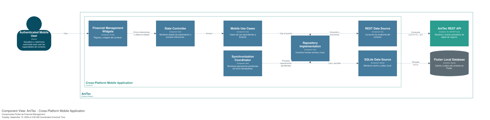
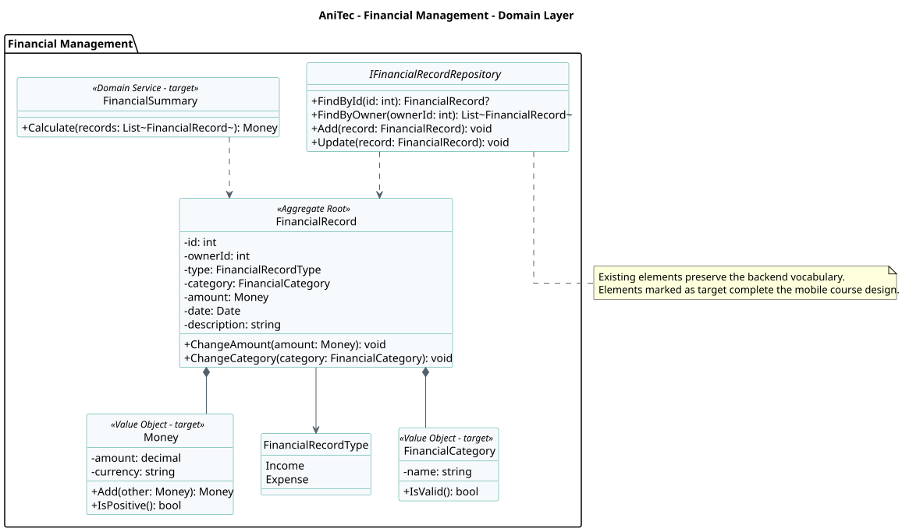
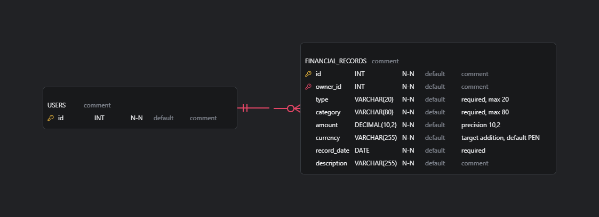
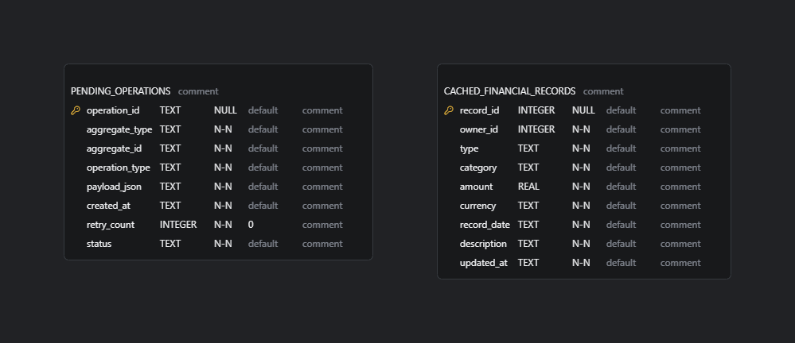

# 2.6.7. Bounded Context: Financial Management

Registrar ingresos y egresos operativos y producir resúmenes económicos básicos para apoyar decisiones del ganadero.

La base implementada se encuentra en el módulo `Financial` de la API ASP.NET Core. El diseño móvil de Android y Flutter se documenta como **no implementado** porque esos clientes todavía no existen en el workspace. Los tres productos comparten contratos REST y lenguaje ubicuo, mientras la API conserva las reglas autoritativas.

## 2.6.7.1. Domain Layer

Esta capa documenta el modelo que representa el núcleo de **Financial Management**. Las reglas autoritativas se ejecutan en la API; Android y Flutter mantienen modelos equivalentes para presentación, validación inmediata y trabajo offline. La columna de estado distingue el código heredado de la arquitectura objetivo.

### Aggregate Root: FinancialRecord

| Campo | Detalle |
|---|---|
| **Producto y estado** | Backend; modelo equivalente en Android y Flutter — **Implementado** |
| **Propósito** | Mantener un ingreso o egreso del ganadero. |
| **Relaciones** | FinancialRecord compone Money; FinancialRecord se relaciona con FinancialRecordType; FinancialRecord compone FinancialCategory; FinancialSummary depende de FinancialRecord; IFinancialRecordRepository depende de FinancialRecord |

**Atributos o dependencias**

| Nombre | Tipo |
|---|---|
| `id` | `int` |
| `ownerId` | `int` |
| `type` | `FinancialRecordType` |
| `category` | `FinancialCategory` |
| `amount` | `Money` |
| `date` | `Date` |
| `description` | `string` |

**Métodos u operaciones**

| Firma | Retorno |
|---|---|
| `ChangeAmount(amount: Money)` | `void` |
| `ChangeCategory(category: FinancialCategory)` | `void` |

### Value Object: Money

| Campo | Detalle |
|---|---|
| **Producto y estado** | Backend, Android y Flutter (modelo canónico) — **No implementado** |
| **Propósito** | Representar un importe junto con su moneda. |
| **Relaciones** | FinancialRecord compone Money |

**Atributos o dependencias**

| Nombre | Tipo |
|---|---|
| `amount` | `decimal` |
| `currency` | `string` |

**Métodos u operaciones**

| Firma | Retorno |
|---|---|
| `Add(other: Money)` | `Money` |
| `IsPositive()` | `bool` |

### Value Object: FinancialCategory

| Campo | Detalle |
|---|---|
| **Producto y estado** | Backend, Android y Flutter (modelo canónico) — **No implementado** |
| **Propósito** | Clasificar un movimiento financiero. |
| **Relaciones** | FinancialRecord compone FinancialCategory |

**Atributos o dependencias**

| Nombre | Tipo |
|---|---|
| `name` | `string` |

**Métodos u operaciones**

| Firma | Retorno |
|---|---|
| `IsValid()` | `bool` |

### Domain Service: FinancialSummary

| Campo | Detalle |
|---|---|
| **Producto y estado** | Backend, Android y Flutter (modelo canónico) — **No implementado** |
| **Propósito** | Calcular totales y balance para un conjunto de movimientos. |
| **Relaciones** | FinancialSummary depende de FinancialRecord |

**Atributos o dependencias**

No aplica.

**Métodos u operaciones**

| Firma | Retorno |
|---|---|
| `Calculate(records: List~FinancialRecord~)` | `Money` |

### Repository Interface: IFinancialRecordRepository

| Campo | Detalle |
|---|---|
| **Producto y estado** | Backend; modelo equivalente en Android y Flutter — **Implementado** |
| **Propósito** | Abstraer la persistencia de FinancialRecord. |
| **Relaciones** | IFinancialRecordRepository depende de FinancialRecord |

**Atributos o dependencias**

No aplica.

**Métodos u operaciones**

| Firma | Retorno |
|---|---|
| `FindById(id: int)` | `FinancialRecord?` |
| `FindByOwner(ownerId: int)` | `List~FinancialRecord~` |
| `Add(record: FinancialRecord)` | `void` |
| `Update(record: FinancialRecord)` | `void` |

## 2.6.7.2. Interface Layer

Esta capa recibe las acciones relacionadas con **registro de ingresos y egresos, actualización y cálculo de resúmenes** y las traduce a casos de uso. Los controllers y resources corresponden a la API; las pantallas y controladores de estado representan la presentación objetivo en Android y Flutter. Ninguna de estas clases implementa reglas de negocio.

### REST Controller: FinancialRecordsController

| Campo | Detalle |
|---|---|
| **Producto y estado** | Backend ASP.NET Core — **Implementado** |
| **Propósito** | Publicar por HTTP las capacidades de Financial Management. |
| **Relaciones** | Recibe resources, invoca servicios de aplicación y devuelve resources HTTP. |

**Atributos o dependencias**

| Nombre | Tipo |
|---|---|
| `commandService` | `IFinancialRecordCommandService` |
| `queryService` | `IFinancialRecordQueryService` |

**Métodos u operaciones**

| Firma | Retorno |
|---|---|
| `GetAll(CancellationToken cancellationToken)` | `No especificado` |
| `GetById(int id, CancellationToken cancellationToken)` | `No especificado` |
| `Create(CreateFinancialRecordResource resource, CancellationToken cancellationToken)` | `No especificado` |
| `Update(int id, CreateFinancialRecordResource resource, CancellationToken cancellationToken)` | `No especificado` |
| `Delete(int id, CancellationToken cancellationToken)` | `No especificado` |

### Presentation Model: FinancialRecordViewModel

| Campo | Detalle |
|---|---|
| **Producto y estado** | Android / Kotlin — **No implementado** |
| **Propósito** | Mantener el estado observable y traducir acciones de Android a casos de uso. |
| **Relaciones** | Invoca casos de uso de Application Layer y publica un UI State inmutable. |

**Atributos o dependencias**

| Nombre | Tipo |
|---|---|
| `state` | `No especificado` |
| `observeUseCase` | `No especificado` |
| `syncUseCase` | `No especificado` |

**Métodos u operaciones**

| Firma | Retorno |
|---|---|
| `Load()` | `No especificado` |
| `Submit(action)` | `No especificado` |
| `RetrySync()` | `No especificado` |

### State Controller: FinancialRecordController

| Campo | Detalle |
|---|---|
| **Producto y estado** | Flutter / Dart — **No implementado** |
| **Propósito** | Mantener el estado de presentación de Flutter y coordinar casos de uso. |
| **Relaciones** | Invoca Application Layer y publica estados de carga, éxito y error. |

**Atributos o dependencias**

| Nombre | Tipo |
|---|---|
| `state` | `No especificado` |
| `observeUseCase` | `No especificado` |
| `syncUseCase` | `No especificado` |

**Métodos u operaciones**

| Firma | Retorno |
|---|---|
| `load()` | `No especificado` |
| `submit(action)` | `No especificado` |
| `retrySync()` | `No especificado` |

## 2.6.7.3. Application Layer

Esta capa coordina las capacidades de **registro de ingresos y egresos, actualización y cálculo de resúmenes**. Los commands y queries expresan intenciones; los handlers cargan aggregates, aplican reglas, persisten cambios y reaccionan a eventos. Los casos de uso móviles coordinan lectura local, actualización remota y sincronización idempotente.

### Application Service: FinancialRecordCommandService

| Campo | Detalle |
|---|---|
| **Producto y estado** | Backend ASP.NET Core — **Implementado** |
| **Propósito** | Orquestar registro de ingresos y egresos, actualización y cálculo de resúmenes sin contener reglas del dominio. |
| **Relaciones** | Invoca agregados y repositories; confirma la transacción mediante Unit of Work. |

**Atributos o dependencias**

| Nombre | Tipo |
|---|---|
| `repository` | `IFinancialRecordRepository` |
| `unitOfWork` | `IUnitOfWork` |

**Métodos u operaciones**

| Firma | Retorno |
|---|---|
| `Handle(CreateFinancialRecordCommand command, CancellationToken cancellationToken)` | `No especificado` |
| `Handle(UpdateFinancialRecordCommand command, CancellationToken cancellationToken)` | `No especificado` |
| `Handle(DeleteFinancialRecordCommand command, CancellationToken cancellationToken)` | `No especificado` |

### Use Case: ObserveFinancialRecordUseCase

| Campo | Detalle |
|---|---|
| **Producto y estado** | Android y Flutter — **No implementado** |
| **Propósito** | Entregar primero datos locales y actualizar la consulta cuando exista conectividad. |
| **Relaciones** | Es invocado por ViewModel/Controller y coordina repositorios móviles. |

**Atributos o dependencias**

| Nombre | Tipo |
|---|---|
| `localRepository` | `No especificado` |
| `remoteRepository` | `No especificado` |
| `connectivityMonitor` | `No especificado` |

**Métodos u operaciones**

| Firma | Retorno |
|---|---|
| `Execute(criteria)` | `Stream<Result>` |

### Command Handler: CreateFinancialRecordCommandHandler

| Campo | Detalle |
|---|---|
| **Producto y estado** | Backend ASP.NET Core — **No implementado** |
| **Propósito** | Ejecutar una intención concreta, aplicar reglas del agregado y confirmar la transacción. |
| **Relaciones** | Consume un Command, carga el aggregate mediante su repository y puede publicar un Domain Event. |

**Atributos o dependencias**

| Nombre | Tipo |
|---|---|
| `repository` | `No especificado` |
| `unitOfWork` | `No especificado` |
| `domainPolicy` | `No especificado` |

**Métodos u operaciones**

| Firma | Retorno |
|---|---|
| `Handle(command)` | `Result` |

### Event Handler: FinancialRecordRegisteredEventHandler

| Campo | Detalle |
|---|---|
| **Producto y estado** | Backend ASP.NET Core — **No implementado** |
| **Propósito** | Reaccionar al evento confirmado y actualizar proyecciones o integraciones. |
| **Relaciones** | Consume un Domain Event y utiliza puertos de infraestructura sin modificar directamente el agregado. |

**Atributos o dependencias**

| Nombre | Tipo |
|---|---|
| `projectionRepository` | `No especificado` |
| `notificationPort` | `No especificado` |
| `unitOfWork` | `No especificado` |

**Métodos u operaciones**

| Firma | Retorno |
|---|---|
| `Handle(domainEvent)` | `Task` |

## 2.6.7.4. Infrastructure Layer

Esta capa implementa los puertos definidos hacia el interior de **Financial Management** y concentra acceso a base de datos, red, almacenamiento local e integraciones externas. Las clases de infraestructura traducen errores y contratos técnicos antes de devolver resultados a Application Layer.

### Repository Adapter: FinancialRecordRepository

| Campo | Detalle |
|---|---|
| **Producto y estado** | Backend / Entity Framework Core — **Implementado** |
| **Propósito** | Implementar el puerto de persistencia definido por Domain Layer. |
| **Relaciones** | Implementa IFinancialRecordRepository; utiliza AppDbContext/MySQL y reconstruye el aggregate. |

**Atributos o dependencias**

| Nombre | Tipo |
|---|---|
| `context` | `AppDbContext` |

**Métodos u operaciones**

| Firma | Retorno |
|---|---|
| `FindById(id)` | `No especificado` |
| `Add(entity)` | `No especificado` |
| `Update(entity)` | `No especificado` |
| `Delete(entity)` | `No especificado` |

### Room Adapter: FinancialRecordDao

| Campo | Detalle |
|---|---|
| **Producto y estado** | Android / Room — **No implementado** |
| **Propósito** | Implementar persistencia local y observación reactiva en Android. |
| **Relaciones** | Implementa el puerto local mediante Room y participa en la estrategia de caché/outbox. |

**Atributos o dependencias**

| Nombre | Tipo |
|---|---|
| `roomDatabase` | `No especificado` |
| `entityMapper` | `No especificado` |

**Métodos u operaciones**

| Firma | Retorno |
|---|---|
| `Observe(criteria)` | `No especificado` |
| `Upsert(entity)` | `No especificado` |
| `Delete(id)` | `No especificado` |
| `Pending()` | `No especificado` |

### SQLite Adapter: FinancialRecordLocalDataSource

| Campo | Detalle |
|---|---|
| **Producto y estado** | Flutter / Dart — **No implementado** |
| **Propósito** | Implementar persistencia local equivalente en Flutter. |
| **Relaciones** | Implementa el puerto local mediante SQLite y participa en la estrategia de caché/outbox. |

**Atributos o dependencias**

| Nombre | Tipo |
|---|---|
| `sqliteDatabase` | `No especificado` |
| `entityMapper` | `No especificado` |

**Métodos u operaciones**

| Firma | Retorno |
|---|---|
| `watch(criteria)` | `No especificado` |
| `upsert(entity)` | `No especificado` |
| `delete(id)` | `No especificado` |
| `pending()` | `No especificado` |

### Offline Adapter: FinancialOutboxStore

| Campo | Detalle |
|---|---|
| **Producto y estado** | Android y Flutter — **No implementado** |
| **Propósito** | Aislar una dependencia externa detrás de un puerto explícito. |
| **Relaciones** | Implementa el puerto de sincronización financiera sobre Room o SQLite. |

**Atributos o dependencias**

| Nombre | Tipo |
|---|---|
| `serializer` | `database,` |

**Métodos u operaciones**

| Firma | Retorno |
|---|---|
| `Enqueue(record)` | `No especificado` |
| `Pending()` | `No especificado` |
| `MarkSynced(id)` | `No especificado` |

## 2.6.7.5. Bounded Context Software Architecture Component Level Diagrams

El archivo [`component-level.dsl`](<../../assets/codefordiagrams/2.6.7. Bounded Context Financial Management/component-level.dsl>) contiene las vistas `BC7-ApiComponents`, `BC7-AndroidComponents` y `BC7-FlutterComponents`. Las tres parten del mismo modelo C4 y muestran la separación entre presentación, aplicación, dominio y adaptadores.

  
  
<i>Figura 2.6.7.1. Componentes de la API para Financial Management. Fuente: elaboración propia con Structurizr DSL.</i>

  
  
<i>Figura 2.6.7.2. Componentes Android para Financial Management. Fuente: elaboración propia con Structurizr DSL.</i>

  
  
<i>Figura 2.6.7.3. Componentes Flutter para Financial Management. Fuente: elaboración propia con Structurizr DSL.</i>

## 2.6.7.6. Bounded Context Software Architecture Code Level Diagrams

Los diagramas de código detallan el modelo del dominio y los objetos de persistencia. El UML diferencia los elementos existentes de las incorporaciones objetivo, mientras los esquemas SQL señalan mediante comentarios las columnas propuestas. Los archivos ERD quedan disponibles para completar la importación manual.

### 2.6.7.6.1. Bounded Context Domain Layer Class Diagrams

El Class Diagram incluye agregados, entidades, value objects, enumeraciones, servicios de dominio e interfaces de repositorio con atributos, operaciones, visibilidad y multiplicidades.

  
  
<i>Figura 2.6.7.4. Domain Layer Class Diagram de Financial Management. Fuente: elaboración propia con PlantUML.</i>

### 2.6.7.6.2. Bounded Context Database Design Diagram

MySQL mantiene la persistencia autoritativa. Room y SQLite contienen únicamente caché, metadatos de sincronización y operaciones pendientes; no sustituyen las reglas ni la fuente de verdad del backend. En IAM, las credenciales y tokens permanecen fuera de las tablas locales y se almacenan mediante mecanismos seguros del sistema operativo.

  
  
<i>Figura 2.6.7.5. MySQL Database Design de Financial Management. Fuente: elaboración propia a partir del esquema SQL.</i>

  
  
<i>Figura 2.6.7.6. Android Room Database Design de Financial Management. Fuente: elaboración propia a partir del esquema SQL.</i>

