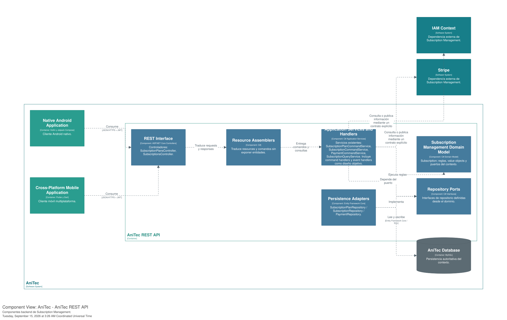
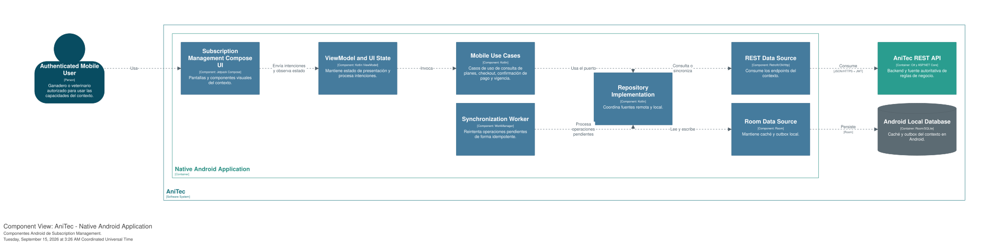
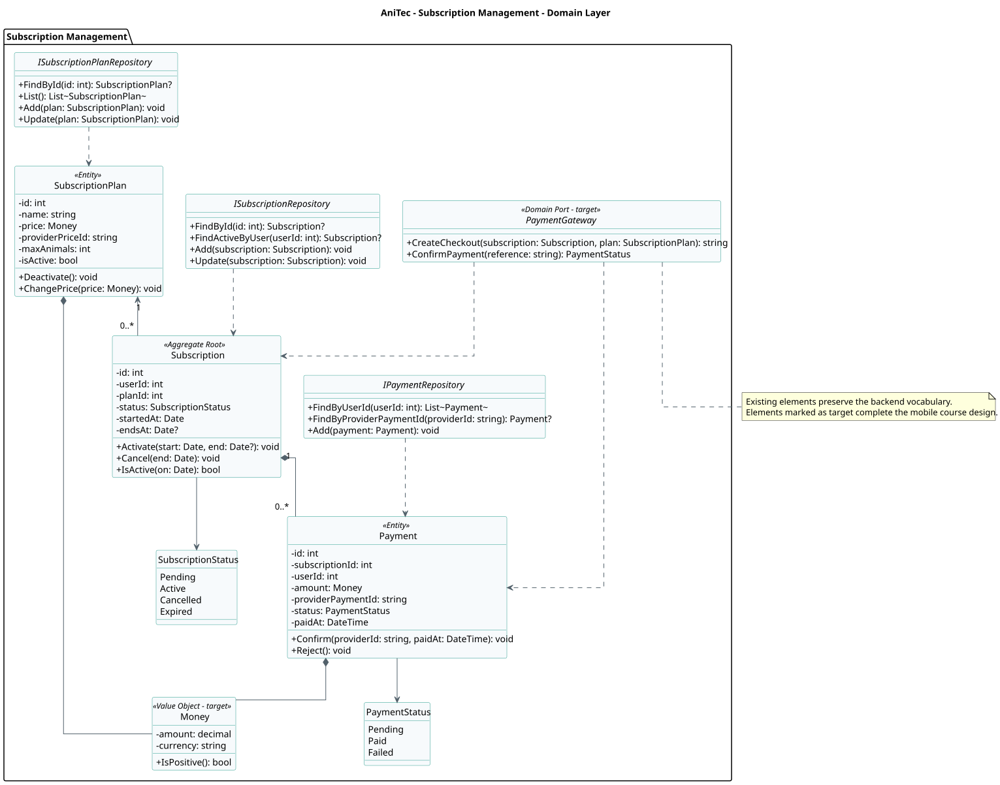
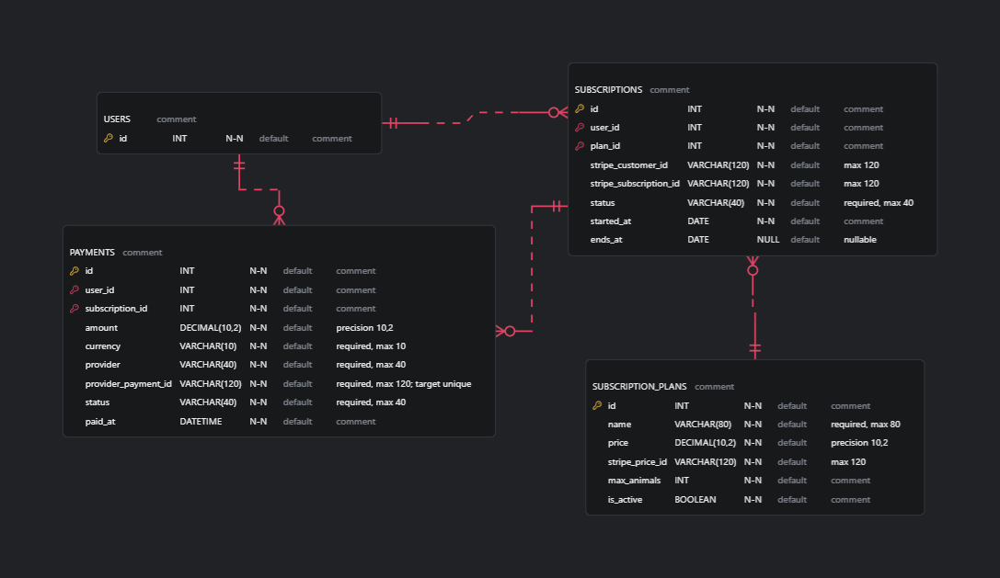
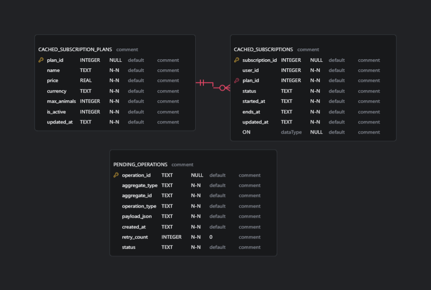

# 2.6.8. Bounded Context: Subscription Management

Administrar planes, vigencia de suscripciones y pagos confirmados sin introducir conceptos propios de Stripe en el dominio.

La base implementada se encuentra en el módulo `Subscriptions` de la API ASP.NET Core. El diseño móvil de Android y Flutter se presenta como **diseño objetivo** porque esos clientes todavía no existen en el workspace. Los tres productos comparten contratos REST y lenguaje ubicuo, mientras la API conserva las reglas autoritativas.

## 2.6.8.1. Domain Layer

**Responsabilidad estable.** Esta capa documenta el modelo que representa el núcleo de **Subscription Management**. Las reglas autoritativas se ejecutan en la API; Android y Flutter mantienen modelos equivalentes para presentación, validación inmediata y trabajo offline. La columna de estado distingue el código heredado de la arquitectura objetivo.

**Detalle técnico evolutivo.** El siguiente diccionario identifica las clases, sus responsabilidades, atributos, métodos y relaciones. Los campos **Producto** y **Estado** distinguen los elementos comprobados en el código de aquellos que aún pertenecen al diseño objetivo.

### Entity: SubscriptionPlan

| Campo | Detalle |
|---|---|
| **Producto** | Backend; modelo equivalente en Android y Flutter |
| **Estado** | **Implementado en el backend** |
| **Propósito** | Definir condiciones y límites de un plan comercial. |
| **Relaciones** | SubscriptionPlan compone Money |

**Atributos o dependencias**

| Nombre | Tipo |
|---|---|
| `id` | `int` |
| `name` | `string` |
| `price` | `Money` |
| `providerPriceId` | `string` |
| `maxAnimals` | `int` |
| `isActive` | `bool` |

**Métodos u operaciones**

| Firma | Retorno |
|---|---|
| `Deactivate()` | `void` |
| `ChangePrice(price: Money)` | `void` |

---

### Aggregate Root: Subscription

| Campo | Detalle |
|---|---|
| **Producto** | Backend; modelo equivalente en Android y Flutter |
| **Estado** | **Implementado en el backend** |
| **Propósito** | Controlar vigencia y estado de la suscripción de un usuario. |
| **Relaciones** | Subscription compone Payment; Subscription se relaciona con SubscriptionStatus; ISubscriptionRepository depende de Subscription |

**Atributos o dependencias**

| Nombre | Tipo |
|---|---|
| `id` | `int` |
| `userId` | `int` |
| `planId` | `int` |
| `status` | `SubscriptionStatus` |
| `startedAt` | `Date` |
| `endsAt` | `Date?` |

**Métodos u operaciones**

| Firma | Retorno |
|---|---|
| `Activate(start: Date, end: Date?)` | `void` |
| `Cancel(end: Date)` | `void` |
| `IsActive(on: Date)` | `bool` |

---

### Entity: Payment

| Campo | Detalle |
|---|---|
| **Producto** | Backend; modelo equivalente en Android y Flutter |
| **Estado** | **Implementado en el backend** |
| **Propósito** | Registrar el resultado de un pago. |
| **Relaciones** | Subscription compone Payment; Payment se relaciona con PaymentStatus; Payment compone Money |

**Atributos o dependencias**

| Nombre | Tipo |
|---|---|
| `id` | `int` |
| `subscriptionId` | `int` |
| `userId` | `int` |
| `amount` | `Money` |
| `providerPaymentId` | `string` |
| `status` | `PaymentStatus` |
| `paidAt` | `DateTime` |

**Métodos u operaciones**

| Firma | Retorno |
|---|---|
| `Confirm(providerId: string, paidAt: DateTime)` | `void` |
| `Reject()` | `void` |

---

### Value Object: Money

| Campo | Detalle |
|---|---|
| **Producto** | Backend, Android y Flutter (modelo canónico) |
| **Estado** | **Diseño objetivo** |
| **Propósito** | Representar un importe junto con su moneda. |
| **Relaciones** | Payment compone Money; SubscriptionPlan compone Money |

**Atributos o dependencias**

| Nombre | Tipo |
|---|---|
| `amount` | `decimal` |
| `currency` | `string` |

**Métodos u operaciones**

| Firma | Retorno |
|---|---|
| `IsPositive()` | `bool` |

---

### Enumeration: SubscriptionStatus

| Campo | Detalle |
|---|---|
| **Producto** | Backend, Android y Flutter (modelo canónico) |
| **Estado** | **Diseño objetivo** |
| **Propósito** | Definir los valores válidos de SubscriptionStatus. |
| **Relaciones** | Subscription se relaciona con SubscriptionStatus |

**Atributos o dependencias**

| Nombre | Tipo |
|---|---|
| `Pending` | `No especificado` |
| `Active` | `No especificado` |
| `Cancelled` | `No especificado` |
| `Expired` | `No especificado` |

**Métodos u operaciones**

No aplica.

---

### Repository Interface: ISubscriptionRepository

| Campo | Detalle |
|---|---|
| **Producto** | Backend; modelo equivalente en Android y Flutter |
| **Estado** | **Implementado en el backend** |
| **Propósito** | Abstraer la persistencia de Subscription. |
| **Relaciones** | ISubscriptionRepository depende de Subscription |

**Atributos o dependencias**

No aplica.

**Métodos u operaciones**

| Firma | Retorno |
|---|---|
| `FindById(id: int)` | `Subscription?` |
| `FindActiveByUser(userId: int)` | `Subscription?` |
| `Add(subscription: Subscription)` | `void` |
| `Update(subscription: Subscription)` | `void` |

---

### Domain Port: PaymentGateway

| Campo | Detalle |
|---|---|
| **Producto** | Backend; modelo equivalente en Android y Flutter |
| **Estado** | **Diseño objetivo** |
| **Propósito** | Abstraer el proveedor externo de cobros. |
| **Relaciones** | Es implementado por StripePaymentGateway en Infrastructure Layer. |

**Atributos o dependencias**

No aplica.

**Métodos u operaciones**

| Firma | Retorno |
|---|---|
| `CreateCheckout(subscription, plan)` | `No especificado` |
| `ConfirmPayment(reference)` | `No especificado` |

---

## 2.6.8.2. Interface Layer

**Responsabilidad estable.** Esta capa recibe las acciones relacionadas con **consulta de planes, contratación, pago y actualización de suscripciones** y las traduce a casos de uso. Los controllers y resources corresponden a la API; las pantallas y controladores de estado representan la presentación objetivo en Android y Flutter. Ninguna de estas clases implementa reglas de negocio.

**Detalle técnico evolutivo.** El siguiente diccionario identifica las clases, sus responsabilidades, atributos, métodos y relaciones. Los campos **Producto** y **Estado** distinguen los elementos comprobados en el código de aquellos que aún pertenecen al diseño objetivo.

### REST Controller: SubscriptionsController

| Campo | Detalle |
|---|---|
| **Producto** | Backend ASP.NET Core |
| **Estado** | **Implementado en el backend** |
| **Propósito** | Publicar por HTTP las capacidades de Subscription Management. |
| **Relaciones** | Recibe resources, invoca servicios de aplicación y devuelve resources HTTP. |

**Atributos o dependencias**

| Nombre | Tipo |
|---|---|
| `commandService` | `ISubscriptionCommandService` |
| `queryService` | `ISubscriptionQueryService` |
| `planQueryService` | `ISubscriptionPlanQueryService` |
| `paymentCommandService` | `IPaymentCommandService` |
| `paymentQueryService` | `IPaymentQueryService` |
| `configuration` | `IConfiguration` |

**Métodos u operaciones**

| Firma | Retorno |
|---|---|
| `GetAll(CancellationToken cancellationToken)` | `No especificado` |
| `GetById(int id, CancellationToken cancellationToken)` | `No especificado` |
| `Create(CreateSubscriptionResource resource, CancellationToken cancellationToken)` | `No especificado` |
| `GetActiveByUser(int userId, CancellationToken cancellationToken)` | `No especificado` |
| `GetPaymentsByUser(int userId, CancellationToken cancellationToken)` | `No especificado` |
| `MockCheckout(MockCheckoutResource resource, CancellationToken cancellationToken)` | `No especificado` |
| `CreateStripeCheckout(StripeCheckoutResource resource, CancellationToken cancellationToken)` | `No especificado` |
| `ConfirmStripeCheckout(string sessionId, CancellationToken cancellationToken)` | `No especificado` |
| `Update(int id, CreateSubscriptionResource resource, CancellationToken cancellationToken)` | `No especificado` |
| `Delete(int id, CancellationToken cancellationToken)` | `No especificado` |

---

### Presentation Model: SubscriptionViewModel

| Campo | Detalle |
|---|---|
| **Producto** | Android / Kotlin |
| **Estado** | **Diseño objetivo** |
| **Propósito** | Mantener el estado observable y traducir acciones de Android a casos de uso. |
| **Relaciones** | Invoca casos de uso de Application Layer y publica un UI State inmutable. |

**Atributos o dependencias**

| Nombre | Tipo |
|---|---|
| `state` | `No especificado` |
| `observeUseCase` | `No especificado` |
| `syncUseCase` | `No especificado` |

**Métodos u operaciones**

| Firma | Retorno |
|---|---|
| `Load()` | `No especificado` |
| `Submit(action)` | `No especificado` |
| `RetrySync()` | `No especificado` |

---

### State Controller: SubscriptionController

| Campo | Detalle |
|---|---|
| **Producto** | Flutter / Dart |
| **Estado** | **Diseño objetivo** |
| **Propósito** | Mantener el estado de presentación de Flutter y coordinar casos de uso. |
| **Relaciones** | Invoca Application Layer y publica estados de carga, éxito y error. |

**Atributos o dependencias**

| Nombre | Tipo |
|---|---|
| `state` | `No especificado` |
| `observeUseCase` | `No especificado` |
| `syncUseCase` | `No especificado` |

**Métodos u operaciones**

| Firma | Retorno |
|---|---|
| `load()` | `No especificado` |
| `submit(action)` | `No especificado` |
| `retrySync()` | `No especificado` |

---

## 2.6.8.3. Application Layer

**Responsabilidad estable.** Esta capa coordina las capacidades de **consulta de planes, contratación, pago y actualización de suscripciones**. Los commands y queries expresan intenciones; los handlers cargan aggregates, aplican reglas, persisten cambios y reaccionan a eventos. Los casos de uso móviles coordinan lectura local, actualización remota y sincronización idempotente.

**Detalle técnico evolutivo.** El siguiente diccionario identifica las clases, sus responsabilidades, atributos, métodos y relaciones. Los campos **Producto** y **Estado** distinguen los elementos comprobados en el código de aquellos que aún pertenecen al diseño objetivo.

### Application Service: SubscriptionCommandService

| Campo | Detalle |
|---|---|
| **Producto** | Backend ASP.NET Core |
| **Estado** | **Implementado en el backend** |
| **Propósito** | Orquestar consulta de planes, contratación, pago y actualización de suscripciones sin contener reglas del dominio. |
| **Relaciones** | Invoca agregados y repositories; confirma la transacción mediante Unit of Work. |

**Atributos o dependencias**

| Nombre | Tipo |
|---|---|
| `repository` | `ISubscriptionRepository` |
| `unitOfWork` | `IUnitOfWork` |

**Métodos u operaciones**

| Firma | Retorno |
|---|---|
| `Handle(CreateSubscriptionCommand command, CancellationToken cancellationToken)` | `No especificado` |
| `Handle(UpdateSubscriptionCommand command, CancellationToken cancellationToken)` | `No especificado` |
| `Handle(DeleteSubscriptionCommand command, CancellationToken cancellationToken)` | `No especificado` |

---

### Use Case: ObserveSubscriptionUseCase

| Campo | Detalle |
|---|---|
| **Producto** | Android y Flutter |
| **Estado** | **Diseño objetivo** |
| **Propósito** | Entregar primero datos locales y actualizar la consulta cuando exista conectividad. |
| **Relaciones** | Es invocado por ViewModel/Controller y coordina repositorios móviles. |

**Atributos o dependencias**

| Nombre | Tipo |
|---|---|
| `localRepository` | `No especificado` |
| `remoteRepository` | `No especificado` |
| `connectivityMonitor` | `No especificado` |

**Métodos u operaciones**

| Firma | Retorno |
|---|---|
| `Execute(criteria)` | `Stream<Result>` |

---

### Command Handler: CreatePaymentCommandHandler

| Campo | Detalle |
|---|---|
| **Producto** | Backend ASP.NET Core |
| **Estado** | **Diseño objetivo** |
| **Propósito** | Ejecutar una intención concreta, aplicar reglas del agregado y confirmar la transacción. |
| **Relaciones** | Consume un Command, carga el aggregate mediante su repository y puede publicar un Domain Event. |

**Atributos o dependencias**

| Nombre | Tipo |
|---|---|
| `repository` | `No especificado` |
| `unitOfWork` | `No especificado` |
| `domainPolicy` | `No especificado` |

**Métodos u operaciones**

| Firma | Retorno |
|---|---|
| `Handle(command)` | `Result` |

---

### Event Handler: PaymentConfirmedEventHandler

| Campo | Detalle |
|---|---|
| **Producto** | Backend ASP.NET Core |
| **Estado** | **Diseño objetivo** |
| **Propósito** | Reaccionar al evento confirmado y actualizar proyecciones o integraciones. |
| **Relaciones** | Consume un Domain Event y utiliza puertos de infraestructura sin modificar directamente el agregado. |

**Atributos o dependencias**

| Nombre | Tipo |
|---|---|
| `projectionRepository` | `No especificado` |
| `notificationPort` | `No especificado` |
| `unitOfWork` | `No especificado` |

**Métodos u operaciones**

| Firma | Retorno |
|---|---|
| `Handle(domainEvent)` | `Task` |

---

## 2.6.8.4. Infrastructure Layer

**Responsabilidad estable.** Esta capa implementa los puertos definidos hacia el interior de **Subscription Management** y concentra acceso a base de datos, red, almacenamiento local e integraciones externas. Las clases de infraestructura traducen errores y contratos técnicos antes de devolver resultados a Application Layer.

**Detalle técnico evolutivo.** El siguiente diccionario identifica las clases, sus responsabilidades, atributos, métodos y relaciones. Los campos **Producto** y **Estado** distinguen los elementos comprobados en el código de aquellos que aún pertenecen al diseño objetivo.

### Repository Adapter: SubscriptionPlanRepository / SubscriptionRepository / PaymentRepository

| Campo | Detalle |
|---|---|
| **Producto** | Backend / Entity Framework Core |
| **Estado** | **Implementado en el backend** |
| **Propósito** | Implementar el puerto de persistencia definido por Domain Layer. |
| **Relaciones** | Implementa ISubscriptionPlanRepository / ISubscriptionRepository / IPaymentRepository; utiliza AppDbContext/MySQL y reconstruye el aggregate. |

**Atributos o dependencias**

| Nombre | Tipo |
|---|---|
| `SubscriptionPlanRepository` | `AppDbContext context` |
| `SubscriptionRepository` | `AppDbContext context` |
| `PaymentRepository` | `AppDbContext context` |

**Métodos u operaciones**

| Firma | Retorno |
|---|---|
| `PaymentRepository.FindByUserIdAsync(int userId, CancellationToken cancellationToken)` | `No especificado` |
| `PaymentRepository.FindByProviderPaymentIdAsync(string providerPaymentId, CancellationToken cancellationToken)` | `No especificado` |

---

### Room Adapter: SubscriptionDao

| Campo | Detalle |
|---|---|
| **Producto** | Android / Room |
| **Estado** | **Diseño objetivo** |
| **Propósito** | Implementar persistencia local y observación reactiva en Android. |
| **Relaciones** | Implementa el puerto local mediante Room y participa en la estrategia de caché/outbox. |

**Atributos o dependencias**

| Nombre | Tipo |
|---|---|
| `roomDatabase` | `No especificado` |
| `entityMapper` | `No especificado` |

**Métodos u operaciones**

| Firma | Retorno |
|---|---|
| `Observe(criteria)` | `No especificado` |
| `Upsert(entity)` | `No especificado` |
| `Delete(id)` | `No especificado` |
| `Pending()` | `No especificado` |

---

### SQLite Adapter: SubscriptionLocalDataSource

| Campo | Detalle |
|---|---|
| **Producto** | Flutter / Dart |
| **Estado** | **Diseño objetivo** |
| **Propósito** | Implementar persistencia local equivalente en Flutter. |
| **Relaciones** | Implementa el puerto local mediante SQLite y participa en la estrategia de caché/outbox. |

**Atributos o dependencias**

| Nombre | Tipo |
|---|---|
| `sqliteDatabase` | `No especificado` |
| `entityMapper` | `No especificado` |

**Métodos u operaciones**

| Firma | Retorno |
|---|---|
| `watch(criteria)` | `No especificado` |
| `upsert(entity)` | `No especificado` |
| `delete(id)` | `No especificado` |
| `pending()` | `No especificado` |

---

### Anti-Corruption Layer: StripePaymentGateway

| Campo | Detalle |
|---|---|
| **Producto** | Backend ASP.NET Core |
| **Estado** | **Diseño objetivo** |
| **Propósito** | Aislar una dependencia externa detrás de un puerto explícito. |
| **Relaciones** | Implementa PaymentGateway y traduce Stripe al lenguaje del dominio. |

**Atributos o dependencias**

| Nombre | Tipo |
|---|---|
| `webhookSecret` | `stripeClient,` |

**Métodos u operaciones**

| Firma | Retorno |
|---|---|
| `CreateCheckout(command)` | `No especificado` |
| `ConfirmWebhook(payload)` | `No especificado` |
| `Refund(paymentId)` | `No especificado` |

---

## 2.6.8.5. Bounded Context Software Architecture Component Level Diagrams

El archivo [`component-level.dsl`](<../../assets/codefordiagrams/2.6.8. Bounded Context Subscription Management/component-level.dsl>) contiene las vistas `BC8-ApiComponents`, `BC8-AndroidComponents` y `BC8-FlutterComponents`. Las tres parten del mismo modelo C4 y muestran la separación entre presentación, aplicación, dominio y adaptadores.

  
  
<i>Figura 2.6.8.1. Componentes de la API para Subscription Management. Fuente: elaboración propia con Structurizr DSL.</i>

  
  
<i>Figura 2.6.8.2. Componentes Android para Subscription Management. Fuente: elaboración propia con Structurizr DSL.</i>

  
  
<i>Figura 2.6.8.3. Componentes Flutter para Subscription Management. Fuente: elaboración propia con Structurizr DSL.</i>

## 2.6.8.6. Bounded Context Software Architecture Code Level Diagrams

Los diagramas de código detallan el modelo del dominio y los objetos de persistencia. El UML diferencia los elementos existentes de las incorporaciones objetivo, mientras los esquemas SQL señalan mediante comentarios las columnas propuestas. Los archivos ERD quedan disponibles para completar la importación manual.

### 2.6.8.6.1. Bounded Context Domain Layer Class Diagrams

El Class Diagram incluye agregados, entidades, value objects, enumeraciones, servicios de dominio e interfaces de repositorio con atributos, operaciones, visibilidad y multiplicidades.

  
  
<i>Figura 2.6.8.4. Domain Layer Class Diagram de Subscription Management. Fuente: elaboración propia con PlantUML.</i>

### 2.6.8.6.2. Bounded Context Database Design Diagram

MySQL mantiene la persistencia autoritativa. Room y SQLite contienen únicamente caché, metadatos de sincronización y operaciones pendientes; no sustituyen las reglas ni la fuente de verdad del backend. En IAM, las credenciales y tokens permanecen fuera de las tablas locales y se almacenan mediante mecanismos seguros del sistema operativo.

  
  
<i>Figura 2.6.8.5. MySQL Database Design de Subscription Management. Fuente: elaboración propia a partir del esquema SQL.</i>

  
  
<i>Figura 2.6.8.6. Android Room Database Design de Subscription Management. Fuente: elaboración propia a partir del esquema SQL.</i>

