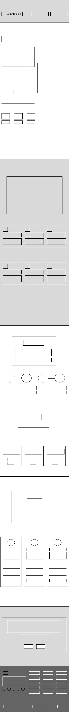
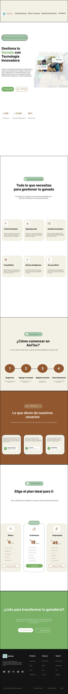

# 3.1. Product design

El diseño de AniTec traduce las necesidades de ganaderos y veterinarios en una experiencia coherente entre la Landing Page, la aplicación Android nativa y la aplicación multiplataforma. Se priorizan la consulta rápida en campo, el registro con pocos pasos, la legibilidad en exteriores y la continuidad ante una conexión inestable. Los artefactos mantienen trazabilidad con los User Personas, User Stories y bounded contexts del capítulo II.

## 3.1.1. Style Guidelines

Estas pautas establecen un lenguaje visual común para que las interfaces sean consistentes, reconocibles y accesibles en la Landing Page, Jetpack Compose y Flutter.

### 3.1.1.1. General Style Guidelines

**Identidad visual.** AniTec combina referencias al entorno ganadero con una presentación digital moderna. Los logotipos deben conservar sus proporciones, un área libre alrededor y suficiente contraste. No deben deformarse, rotarse ni recolorearse arbitrariamente.

  
  
<i>Figura 1. Logo de la startup Titan. Fuente: elaboración propia.</i>

  
  
<i>Figura 2. Logo de AniTec. Fuente: elaboración propia.</i>

**Paleta de colores.** Los verdes representan salud, campo y crecimiento; los marrones conectan la interfaz con la actividad ganadera; y los tonos claros producen superficies legibles. Ningún estado dependerá únicamente del color: las alertas, confirmaciones y errores también usarán texto o iconografía.

<table>
  <thead><tr><th>Color</th><th>Código</th><th>Uso principal</th></tr></thead>
  <tbody>
    <tr><td>Verde principal</td><td>#79B267</td><td>Acciones principales, selección activa y marca.</td></tr>
    <tr><td>Marrón oscuro</td><td>#925930</td><td>Contraste de identidad y elementos ganaderos.</td></tr>
    <tr><td>Marrón medio</td><td>#A3794F</td><td>Acentos, ilustraciones y acciones secundarias.</td></tr>
    <tr><td>Verde suave</td><td>#A3C4A8</td><td>Estados secundarios y fondos de apoyo.</td></tr>
    <tr><td>Beige</td><td>#D1BFA5</td><td>Tarjetas, superficies y separadores.</td></tr>
    <tr><td>Crema</td><td>#F5F0E6</td><td>Fondo claro principal y descanso visual.</td></tr>
  </tbody>
</table>

  
  
  
  
  
  
  
<i>Figura 3. Paleta cromática de AniTec. Fuente: elaboración propia.</i>

**Tipografía.** AniTec utiliza Poppins por su lectura clara. Los encabezados emplean SemiBold o Bold y el cuerpo Regular o Medium. En móviles se respetará el escalado configurado por el usuario y se evitarán bloques extensos en mayúsculas.

| Uso | Peso recomendado | Tamaño móvil de referencia |
|---|---|---|
| Título principal | Bold | 28–32 sp |
| Título de pantalla | SemiBold | 22–24 sp |
| Subtítulo | SemiBold | 18–20 sp |
| Cuerpo | Regular | 16 sp |
| Etiqueta o ayuda | Medium / Regular | 14 sp |
| Texto auxiliar | Regular | 12 sp como mínimo |

  
  
<i>Figura 4. Tipografía Poppins. Fuente: elaboración propia.</i>

**Espaciado, formas e iconografía.** Se usará una cuadrícula base de 8 unidades. Las tarjetas podrán utilizar radios de 8 a 16 dp y los controles táctiles mantendrán un área mínima de 48 × 48 dp. Los iconos tendrán etiquetas o descripciones accesibles cuando su significado no sea evidente.

  
  
<i>Figura 5. Referencia de iconografía. Fuente: elaboración propia.</i>

**Tono de comunicación.** La comunicación será clara, respetuosa, serena y orientada a la acción. Usará términos conocidos por ganaderos y veterinarios, instrucciones breves y mensajes que indiquen cómo recuperarse de un problema.

| Situación | Redacción recomendada |
|---|---|
| Acción | “Registrar animal” |
| Confirmación | “El animal se registró correctamente.” |
| Error recuperable | “No pudimos guardar los cambios. Revisa tu conexión e inténtalo nuevamente.” |
| Sin resultados | “No se encontraron animales con esos filtros.” |
| Permiso | “AniTec necesita acceso a la cámara para leer el código del animal.” |

**Dimensiones del tono.** El tono de comunicación se ubica en las siguientes posiciones:

| Dimensión | Posición | Cómo se aplica |
|---|---|---|
| Divertido / Serio | Serio, con cercanía | Mensajes profesionales; sin bromas en alertas sanitarias o financieras. |
| Formal / Casual | Casual profesional | Tuteo y frases breves, como «Revisa tu conexión»; sin jerga técnica. |
| Respetuoso / Irreverente | Respetuoso | Reconoce el conocimiento del ganadero y del veterinario y nunca culpa al usuario por un error. |
| Entusiasta / Sereno | Sereno | Confirmaciones claras y sin exceso; ante un problema se mantiene la calma e indica el siguiente paso. |

**Sustento de las decisiones.** Las decisiones de marca, color, tipografía y espaciado se apoyan en los siguientes principios y elementos de diseño:

- **Jerarquía visual:** la escala tipográfica y el peso de la fuente ordenan la lectura de títulos, cuerpo y textos de ayuda.
- **Contraste y legibilidad:** los fondos claros y sin brillo excesivo favorecen la lectura en exteriores, y el texto y los controles recurren a las variantes más oscuras de verdes y marrones cuando se necesita contraste suficiente.
- **Proximidad y consistencia:** las tarjetas agrupan la información relacionada, y los mismos componentes, colores y espaciados se repiten en todos los productos, de modo que lo aprendido en uno sirve en los demás.
- **Significado cromático:** el verde se asocia con la salud y las acciones principales, el marrón con la actividad ganadera y los tonos beige con superficies neutras; el color nunca es la única señal de un estado.
- **Facilidad de uso táctil:** el área mínima de 48 × 48 dp y la cuadrícula de 8 unidades reducen los errores al tocar los controles.
- **Carga cognitiva:** cada nivel de navegación ofrece pocas opciones (cinco destinos principales), lo que reduce el esfuerzo de decisión.

**Accesibilidad e internacionalización**

- Mantener contraste suficiente y no depender solo del color.
- Permitir el aumento de texto sin pérdida de contenido.
- Incluir descripciones accesibles en imágenes y controles.
- Centralizar textos para English (en_US) y Latin American Spanish (es_419), con inglés como idioma predeterminado.
- Formatear fechas, números y monedas según la región.
- Ofrecer una alternativa manual cuando la cámara no esté disponible.
- Usar etiquetas semánticas, foco visible y atributos ARIA en la Landing Page.

**Criterios por producto.** La Landing Page tendrá jerarquía vertical, navegación superior y diseño responsive. Android aplicará los patrones de Material Design con Jetpack Compose. Flutter utilizará componentes equivalentes y conservará la misma identidad y orden de tareas. Ambas aplicaciones contemplarán carga, contenido, ausencia de datos, error, confirmación y operación sin conexión cuando corresponda.

### 3.1.1.2. Web Style Guidelines

Estas pautas aplican a la Landing Page y a la aplicación web, y complementan las pautas generales.

- **Estructura:** encabezado con navegación superior, secciones apiladas con un encabezado centrado, contenido en bloques de ancho limitado y pie de página con columnas de enlaces.
- **Diseño responsive:** la Landing Page se diseñó para escritorio y para un ancho móvil de 412 px; la aplicación web reorganiza su contenido en pantallas de hasta 720 px, por ejemplo al ocultar las columnas secundarias de las tablas.
- **Componentes:** botones principales rellenos en verde y secundarios con borde; tarjetas de esquinas redondeadas sobre fondo crema o beige; secciones que alternan fondos para separar los temas. La aplicación web utiliza los componentes de PrimeVue adaptados a la paleta de AniTec.
- **Accesibilidad:** HTML semántico, atributos ARIA, foco visible, textos alternativos en las imágenes y no depender solo del color.
- **Internacionalización:** inglés (en_US) como idioma predeterminado y español latinoamericano (es_419) como alternativa.
- **Recursos compartidos:** los logotipos, las fuentes y la iconografía se conservan en la carpeta `assets` de cada repositorio y en el archivo de diseño de Figma del proyecto.

### 3.1.1.3. Mobile Style Guidelines

Estas pautas aplican a la aplicación Android nativa y a la aplicación Flutter, que comparten identidad y orden de tareas.

- **Plataforma y componentes:** Android utiliza Material Design 3 con Jetpack Compose; Flutter emplea componentes equivalentes con la misma identidad visual. Se usa un único tema claro.
- **Navegación:** barra superior con título y acciones, barra inferior de cinco destinos por rol, botón de acción flotante para crear registros y pantallas completas con flecha de retorno para formularios y detalles.
- **Contenedores:** tarjetas con esquinas de 8 a 16 dp, fichas de detalle en hojas inferiores y etiquetas de estado que combinan color y texto.
- **Controles:** objetivos táctiles de al menos 48 × 48 dp, botón principal de ancho completo con degradado verde, teclado decimal en los campos de importes y selectores de fecha del sistema.
- **Estados:** cada pantalla de datos contempla carga, lista vacía, error con opción de reintentar y operación sin conexión, con un aviso de los cambios pendientes de sincronizar.
- **Permisos y alternativas:** la cámara se solicita al abrir el escáner o al tomar una foto; si se deniega, el usuario puede escribir el código del arete o elegir una imagen de la galería.
- **Accesibilidad e internacionalización:** descripciones accesibles en los iconos, textos que respetan el tamaño de fuente del sistema, inglés (en_US) como idioma predeterminado y español latinoamericano (es_419) con un selector dentro de la aplicación.

## 3.1.2. Information Architecture

La arquitectura de información organiza la Landing Page y las aplicaciones para que visitantes, ganaderos y veterinarios encuentren con rapidez las funciones relacionadas con sus objetivos. La propuesta reduce carga cognitiva mediante etiquetas breves, agrupación por tareas y navegación diferenciada por rol.

### 3.1.2.1. Organization Systems

| Sistema | Aplicación en AniTec |
|---|---|
| Jerárquico | Los dashboards priorizan alertas, indicadores y acciones frecuentes. |
| Secuencial | Registro de cuenta, finca, animal y evento sanitario se resuelve en pasos ordenados. |
| Cronológico | Actividades, historial sanitario, pagos y operaciones pendientes se ordenan por fecha. |
| Alfabético | Las listas de animales, fincas y corrales se ordenan por nombre para localizar un elemento con rapidez. |
| Por tópicos | Animales, fincas, sanidad, actividades, finanzas, colaboración, analíticas y suscripciones. |
| Por audiencia | La Landing Page y la navegación diferencian a ganaderos y veterinarios. |
| Matricial | Los reportes cruzan indicadores por finca, animal, categoría, estado o periodo. |

La Landing Page sigue un recorrido de descubrimiento: propuesta de valor, problema, beneficios, funciones por segmento, planes y llamada a la acción. En las aplicaciones, la autenticación conduce a un dashboard ajustado al rol.

### 3.1.2.2. Labelling Systems

Las etiquetas representan conceptos del dominio y evitan términos técnicos internos. Las etiquetas de las aplicaciones corresponden a la aplicación Android implementada y se conservan en la aplicación Flutter.

| Producto o rol | Etiqueta | Significado |
|---|---|---|
| Landing Page | Inicio | Propuesta principal de AniTec. |
| Landing Page | Beneficios | Valor ofrecido por el producto. |
| Landing Page | Ganaderos | Capacidades de gestión del hato. |
| Landing Page | Veterinarios | Capacidades de seguimiento clínico. |
| Landing Page | Planes | Alternativas de suscripción. |
| Ganadero | Inicio | Alertas, indicadores del hato, próximas actividades y registros sanitarios recientes. |
| Ganadero | Animales | Búsqueda, registro individual o masivo, ficha técnica y acciones sobre varios animales. |
| Ganadero | Sanidad | Incidencias, vacunas, revisiones, tratamientos y diagnósticos. |
| Ganadero | Actividades | Tareas y recordatorios ordenados por fecha. |
| Ganadero | Más | Fincas, Corrales, Finanzas, Analítica, Dispositivos IoT, Suscripciones y Términos de Servicio. |
| Veterinario | Inicio | Resumen de clientes, pacientes que requieren atención y seguimientos pendientes. |
| Veterinario | Pacientes | Animales de cada cliente, con acceso a su historial clínico. |
| Veterinario | Sanidad | Registros sanitarios de los pacientes. |
| Veterinario | Actividades | Visitas y tareas programadas para los clientes. |
| Veterinario | Más | Clientes, Analítica, Dispositivos IoT, Suscripciones y Términos de Servicio. |
| Compartido | Escanear arete | Identificación del animal mediante código QR o de barras, con ingreso manual como alternativa. |
| Compartido | Cambios pendientes | Aviso de registros guardados sin conexión que esperan sincronizarse. |

Las acciones principales serán «Registrar», «Guardar», «Editar», «Buscar», «Filtrar», «Escanear», «Reintentar» y «Cancelar». «Eliminar» se reservará para operaciones destructivas y requerirá confirmación; «Descartar» se usará solo para los cambios sin sincronizar que el servidor rechazó.

### 3.1.2.3. SEO Tags and Meta Tags

**Landing Page.** El sitio define sus etiquetas en inglés, idioma predeterminado; la tabla las muestra junto con su versión en español.

| Elemento | Valor implementado (en_US) | Valor en español (es_419) |
|---|---|---|
| Title | AniTec - Digital Platform for Livestock Management | AniTec – Gestión y trazabilidad inteligente para la ganadería |
| Description | AniTec is the leading digital platform in Latin America for livestock management. Manage health, reproduction, and productivity of your herd with innovative technology designed for ranchers and veterinarians. | AniTec ayuda a ganaderos y veterinarios a organizar animales, sanidad, actividades y decisiones de campo desde experiencias móviles conectadas. |
| Keywords | livestock management, rancher platform, AniTec, livestock traceability, digital livestock, animal health, herd control, platform for veterinarians, rural technology, livestock organizer, cattle management, farm management, agricultural technology, agtech | AniTec, gestión ganadera, trazabilidad animal, salud animal, veterinarios, aplicación ganadera, ganado, Perú |
| Author | AniTec | AniTec |
| Robots | index, follow | index, follow |
| Open Graph title | AniTec - Digital Platform for Livestock Management | AniTec – Información ganadera donde la necesitas |
| Open Graph description | AniTec is the leading digital platform in Latin America for livestock management. Manage health, reproduction, and productivity of your herd with innovative technology. | Gestiona animales, registros sanitarios y actividades desde una experiencia diseñada para el trabajo de campo. |

**Aplicación web.** La aplicación web define hoy solo el título de la página; los demás valores son la propuesta que se incorporará.

| Elemento | Valor |
|---|---|
| Title | AniTec Web App |
| Description | AniTec Web App helps ranchers and veterinarians manage animals, health records, activities and finances from the browser. (propuesto) |
| Keywords | AniTec, livestock management, animal health, ranchers, veterinarians, web application (propuesto) |
| Author | AniTec (propuesto) |

**ASO de las aplicaciones móviles**

| Elemento | Android nativo | Aplicación Flutter |
|---|---|---|
| App title | AniTec Ganadería | AniTec Ganadería |
| Subtitle | Gestión del ganado en campo | Gestión ganadera multiplataforma |
| Keywords | ganado, animales, sanidad, trazabilidad, veterinario | ganado, animales, sanidad, trazabilidad, veterinario |
| Short description | Registra animales, controla su salud y organiza actividades desde el teléfono. | Consulta y gestiona la información esencial de AniTec desde dispositivos compatibles. |
| Full description | Aplicación para ganaderos y veterinarios que necesitan información organizada, alertas y trazabilidad en campo. | Experiencia multiplataforma para acceder a los flujos de AniTec mediante la misma API y reglas del producto. |

Los textos definitivos se ajustarán a las restricciones de longitud de cada tienda antes de la distribución.

### 3.1.2.4. Searching Systems

| Datos | Búsqueda | Filtros | Presentación |
|---|---|---|---|
| Animales | Código, nombre, especie, raza, sexo, estado, finca o corral | Corral | Lista con foto, código, finca, corral y estado; la selección múltiple habilita acciones masivas. |
| Pacientes (veterinario) | No aplica | Cliente y finca | Lista de animales con acceso al historial clínico. |
| Historial sanitario | No aplica | Animal | Registros en orden cronológico. |
| Clientes (veterinario) | Nombre o usuario del ganadero al agregar un cliente | No aplica | Lista de ganaderos disponibles con la acción de agregar. |
| Actividades | No aplica | No aplica | Próximas actividades primero y luego las vencidas, con prioridad y estado. |
| Finanzas | No aplica | No aplica | Resumen de ingresos, egresos y balance, y lista de movimientos por fecha. |
| Identificación de animales | Código del arete leído por cámara o escrito a mano | No aplica | Ficha del animal encontrado o mensaje de que no existe. |

Las búsquedas se realizan sobre los datos guardados en el dispositivo, por lo que también están disponibles sin conexión. Cuando no hay coincidencias se muestra un estado vacío que explica la situación.

### 3.1.2.5. Navigation Systems

La Landing Page navega hacia Inicio, Beneficios, Ganaderos, Veterinarios, Planes y Contacto. En pantallas pequeñas usará un menú condensado sin ocultar las llamadas a la acción.

| Rol | Destinos principales | Rutas secundarias (Más) |
|---|---|---|
| Ganadero | Inicio, Animales, Sanidad, Actividades y Más | Fincas, Corrales, Finanzas, Analítica, Dispositivos IoT, Suscripciones, Términos de Servicio y cambio de idioma. |
| Veterinario | Inicio, Pacientes, Sanidad, Actividades y Más | Clientes, Analítica, Dispositivos IoT, Suscripciones, Términos de Servicio y cambio de idioma. |

La barra superior de las pantallas principales da acceso al escáner de aretes. Los formularios y las pantallas secundarias se abren a pantalla completa con una flecha de retorno, y las acciones destructivas piden confirmación. Si la sesión vence, la aplicación regresa al inicio de sesión. Las notificaciones y los enlaces profundos, como el retorno del pago de la suscripción, se incorporarán en una etapa posterior y comprobarán autenticación y autorización antes de abrir un recurso.

## 3.1.3. Landing Page UI Design

La Landing Page comunica el problema, los beneficios para cada segmento y las opciones para conocer las aplicaciones. Aplica la identidad visual, la organización jerárquica y una estructura responsive.

La propuesta aplica la arquitectura de información de la sección 3.1.2 y el Design System de la sección 3.1.1. El recorrido combina los sistemas de organización secuencial y por audiencia: propuesta de valor, características, pasos para comenzar, testimonios, planes y una llamada final a la acción. La navegación superior, las etiquetas breves y la repetición de colores, tipografía e iconografía permiten reconocer AniTec en cualquier punto de contacto, y el mismo recorrido se mantiene en el navegador de escritorio y en el móvil.

**Enlace de diseño móvil:** 
https://www.figma.com/design/DvQjG8GIupLP7TBQNi5Hr6/LandingMovil_MockUp?node-id=0-1&t=qJgJhyhc97VCfTMW-1
https://www.figma.com/design/q7A10f5s09GjpeGGWNdsZG/LandingMovil_wireframe?node-id=0-1&t=FDHM5xffOJs1fj7Z-1

### 3.1.3.1. Landing Page Wireframe

El wireframe de escritorio define la distribución del encabezado, propuesta de valor, beneficios, secciones por segmento, planes, testimonios y pie de página antes de aplicar el acabado visual.

El wireframe prescinde del color y de las imágenes para evaluar solo la estructura. De arriba hacia abajo se distinguen una cabecera con cinco enlaces de navegación; un bloque principal con titular, texto de apoyo, dos llamadas a la acción y tres indicadores; una cuadrícula de seis tarjetas de características; una secuencia de cuatro pasos; tres testimonios; tres planes, con el central destacado; una llamada final a la acción y un pie de página con columnas de enlaces. Se aplicaron los principios de jerarquía (los títulos de sección dominan visualmente), proximidad (cada tarjeta agrupa icono, título y descripción), repetición (todas las secciones usan el mismo encabezado centrado) y contraste (el plan recomendado y las llamadas a la acción se distinguen del resto). Como parte del diseño inclusivo, el orden visual coincide con el orden de lectura, de modo que la estructura puede recorrerse con teclado o lector de pantalla.

  
  
<i>Figura 6. Wireframe de escritorio de la Landing Page. Fuente: elaboración propia.</i>

  
  
<i>Figura 7. Wireframe de movil de la Landing Page. Fuente: elaboración propia.</i>

Link del wireframe movil: https://www.figma.com/design/q7A10f5s09GjpeGGWNdsZG/LandingMovil_wireframe?node-id=0-1&t=FDHM5xffOJs1fj7Z-1 

### 3.1.3.2. Landing Page Mock-up

El mock-up de escritorio incorpora la paleta, Poppins, imágenes, iconografía y llamadas a la acción para transmitir confianza y relación con el entorno agropecuario.

El mock-up traduce la estructura anterior al Design System de AniTec: fondo crema y tarjetas beige, verde para las acciones principales, marrón para las secciones destacadas, como los testimonios, y tipografía Poppins con una jerarquía clara de pesos. Cada característica usa un icono con título y descripción breve, y los tres planes comparan la oferta con la misma estructura para facilitar la elección. Las llamadas a la acción conservan el mismo estilo en el bloque principal y en el cierre, y las secciones alternan fondos para separar los temas sin depender solo del color. La versión móvil conserva el mismo orden de secciones y el mismo lenguaje visual.

  
  
<i>Figura 8. Mock-up de escritorio de la Landing Page. Fuente: elaboración propia.</i>

  
  
<i>Figura 9. Mock-up de movil de la Landing Page. Fuente: elaboración propia.</i>

Link del MockUp: https://www.figma.com/design/DvQjG8GIupLP7TBQNi5Hr6/LandingMovil_MockUp?node-id=0-1&t=qJgJhyhc97VCfTMW-1 

## 3.1.4. Mobile Applications UX/UI Design

La propuesta comprende Android nativo con Kotlin y Jetpack Compose y una aplicación multiplataforma con Flutter y Dart. Ambas comparten objetivos, contratos, identidad y reglas de negocio, pero respetan los patrones de su plataforma. Los primeros flujos cubren autenticación, dashboard, registro y mantenimiento de animales, consulta del historial y registro sanitario.

Los diseños de ambas aplicaciones aplican la arquitectura de información de la sección 3.1.2 y el Design System de la sección 3.1.1: navegación diferenciada por rol con una barra inferior de cinco destinos, pantallas que combinan tarjetas, listas y formularios con la misma jerarquía de títulos, colores de estado acompañados de texto o icono, objetivos táctiles de al menos 48 × 48 dp y una alternativa manual a la lectura con cámara. El diseño inclusivo se refleja en el contraste, en el texto que acompaña a cada color de estado, en las descripciones accesibles de los iconos y en estados que explican qué ocurrió y cómo continuar: carga, vacío, sin resultados, error, sesión vencida, permiso de cámara denegado y trabajo sin conexión.

### 3.1.4.1. Mobile Applications Wireframes

Los wireframes mostrarán estructura, jerarquía, navegación y estados sin acabado visual definitivo.

Los wireframes de baja fidelidad se elaboran en Figma sin color ni imágenes finales y sirven para validar la jerarquía, el orden de los controles y la navegación. Cada pantalla se documenta con su objetivo y con la User Story que satisface. Para ambos roles se aplican los siguientes criterios:

- Una acción principal por pantalla, ubicada en una zona alcanzable con el pulgar.
- Información agrupada por proximidad, por ejemplo los datos del animal, su ubicación y su estado, y ordenada por prioridad.
- Formularios por secciones, con etiquetas visibles, campos agrupados y mensajes de validación junto al campo.
- Navegación persistente con los destinos principales y acceso a las funciones secundarias desde «Más».
- Estados previstos desde el inicio: carga, sin datos, error y sin conexión.

| Aplicación | Rol | Pantalla | Objetivo | User Story | Estado |
|---|---|---|---|---|---|
| Android | Ganadero / Veterinario | Pendiente: nombre de pantalla | Pendiente: tarea | Pendiente: US-xxx | Pendiente |
| Flutter | Ganadero / Veterinario | Pendiente: nombre de pantalla | Pendiente: tarea | Pendiente: US-xxx | Pendiente |

> **Pendiente de completar:** insertar wireframes de Android y Flutter para autenticación, dashboard, fincas, animales e historial sanitario. 
> **Enlaces pendientes:** https://www.figma.com/design/uRmjCeeukXUb2AnZ2kFQsA/Anitec-2026-2?node-id=1-2&t=GnQ9UR4xNp7TYaA1-1

### 3.1.4.2. Mobile Applications Wireflow Diagrams

Cada wireflow mostrará cómo cambia la interfaz después de una acción.

| User goal | Actor | Punto inicial | Pasos principales | Alternativas | Resultado |
|---|---|---|---|---|---|
| Registrarse e iniciar sesión | Ganadero / Veterinario | Bienvenida | Seleccionar rol, ingresar datos y autenticar | Cuenta existente, datos inválidos, error de red | Dashboard del rol |
| Consultar dashboard | Ambos roles | Sesión autenticada | Cargar resumen y abrir módulo | Sin datos, sin conexión o acceso no autorizado | Recurso seleccionado |
| Registrar animal | Ganadero | Lista de animales | Completar datos y guardar | Datos incompletos, duplicado u operación offline | Animal registrado o pendiente |
| Consultar o actualizar animal | Ganadero | Lista o búsqueda | Abrir detalle, revisar y editar | Sin autorización, archivado o error | Información actualizada |
| Consultar historial sanitario | Usuario autorizado | Detalle del animal | Abrir sanidad, filtrar y revisar | Historial vacío o permiso insuficiente | Evento consultado |
| Registrar evento sanitario | Usuario autorizado | Historial | Seleccionar tipo, completar y guardar | Validación, falta de permiso o sin conexión | Evento registrado o pendiente |

> **Pendiente de completar:** insertar un wireflow por cada user goal y por cada aplicación.

**Descripción de los wireflows.** Cada wireflow parte de un user goal y de un User Persona de la sección 2.3.1, y muestra cómo cambia la interfaz después de cada acción añadiendo un paso con el estado resultante.

- **Registrarse e iniciar sesión.** El ganadero o la veterinaria abre la aplicación, elige su tipo de cuenta, completa el formulario, acepta los Términos de Servicio y accede al dashboard de su rol. Si los datos son inválidos se marca el campo con el error; si la cuenta ya existe se ofrece iniciar sesión; si falla la red se permite reintentar.
- **Consultar el dashboard.** Desde la sesión autenticada se muestran los indicadores y alertas del rol, y el usuario abre un módulo desde una tarjeta o desde la barra de navegación. Sin datos se invita a registrar el primer elemento; sin conexión se muestran los datos guardados con un aviso.
- **Registrar un animal.** El ganadero abre la lista de animales, elige el registro individual o masivo, completa los datos (código, nombre, especie, finca y corral) y guarda. Si faltan campos obligatorios se resalta el primero; sin conexión el registro se guarda en el dispositivo y queda pendiente de sincronizar.
- **Consultar o actualizar un animal.** Desde la lista o la búsqueda se abre la ficha del animal con su historial y desde allí se edita y se guarda. Si no hay resultados se ofrece limpiar la búsqueda; si el recurso ya no está disponible se explica la situación y se regresa a la lista.
- **Consultar el historial sanitario.** Desde la ficha del animal, o desde un paciente en el caso del veterinario, se abre el historial en orden cronológico. Si está vacío se invita a registrar el primer evento.
- **Registrar un evento sanitario.** Desde el historial se elige el tipo de evento, se completan fecha, descripción y seguimiento, y se guarda. Si falta información se muestra la validación; sin conexión el evento queda pendiente de sincronizar.

### 3.1.4.3. Mobile Applications Mock-ups

Los mock-ups aplican el Design System de AniTec a los wireframes aprobados y muestran contenido representativo, controles táctiles, navegación y estados de la interfaz. Para facilitar su revisión, las 195 pantallas se organizan por tecnología y perfil funcional. Cada lámina se lee de izquierda a derecha y de arriba hacia abajo; los códigos Axx y Fxx conservan el identificador de la exportación original de Android y Flutter, respectivamente.

| Aplicación | IAM | Usuario rancher | Usuario vet | Total |
|---|---:|---:|---:|---:|
| Flutter | 5 | 48 | 44 | 97 |
| Android | 5 | 49 | 44 | 98 |
| **Total** | **10** | **97** | **88** | **195** |

El prototipo editable se encuentra en [Figma - AniTec 2026-2](https://www.figma.com/design/uRmjCeeukXUb2AnZ2kFQsA/Anitec-2026-2?node-id=1-2&t=GnQ9UR4xNp7TYaA1-1).

**Aplicación del Design System.** Los mock-ups usan la paleta, la tipografía y la iconografía de la sección 3.1.1: fondo crema, tarjetas claras con bordes suaves, verde para las acciones principales y la selección activa, y etiquetas de estado, como Saludable o En observación, que combinan color y texto. Las pantallas se organizan con patrones que se repiten (lista con búsqueda y filtros, ficha de detalle, formulario por secciones y tarjeta de resumen), de modo que el usuario reconoce cómo operar un módulo nuevo a partir de otro que ya conoce. Los formularios muestran etiquetas visibles, selectores para los valores controlados y mensajes de validación junto al campo, y la acción de guardar permanece fija al pie de la pantalla.

**Estados e inclusión.** Para los flujos principales se diseñaron los estados que evitan dejar al usuario sin orientación: carga con marcadores de posición, listas vacías con una acción sugerida, búsquedas sin resultados con la opción de limpiar el filtro, errores de conexión con reintento, aviso de sesión vencida, permiso de cámara denegado con alternativa de ingreso manual del código, cancelación de pago y avisos de que los registros se guardan en el dispositivo y se sincronizan después. Estos estados responden al uso en campo con conexión inestable que motiva el diseño del producto (sección 3.1).

#### Aplicación Flutter

##### IAM

Este conjunto presenta el onboarding, el registro y el inicio de sesión compartidos por los usuarios de la aplicación.

  
  
<i>Figura 10. Mock-ups Flutter del módulo IAM. Fuente: elaboración propia.</i>

##### Usuario rancher

Las siguientes láminas recorren la experiencia del ganadero: dashboard, animales, actividades, veterinarios, escaneo QR, finanzas, suscripción, configuración y los estados asociados a estas operaciones.

  
  
<i>Figura 11. Mock-ups Flutter del usuario rancher, lámina 1 de 5. Fuente: elaboración propia.</i>

  
  
<i>Figura 12. Mock-ups Flutter del usuario rancher, lámina 2 de 5. Fuente: elaboración propia.</i>

  
  
<i>Figura 13. Mock-ups Flutter del usuario rancher, lámina 3 de 5. Fuente: elaboración propia.</i>

  
  
<i>Figura 14. Mock-ups Flutter del usuario rancher, lámina 4 de 5. Fuente: elaboración propia.</i>

  
  
<i>Figura 15. Mock-ups Flutter del usuario rancher, lámina 5 de 5. Fuente: elaboración propia.</i>

##### Usuario vet

Las pantallas del veterinario cubren el dashboard profesional, la gestión de clientes, el historial clínico, el registro y corrección de visitas, el seguimiento, las actividades, los indicadores y la configuración.

  
  
<i>Figura 16. Mock-ups Flutter del usuario vet, lámina 1 de 4. Fuente: elaboración propia.</i>

  
  
<i>Figura 17. Mock-ups Flutter del usuario vet, lámina 2 de 4. Fuente: elaboración propia.</i>

  
  
<i>Figura 18. Mock-ups Flutter del usuario vet, lámina 3 de 4. Fuente: elaboración propia.</i>

  
  
<i>Figura 19. Mock-ups Flutter del usuario vet, lámina 4 de 4. Fuente: elaboración propia.</i>

#### Aplicación Android

##### IAM

La versión Android conserva el mismo alcance funcional del acceso y adapta la presentación a los patrones visuales de la plataforma.

  
  
<i>Figura 20. Mock-ups Android del módulo IAM. Fuente: elaboración propia.</i>

##### Usuario rancher

Las láminas Android mantienen la secuencia funcional del usuario rancher e incluyen vistas principales, formularios, estados vacíos, confirmaciones, errores y sincronización.

  
  
<i>Figura 21. Mock-ups Android del usuario rancher, lámina 1 de 5. Fuente: elaboración propia.</i>

  
  
<i>Figura 22. Mock-ups Android del usuario rancher, lámina 2 de 5. Fuente: elaboración propia.</i>

  
  
<i>Figura 23. Mock-ups Android del usuario rancher, lámina 3 de 5. Fuente: elaboración propia.</i>

  
  
<i>Figura 24. Mock-ups Android del usuario rancher, lámina 4 de 5. Fuente: elaboración propia.</i>

  
  
<i>Figura 25. Mock-ups Android del usuario rancher, lámina 5 de 5. Fuente: elaboración propia.</i>

##### Usuario vet

La versión Android del perfil veterinario documenta la gestión de clientes y visitas, los estados operativos, los indicadores, el escaneo, las notificaciones y las opciones de cuenta.

  
  
<i>Figura 26. Mock-ups Android del usuario vet, lámina 1 de 4. Fuente: elaboración propia.</i>

  
  
<i>Figura 27. Mock-ups Android del usuario vet, lámina 2 de 4. Fuente: elaboración propia.</i>

  
  
<i>Figura 28. Mock-ups Android del usuario vet, lámina 3 de 4. Fuente: elaboración propia.</i>

  
  
<i>Figura 29. Mock-ups Android del usuario vet, lámina 4 de 4. Fuente: elaboración propia.</i>

### 3.1.4.4. Mobile Applications User Flow Diagrams

Los User Flow Diagrams integrarán los mock-ups con el happy path y las rutas alternativas.

| User goal | Happy path | Unhappy paths | Relación |
|---|---|---|---|
| Registro e inicio de sesión | Datos válidos y dashboard | Datos inválidos, cuenta existente, credenciales incorrectas y sin red | US-004, US-005, US-006 |
| Dashboard | Resumen disponible y acceso a módulo | Sin datos, sesión vencida y error del servicio | US-007 y flujos del rol |
| Registro de animal | Formulario válido y confirmación | Campos faltantes, duplicado, servidor y guardado offline | US-011, TS-004, TS-005 |
| Consulta y actualización | Recurso autorizado y actualización | Sin permiso, inexistente y conflicto de sincronización | US-010, US-012, US-013 |
| Historial sanitario | Historial disponible | Historial vacío, filtro sin resultados y acceso denegado | US-014 |
| Registro sanitario | Datos válidos y confirmación | Validación, permiso insuficiente y sin conexión | US-015 |

> **Pendiente de completar:** insertar diagramas Android y Flutter con condiciones y rutas alternativas.

**Descripción de los User Flows.** Cada User Flow reutiliza los mock-ups del wireflow correspondiente y agrega las decisiones que separan el camino esperado (happy path) de los caminos alternativos (unhappy paths). Comienza en la pantalla desde la que el usuario inicia la tarea y termina en la que confirma el resultado.

- **Registro e inicio de sesión:** bienvenida, formulario, validación y dashboard del rol. Decisiones: ¿los datos son válidos?, ¿la cuenta ya existe?, ¿hay conexión?
- **Dashboard:** sesión autenticada, carga, resumen y módulo elegido. Decisiones: ¿hay datos?, ¿la sesión sigue vigente?
- **Registro de animal:** lista, formulario individual o masivo, validación y confirmación. Decisiones: ¿los campos están completos?, ¿el código ya existe?, ¿hay conexión o debe guardarse localmente?
- **Consulta y actualización:** lista o búsqueda, ficha, edición y confirmación. Decisiones: ¿hay resultados?, ¿el usuario tiene permiso?
- **Historial sanitario:** ficha o paciente e historial. Decisiones: ¿hay eventos?, ¿el filtro devuelve resultados?, ¿el acceso está autorizado?
- **Registro sanitario:** historial, formulario, validación y confirmación. Decisiones: ¿los datos son válidos?, ¿el usuario tiene permiso?, ¿hay conexión?

### 3.1.4.5. Mobile Applications Prototyping

Los prototipos simularán la navegación de los User Flow Diagrams y permitirán comprobar etiquetas, acciones, retroalimentación, recuperación ante errores y consistencia.

Los criterios de interacción de los prototipos derivan de la arquitectura de información de la sección 3.1.2 y de los User Flows de la sección 3.1.4.4. La navegación principal se resuelve con una barra inferior de cinco destinos por rol y las funciones secundarias se agrupan en «Más». Las tareas de creación se inician desde un botón de acción visible en cada lista, los formularios se abren a pantalla completa con retorno explícito y las acciones destructivas piden confirmación. Cada interacción devuelve retroalimentación inmediata, como la selección activa en la barra, los mensajes de validación junto al campo, las confirmaciones y los avisos de sincronización, y los errores ofrecen una acción de recuperación: reintentar, limpiar la búsqueda o ingresar el código manualmente. Con ello se comprueban las etiquetas, la jerarquía, la recuperación ante errores y la consistencia entre pantallas.

| Aplicación | Prototipo Figma | Captura del video | Video en Microsoft Stream | Estado |
|---|---|---|---|---|
| Android | URL pendiente | Pendiente | URL pendiente | Pendiente |
| Flutter | URL pendiente | Pendiente | URL pendiente | Pendiente |

> **Pendiente de completar:** insertar una captura de cada video y reemplazar los enlaces después de publicar los prototipos y sus demostraciones.

**Enlace de diseño en Figma:** <https://www.figma.com/design/uRmjCeeukXUb2AnZ2kFQsA/Anitec-2026-2?node-id=1-2&t=GnQ9UR4xNp7TYaA1-1>
