# Project Report Collaboration Insights

- URL del repositorio para el reporte del proyecto: https://github.com/ADM-1ACC0238-2620-13975-Grupo01/Informe.git
- URL del repositorio para la Landing Page: https://github.com/ADM-1ACC0238-2620-13975-Grupo01/anitec-landing-page.git
- URL del repositorio para el desarrollo del frontend web applications: 
- URL del repositorio para el desarrollo del backend web applications: 

**AV1**

Para el desarrollo del informe perteneciente a la entrega AV1, se dividió la implementación de secciones de la siguiente forma para cada integrante del equipo:

| Integrante       | Tareas Asignadas                                                                                                                                                                           |
| ---------------- | ------------------------------------------------------------------------------------------------------------------------------------------------------------------------------------------ |
|  | Desarrollo del Capítulo I, una parte del Capítulo II, así como la parte final del Capítulo V del documento en formato markdown.                                                            |
|     | Desarrollo del Capítulo III, desarrollo parcial de capítulo II, así como colaboración en el capítulo V del documento en formato markdown.                                                  |
|      | Desarrollo parcial del Capítulo IV, así como colaboración en el capítulo V del documento en formato markdown                                                                               |
| Josep Melgarejo  | Desarrollo parcial del Capítulo II y I, así como colaboración en el Keynote                                                                              |
| Luciana Sanchez  | Desarrollo parcial del Capítulo II y I: Diseño del landing page y  keynote.   |

El trabajo se desarrolló mediante commits continuos en el repositorio de la organización, asegurando trazabilidad y colaboración activa del equipo.

---

**Github Collaboration Insights**

Github también presenta un timeline de las ramas principales y los procesos de merge a los que se han sometido. Todas las ramas se crearon tomando en cuenta el diseño de GitFlow para una buena organización cuando se usa un software de control de versiones.

Los integrantes son:

- Josep Melgarejo (Melga1502)
- 
- 
- 
- Luciana Sánchez (Luccsss)

Se explican las ramas más prominentes:

- **main**: Es representada por el color blanco. Se trata de la rama principal del proyecto y se actualiza para cada entregable.
- **develop**: Es representada por el color morado. Se trata de la rama principal para el proceso del desarrollo del proyecto.
- **feature/**: cambios específicos del documento o de endpoints implementados.
- **hotfix/**: correcciones puntuales realizadas sobre errores críticos encontrados durante la integración o despliegue.

Los siguientes gráficos representan analíticos de commits en el repositorio del informe. En los gráficos se incluye la cantidad de lineas de texto añadidas por cada integrante del equipo.

**AV1**

**Grafo de commits AV1**

**Commits durante AV1**

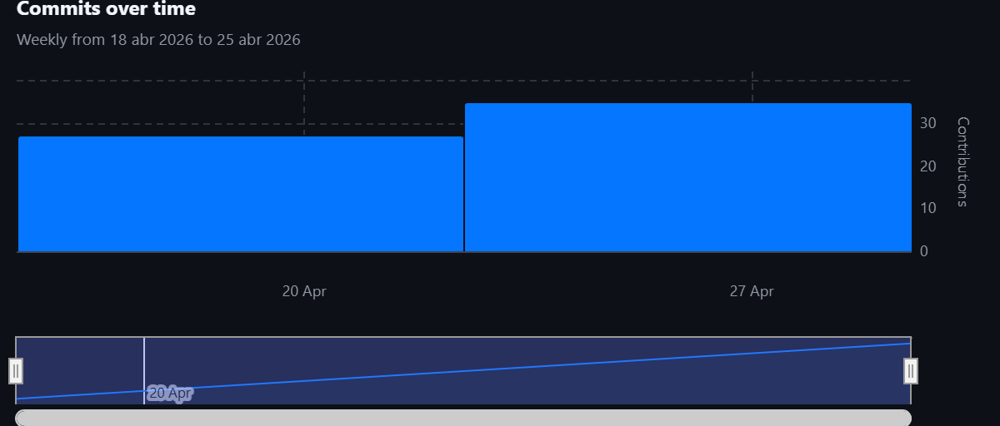

**Commits por integrante durante AV1**

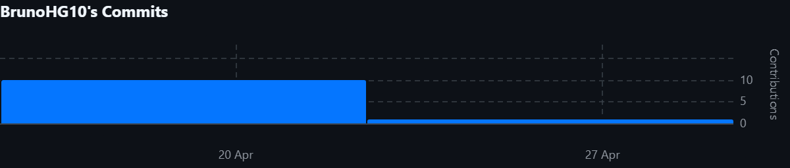

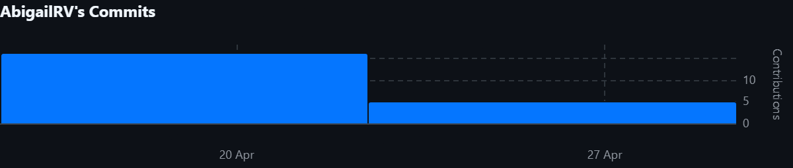

**TB1** 

**Grafo de commits TB1**

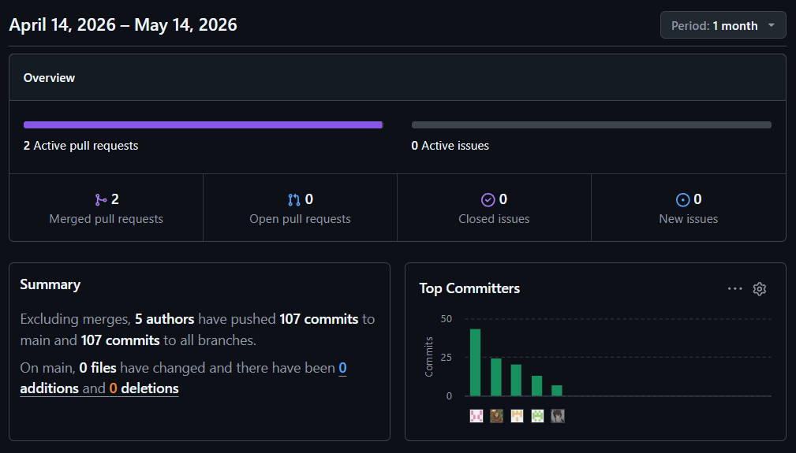

**Commits durante TB1**

**Commits por integrante durante TB1**

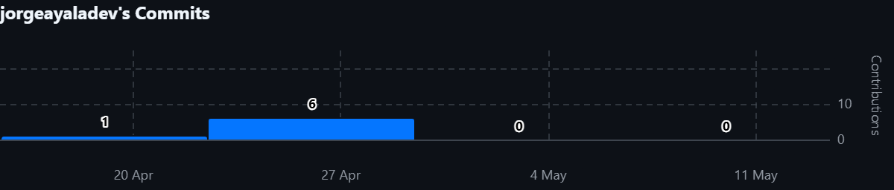

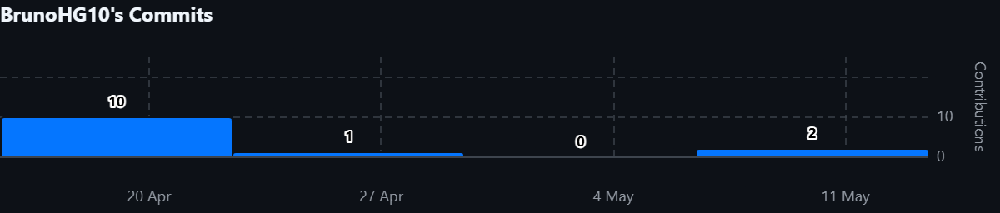

**AV2**

**Grafo de commits AV2**

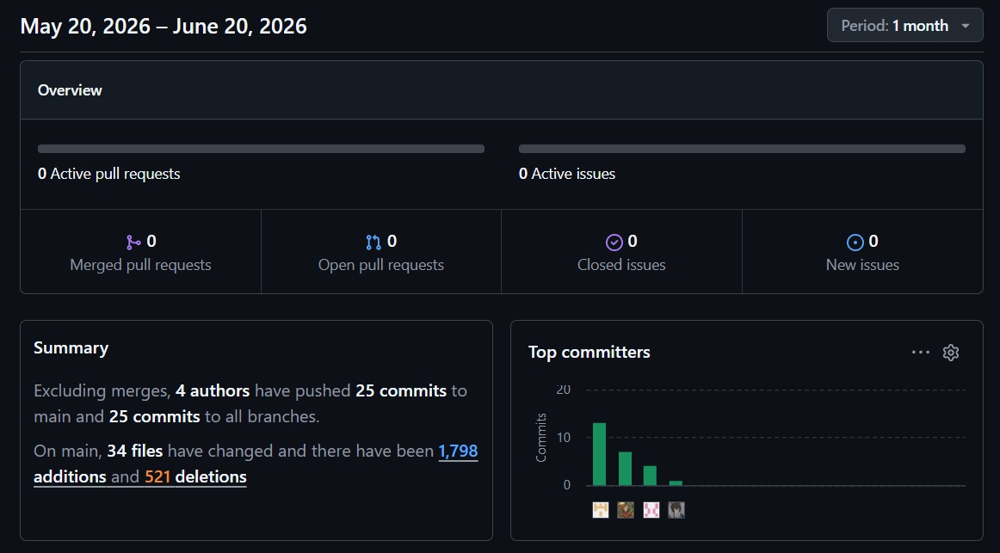

**Commits durante AV2**

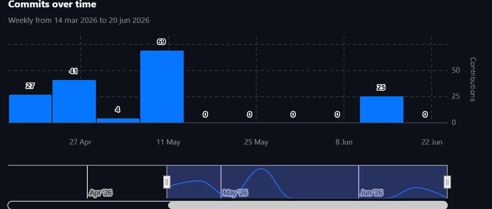

**Commits por integrante durante AV2**

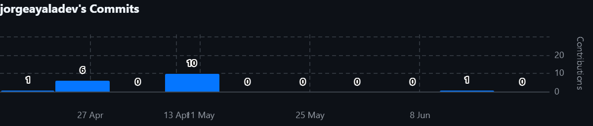

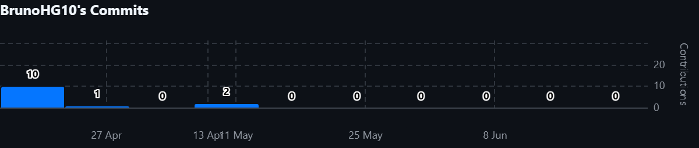

**TB2**

**Grafo de commits TB2**

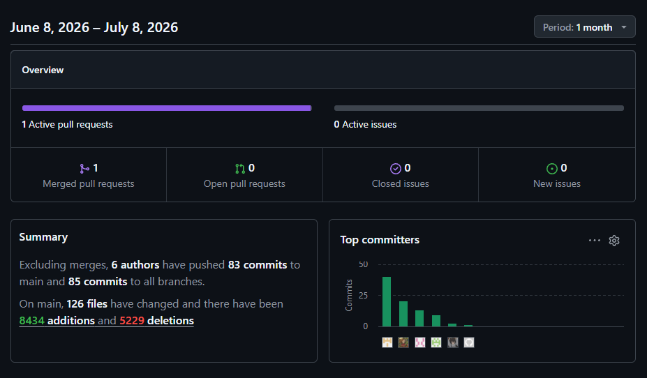

**Commits durante TB2**

**Commits por integrante durante TB2**

