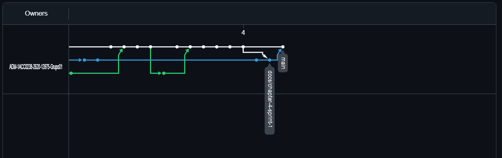
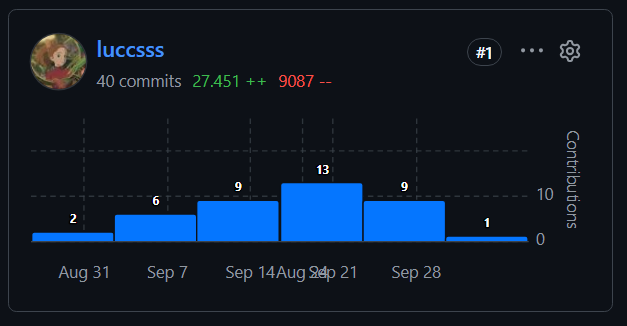
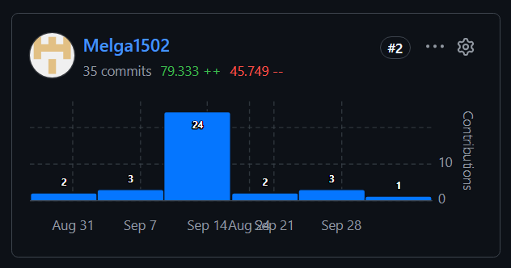
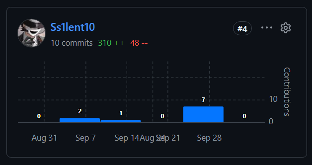
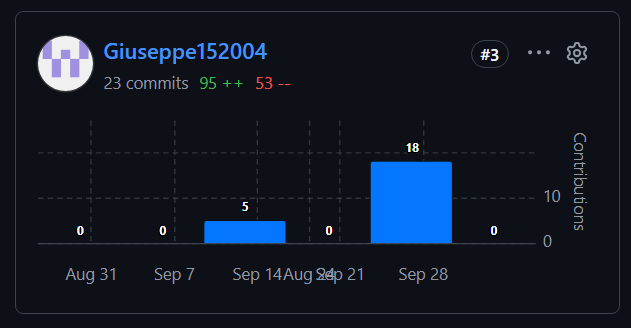
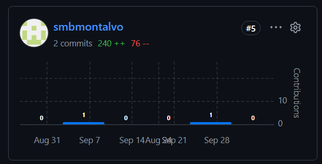

# Project Report Collaboration Insights

## Repositorios del proyecto

- Informe: https://github.com/ADM-1ACC0238-2620-13975-Grupo01/Informe
- Landing page: https://github.com/ADM-1ACC0238-2620-13975-Grupo01/anitec-landing-page
- Frontend web: https://github.com/ADM-1ACC0238-2620-13975-Grupo01/anitec-frontend
- Backend: https://github.com/ADM-1ACC0238-2620-13975-Grupo01/anitec-backend
- Android: https://github.com/ADM-1ACC0238-2620-13975-Grupo01/anitec-android

## **AV1. Distribución del trabajo**

Durante AV1, el equipo adaptó el informe y el diseño de AniTec al alcance de una aplicación móvil. Las contribuciones documentadas para los cinco integrantes actuales son las siguientes:

| Integrante | Contribución en AV1 |
| :--- | :--- |
| Sebastian Martin Beingolea Montalvo | Redactó el capítulo I: Introducción. |
| Saul Ortega Muñoz | Redactó las secciones 2.1 a 2.4 del capítulo II. |
| Josep Eliu Melgarejo Quiroz | Redactó las secciones 2.6.1 a 2.6.9 del capítulo II. |
| Giuseppe Villanueva Rodriguez | Realizó una entrevista. |
| Luciana Celeste Sanchez Silva | Redactó las secciones 2.5 a 2.6 del capítulo II. |

## **TB1. Distribución del trabajo**

Durante el TB1 (Sprint 1), el equipo implementó la Landing Page, el backend y la aplicación Android, y documentó el sprint en los capítulos III y IV del informe. Las contribuciones de los cinco integrantes, según las tareas del Sprint Backlog, son las siguientes:

| Integrante | Contribución en TB1 |
| :--- | :--- |
| Sebastian Martin Beingolea Montalvo | Conectó la aplicación con la API, agregó los corrales y las operaciones masivas al backend, documentó los endpoints con OpenAPI, protegió la sesión del usuario y creó las pruebas automatizadas del backend. Documentó las evidencias del backend en el informe. |
| Saul Ortega Muñoz | Diseñó el wireframe y el mock-up móvil de la Landing Page y construyó sus secciones, su diseño adaptable y el cambio de idioma. Desarrolló las pantallas de registro, inicio de sesión, mantenimiento de la sesión y ficha técnica del animal. |
| Josep Eliu Melgarejo Quiroz | Desarrolló el almacenamiento local de la aplicación Android, la navegación por rol, la lista de animales con búsqueda, el registro individual y masivo de animales y la fotografía del animal. Dirigió la planificación del Sprint 1 y mantiene la estructura del informe. |
| Giuseppe Villanueva Rodriguez | Creó el proyecto Android y organizó su código por capas, y desarrolló la edición de animales y la pantalla de inicio del ganadero. Escribió las pruebas de la aplicación y registró las aplicaciones en Firebase. |
| Luciana Celeste Sanchez Silva | Elaboró los mock-ups, wireframes, wireflows, user flow diagrams y el prototipo de las aplicaciones móviles. Desarrolló las pantallas de fincas, corrales y registros sanitarios. |

## GitHub Collaboration Insights

El repositorio del informe conserva el historial de los cambios documentales del equipo. Las siguientes capturas muestran el grafo general y los commits asociados a cada integrante durante el avance.

### *Grafo general de commits AV1*

### *Commits por integrante AV1*

*Luciana Celeste Sanchez Silva*

  

*Josep Eliu Melgarejo Quiroz*

  

*Sebastian Martin Beingolea Montalvo*

  

*Saul Ortega Muñoz*

  

*Giuseppe Villanueva Rodriguez*

  

### *Grafo general de commits TB1*

### *Commits por integrante TB1*

*Luciana Celeste Sanchez Silva*

  

*Josep Eliu Melgarejo Quiroz*

  

*Sebastian Martin Beingolea Montalvo*

  

*Saul Ortega Muñoz*

  

*Giuseppe Villanueva Rodriguez*

  

