

 

  

 
<h2 align="center">Universidad Peruana de Ciencias Aplicadas</h2>
<h2 align="center">Carrera de Ingeniería de Software</h2>

<h2 align="center"><strong>1ACC0238</strong></h2>
<h2 align="center"><strong>Aplicaciones para Dispositivos Móviles </strong></h2>
<h2 align="center">NRC</h2>
<h2 align="center"><strong>13975</strong></h2>
<h2 align="center"><strong>Informe del Trabajo Final</strong></h2>
<h2 align="center">Docente</h2>
<h2 align="center"><strong>Quevedo Velasco, David Gerardo </strong></h2>
<h2 align="center">Equipo</h2>
<h2 align="center"><strong>ADM</strong></h2>
<h2 align="center">Proyecto</h2>
<h2 align="center"><strong>AniTec</strong></h2>

<h2 align="center"><strong>Integrantes:</strong></h2>

  <table align="center" border="0" cellspacing="0" style="border: none !important; border-collapse: collapse;">
    <thead>
      <tr>
        <th align="center" style="border: none !important;">Código</th>
        <th align="left" style="border: none !important; text-align: left;">Apellidos y Nombres</th>
      </tr>
    </thead>
    <tbody>
      <tr>
        <td align="center" style="border: none !important;">U202217853</td>
        <td align="left" style="border: none !important; text-align: left;">Beingolea Montalvo, Sebastian Martin </td>
      </tr>
      <tr>
        <td align="center" style="border: none !important;">U202315165</td>
        <td align="left" style="border: none !important; text-align: left;">Melgarejo Quiroz, Josep Eliu</td>
      </tr>
      <tr>
        <td align="center" style="border: none !important;">U20231C019</td>
        <td align="left" style="border: none !important; text-align: left;">Ortega Muñoz, Saul </td>
      </tr>
      <tr>
        <td align="center" style="border: none !important;">U202215979</td>
        <td align="left" style="border: none !important; text-align: left;">Sanchez Silva, Luciana Celeste</td>
      </tr>
      <tr>
        <td align="center" style="border: none !important;">U20221C554</td>
        <td align="left" style="border: none !important; text-align: left;"> Villanueva Rodriguez, Giuseppe Adrian</td>
      </tr>
    </tbody>
  </table>

<h2 align="center"><strong>Período 202620</strong></h2>
<h2 align="center"><strong>Septiembre 2026</strong></h2>

<h1 align="center">Índice general</h1>

- [Registro de Versiones del Informe](#registro-de-versiones-del-informe)

- [Project Report Collaboration Insights](#project-report-collaboration-insights)

- [Student Outcome](#toc-student-outcome)

<h2>Capítulo I: Presentación</h2>

- [1.1. Startup Profile](#toc-1-1-startup-profile)
  - [1.1.1. Descripción de la Startup](#toc-1-1-1-descripcion-de-la-startup)
  - [1.1.2. Perfiles de integrantes del equipo](#toc-1-1-2-perfiles-de-integrantes-del-equipo)
- [1.2. Solution Profile](#toc-1-2-solution-profile)
  - [1.2.1. Antecedentes y problemática](#toc-1-2-1-antecedentes-y-problematica)
  - [1.2.2. Lean UX Process](#toc-1-2-2-lean-ux-process)
    - [1.2.2.1. Lean UX Problem Statements](#toc-1-2-2-1-lean-ux-problem-statements)
    - [1.2.2.2. Lean UX Assumptions](#toc-1-2-2-2-lean-ux-assumptions)
    - [1.2.2.3. Lean UX Hypothesis Statements](#toc-1-2-2-3-lean-ux-hypothesis-statements)
    - [1.2.2.4. Lean UX Canvas](#toc-1-2-2-4-lean-ux-canvas)
- [1.3. Segmentos objetivo](#toc-1-3-segmentos-objetivo)

<h2>Capítulo II: Requirements Development and Software Solution Design</h2>

- [2.1. Competidores](#toc-2-1-competidores)
  - [2.1.1. Análisis competitivo](#toc-2-1-1-analisis-competitivo)
  - [2.1.2. Estrategias y tácticas frente a competidores](#toc-2-1-2-estrategias-y-tacticas-frente-a-competidores)
- [2.2. Entrevistas](#toc-2-2-entrevistas)
  - [2.2.1. Diseño de entrevistas](#toc-2-2-1-diseno-de-entrevistas)
  - [2.2.2. Registro de entrevistas](#toc-2-2-2-registro-de-entrevistas)
  - [2.2.3. Análisis de entrevistas](#toc-2-2-3-analisis-de-entrevistas)
- [2.3. Needfinding](#toc-2-3-needfinding)
  - [2.3.1. User Personas](#toc-2-3-1-user-personas)
  - [2.3.2. User Task Matrix](#toc-2-3-2-user-task-matrix)
  - [2.3.3. User Journey Mapping](#toc-2-3-3-user-journey-mapping)
  - [2.3.4. Empathy Mapping](#toc-2-3-4-empathy-mapping)
  - [2.3.5. Big Picture EventStorming](#toc-2-3-5-big-picture-eventstorming)
  - [2.3.6. Ubiquitous Language](#toc-2-3-6-ubiquitous-language)
- [2.4. Requirements specification](#toc-2-4-requirements-specification)
  - [2.4.1. User Stories](#toc-2-4-1-user-stories)
  - [2.4.2. Impact Mapping](#toc-2-4-2-impact-mapping)
  - [2.4.3. Product Backlog](#toc-2-4-3-product-backlog)
- [2.5. Strategic-Level Domain-Driven Design](#toc-2-5-strategic-level-domain-driven-design)
  - [2.5.1. EventStorming](#toc-2-5-1-eventstorming)
    - [2.5.1.1. Candidate Context Discovery](#toc-2-5-1-1-candidate-context-discovery)
    - [2.5.1.2. Domain Message Flows Modeling](#toc-2-5-1-2-domain-message-flows-modeling)
    - [2.5.1.3. Bounded Context Canvases](#toc-2-5-1-3-bounded-context-canvases)
  - [2.5.2. Context Mapping](#toc-2-5-2-context-mapping)
  - [2.5.3. Software Architecture](#toc-2-5-3-software-architecture)
    - [2.5.3.1. Software Architecture Context Level Diagrams](#toc-2-5-3-1-software-architecture-context-level-diagrams)
    - [2.5.3.2. Software Architecture Container Level Diagrams](#toc-2-5-3-2-software-architecture-container-level-diagrams)
    - [2.5.3.3. Software Architecture Deployment Diagrams](#toc-2-5-3-3-software-architecture-deployment-diagrams)
- [2.6. Tactical-Level Domain-Driven Design](#toc-2-6-tactical-level-domain-driven-design)
  - [2.6.1. Bounded Context: Identity and Access Management](#toc-2-6-1-bounded-context-identity-and-access-management)
    - [2.6.1.1. Domain Layer](#toc-2-6-1-1-domain-layer)
    - [2.6.1.2. Interface Layer](#toc-2-6-1-2-interface-layer)
    - [2.6.1.3. Application Layer](#toc-2-6-1-3-application-layer)
    - [2.6.1.4. Infrastructure Layer](#toc-2-6-1-4-infrastructure-layer)
    - [2.6.1.5. Bounded Context Software Architecture Component Level Diagrams](#toc-2-6-1-5-bounded-context-software-architecture-component-level-diagrams)
    - [2.6.1.6. Bounded Context Software Architecture Code Level Diagrams](#toc-2-6-1-6-bounded-context-software-architecture-code-level-diagrams)
      - [2.6.1.6.1. Bounded Context Domain Layer Class Diagrams](#toc-2-6-1-6-1-bounded-context-domain-layer-class-diagrams)
      - [2.6.1.6.2. Bounded Context Database Design Diagram](#toc-2-6-1-6-2-bounded-context-database-design-diagram)
  - [2.6.2. Bounded Context: Profile Management](#toc-2-6-2-bounded-context-profile-management)
    - [2.6.2.1. Domain Layer](#toc-2-6-2-1-domain-layer)
    - [2.6.2.2. Interface Layer](#toc-2-6-2-2-interface-layer)
    - [2.6.2.3. Application Layer](#toc-2-6-2-3-application-layer)
    - [2.6.2.4. Infrastructure Layer](#toc-2-6-2-4-infrastructure-layer)
    - [2.6.2.5. Bounded Context Software Architecture Component Level Diagrams](#toc-2-6-2-5-bounded-context-software-architecture-component-level-diagrams)
    - [2.6.2.6. Bounded Context Software Architecture Code Level Diagrams](#toc-2-6-2-6-bounded-context-software-architecture-code-level-diagrams)
      - [2.6.2.6.1. Bounded Context Domain Layer Class Diagrams](#toc-2-6-2-6-1-bounded-context-domain-layer-class-diagrams)
      - [2.6.2.6.2. Bounded Context Database Design Diagram](#toc-2-6-2-6-2-bounded-context-database-design-diagram)
  - [2.6.3. Bounded Context: Livestock Management](#toc-2-6-3-bounded-context-livestock-management)
    - [2.6.3.1. Domain Layer](#toc-2-6-3-1-domain-layer)
    - [2.6.3.2. Interface Layer](#toc-2-6-3-2-interface-layer)
    - [2.6.3.3. Application Layer](#toc-2-6-3-3-application-layer)
    - [2.6.3.4. Infrastructure Layer](#toc-2-6-3-4-infrastructure-layer)
    - [2.6.3.5. Bounded Context Software Architecture Component Level Diagrams](#toc-2-6-3-5-bounded-context-software-architecture-component-level-diagrams)
    - [2.6.3.6. Bounded Context Software Architecture Code Level Diagrams](#toc-2-6-3-6-bounded-context-software-architecture-code-level-diagrams)
      - [2.6.3.6.1. Bounded Context Domain Layer Class Diagrams](#toc-2-6-3-6-1-bounded-context-domain-layer-class-diagrams)
      - [2.6.3.6.2. Bounded Context Database Design Diagram](#toc-2-6-3-6-2-bounded-context-database-design-diagram)
  - [2.6.4. Bounded Context: Sanitary Management](#toc-2-6-4-bounded-context-sanitary-management)
    - [2.6.4.1. Domain Layer](#toc-2-6-4-1-domain-layer)
    - [2.6.4.2. Interface Layer](#toc-2-6-4-2-interface-layer)
    - [2.6.4.3. Application Layer](#toc-2-6-4-3-application-layer)
    - [2.6.4.4. Infrastructure Layer](#toc-2-6-4-4-infrastructure-layer)
    - [2.6.4.5. Bounded Context Software Architecture Component Level Diagrams](#toc-2-6-4-5-bounded-context-software-architecture-component-level-diagrams)
    - [2.6.4.6. Bounded Context Software Architecture Code Level Diagrams](#toc-2-6-4-6-bounded-context-software-architecture-code-level-diagrams)
      - [2.6.4.6.1. Bounded Context Domain Layer Class Diagrams](#toc-2-6-4-6-1-bounded-context-domain-layer-class-diagrams)
      - [2.6.4.6.2. Bounded Context Database Design Diagram](#toc-2-6-4-6-2-bounded-context-database-design-diagram)
  - [2.6.5. Bounded Context: Veterinary Collaboration](#toc-2-6-5-bounded-context-veterinary-collaboration)
    - [2.6.5.1. Domain Layer](#toc-2-6-5-1-domain-layer)
    - [2.6.5.2. Interface Layer](#toc-2-6-5-2-interface-layer)
    - [2.6.5.3. Application Layer](#toc-2-6-5-3-application-layer)
    - [2.6.5.4. Infrastructure Layer](#toc-2-6-5-4-infrastructure-layer)
    - [2.6.5.5. Bounded Context Software Architecture Component Level Diagrams](#toc-2-6-5-5-bounded-context-software-architecture-component-level-diagrams)
    - [2.6.5.6. Bounded Context Software Architecture Code Level Diagrams](#toc-2-6-5-6-bounded-context-software-architecture-code-level-diagrams)
      - [2.6.5.6.1. Bounded Context Domain Layer Class Diagrams](#toc-2-6-5-6-1-bounded-context-domain-layer-class-diagrams)
      - [2.6.5.6.2. Bounded Context Database Design Diagram](#toc-2-6-5-6-2-bounded-context-database-design-diagram)
  - [2.6.6. Bounded Context: Activity Management](#toc-2-6-6-bounded-context-activity-management)
    - [2.6.6.1. Domain Layer](#toc-2-6-6-1-domain-layer)
    - [2.6.6.2. Interface Layer](#toc-2-6-6-2-interface-layer)
    - [2.6.6.3. Application Layer](#toc-2-6-6-3-application-layer)
    - [2.6.6.4. Infrastructure Layer](#toc-2-6-6-4-infrastructure-layer)
    - [2.6.6.5. Bounded Context Software Architecture Component Level Diagrams](#toc-2-6-6-5-bounded-context-software-architecture-component-level-diagrams)
    - [2.6.6.6. Bounded Context Software Architecture Code Level Diagrams](#toc-2-6-6-6-bounded-context-software-architecture-code-level-diagrams)
      - [2.6.6.6.1. Bounded Context Domain Layer Class Diagrams](#toc-2-6-6-6-1-bounded-context-domain-layer-class-diagrams)
      - [2.6.6.6.2. Bounded Context Database Design Diagram](#toc-2-6-6-6-2-bounded-context-database-design-diagram)
  - [2.6.7. Bounded Context: Financial Management](#toc-2-6-7-bounded-context-financial-management)
    - [2.6.7.1. Domain Layer](#toc-2-6-7-1-domain-layer)
    - [2.6.7.2. Interface Layer](#toc-2-6-7-2-interface-layer)
    - [2.6.7.3. Application Layer](#toc-2-6-7-3-application-layer)
    - [2.6.7.4. Infrastructure Layer](#toc-2-6-7-4-infrastructure-layer)
    - [2.6.7.5. Bounded Context Software Architecture Component Level Diagrams](#toc-2-6-7-5-bounded-context-software-architecture-component-level-diagrams)
    - [2.6.7.6. Bounded Context Software Architecture Code Level Diagrams](#toc-2-6-7-6-bounded-context-software-architecture-code-level-diagrams)
      - [2.6.7.6.1. Bounded Context Domain Layer Class Diagrams](#toc-2-6-7-6-1-bounded-context-domain-layer-class-diagrams)
      - [2.6.7.6.2. Bounded Context Database Design Diagram](#toc-2-6-7-6-2-bounded-context-database-design-diagram)
  - [2.6.8. Bounded Context: Subscription Management](#toc-2-6-8-bounded-context-subscription-management)
    - [2.6.8.1. Domain Layer](#toc-2-6-8-1-domain-layer)
    - [2.6.8.2. Interface Layer](#toc-2-6-8-2-interface-layer)
    - [2.6.8.3. Application Layer](#toc-2-6-8-3-application-layer)
    - [2.6.8.4. Infrastructure Layer](#toc-2-6-8-4-infrastructure-layer)
    - [2.6.8.5. Bounded Context Software Architecture Component Level Diagrams](#toc-2-6-8-5-bounded-context-software-architecture-component-level-diagrams)
    - [2.6.8.6. Bounded Context Software Architecture Code Level Diagrams](#toc-2-6-8-6-bounded-context-software-architecture-code-level-diagrams)
      - [2.6.8.6.1. Bounded Context Domain Layer Class Diagrams](#toc-2-6-8-6-1-bounded-context-domain-layer-class-diagrams)
      - [2.6.8.6.2. Bounded Context Database Design Diagram](#toc-2-6-8-6-2-bounded-context-database-design-diagram)
  - [2.6.9. Bounded Context: Analytics and Reporting](#toc-2-6-9-bounded-context-analytics-and-reporting)
    - [2.6.9.1. Domain Layer](#toc-2-6-9-1-domain-layer)
    - [2.6.9.2. Interface Layer](#toc-2-6-9-2-interface-layer)
    - [2.6.9.3. Application Layer](#toc-2-6-9-3-application-layer)
    - [2.6.9.4. Infrastructure Layer](#toc-2-6-9-4-infrastructure-layer)
    - [2.6.9.5. Bounded Context Software Architecture Component Level Diagrams](#toc-2-6-9-5-bounded-context-software-architecture-component-level-diagrams)
    - [2.6.9.6. Bounded Context Software Architecture Code Level Diagrams](#toc-2-6-9-6-bounded-context-software-architecture-code-level-diagrams)
      - [2.6.9.6.1. Bounded Context Domain Layer Class Diagrams](#toc-2-6-9-6-1-bounded-context-domain-layer-class-diagrams)
      - [2.6.9.6.2. Bounded Context Database Design Diagram](#toc-2-6-9-6-2-bounded-context-database-design-diagram)

<h2>Capítulo III: Solution UI/UX Design</h2>

- [3.1. Product design](#toc-3-1-product-design)
  - [3.1.1. Style Guidelines](#toc-3-1-1-style-guidelines)
    - [3.1.1.1. General Style Guidelines](#toc-3-1-1-1-general-style-guidelines)
  - [3.1.2. Information Architecture](#toc-3-1-2-information-architecture)
    - [3.1.2.1. Organization Systems](#toc-3-1-2-1-organization-systems)
    - [3.1.2.2. Labelling Systems](#toc-3-1-2-2-labelling-systems)
    - [3.1.2.3. SEO Tags and Meta Tags](#toc-3-1-2-3-seo-tags-and-meta-tags)
    - [3.1.2.4. Searching Systems](#toc-3-1-2-4-searching-systems)
    - [3.1.2.5. Navigation Systems](#toc-3-1-2-5-navigation-systems)
  - [3.1.3. Landing Page UI Design](#toc-3-1-3-landing-page-ui-design)
    - [3.1.3.1. Landing Page Wireframe](#toc-3-1-3-1-landing-page-wireframe)
    - [3.1.3.2. Landing Page Mock-up](#toc-3-1-3-2-landing-page-mock-up)
  - [3.1.4. Mobile Applications UX/UI Design](#toc-3-1-4-mobile-applications-ux-ui-design)
    - [3.1.4.1. Mobile Applications Wireframes](#toc-3-1-4-1-mobile-applications-wireframes)
    - [3.1.4.2. Mobile Applications Wireflow Diagrams](#toc-3-1-4-2-mobile-applications-wireflow-diagrams)
    - [3.1.4.3. Mobile Applications Mock-ups](#toc-3-1-4-3-mobile-applications-mock-ups)
    - [3.1.4.4. Mobile Applications User Flow Diagrams](#toc-3-1-4-4-mobile-applications-user-flow-diagrams)
    - [3.1.4.5. Mobile Applications Prototyping](#toc-3-1-4-5-mobile-applications-prototyping)

<h2>Capítulo IV: Product Implementation & Validation</h2>

- [4. Product Implementation & Validation](#toc-4-product-implementation-validation)
  - [4.1. Software Configuration Management](#toc-4-1-software-configuration-management)
    - [4.1.1. Software Development Environment Configuration](#toc-4-1-1-software-development-environment-configuration)
    - [4.1.2. Source Code Management](#toc-4-1-2-source-code-management)
    - [4.1.3. Source Code Style Guide & Conventions](#toc-4-1-3-source-code-style-guide-conventions)
    - [4.1.4. Software Deployment Configuration](#toc-4-1-4-software-deployment-configuration)
  - [4.2. Landing Page & Mobile Application Implementation](#toc-4-2-landing-page-mobile-application-implementation)
    - [4.2.1. Sprint n](#toc-4-2-1-sprint-n)
      - [4.2.1.1. Sprint Planning n](#toc-4-2-1-1-sprint-planning-n)
      - [4.2.1.2. Aspect Leaders and Collaborators](#toc-4-2-1-2-aspect-leaders-and-collaborators)
      - [4.2.1.3. Sprint Backlog n](#toc-4-2-1-3-sprint-backlog-n)
      - [4.2.1.4. Development Evidence for Sprint Review](#toc-4-2-1-4-development-evidence-for-sprint-review)
      - [4.2.1.5. Testing Suite Evidence for Sprint Review](#toc-4-2-1-5-testing-suite-evidence-for-sprint-review)
      - [4.2.1.6. Execution Evidence for Sprint Review](#toc-4-2-1-6-execution-evidence-for-sprint-review)
      - [4.2.1.7. Services Documentation Evidence for Sprint Review](#toc-4-2-1-7-services-documentation-evidence-for-sprint-review)
      - [4.2.1.8. Software Deployment Evidence for Sprint Review](#toc-4-2-1-8-software-deployment-evidence-for-sprint-review)
      - [4.2.1.9. Team Collaboration Insights during Sprint](#toc-4-2-1-9-team-collaboration-insights-during-sprint)
  - [4.3. Validation Interviews](#toc-4-3-validation-interviews)
    - [4.3.1. Diseño de Entrevistas](#toc-4-3-1-diseno-de-entrevistas)
    - [4.3.2. Registro de Entrevistas](#toc-4-3-2-registro-de-entrevistas)
    - [4.3.3. Evaluaciones según heurísticas](#toc-4-3-3-evaluaciones-segun-heuristicas)

- [Conclusiones](#toc-conclusiones)

- [Bibliografía](#toc-bibliografia)

- [Anexos](#toc-anexos)

# Registro de versiones del informe

Las entradas de la versión 1 corresponden al avance AV1 del curso de Aplicaciones para Dispositivos Móviles. La fecha indica la actualización de este registro.

| Versión | Fecha | Autor | Descripción de modificación |
| :---: | :---: | :--- | :--- |
| 1.0 | 16/09/2026 | Sebastian Martin Beingolea Montalvo | Redacción del capítulo I: Introducción. |
| 1.1 | 16/09/2026 | Saul Ortega Muñoz | Redacción de las secciones 2.1 a 2.4 del capítulo II. |
| 1.2 | 16/09/2026 | Josep Eliu Melgarejo Quiroz | Redacción de las secciones 2.6.1 a 2.6.9 del capítulo II. |
| 1.3 | 16/09/2026 | Giuseppe Villanueva Rodriguez | Realizó una entrevista. |
| 1.4 | 16/09/2026 | Luciana Celeste Sanchez Silva | Redacción de las secciones 2.5 a 2.6 del capítulo II. |

# Project Report Collaboration Insights

## Repositorios del proyecto

- [Informe](https://github.com/ADM-1ACC0238-2620-13975-Grupo01/Informe)
- [Landing page](https://github.com/ADM-1ACC0238-2620-13975-Grupo01/anitec-landing-page)
- [Frontend web heredado](https://github.com/ADM-1ACC0238-2620-13975-Grupo01/anitec-frontend)
- [Backend](https://github.com/ADM-1ACC0238-2620-13975-Grupo01/anitec-backend)

## AV1. Distribución del trabajo

Durante AV1, el equipo adaptó el informe y el diseño de AniTec al alcance de una aplicación móvil. Las contribuciones documentadas para los cinco integrantes actuales son las siguientes:

| Integrante | Contribución en AV1 |
| :--- | :--- |
| Sebastian Martin Beingolea Montalvo | Redactó el capítulo I: Introducción. |
| Saul Ortega Muñoz | Redactó las secciones 2.1 a 2.4 del capítulo II. |
| Josep Eliu Melgarejo Quiroz | Redactó las secciones 2.6.1 a 2.6.9 del capítulo II. |
| Giuseppe Villanueva Rodriguez | Realizó una entrevista. |
| Luciana Celeste Sanchez Silva | Redactó las secciones 2.5 a 2.6 del capítulo II. |

## GitHub Collaboration Insights

El repositorio del informe conserva el historial de los cambios documentales del equipo. Las siguientes capturas muestran el grafo general y los commits asociados a cada integrante durante el avance.

### Grafo general de commits

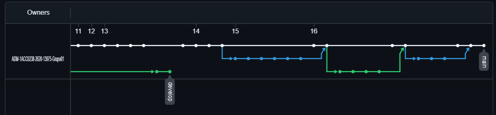

### Commits por integrante

**Luciana Celeste Sanchez Silva**

  

**Josep Eliu Melgarejo Quiroz**

  

**Sebastian Martin Beingolea Montalvo**

  

**Saul Ortega Muñoz**

  

**Giuseppe Villanueva Rodriguez**

  

# Student Outcome

## ABET - EAC - Student Outcome 7

**Criterio:** La capacidad de adquirir y aplicar nuevos conocimientos según sea necesario, utilizando estrategias de aprendizaje apropiadas.

En el siguiente cuadro se describen las acciones realizadas y los enunciados de conclusiones por parte del grupo durante el AV1, que permiten sustentar el logro del ABET - EAC - Student Outcome 7.

| Criterio específico | Acciones realizadas | Conclusiones |
|---|---|---|
| Actualiza conceptos y conocimientos necesarios para su desarrollo profesional y en especial para su proyecto en soluciones de software. | **AV1:**  **Luciana Celeste Sanchez Silva:** Revisó los conceptos de Lean UX, segmentación de usuarios y diseño centrado en las necesidades del ganadero y del veterinario. Aplicó estos conocimientos al actualizar el Startup Profile, el Solution Profile, los Problem Statements, Assumptions e Hypothesis Statements para orientar AniTec hacia una aplicación móvil.  **Josep Eliu Melgarejo Quiroz:** Analizó el statement del curso y estudió la estructura requerida para la especificación de requisitos móviles. Aplicó lo aprendido al reorganizar el índice del informe, adaptar las User Stories y Technical Stories, y distribuir el Product Backlog en tres sprints alineados con los hitos del curso.  **Sebastian Martin Beingolea Montalvo:** Profundizó en los fundamentos de Domain-Driven Design, EventStorming y lenguaje ubicuo. Aplicó estos conceptos en la identificación y delimitación de los bounded contexts, así como en la revisión de los flujos de mensajes del dominio ganadero.  **Saul Ortega Muñoz:** Investigó la notación C4, Structurizr DSL y la representación de arquitecturas para aplicaciones móviles. Aplicó estos conocimientos al apoyar la definición de los diagramas de contexto, contenedores, despliegue y componentes de AniTec.  **Giuseppe Villanueva Rodriguez:** Revisó conceptos relacionados con desarrollo Android, aplicaciones multiplataforma, persistencia local, sincronización, uso de cámara y notificaciones. Aplicó estos conocimientos al verificar la coherencia entre los requisitos obligatorios del curso, las funcionalidades móviles y las historias incluidas en el Product Backlog. | **AV1:**  El equipo actualizó conocimientos de Lean UX, Requirements Engineering, Domain-Driven Design, arquitectura C4 y desarrollo para dispositivos móviles. Estos conocimientos se aplicaron directamente en la corrección de los capítulos I y II, la definición del alcance de Android y Flutter, la elaboración de requisitos trazables y el diseño estratégico y táctico de los nueve bounded contexts. Como resultado, AniTec cuenta con una base documental coherente con el statement del curso y preparada para orientar su posterior implementación móvil. |
| Reconoce la necesidad del aprendizaje permanente para el desempeño profesional y el desarrollo de proyectos en soluciones de software. | **AV1:**  **Luciana Celeste Sanchez Silva:** Identificó que los supuestos sobre facilidad de uso, adopción y colaboración entre ganaderos y veterinarios deben contrastarse continuamente mediante entrevistas y validaciones. Por ello, consideró la investigación con usuarios como una fuente permanente de aprendizaje para mejorar la propuesta móvil.  **Josep Eliu Melgarejo Quiroz:** Reconoció la necesidad de revisar continuamente el statement, el Product Backlog y los criterios de evaluación para detectar brechas entre el trabajo heredado y las exigencias del nuevo curso. Utilizó la comparación sistemática y la mejora iterativa del informe como estrategia de aprendizaje.  **Sebastian Martin Beingolea Montalvo:** Comprendió que la delimitación del dominio puede evolucionar conforme aparecen nuevos eventos, reglas y dependencias. Adoptó la revisión de recursos anteriores, la discusión del lenguaje ubicuo y la contrastación entre diagramas como estrategias para refinar el diseño.  **Saul Ortega Muñoz:** Reconoció que las herramientas y convenciones de arquitectura requieren práctica y actualización constante. Consultó ejemplos, documentación y resultados exportados para comprobar que los diagramas representaran correctamente las relaciones entre usuarios, aplicaciones y servicios.  **Giuseppe Villanueva Rodriguez:** Identificó que las capacidades móviles plantean riesgos que deben investigarse antes de implementarse, especialmente en conectividad, permisos, almacenamiento local y uso de recursos del dispositivo. Consideró las Spike Stories, los prototipos y las pruebas en dispositivos físicos como estrategias necesarias para adquirir evidencia y ajustar decisiones. | **AV1:**  El equipo reconoció que el desarrollo de AniTec requiere aprendizaje continuo porque combina un producto web heredado con nuevas plataformas, herramientas y restricciones móviles. La revisión de documentación, el análisis de trabajos anteriores, la investigación individual, la discusión en equipo y la validación progresiva permitieron corregir supuestos y fundamentar decisiones. Estas prácticas fortalecen la capacidad del grupo para incorporar nuevos conocimientos durante los siguientes hitos y responder a cambios técnicos o de usuario sin perder coherencia en la solución. |

# Capítulo I: Presentación

# 1.1. Startup Profile

En esta sección se presenta la startup responsable de AniTec y a los integrantes del equipo que desarrollarán la solución durante el curso de Aplicaciones para Dispositivos Móviles.

## 1.1.1. Descripción de la Startup

Titan es una startup tecnológica que desarrolla soluciones digitales para mejorar la gestión de pequeños y medianos productores ganaderos. Su producto, AniTec, nació como una aplicación web para centralizar la información sanitaria, productiva y económica del ganado. En este curso, la propuesta evoluciona hacia una solución móvil que permita realizar las tareas principales desde el teléfono, dispositivo que acompaña al usuario durante el trabajo de campo.

AniTec contará con una aplicación nativa para Android desarrollada con Kotlin y con una experiencia multiplataforma. La tecnología de esta última se seleccionará mediante una evaluación técnica entre las alternativas permitidas por el curso. Ambas aplicaciones consumirán la API REST propia de AniTec y ofrecerán una experiencia coherente, accesible e internacionalizada.

La solución móvil se concentrará en las siguientes capacidades:

- Registrar, consultar y actualizar animales y sus datos principales.
- Consultar el historial sanitario y registrar atenciones, tratamientos y otros eventos.
- Guardar borradores o información esencial localmente para afrontar conexiones inestables.
- Programar y recibir recordatorios de vacunaciones, tratamientos y actividades.
- Identificar animales con apoyo de la cámara, manteniendo una búsqueda manual como alternativa.
- Consultar indicadores y resúmenes visuales que faciliten decisiones de campo.
- Permitir que los veterinarios consulten los animales autorizados por sus clientes y registren el seguimiento correspondiente.
- Gestionar planes mediante un servicio externo de pagos, sujeto a validación técnica y funcional.

El ecosistema se complementará con la landing page existente, que comunicará la propuesta de valor y dirigirá a la descarga de las aplicaciones. El desarrollo también incluirá persistencia local, acceso a capacidades del dispositivo, manejo de errores de red, accesibilidad e internacionalización. Además, se incorporará una capacidad autónoma basada en una biblioteca o servicio no utilizado previamente en clase, cuya viabilidad se comprobará mediante una Spike Story antes de integrarla al producto.

**Misión:** Facilitar la gestión y trazabilidad del ganado de pequeños y medianos productores mediante una experiencia móvil simple, accesible y útil en el trabajo de campo, que conecte al ganadero con la información de sus animales y con el seguimiento veterinario.

**Visión:** Convertir a AniTec en una solución móvil confiable para la gestión ganadera en Latinoamérica, reconocida por adaptarse a las condiciones reales del entorno rural y por ayudar a tomar decisiones sanitarias y productivas basadas en información ordenada.

## 1.1.2. Perfiles de integrantes del equipo

<table>
  <tr>
    <td width="30%" align="center">
      
    </td>
    <td width="70%">
      <h3>Luciana Celeste Sanchez Silva</h3>
      <h4>U202215979</h4>
      

        Mi nombre es Luciana Celeste Sanchez Silva, tengo 20 años y vivo en Lima. En la actualidad, me encuentro estudiando el 6to ciclo de la carrera de ingeniería de software en la UPC debido a que desde una edad temprana tuve una fascinación relacionada con el uso de la tecnología y la programación. En mi tiempo libre trato de crecer y expandir mi conocimiento en todas las áreas posibles. De igual forma, me gusta nadar, escuchar música y tocar la guitarra. Me comprometo a colaborar en todo momento con la elaboración de esta startup, y llegar a un trabajo sobresaliente. Mis habilidades son: responsabilidad, resolución de problemas, y disciplina.
      

    </td>
  </tr>

   <tr>
    <td width="30%" align="center">
      
    </td>
    <td width="70%">
      <h3>Josep Eliu Melgarejo Quiroz</h3>
      <h4>u202315165</h4>
      

        Mi nombre es Josep Eliu Melgarejo Quiroz, tengo 21 años y mi lugar de nacimiento es Huaral pero vivo actualmente en Lima - San miguel, me encuentro cursando el 5to ciclo de la carrera de ingenieria de software en la UPC debido a que siempre me fascino el tema tecnologico, y como era un apasionado por lo juegos que luego me conllevaron a conocer el mundo de la programacion decidi estudiar mi carrera. Me comprometo a siempre apoyar y motivar a mis compañeros en hacer el mejor trabajo posible y dar el 100% de capacidad en este trabajo
      

    </td>
  </tr>

   <tr>
    <td width="30%" align="center">
      
    </td>
    <td width="70%">
      <h3>Sebastian Martin Beingolea Montalvo</h3>
      <h4>U202217853</h4>
      

        Mi nombre es Sebastian Martin Beingolea Montalvo, tengo 21 años y vivo en Lima. Actualmente estudio la carrera de Ingeniería de Software en la UPC, motivado por el interés en crear soluciones tecnológicas que aporten valor real a las personas y a los negocios. Me gusta el desarrollo de software, el trabajo en equipo y aprender nuevas herramientas que puedan aplicar en proyectos como AniTec. En mi tiempo libre disfruto explorar tecnologías, escuchar música y seguir mejorando mis habilidades de programación. Me comprometo a colaborar de forma constante con mis compañeros, aportar ideas y contribuir a un entregable de calidad. Mis habilidades son: responsabilidad, trabajo en equipo, capacidad de aprendizaje y orientación a resultados.
      

    </td>
  </tr>

  <tr>
    <td width="30%" align="center">
      
    </td>
    <td width="70%">
      <h3>Saul Ortega Muñoz</h3>
      <h4>u20231c019</h4>
      

        Soy estudiante de Ingeniería de Software con formación en programación y desarrollo web. Tengo conocimientos en algunos lenguajes de programacion. Me caracterizo por ser responsable, con capacidad de aprendizaje rápido y trabajo en equipo, aportando ideas prácticas para resolver problemas y mejorar proyectos tecnológicos.
      

    </td>
  </tr>

  <tr>
    <td width="30%" align="center">
      
    </td>
    <td width="70%">
      <h3>Giuseppe Villanueva Rodriguez</h3>
      <h4>u20221c554</h4>
      

        Soy estudiante de Ingeniería de Software con habilidades en programacion. Poseo conocimientos en algunos lenguajes de programacion. Me caracterizo por ser empotico y siempre atento cuando se trata de trabajo en equipo.
      

    </td>
  </tr>
</table>

# 1.2. Solution Profile

## 1.2.1. Antecedentes y problemática

**Qué (What)**

_¿Cuál es la situación problemática?_

Los pequeños y medianos ganaderos suelen distribuir la información de sus animales entre cuadernos, hojas sueltas, archivos y mensajes. Esto dificulta mantener historiales completos, encontrar datos durante una atención, recordar actividades sanitarias y compartir información confiable con el veterinario. La aplicación web tomada como base centraliza parte de esos datos, pero no cubre por sí sola la necesidad de registrar y consultar información mientras el usuario se desplaza por el campo.

**Cuándo (When)**

_¿Cuándo ocurre el problema?_

El problema aparece durante todo el ciclo de manejo del animal: registro o nacimiento, vacunaciones, tratamientos, controles, reproducción, cambios productivos y venta. Se vuelve especialmente crítico cuando una actividad debe registrarse en el momento o cuando se necesita consultar el historial para decidir una atención.

**Dónde (Where)**

_¿Dónde se manifiesta y dónde se origina?_

Se manifiesta en unidades ganaderas rurales y semiurbanas, durante recorridos de campo y atenciones veterinarias. En estos entornos puede haber acceso limitado a una computadora y conectividad móvil intermitente, por lo que depender exclusivamente de una aplicación web o de una conexión constante interrumpe el flujo de trabajo.

**Quién (Who)**

_¿Quiénes participan y quiénes usarán la solución?_

Los usuarios principales serán pequeños y medianos ganaderos responsables del manejo cotidiano del hato y veterinarios de campo que necesitan consultar antecedentes y registrar atenciones. Asociaciones, cooperativas y entidades del sector son actores relacionados, pero no constituyen los segmentos de usuario priorizados para la primera versión.

**Por qué (Why)**

_¿Cuál es la causa principal del problema?_

Las herramientas disponibles no siempre se ajustan a la movilidad del trabajo ganadero, al nivel de experiencia digital de los usuarios ni a las restricciones de conectividad. Como consecuencia, el registro se posterga, la información queda incompleta o dispersa y la coordinación entre ganadero y veterinario depende de comunicaciones informales.

**Cómo (How)**

_¿Cómo se implementará la solución?_

AniTec extenderá el producto web existente con una aplicación nativa Android desarrollada con Kotlin y una aplicación multiplataforma cuya tecnología se elegirá mediante evaluación técnica. Las aplicaciones consumirán la API REST propia y permitirán registrar animales y eventos, consultar historiales, recibir notificaciones, utilizar la cámara, revisar indicadores y conservar temporalmente datos o borradores en el dispositivo.

_¿Cómo se logrará una experiencia útil en campo?_

Se diseñarán flujos breves, formularios con validación, estados claros de sincronización y alternativas manuales cuando una función del dispositivo no esté disponible. La solución considerará accesibilidad, internacionalización, seguridad de acceso y pruebas en dispositivos físicos bajo distintas condiciones de conectividad.

**Cuánto (How much)**

_¿Cuál es la magnitud del contexto?_

El IV Censo Nacional Agropecuario registró 2 199 243 productores agropecuarios como personas naturales y señaló que el 79,6 % tenía unidades de menos de cinco hectáreas (INEI, 2014). Además, durante el primer trimestre de 2025 solo el 20,5 % de los hogares rurales disponía de Internet en el hogar (INEI, 2025a). Estas cifras no cuantifican por sí solas el mercado de AniTec, pero muestran la escala de la pequeña producción agropecuaria y la necesidad de diseñar para un entorno de conectividad restringida.

### Descripción consolidada de los antecedentes y la problemática

AniTec parte de una aplicación web creada en un curso anterior. El reto actual consiste en adaptar y ampliar esa solución para el uso móvil, sin limitarse a reproducir sus pantallas. El teléfono debe convertirse en la herramienta de trabajo inmediata del ganadero y del veterinario: permitir el registro en el lugar donde ocurre el evento, presentar la información relevante con rapidez y tolerar interrupciones de red.

La propuesta comprenderá una landing page, una API REST propia, una aplicación Android nativa y una experiencia multiplataforma. El alcance inicial priorizará la gestión de animales e historiales sanitarios, el trabajo local y la posterior sincronización, las notificaciones, el uso de cámara, los indicadores de seguimiento y la colaboración autorizada con veterinarios. Las integraciones complementarias, como pagos o una capacidad autónoma basada en una tecnología nueva para el equipo, se incorporarán después de validar su viabilidad y su aporte al usuario.

El objetivo del proyecto es reducir la pérdida y fragmentación de información, facilitar el cumplimiento de actividades sanitarias y mejorar el acceso al historial del animal durante el trabajo de campo. La solución deberá mantener coherencia entre plataformas, proteger los datos, comunicar los estados de conexión y funcionar de manera comprensible para usuarios con distintos niveles de experiencia digital.

## 1.2.2. Lean UX Process.

### 1.2.2.1. Lean UX Problem Statements.

**Problem Statement:**

El estado actual de la gestión ganadera para pequeños y medianos productores se ha centrado principalmente en controles manuales, registros en cuadernos y herramientas digitales improvisadas para administrar la información sanitaria, reproductiva y económica del hato.

Lo que los productos y servicios existentes no abordan es la necesidad de contar con una aplicación para Android sencilla, accesible y adaptada al trabajo de campo, que permita centralizar la información del ganado y mantener el registro de las actividades principales incluso cuando la conexión a Internet sea inestable.

Nuestro producto, AniTec, abordará esta brecha mediante una aplicación móvil para Android que permitirá registrar, organizar y consultar la información del ganado desde el teléfono. La solución incluirá recordatorios sanitarios, historiales por animal, reportes y almacenamiento local de información esencial para reducir errores, evitar la pérdida de datos y facilitar la toma de decisiones.

Nuestro enfoque inicial será pequeños y medianos ganaderos que actualmente dependen de registros manuales o sistemas poco organizados para gestionar su producción, junto con veterinarios que necesitan consultar información sanitaria y dar seguimiento a los animales de sus clientes desde un dispositivo Android.

Sabremos que hemos tenido éxito cuando observemos una reducción en el uso de registros manuales, un aumento en la frecuencia y precisión de los registros realizados desde la aplicación, una mejora en el cumplimiento de vacunaciones y tratamientos, y una consulta más rápida de los historiales sanitarios por parte de ganaderos y veterinarios.

### 1.2.2.2. Lean UX Assumptions.

### **Business Assumptions:**

1. **Creemos que nuestros usuarios necesitan** un método confiable y eficiente para registrar y supervisar desde el teléfono la salud, productividad y trazabilidad de su ganado.
2. **Creemos que esta necesidad puede satisfacerse** mediante una aplicación para Android que permita registrar información clave, conservar datos esenciales en el dispositivo, generar alertas y consultar reportes útiles para la toma de decisiones.
3. **Creemos que nuestros primeros usuarios serán** pequeños y medianos ganaderos que utilizan teléfonos Android, así como veterinarios y técnicos agropecuarios que asesoran directamente en el campo.
4. **Creemos que lo más importante para los clientes es** contar con un control ordenado y disponible durante sus actividades, evitando pérdidas de información y mejorando la trazabilidad del ganado.
5. **Creemos que los usuarios también recibirán** alertas sanitarias mediante notificaciones, reportes económicos, acceso al historial de cada animal y contenido educativo dentro de la aplicación.
6. **Creemos que conseguiremos clientes mediante** alianzas con asociaciones ganaderas, programas de desarrollo rural, recomendaciones de veterinarios y campañas digitales dirigidas a regiones con actividad ganadera.
7. **Creemos que los ingresos se generarán mediante** un modelo de suscripción con planes ajustados al tamaño del hato y licencias institucionales para asociaciones y entidades del sector agropecuario.
8. **Creemos que nuestra competencia incluye** aplicaciones genéricas de gestión ganadera, hojas de cálculo y métodos tradicionales de registro manual.
9. **Creemos que nuestra ventaja competitiva radica en** ofrecer una aplicación Android adaptada al contexto rural, fácil de usar y preparada para conservar el progreso cuando la conectividad sea limitada.
10. **Creemos que un riesgo importante es** que algunos ganaderos no adopten fácilmente la aplicación por falta de experiencia digital, conectividad inestable o limitaciones de sus dispositivos.
11. **Creemos que lo mitigaremos mediante** una interfaz intuitiva, tutoriales paso a paso, formularios breves, almacenamiento local y mensajes claros sobre el estado de sincronización.

### **User Assumptions:**

- **Creemos que** los principales usuarios son pequeños y medianos ganaderos, veterinarios y técnicos agropecuarios que utilizan dispositivos Android durante sus actividades. En etapas posteriores, la aplicación también podría apoyar a asociaciones, cooperativas y entidades vinculadas con la sanidad y trazabilidad del sector.

- **Creemos que** AniTec ayuda a organizar la información del hato desde el teléfono, evitando la pérdida de datos importantes y la falta de seguimiento de vacunas, partos, tratamientos y movimientos. Para los veterinarios, facilita la consulta de clientes, pacientes e historiales sanitarios durante una atención.

- **Creemos que** los usuarios valoran el registro individual de cada animal, las notificaciones sobre actividades pendientes, los reportes simples, el historial del hato y la posibilidad de conservar registros cuando la conexión sea inestable. También creemos que la facilidad de uso es esencial para su adopción.

- **Creemos que** AniTec se integra en la rutina del ganadero porque puede utilizarse en el campo cada vez que se registra un animal, tratamiento, parto, vacunación o cambio productivo. Los veterinarios pueden utilizarla antes, durante y después de una visita para consultar antecedentes y registrar la atención.

- **Creemos que** AniTec debe ofrecer una experiencia Android intuitiva, legible y estable, pensada para usuarios con distintos niveles de experiencia tecnológica. También debe proteger los datos, comunicar los errores de conexión y permitir recuperar el trabajo pendiente.

### Feature Assumptions:

**Feature Assumption 01**

**Creemos que** una funcionalidad de registro móvil centralizado permitirá a los pequeños y medianos ganaderos gestionar la información sanitaria, reproductiva y económica de sus animales desde un dispositivo Android.

**Sabremos que esta funcionalidad es valiosa cuando** la mayoría de los usuarios registre y actualice periódicamente la información de sus animales mediante la aplicación.

**Feature Assumption 02**

**Creemos que** un sistema de notificaciones para vacunaciones, tratamientos y eventos reproductivos ayudará a los ganaderos a recordar actividades importantes y reducir los descuidos en el manejo del hato.

**Sabremos que esta funcionalidad es valiosa cuando** los usuarios atiendan o reprogramen los recordatorios recibidos en sus dispositivos Android.

**Feature Assumption 03**

**Creemos que** un módulo de reportes visuales e historial de cada animal facilitará la interpretación de la información y permitirá tomar mejores decisiones productivas, reproductivas y económicas.

**Sabremos que esta funcionalidad es valiosa cuando** los usuarios consulten los reportes y antecedentes antes de realizar acciones relacionadas con la gestión del ganado.

**Feature Assumption 04**

**Creemos que** el almacenamiento local de información esencial y borradores permitirá que los usuarios continúen registrando actividades cuando la conexión a Internet sea inestable.

**Sabremos que esta funcionalidad es valiosa cuando** los usuarios puedan recuperar y sincronizar sus registros sin repetir la información ingresada.

**Feature Assumption 05**

**Creemos que** un módulo para veterinarios con acceso autorizado a clientes, historiales y eventos sanitarios facilitará el seguimiento de los animales y mejorará la colaboración con los ganaderos.

**Sabremos que esta funcionalidad es valiosa cuando** los veterinarios utilicen la aplicación Android para registrar y consultar la información sanitaria de los animales atendidos.

### 1.2.2.3. Lean UX Hypothesis Statements.

- **Hypothesis Statement 01:**

  **Creemos que lograremos** una mayor adopción y un uso continuo de AniTec

  **Si** los pequeños y medianos ganaderos

  **Obtienen** una forma sencilla de registrar y consultar la información sanitaria, reproductiva y económica de sus animales desde el teléfono

  **Con** una aplicación para Android que centralice y organice la información del hato.

- **Hypothesis Statement 02:**

  **Creemos que lograremos** mejorar la gestión sanitaria del hato y reducir actividades olvidadas

  **Si** los pequeños y medianos ganaderos

  **Obtienen** recordatorios oportunos sobre vacunaciones, tratamientos y eventos reproductivos

  **Con** un sistema de alertas y notificaciones integrado en la aplicación Android.

- **Hypothesis Statement 03:**

  **Creemos que lograremos** una mejor toma de decisiones sobre el manejo del ganado

  **Si** los pequeños y medianos ganaderos

  **Obtienen** acceso desde el teléfono a reportes visuales y al historial de cada animal

  **Con** un módulo móvil de reportes e historiales organizado y fácil de interpretar.

- **Hypothesis Statement 04:**

  **Creemos que lograremos** reducir la pérdida de información causada por problemas de conectividad

  **Si** los pequeños y medianos ganaderos y veterinarios

  **Obtienen** la posibilidad de conservar el progreso cuando no dispongan de una conexión estable

  **Con** almacenamiento local y sincronización posterior dentro de la aplicación Android.

- **Hypothesis Statement 05:**

  **Creemos que lograremos** una mejor colaboración entre ganaderos y veterinarios y un seguimiento sanitario más eficiente

  **Si** los veterinarios

  **Obtienen** acceso autorizado a los clientes asignados, al historial de los animales y al registro de eventos sanitarios

  **Con** un módulo para veterinarios integrado en la aplicación Android de AniTec.

### 1.2.2.4. Lean UX Canvas.

El Lean UX Canvas es una herramienta utilizada en el marco del diseño centrado en el usuario (UX) y la metodología Lean, cuyo objetivo es apoyar la creación y mejora de productos de manera ágil y eficiente. Su propósito principal es proporcionar una estructura organizada que fomente la colaboración entre equipos multidisciplinarios. A continuación, se presenta el Lean UX Canvas elaborado por el equipo utilizando la plataforma digital Mural.

Enlace para acceder al Lean UX Canvas en Mural:  https://tinyurl.com/LeanUxCanvasMural

# 1.3. Segmentos objetivo

AniTec prioriza dos segmentos que participan directamente en el registro y uso de la información ganadera: pequeños y medianos ganaderos y veterinarios de campo. Esta delimitación permite diseñar los flujos móviles alrededor de tareas concretas y evita considerar como usuarios principales a organizaciones que solo cumplen un rol de apoyo o influencia.

El IV Censo Nacional Agropecuario registró 2 199 243 productores agropecuarios como personas naturales y encontró que el 79,6 % tenía unidades de menos de cinco hectáreas (INEI, 2014). Aunque estas cifras incluyen distintas actividades agropecuarias y no representan por sí solas el mercado de AniTec, evidencian la relevancia de la pequeña producción. El diseño también debe considerar la brecha de conectividad: en el primer trimestre de 2025, el 20,5 % de los hogares rurales disponía de Internet en el hogar (INEI, 2025a). A la vez, el teléfono móvil es el principal medio de acceso: en el cuarto trimestre de 2025, el 89,2 % de las personas usuarias de Internet se conectó mediante un celular y, en el área rural, la proporción fue de 88,4 % (INEI, 2026). Estas condiciones respaldan una experiencia centrada en el teléfono, con persistencia local y tolerancia a conexiones intermitentes.

## Pequeños y medianos ganaderos

Son productores responsables del manejo cotidiano de un hato pequeño o mediano en zonas rurales o semiurbanas. Registran nacimientos, vacunaciones, tratamientos, reproducción, producción y movimientos de animales. Cuando esta información se conserva en cuadernos, mensajes o archivos separados, necesitan invertir más tiempo para encontrarla y corren el riesgo de perder continuidad en el seguimiento.

Las entrevistas exploratorias disponibles comprenden tres ganaderos de entre 54 y 65 años que utilizan teléfonos Android y aplicaciones de comunicación como WhatsApp. Esta muestra ayuda a formular supuestos iniciales, pero no permite generalizar sus resultados al conjunto del segmento; deberá ampliarse y contrastarse durante la validación.

| Característica | Descripción |
|---|---|
| Contexto de uso | Campo, establo o vivienda, con acceso variable a Internet y uso frecuente del teléfono. |
| Necesidades principales | Registrar animales y eventos en el momento, consultar historiales, recordar actividades y revisar el estado general del hato. |
| Dificultades actuales | Información dispersa, pérdida u omisión de datos, demora al buscar antecedentes y conectividad inestable. |
| Valor esperado | Menos tiempo de registro y búsqueda, mayor continuidad sanitaria y decisiones sustentadas en información organizada. |
| Consideraciones de diseño | Flujos cortos, lenguaje simple, controles legibles, ayuda contextual, almacenamiento local y estados de sincronización comprensibles. |

## Veterinarios de campo

Son profesionales que atienden animales de distintos productores y necesitan revisar antecedentes, registrar diagnósticos, tratamientos y recomendaciones, y dar seguimiento a los casos. Requieren acceso únicamente a los clientes y animales que les hayan concedido autorización, además de una forma clara de comunicar lo registrado al ganadero.

Las entrevistas exploratorias disponibles comprenden dos veterinarios de entre 24 y 27 años. Sus respuestas orientan los primeros supuestos sobre movilidad y consulta de historiales, pero la muestra aún no satisface el mínimo de tres a cinco entrevistas exigido para cada segmento. Por ello, será necesario entrevistar al menos a un veterinario adicional y actualizar el análisis antes de cerrar la validación del problema.

| Característica | Descripción |
|---|---|
| Contexto de uso | Atención en campo, desplazamiento entre clientes y consulta desde el teléfono antes, durante o después de una visita. |
| Necesidades principales | Acceder con autorización al historial del animal, registrar atenciones y revisar pendientes de seguimiento. |
| Dificultades actuales | Antecedentes incompletos, información repartida entre conversaciones y documentos, y demora para coordinar con el productor. |
| Valor esperado | Consulta rápida de antecedentes, registros sanitarios consistentes y mejor continuidad entre visitas. |
| Consideraciones de diseño | Permisos explícitos, identificación clara del cliente y del animal, formularios breves, trazabilidad de cambios y funcionamiento ante fallas de red. |

Las asociaciones ganaderas, cooperativas, técnicos agropecuarios y entidades públicas son stakeholders externos que pueden facilitar adopción, capacitación o articulación. El equipo de desarrollo es un stakeholder interno. Estos actores se documentarán en el análisis correspondiente, pero no sustituyen a los dos segmentos objetivo priorizados.

# Capítulo II: Requirements Development and Software Solution Design

# 2.1. Competidores

El análisis competitivo permite conocer cómo otras soluciones digitales atienden la gestión ganadera y qué aspectos debe validar AniTec para diferenciarse. Se seleccionaron tres competidores directos con productos móviles vigentes: Livestock Manager, AgriWebb e iLivestock. La comparación se concentra en las capacidades relevantes para la aplicación Android de AniTec y utiliza información publicada en los sitios oficiales de cada producto, consultada el 13 de septiembre de 2026.

## 2.1.1. Análisis competitivo

**Pregunta que orienta el análisis**

¿Cómo puede AniTec diferenciar su aplicación Android frente a otras soluciones móviles de gestión ganadera en facilidad de uso, continuidad ante conexiones inestables, seguimiento veterinario y adaptación a pequeños y medianos ganaderos peruanos?

### Competitive Analysis Landscape

<table>
  <thead>
    <tr>
      <th>Aspecto</th>
      <th>AniTec 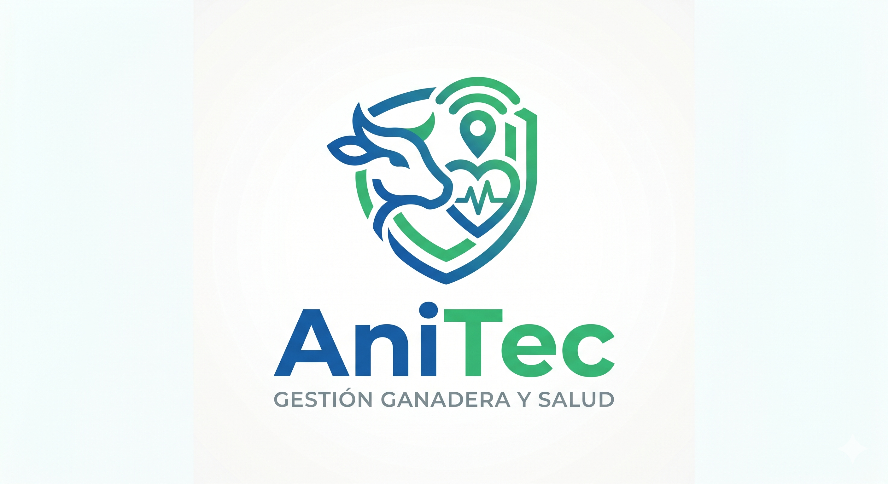</th>
      <th>Livestock Manager </th>
      <th>AgriWebb </th>
      <th>iLivestock </th>
    </tr>
  </thead>
  <tbody>
    <tr>
      <th colspan="5">Perfil</th>
    </tr>
    <tr>
      <th>Clasificación</th>
      <td>Startup analizada.</td>
      <td>Competidor directo.</td>
      <td>Competidor directo.</td>
      <td>Competidor directo.</td>
    </tr>
    <tr>
      <th>Overview</th>
      <td>Solución de gestión ganadera orientada a pequeños y medianos ganaderos y veterinarios de campo. Parte de una landing page, una API REST y una aplicación web desarrolladas previamente. En el curso se desarrollará una aplicación Android nativa y se definirá la experiencia multiplataforma requerida.</td>
      <td>Producto de Pila para gestionar animales y lotes de distintas especies desde el teléfono y la web. Integra registros de salud, alimentación, reproducción y finanzas. Su sitio declara más de 50 000 descargas, 24 especies y 15 idiomas.</td>
      <td>Plataforma de gestión ganadera que trabaja con animales individuales o grupos. Permite registrar actividades, movimientos, tratamientos, pesos, alimentación, inventarios y tareas desde aplicaciones móviles y una plataforma web.</td>
      <td>Plataforma para productores de ganado bovino y ovino. Reúne registros de salud, reproducción, movimientos, pesos, tratamientos y rendimiento, y se integra con equipos de identificación electrónica y pesaje.</td>
    </tr>
    <tr>
      <th>Ventaja competitiva</th>
      <td>Propuesta de experiencia simple en español, adaptada al contexto de pequeños productores peruanos y con un flujo de colaboración autorizado entre ganadero y veterinario. Esta ventaja todavía debe comprobarse con usuarios.</td>
      <td>Barrera de entrada baja mediante un plan gratuito, cobertura de múltiples especies y disponibilidad tanto móvil como web.</td>
      <td>Amplitud funcional para operaciones ganaderas, mapas interactivos, trabajo sin conexión e integración con lectores EID, clima y dispositivos IoT.</td>
      <td>Integración de software y hardware para identificación EID y pesaje, funcionamiento sin conexión y herramientas especializadas para ganado bovino y ovino.</td>
    </tr>
    <tr>
      <th>Valor que ofrece a los clientes</th>
      <td>Centralizar animales e historiales, registrar actividades desde el campo, conservar datos esenciales ante interrupciones de red, recibir recordatorios y facilitar el seguimiento sanitario compartido.</td>
      <td>Reunir registros productivos y económicos de distintas especies en una herramienta económica y accesible desde varios dispositivos.</td>
      <td>Registrar las operaciones del campo en el momento, mantener inventarios y movimientos actualizados y sincronizar los datos cuando se recupera la conexión.</td>
      <td>Reducir el trabajo manual de identificación y pesaje, mantener la trazabilidad y convertir los registros del ganado en reportes de desempeño.</td>
    </tr>
    <tr>
      <th colspan="5">Perfil de Marketing</th>
    </tr>
    <tr>
      <th>Mercado objetivo</th>
      <td>Pequeños y medianos ganaderos peruanos y veterinarios de campo que emplean teléfonos Android y gestionan información dispersa.</td>
      <td>Desde propietarios de granjas pequeñas y aficionados hasta productores profesionales y organizaciones con múltiples granjas.</td>
      <td>Productores y equipos ganaderos que administran bovinos u ovinos de forma individual o por grupos y requieren coordinación operativa.</td>
      <td>Productores de bovinos y ovinos, desde hatos pequeños hasta operaciones comerciales que utilizan registros, identificación EID o sistemas de pesaje.</td>
    </tr>
    <tr>
      <th>Estrategias de marketing observables</th>
      <td>Propuesta preliminar basada en la landing page, demostraciones con usuarios, recomendaciones de veterinarios y alianzas con asociaciones ganaderas. Todavía no existe evidencia de adquisición o retención.</td>
      <td>Modelo freemium sin tarjeta para iniciar, distribución en tiendas de aplicaciones, prueba inmediata del producto y uso de testimonios y cifras de descargas como prueba social.</td>
      <td>Prueba gratuita, demostración interactiva, contenido educativo y contacto con ventas para operaciones que requieren configuración o integraciones.</td>
      <td>Prueba gratuita de 14 días, presencia en tiendas de aplicaciones, distribuidores regionales y venta combinada de software, lectores, balanzas y etiquetas.</td>
    </tr>
    <tr>
      <th colspan="5">Perfil de Producto</th>
    </tr>
    <tr>
      <th>Productos y servicios</th>
      <td>Landing page y API REST existentes; aplicación Android nativa en desarrollo. El alcance móvil prioriza animales, historiales sanitarios, notificaciones, almacenamiento local, reportes y acceso veterinario autorizado. La solución multiplataforma se definirá durante el curso.</td>
      <td>Registro de animales y lotes, salud, medicamentos, alimentación, reproducción, finanzas y reportes. Los planes superiores incorporan colaboración, facturación, certificados, integraciones y acceso mediante API.</td>
      <td>Gestión individual o por grupos, mapas, movimientos, tratamientos, pesos, alimentación, reproducción, inventarios, tareas, reportes e integraciones con hardware y servicios externos.</td>
      <td>Registros de bovinos y ovinos, grupos, tratamientos, medicamentos, movimientos, reproducción, pesos, rendimiento, reportes e integración con lectores EID y equipos de pesaje.</td>
    </tr>
    <tr>
      <th>Precios y costos</th>
      <td>Precio aún no definido. El modelo de suscripción y la disposición de pago son hipótesis que deben validarse. Las cifras heredadas de la landing page y del backend no se consideran precios comerciales aprobados.</td>
      <td>Starter: gratuito. Growth: desde USD 3,99 y Scale: desde USD 9,99, mostrados como importes mensuales con facturación anual. Enterprise: cotización personalizada.</td>
      <td>Precio calculado según la cantidad de animales y la región. El sitio solicita ingresar el número de bovinos u ovinos o contactar con ventas; también ofrece complementos con costo adicional.</td>
      <td>Software: GBP 27,50 mensuales o GBP 300 anuales. Ofrece una prueba gratuita de 14 días; el hardware y las etiquetas se comercializan por separado.</td>
    </tr>
    <tr>
      <th>Canales de distribución</th>
      <td>Landing page web y, cuando se implemente y publique, Google Play para la aplicación Android. El canal de la aplicación multiplataforma permanece por definir.</td>
      <td>Aplicaciones para Android e iOS y acceso web o de escritorio.</td>
      <td>Aplicaciones para Android e iOS y aplicación web.</td>
      <td>Aplicaciones para Android e iOS y acceso desde smartphone, tableta, PC o Mac.</td>
    </tr>
  </tbody>
</table>

Los precios corresponden a la información visible en los sitios oficiales en la fecha de consulta y pueden cambiar según país, cantidad de animales, modalidad de facturación o configuración contratada. En el caso de AniTec, cualquier precio deberá presentarse como una propuesta hasta que sea validado con los segmentos objetivo y exista una decisión comercial consistente.

### Análisis FODA

El siguiente análisis interpreta la oferta observable de cada producto en relación con el objetivo de AniTec. Las fortalezas y debilidades describen condiciones internas de cada solución; las oportunidades y amenazas consideran su posición frente al mercado y los demás competidores.

<table>
  <thead>
    <tr>
      <th>Dimensión</th>
      <th>AniTec</th>
      <th>Livestock Manager</th>
      <th>AgriWebb</th>
      <th>iLivestock</th>
    </tr>
  </thead>
  <tbody>
    <tr>
      <th>Fortalezas</th>
      <td>Conocimiento inicial de los segmentos locales; propuesta en español; reutilización de una API y producto web existentes; flujo diferenciado entre ganadero y veterinario.</td>
      <td>Plan gratuito; precio inicial bajo; soporte para numerosas especies e idiomas; disponibilidad móvil y web; base pública de descargas.</td>
      <td>Trabajo online y offline; gestión ganadera amplia; sincronización; mapas; roles de equipo e integraciones con EID e IoT.</td>
      <td>Especialización en bovinos y ovinos; trabajo offline; integración propia con lectores y pesaje; trazabilidad y reportes de rendimiento.</td>
    </tr>
    <tr>
      <th>Debilidades</th>
      <td>Aplicación móvil aún no implementada; propuesta de precio sin validar; ausencia de usuarios activos demostrables; reconocimiento de marca limitado y capacidades offline aún por comprobar.</td>
      <td>Su cobertura de muchas especies puede ofrecer menos profundidad para un flujo veterinario especializado; la propuesta pública no destaca adaptación específica al contexto peruano.</td>
      <td>La amplitud de funciones e integraciones puede elevar el esfuerzo de configuración y aprendizaje; el precio final no es visible sin introducir datos del hato o contactar con ventas.</td>
      <td>Parte importante de su diferenciación depende del ecosistema de hardware y EID; el precio se publica en libras esterlinas y varias integraciones regulatorias dependen del país.</td>
    </tr>
    <tr>
      <th>Oportunidades</th>
      <td>Atender a pequeños productores peruanos con lenguaje, soporte y flujos validados localmente; simplificar la colaboración con veterinarios; diseñar para teléfonos Android y conectividad intermitente.</td>
      <td>Convertir usuarios del plan gratuito a funciones avanzadas y ampliar sus capacidades de colaboración y automatización.</td>
      <td>Extender sus integraciones, análisis de rendimiento y servicios para operaciones ganaderas de mayor complejidad.</td>
      <td>Expandir su red de distribuidores y alianzas en Latinoamérica, y aumentar la adopción de identificación y pesaje digital.</td>
    </tr>
    <tr>
      <th>Amenazas</th>
      <td>Competidores consolidados ya ofrecen trabajo offline, aplicaciones Android y precios de entrada bajos; resistencia a la adopción, problemas de conectividad y desconfianza sobre el manejo de datos.</td>
      <td>Soluciones especializadas por especie o región pueden ofrecer flujos más profundos; plataformas integrales pueden competir mediante mapas, hardware y cumplimiento.</td>
      <td>Aplicaciones más simples y económicas pueden resultar suficientes para productores pequeños que no necesitan todas sus capacidades.</td>
      <td>Alternativas que funcionan sin hardware adicional o con planes gratuitos pueden reducir la adopción entre productores sensibles al precio.</td>
    </tr>
  </tbody>
</table>

El Landscape muestra que el funcionamiento sin conexión ya está presente en AgriWebb e iLivestock, mientras que Livestock Manager compite con un plan gratuito y precios de entrada bajos. Por ello, AniTec no debe presentar el almacenamiento local ni la accesibilidad económica como ventajas únicas sin validación. Su diferenciación deberá comprobarse principalmente en la adaptación al contexto peruano, la simplicidad de los flujos Android y la colaboración autorizada entre ganadero y veterinario.

### Fuentes del análisis competitivo

- [Livestock Manager: producto, funciones y precios](https://app.livestockfarm.co/).
- [AgriWebb: aplicación móvil y funcionamiento offline](https://www.agriwebb.com/mobile-app/).
- [AgriWebb: planes e integraciones](https://www.agriwebb.com/us/pricing/).
- [iLivestock: software, funciones y precio](https://www.ilivestock.com/software).
- [iLivestock: presencia y alianzas en Latinoamérica](https://www.ilivestock.com/es-ar/ar).

## 2.1.2. Estrategias y tácticas frente a competidores

Las siguientes estrategias son preliminares y se derivan de los hallazgos del Landscape y del análisis FODA. Sus indicadores permitirán comprobar si las tácticas producen el resultado esperado.

| Hallazgo competitivo | Estrategia de AniTec | Táctica preliminar | Indicador de validación |
|---|---|---|---|
| AgriWebb e iLivestock ya permiten trabajar sin conexión. | Alcanzar una continuidad de uso comparable y ofrecer estados de sincronización comprensibles. | Permitir guardar datos esenciales y borradores localmente, mostrar si existen cambios pendientes y reintentar la sincronización al recuperar la conexión. | Porcentaje de registros recuperados y sincronizados sin duplicación; cantidad de tareas abandonadas por errores de red. |
| Livestock Manager reduce la barrera de entrada con un plan gratuito y precios bajos. | Definir una propuesta de planes ajustada al valor percibido por pequeños productores. | Probar con los segmentos una versión gratuita o de evaluación, límites por cantidad de animales y funciones pagadas antes de fijar precios comerciales. | Comprensión de los planes, disposición de pago y porcentaje de participantes que elegiría cada alternativa. |
| Los competidores ofrecen productos amplios para mercados internacionales. | Adaptar AniTec al contexto de los ganaderos peruanos. | Validar con usuarios el lenguaje, los formularios, las categorías sanitarias, el proceso de incorporación y las condiciones reales de uso en teléfonos Android. | Porcentaje de tareas completadas sin ayuda, tiempo por tarea y problemas de comprensión encontrados. |
| Las ofertas revisadas gestionan equipos o usuarios, pero no presentan como eje principal una relación ganadero-veterinario adaptada al mercado local. | Diferenciar AniTec mediante seguimiento sanitario autorizado. | Implementar permisos explícitos para asignar veterinarios, consultar historiales y registrar atenciones, mostrando al ganadero quién puede acceder a cada animal. | Porcentaje de asignaciones completadas, atenciones registradas y percepción de confianza sobre los permisos. |
| AniTec aún no tiene la trayectoria ni la base pública de usuarios de sus competidores. | Construir confianza mediante acompañamiento y evidencia de uso. | Realizar demostraciones con ganaderos y veterinarios, ofrecer tutorial inicial y soporte por canales conocidos, y publicar únicamente resultados obtenidos en validaciones reales. | Activación del primer animal, retención semanal, solicitudes de soporte y recomendaciones obtenidas. |
| AgriWebb e iLivestock cuentan con integraciones avanzadas de hardware y EID. | Priorizar primero los problemas centrales del segmento y evaluar integraciones mediante aprendizaje técnico. | Desarrollar una Spike Story para la capacidad autónoma elegida y probar su utilidad antes de convertirla en una función permanente del producto. | Viabilidad técnica documentada, tasa de éxito en pruebas y beneficio percibido por los usuarios. |

Las campañas de referidos, alianzas con asociaciones, participación en ferias y acercamiento a veterinarios podrán utilizarse como tácticas de adquisición cuando exista una versión Android demostrable. Cada actividad deberá registrar participantes, usuarios activados y continuidad de uso; la asistencia a una actividad, por sí sola, no demostrará adopción del producto.

# 2.2. Entrevistas.

Las entrevistas son una herramienta esencial para comprender a fondo a nuestro público objetivo. Para que sean efectivas, deben seguir una estructura clara y directa, utilizando preguntas específicas que permitan recolectar información de valor y datos precisos de los participantes.

<h4> 2.2.1. Diseño de entrevistas. </h4>

Objetivo: Identificar frustraciones, necesidades, dispositivos disponibles, grado de digitalización y percepción sobre el registro de información ganadera.

## 2.2.1. Diseño de entrevistas.

### Segmentos entrevistados:

- Ganaderos

- Veterinarios

Formato: Entrevistas semiestructuradas, de 25-30 minutos, registradas en video con consentimiento.

Preguntas dirigidas al personal de **Ganaderos**.

Preguntas principales:

- ¿Podría indicarnos su nombre completo y su edad?

- ¿Cuánto tiempo lleva dedicado a la ganadería? ¿Qué tipo de ganado maneja actualmente?

- ¿Cuál es el tamaño aproximado de su ganado? ¿Y cuántas personas trabajan en su unidad ganadera?

- ¿Qué herramientas utiliza actualmente para llevar el control de sus animales y sus actividades?

- ¿Lleva algún registro sobre la salud, alimentación o reproducción de su ganado? ¿Cómo lo hace?

- ¿Cuáles son las principales dificultades que enfrenta en la gestión diaria del ganado?

- ¿Cómo monitorea actualmente la productividad y salud de su ganado?

- ¿Qué tan importante considera llevar un control digital del historial veterinario y productivo de cada animal?

- ¿Ha enfrentado problemas por no tener registros claros (por ejemplo, en ventas, enfermedades o reproducción)?

- ¿Confía en herramientas digitales o ha probado alguna aplicación para el manejo ganadero?

- ¿Cuánto tiempo promedio dedica al registro manual de datos (si lo realiza)?

- ¿Qué tipo de información considera más importante tener a la mano sobre su ganado?

- ¿Estaría dispuesto a usar una aplicación móvil/web para llevar el control del ganado si fuera sencilla y funcional?

- ¿Qué funcionalidades le gustaría que tenga esta herramienta (alertas, historial médico, reproductivo, reportes, etc.)?
- ¿Qué beneficios espera al adoptar una herramienta digital para su ganadería?

### Preguntas dirigidas a los **Veterinarios**

Preguntas principales:

- ¿Podría proporcionarnos su nombre completo y su edad?

- ¿Cuánto tiempo lleva ejerciendo como veterinario y en qué región trabaja principalmente?

- ¿Está especializado en atención ganadera? ¿Qué tipo de ganado atiende con más frecuencia?

- ¿Cómo realiza el seguimiento del historial médico de los animales que atiende?

- ¿Utiliza actualmente alguna herramienta digital para llevar registros veterinarios?

- ¿Qué información considera fundamental registrar tras una consulta o intervención (vacunas, tratamientos, diagnóstico)?

- ¿Cómo se comunica con los ganaderos respecto al seguimiento o tratamientos posteriores?

- ¿Con qué frecuencia atiende emergencias ganaderas? ¿Cómo coordina este tipo de intervenciones?

- ¿Ha tenido casos donde la falta de información del animal haya afectado la efectividad del tratamiento?

- ¿Qué retos encuentra en su trabajo relacionado con el registro o gestión de información?

- ¿Le resultaría útil tener acceso al historial médico del animal antes de una consulta?

- ¿Qué tan dispuesto estaría a utilizar una aplicación móvil/web para registrar y acceder al historial de sus pacientes?

- ¿Qué funcionalidades considera clave en una herramienta digital veterinaria (calendario, historial, recordatorios, fichas clínicas)?

- ¿Cómo podría mejorar su trabajo con una solución que conecte a veterinarios con ganaderos en tiempo real?

- ¿Qué tan importante considera el análisis de datos (estadísticas de salud, tratamientos más comunes, etc.) en su labor?

### Preguntas complementarias (para ambos segmentos):

- ¿Qué expectativas tendría sobre una plataforma digital que centralice la información ganadera y veterinaria?

- ¿Qué dispositivos usa con más frecuencia para sus actividades laborales (celular, laptop, tablet)? ¿Está familiarizado con el uso de apps?

- ¿Qué es lo que más valora en una herramienta digital: rapidez, facilidad de uso, seguridad de datos u otro aspecto?

### Preguntas principales (comunes):

1. ¿Cómo lleva actualmente el registro de su ganado (peso, salud, vacunas)?

2. ¿Qué desafíos ha enfrentado por llevar registros manuales?

3. ¿Qué tan cómodo se siente utilizando un celular o computadora?

4. ¿Le sería útil recibir alertas de vacunación o reproducción?

5. ¿Ha perdido información relevante alguna vez?

6. ¿Qué contenido educativo le interesaría tener en una app?

7. ¿Qué canales digitales usa actualmente (WhatsApp, redes sociales, etc.)?

Variables demográficas a recolectar: Edad, género, distrito de residencia, educación, tipo de hacienda, frecuencia de registros, ocupación alterna, herramientas digitales que maneja, tipo de celular, acceso a internet, objetivos personales, frustraciones, marcas preferidas, influencia de técnicos o asociaciones.

## 2.2.2. Registro de entrevistas.

### Entrevistas al segmento de ganaderos

#### Entrevista 1: Caterina Rodriguez

| Campo | Información |
|-------|-------------|
| Segmento | Ganadero |
| Nombres y apellidos | Caterina Rodriguez |
| Edad | 33 años |
| Distrito | San miguel, Lima |
| Ocupación | Ganadera con más de 9 años de experiencia |
| Tipo de ganado | Ganado porcino |
| Tamaño aproximado del ganado | 16 cabezas de ganado |
| Inicio de la entrevista | 00:00 |
| Duración | 00:07:54 |
| URL del video | https://tinyurl.com/caterinarodri |

    

**Resumen de la entrevista:**

Caterina Rodríguez es una ganadera de 33 años con aproximadamente ocho años de experiencia en el manejo, principalmente, de ganado vacuno. Actualmente gestiona alrededor de 45 animales junto a un equipo de tres personas (dos familiares y un cuidador). Durante la entrevista, explicó que su gestión de datos se realiza de manera fragmentada: utiliza un cuaderno físico, un cuadro de Excel y su teléfono celular (tomando fotos y notas) para registrar información sobre salud, alimentación y reproducción. Esta forma de trabajo, a la que dedica entre 20 y 30 minutos diarios, le genera dificultades para mantener la información organizada. La entrevistada señaló que los datos suelen traspapelarse o perderse al estar en distintos formatos, o resultar incomprensibles por la mala caligrafía, lo que complica el seguimiento preciso de vacunas y tratamientos.

En cuanto a su perfil tecnológico y forma de trabajo, Caterina se muestra como una persona consciente de la necesidad de optimizar su tiempo y mejorar la toma de decisiones en su ganadería. Valora tener a la mano información vital de cada animal, como edad, peso, historial de enfermedades y tratamientos. Respecto a la tecnología, confía en las herramientas digitales, aunque hasta ahora no ha utilizado ninguna aplicación especializada en el manejo ganadero. Su dispositivo principal es el celular, siendo WhatsApp la aplicación que más utiliza para registrar información y comunicarse, además de usar redes sociales como Facebook y TikTok. El uso de la computadora es mínimo y lo reserva casi exclusivamente para revisar Excel.

La entrevista permitió identificar que Caterina está totalmente dispuesta a utilizar una aplicación móvil o web para el control de su ganado. Destacó que la herramienta ideal debe centralizar la información (usando códigos por animal), contar con un historial médico y reproductivo, y emitir alertas de vacunación y atención. Un punto crucial para ella es que la plataforma sea muy sencilla e intuitiva de usar, ya que sus familiares, que son personas mayores, también deberán interactuar con ella. Además, mostró interés en recibir contenido educativo sobre prevención de enfermedades, alimentación y cuidado de terneros. Esta información sustenta el arquetipo de una ganadera joven que reconoce las limitaciones de los métodos tradicionales y busca una digitalización práctica y accesible que unifique el trabajo de su equipo familiar.

#### Entrevista 2: Rebeca Noemi Quiroz Roldan

| Campo | Información |
|-------|-------------|
| Segmento | Ganadera |
| Nombres y apellidos | Rebeca Noemi Quiroz Roldan |
| Edad | 54 años |
| Distrito | Lima |
| Ocupación | Productora ganadera |
| Tipo de ganado | Ganado vacuno |
| Tamaño aproximado del ganado | Hato pequeño familiar |
| Inicio de la entrevista | 00:00 |
| Duración | 00:06:53 |
| URL del video | https://tinyurl.com/entrevista2RebecaQuiroz |

    

**Resumen de la entrevista:**

Rebeca Noemi Quiroz Roldan comentó que su actividad ganadera se enfoca en el cuidado de ganado vacuno y que una de sus mayores preocupaciones aparece cuando se presentan enfermedades como mastitis o cuando los terneros se enferman. Actualmente registra la información mediante cuadernos, apuntes y hojas sueltas. Aunque mencionó que logra manejar su actividad con estos medios, también reconoció que una aplicación podría ayudarle a tener mayor orden y a recordar eventos importantes, como vacunaciones, dosis de medicamentos y controles sanitarios.

En sus respuestas se observa una personalidad responsable y preventiva. Rebeca valora la seguridad y la confianza antes de adoptar una herramienta digital, por lo que una solución como AniTec debe transmitir protección de datos, facilidad de uso y utilidad concreta. Su principal canal de interacción es el celular, especialmente WhatsApp, ya que lo usa para comunicarse con familiares, trabajadores y profesionales que la asesoran. Además, suele apoyarse en un ingeniero o especialista para atender problemas sanitarios del ganado, lo que muestra que sus decisiones están influenciadas por personal técnico de confianza.

Respecto a tecnología, utiliza smartphone y navegación básica desde el celular. No manifestó rechazo hacia las aplicaciones, pero sí dejó claro que no desea una herramienta complicada. Esta entrevista ayuda a justificar funciones como recordatorios, alertas sanitarias, registro simple de enfermedades y acceso rápido a datos importantes. Sus respuestas aportan evidencia para construir un arquetipo de ganadera que tiene disposición a digitalizarse siempre que la plataforma sea segura, clara y útil para resolver problemas reales del manejo diario.

#### Entrevista 3: Ursula Trigozo Salcedo

| Campo | Información                                                                                                                                                                                                                                                                                                             |
|-------|-------------------------------------------------------------------------------------------------------------------------------------------------------------------------------------------------------------------------------------------------------------------------------------------------------------------------|
| Segmento | Ganadero                                                                                                                                                                                                                                                                                                                |
| Nombres y apellidos | Ursula trigozo Salcedo                                                                                                                                                                                                                                                                                                  |
| Edad | 64 años                                                                                                                                                                                                                                                                                                                 |
| Distrito | Lurin, Lima                                                                                                                                                                                                                                                                                                             |
| Ocupación | Ganadero artesanal                                                                                                                                                                                                                                                                                                      |
| Tipo de ganado | Ganado vacuno                                                                                                                                                                                                                                                                                                           |
| Tamaño aproximado del ganado | Hato pequeño familiar                                                                                                                                                                                                                                                                                                   |
| Inicio de la entrevista | 00:00                                                                                                                                                                                                                                                                                                                   |
| Duración | 00:10:31                                                                                                                                                                                                                                                                                                                |
| URL del video | https://upcedupe-my.sharepoint.com/:v:/g/personal/u20231c019_upc_edu_pe/IQDw1Fks32sxQroa9TMJpBhPAffdaO--WIZy3fKexREgNhU?nav=eyJyZWZlcnJhbEluZm8iOnsicmVmZXJyYWxBcHAiOiJTdHJlYW1XZWJBcHAiLCJyZWZlcnJhbFZpZXciOiJTaGFyZURpYWxvZy1MaW5rIiwicmVmZXJyYWxBcHBQbGF0Zm9ybSI6IldlYiIsInJlZmVycmFsTW9kZSI6InZpZXcifX0%3D&e=H1KzAW |

    

**Resumen de la entrevista:**

Úrsula Trigozo Salcedo, de 64 años, cuenta con 25 años de experiencia en la ganadería y actualmente maneja aproximadamente 35 cabezas de ganado vacuno junto con tres familiares. Su gestión se basa principalmente en cuadernos, papel y celular, donde registra vacunas, tratamientos, reproducción, partos y observaciones.

Su principal dificultad es mantener la información ordenada y disponible, ya que en ocasiones pierde tiempo buscando registros o estos se deterioran. Considera importante contar con un historial digital por animal y recibir alertas de vacunas, controles veterinarios y reproducción.

Úrsula está familiarizada con aplicaciones como WhatsApp, Facebook y YouTube, por lo que estaría dispuesta a utilizar AniTec si es simple, rápida, segura y funciona desde el celular. También valora el contenido educativo sobre alimentación, enfermedades y manejo del ganado.

En este perfil, AniTec debe enfocarse en centralizar la información, ahorrar tiempo, evitar la pérdida de datos y facilitar el seguimiento individual de cada animal. Sus respuestas representan el arquetipo de una ganadera experimentada y abierta a la tecnología, siempre que sea sencilla y útil para su trabajo diario.

### Entrevistas al segmento de veterinarios

#### Entrevista 4: Angela Mendoza

| Campo | Información |
|-------|-------------|
| Segmento | Veterinaria |
| Nombres y apellidos | Angela Mendoza |
| Edad | 24 años |
| Distrito | Camaná, Arequipa |
| Ocupación | Médica veterinaria |
| Zona de trabajo | Sierra sur del Perú |
| Tipo de atención | Atención sanitaria de ganado |
| Inicio de la entrevista | 00:00 |
| Duración | 00:06:55 |
| URL del video | https://tinyurl.com/entrevista4AngelaMendoza |

    

**Resumen de la entrevista:**

Angela Mendoza explicó que en su trabajo como veterinaria observa que muchos productores todavía gestionan la información sanitaria con cuadernos físicos, archivos simples de Excel, fotografías y conversaciones de WhatsApp. Esta dispersión de datos afecta el seguimiento de vacunas, tratamientos, diagnósticos y antecedentes clínicos. También mencionó que, en visitas de emergencia o campañas sanitarias, la falta de información ordenada puede retrasar la atención y complicar la toma de decisiones.

Su perfil evidencia una personalidad organizada, técnica y orientada al servicio. Angela valora la rapidez, la trazabilidad y la claridad de la información porque su trabajo depende de revisar antecedentes antes de indicar tratamientos. Sus canales principales de interacción son WhatsApp, llamadas telefónicas y archivos digitales básicos que comparte con productores. Usa smartphone y laptop para su labor diaria, y se siente cómoda navegando en Google Chrome o usando herramientas web cuando necesita consultar información técnica. Sus influencias profesionales provienen de su formación veterinaria, colegas del sector, campañas sanitarias y necesidades reales observadas en campo.

La entrevistada considera que una herramienta como AniTec sería útil si permite centralizar el historial clínico de cada animal, registrar tratamientos, programar seguimientos y mejorar la comunicación con los ganaderos. Sin embargo, remarcó que la plataforma debe ser rápida y fácil de usar, porque el trabajo veterinario de campo no permite perder tiempo en procesos largos. Esta entrevista aporta evidencia para el arquetipo de veterinaria joven que usa tecnología, pero necesita una solución enfocada en eficiencia clínica y coordinación con productores.

#### Entrevista 5: Jeferson Castro Pariona

| Campo | Información |
|-------|-------------|
| Segmento | Veterinario |
| Nombres y apellidos | Jeferson Castro Pariona |
| Edad | 27 años |
| Distrito | Ventanilla, Lima (Residencia) |
| Ocupación | Médico veterinario |
| Zona de trabajo | Selva central del Perú |
| Tipo de atención | Atención clínica y sanitaria de ganado en campo |
| Inicio de la entrevista | 00:00 |
| Duración | 00:08:09 |
| URL del video | https://tinyurl.com/b3txtyh3 |

    

**Resumen de la entrevista:**

Jeferson Castro Pariona comentó que el reto más grande y frecuente en la atención veterinaria ganadera es la falta de trazabilidad y la pérdida de continuidad en el historial médico de los animales. Explicó que la información suele estar dispersa en cuadernos, notas físicas, hojas de cálculo o chats de WhatsApp, y que cuando se enfrentan emergencias o se incorporan nuevos animales, debe tomar decisiones clínicas con datos limitados. Esto afecta directamente la planificación sanitaria, la efectividad de los tratamientos y el seguimiento de las intervenciones.

El entrevistado muestra un perfil analítico, práctico y orientado a la tecnología como herramienta de trabajo diario. Utiliza su smartphone para la comunicación y el registro rápido en campo, y su laptop para consultas técnicas más detalladas. Considera fundamental contar con datos concretos antes de intervenir y valora la rapidez, la facilidad de uso y la intuición en cualquier herramienta digital, especialmente considerando los retos de conectividad en el entorno rural.

Según sus respuestas, una plataforma digital (como AniTec) le aportaría un valor significativo si logra centralizar la información sin ser un sistema pesado. Sus funcionalidades clave ideales incluyen: acceso inmediato al historial sanitario del animal, un módulo rápido para registrar diagnósticos y tratamientos, alertas de vacunación o reproducción para programar rutas de campo, y un canal claro de comunicación con el ganadero. También valoró la inclusión de contenido educativo rápido, como fichas técnicas o información sobre brotes en la región. En conclusión, está totalmente dispuesto a digitalizar su labor para reducir los errores derivados de la información dispersa, siempre y cuando la herramienta se integre de forma ágil a su flujo real de trabajo en el campo.

## 2.2.3. Análisis de entrevistas.

### Análisis del segmento de Ganaderos

Para el segmento de ganaderos se analizaron 3 entrevistas: Vicente Huamán Alacutte, Rebeca Noemi Quiroz Roldan y Porfirio Salazar Rodriguez. La muestra evidencia un perfil de productores con experiencia práctica, uso frecuente de métodos tradicionales y apertura moderada hacia herramientas digitales siempre que sean simples, útiles y accesibles.

| Característica identificada | Resultado estadístico | Sustento en entrevistas | Relación con el arquetipo |
|-----------------------------|----------------------|-------------------------|---------------------------|
| Edad adulta y experiencia en ganadería | 3 de 3 entrevistados (100%) tienen entre 54 y 65 años y experiencia directa en actividades ganaderas. | Vicente tiene 62 años y más de 30 años de experiencia; Rebeca tiene 54 años y gestiona ganado vacuno; Porfirio tiene 65 años y trabaja en ganadería artesanal. | El arquetipo debe representar a un usuario con conocimiento práctico del campo, pero no necesariamente familiarizado con sistemas digitales complejos. |
| Uso de registros manuales | 3 de 3 entrevistados (100%) usan cuadernos, apuntes, hojas o registros básicos para controlar información del ganado. | Vicente usa cuaderno físico y Excel; Rebeca usa cuadernos y hojas sueltas; Porfirio trabaja con una gestión artesanal y poco digitalizada. | AniTec debe priorizar registro rápido, ordenado y fácil de consultar para reemplazar gradualmente el control manual. |
| Necesidad de controlar salud y tratamientos | 2 de 3 entrevistados (66.7%) mencionan directamente problemas relacionados con enfermedades, tratamientos o control sanitario. | Vicente menciona control de enfermedades y vacunación; Rebeca menciona mastitis, terneros enfermos y dosis de medicamentos. | El arquetipo necesita alertas sanitarias, historial médico y recordatorios de vacunación o tratamiento. |
| Uso del celular como canal principal | 3 de 3 entrevistados (100%) muestran familiaridad básica con el celular como medio de comunicación o consulta. | Vicente usa celular y WhatsApp; Rebeca usa principalmente su celular; Porfirio utiliza celular y comunicación por WhatsApp. | La solución debe funcionar bien en pantallas pequeñas y permitir una interacción directa desde dispositivos móviles. |
| Interés en adoptar tecnología | 3 de 3 entrevistados (100%) reconocen que la tecnología podría ayudar a mejorar su gestión. | Vicente afirma que la tecnología puede profesionalizar el sector; Rebeca estaría dispuesta a usar una aplicación; Porfirio considera que la tecnología podría mejorar su productividad. | El arquetipo no rechaza la tecnología, pero necesita percibir un beneficio claro antes de usarla. |
| Necesidad de simplicidad | 3 de 3 entrevistados (100%) requieren que la herramienta sea sencilla, clara o fácil de justificar en el trabajo diario. | Vicente pide una app sencilla para el hombre de campo; Rebeca no desea una herramienta complicada; Porfirio evalúa si el beneficio justifica la inversión. | La interfaz debe usar lenguaje simple, formularios directos y pocos pasos para completar tareas. |
| Influencia de terceros en decisiones | 3 de 3 entrevistados (100%) dependen o se ven influenciados por otras personas del entorno ganadero. | Vicente considera compradores y técnicos; Rebeca se apoya en un especialista; Porfirio aprende de experiencia familiar y otros productores. | El arquetipo toma decisiones con apoyo de redes de confianza, por lo que la app debe transmitir seguridad y utilidad comprobable. |
| Sensibilidad al costo | 1 de 3 entrevistados (33.3%) menciona directamente el costo como barrera. | Porfirio indica que necesitaría capital suficiente para pagar una solución digital. | El modelo de adopción debe considerar planes accesibles, prueba gratuita o beneficios económicos visibles. |

En conjunto, el análisis muestra que el ganadero objetivo de AniTec es un usuario con experiencia práctica y responsabilidad directa sobre el cuidado del ganado, pero con procesos todavía manuales. La característica más fuerte del segmento es la necesidad de orden y recordatorios, ya que el 100% de entrevistados depende de registros tradicionales y el 66.7% menciona problemas sanitarios específicos. También se observa una oportunidad clara para una solución móvil, debido a que el 100% usa el celular como canal principal o familiar.

Desde el punto de vista subjetivo, los ganaderos entrevistados valoran la confianza, la utilidad concreta, la seguridad de la información y la facilidad de uso. Estas características provienen directamente de los resúmenes: Vicente prioriza una herramienta simple para el campo, Rebeca valora la seguridad y Porfirio evalúa el beneficio frente al costo. Por ello, el arquetipo de ganadero debe construirse como una persona práctica, cuidadosa, sensible al esfuerzo de aprendizaje y dispuesta a digitalizarse si la solución demuestra valor real.

### Análisis del segmento de Veterinarios

Para el segmento de veterinarios se analizaron 2 entrevistas: Angela Mendoza y Jeferson Castro Pariona. La muestra evidencia un perfil profesional joven, con experiencia en atención de campo, necesidad de información clínica ordenada y uso de herramientas digitales básicas para comunicarse con productores.

| Característica identificada | Resultado estadístico | Sustento en entrevistas | Relación con el arquetipo |
|-----------------------------|----------------------|-------------------------|---------------------------|
| Profesionales jóvenes | 2 de 2 entrevistados (100%) tienen entre 24 y 27 años. | Angela tiene 24 años; Jeferson tiene 27 años. | El arquetipo puede representarse como un veterinario joven, con mayor disposición a usar herramientas digitales. |
| Trabajo en campo o zonas descentralizadas | 2 de 2 entrevistados (100%) trabajan o han trabajado en zonas fuera del entorno urbano principal. | Angela trabaja en la sierra sur; Jeferson tiene experiencia en la selva central. | La solución debe considerar rapidez, movilidad y uso en contextos con posible conectividad limitada. |
| Problemas por registros incompletos o dispersos | 2 de 2 entrevistados (100%) mencionan información sanitaria desordenada o incompleta. | Angela menciona cuadernos, Excel, fotos y WhatsApp; Jeferson menciona cuadernos, notas físicas, hojas de cálculo y chats de WhatsApp. | El arquetipo necesita acceso centralizado al historial clínico y sanitario de los animales. |
| Uso de WhatsApp y herramientas digitales básicas | 2 de 2 entrevistados (100%) usan canales digitales simples para comunicarse o complementar su trabajo. | Angela usa WhatsApp, llamadas y archivos digitales; Jeferson usa smartphone en campo y laptop para consultas técnicas. | AniTec debe integrarse al flujo real del veterinario y reducir la dependencia de información dispersa. |
| Necesidad de historial clínico previo | 2 de 2 entrevistados (100%) señalan que conocer antecedentes mejora la atención. | Angela necesita revisar antecedentes antes de tratamientos; Jeferson indica que la falta de trazabilidad obliga a decidir con datos limitados. | El arquetipo requiere fichas clínicas, historial sanitario y acceso rápido a tratamientos previos. |
| Valoración de rapidez y facilidad de uso | 2 de 2 entrevistados (100%) indican que la herramienta debe ser rápida, intuitiva y adaptada al campo. | Angela remarca que no puede perder tiempo en procesos largos; Jeferson pide rapidez, facilidad de uso e integración ágil al trabajo rural. | La interfaz veterinaria debe permitir registrar atenciones con pocos pasos y consultar datos al instante. |
| Necesidad de mejorar comunicación con ganaderos | 2 de 2 entrevistados (100%) consideran importante coordinar mejor con productores. | Angela menciona mejorar comunicación con ganaderos; Jeferson valora un canal claro de comunicación con el productor. | El arquetipo necesita funciones de seguimiento, coordinación y comunicación clara con el productor. |
| Actitud favorable hacia herramientas tecnológicas | 2 de 2 entrevistados (100%) muestran apertura a soluciones digitales para mejorar su trabajo. | Angela considera útil centralizar historial y seguimiento; Jeferson está dispuesto a digitalizar su labor si la herramienta no es pesada y aporta alertas, registro rápido y contenido educativo. | El arquetipo es un usuario con mayor predisposición digital que el ganadero, pero exige eficiencia profesional. |

El análisis del segmento veterinario muestra que las principales necesidades están relacionadas con trazabilidad clínica, acceso rápido a información y coordinación con productores. El 100% de los entrevistados menciona problemas por información dispersa y el 100% considera importante contar con antecedentes del animal antes o durante la atención. Esto evidencia que el arquetipo veterinario debe estar construido alrededor de la toma de decisiones clínicas, el seguimiento sanitario y la necesidad de reducir incertidumbre durante el trabajo de campo.

En cuanto a características subjetivas, ambos veterinarios se muestran más familiarizados con la tecnología que el segmento ganadero. Angela representa un perfil organizado, técnico y orientado al servicio, mientras que Jeferson muestra un perfil analítico, práctico y orientado a la tecnología. Ambos valoran la rapidez, la trazabilidad y la utilidad real. Por ello, el arquetipo de veterinario debe representar a un profesional joven, móvil, acostumbrado a usar herramientas digitales básicas, pero que necesita una plataforma más integrada para evitar pérdida de información y mejorar la continuidad de tratamientos.

# 2.3. Needfinding.

En esta sección se presentarán los artefactos resultantes del proceso de análisis de la información recolectada de los segmentos objetivos. Aquí se incluyen secciones para User Personas, User Task Matrix, User Journey Maps, Empathy Mapping y As-is Scenario Mapping.

## 2.3.1. User Personas.

A continuación, se presentan los User Personas diseñados para representar a los segmentos objetivo identificados durante la fase de investigación. Estos arquetipos detallan variables demográficas, rasgos psicográficos, motivaciones y comportamientos, así como los pains (frustraciones) y gains (objetivos) que enfrentan en su gestión diaria. Asimismo, se analiza su nivel digital y su interacción con soluciones tecnológicas del sector agropecuario. Toda la información ha sido sintetizada a partir de los insights recolectados en las entrevistas y estructurada mediante la plataforma UXPressia para garantizar una representación fiel de las necesidades del usuario.

### User Persona: Ganaderos

### User Persona: Veterinarios

## 2.3.2. User Task Matrix.

A través de la User Task Matrix, es posible identificar y organizar las principales actividades que los usuarios realizan actualmente dentro de su contexto de trabajo. Al categorizar estas tareas según su frecuencia e importancia, se logra comprender cuáles representan mayores dificultades y necesidades para cada perfil de usuario, permitiendo detectar oportunidades de mejora en la gestión ganadera y veterinaria.

| **User Task**                                                                          | **Jorge Luis Rivas (Frecuencia)** | **Jorge Luis Rivas (Importancia)** | **Valeria Mendoza (Frecuencia)** | **Valeria Mendoza (Importancia)** |
| -------------------------------------------------------------------------------------- | ---------------------------- | ----------------------------- | -------------------------------- | --------------------------------- |
| Anotar el nacimiento o compra de un nuevo animal en cuadernos físicos                  | Sometimes                    | High                          | Rarely                           | Medium                            |
| Registrar manualmente vacunas y tratamientos del ganado                                | Often                        | High                          | Always                           | High                              |
| Revisar fechas de vacunación en notas, calendarios o cuadernos                         | Often                        | High                          | Often                            | High                              |
| Recordar manualmente vacunas o controles pendientes                                    | Sometimes                    | High                          | Sometimes                        | High                              |
| Anotar peso y crecimiento del ganado durante controles                                 | Often                        | Medium                        | Often                            | Medium                            |
| Revisar manualmente información sobre productividad y rendimiento                      | Sometimes                    | Medium                        | Often                            | Medium                            |
| Compartir documentos físicos o fotografías de registros con asociaciones o compradores | Rarely                       | Medium                        | Rarely                           | Low                               |
| Buscar información o capacitaciones ganaderas en internet y redes sociales             | Sometimes                    | Low                           | Sometimes                        | Medium                            |
| Llevar el control reproductivo mediante anotaciones manuales                           | Rarely                       | Medium                        | Rarely                           | Medium                            |
| Buscar antecedentes médicos y sanitarios en cuadernos o archivos físicos               | Sometimes                    | High                          | Sometimes                        | High                              |

La User Task Matrix evidencia que tanto Jorge Luis como Valeria realizan constantemente actividades relacionadas con el control sanitario y el seguimiento del ganado. Mientras Jorge Luis depende principalmente de registros físicos y de su memoria para organizar la información de sus animales, Valeria necesita acceder rápidamente a datos precisos durante sus visitas de campo y procedimientos veterinarios. Asimismo, ambos perfiles presentan dificultades relacionadas con la organización, trazabilidad y acceso oportuno a la información, especialmente en procesos de vacunación, historial clínico y monitoreo del ganado. Estas tareas permiten comprender mejor el contexto actual de los usuarios e identificar necesidades reales dentro del entorno ganadero y veterinario.

## 2.3.3. User Journey Mapping.

En este apartado se describe de manera detallada el recorrido y la experiencia actual de los usuarios dentro de su contexto de trabajo cotidiano, enfocándose específicamente en los dos perfiles clave identificados: productores ganaderos y médicos veterinarios. A través de los User Journey Maps As-Is, se analizan las actividades, emociones, problemas y necesidades que experimentan los usuarios durante la gestión y seguimiento del ganado, sin considerar aún la existencia de una solución tecnológica implementada.

El mapeo de este recorrido inicia desde las primeras dificultades relacionadas con la organización y acceso a la información, avanzando a través de las tareas diarias de registro, seguimiento sanitario y búsqueda de antecedentes médicos. Asimismo, se identifican los principales puntos de contacto, canales utilizados y frustraciones presentes en el proceso actual, permitiendo comprender de forma integral cómo los usuarios realizan actualmente sus actividades y cuáles son las oportunidades de mejora dentro del entorno ganadero y veterinario.

User Ganadero:

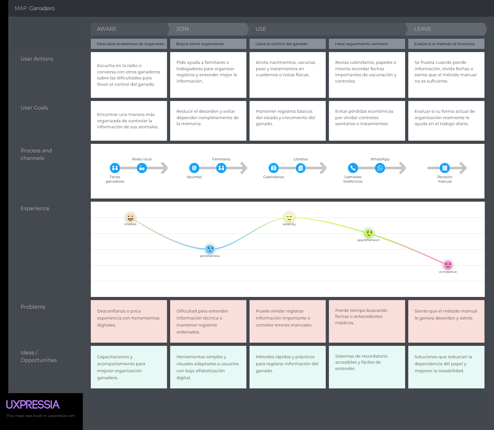

User Veterinario:

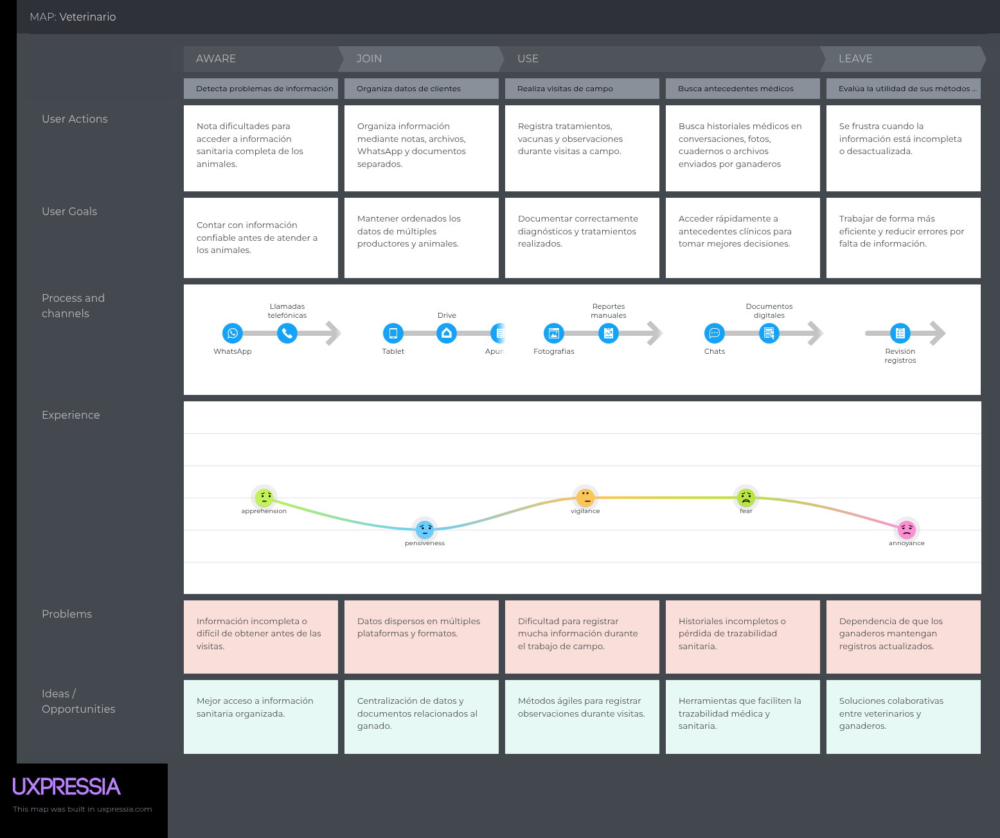

## 2.3.4. Empathy Mapping.

En esta sección se presenta el proceso de elaboración de los Empathy Maps correspondientes a los User Personas identificados para el proyecto: el productor ganadero y la médica veterinaria. Para el desarrollo de estos mapas de empatía, el equipo analizó la información obtenida durante la etapa de investigación y needfinding, considerando las necesidades, comportamientos, preocupaciones y motivaciones de cada perfil dentro de su contexto laboral cotidiano.

El proceso de elaboración inició colocando al User Persona en el centro del análisis, permitiendo identificar de manera estructurada qué piensa, siente, observa, escucha, dice y hace cada usuario en relación con la gestión sanitaria y administrativa del ganado. Asimismo, se identificaron los principales esfuerzos (Pains) y ganancias (Gains) presentes en sus actividades diarias, con el objetivo de comprender mejor sus frustraciones, expectativas y oportunidades de mejora dentro del entorno ganadero y veterinario.

Los Empathy Maps permitieron visualizar de forma más profunda la experiencia actual de los usuarios, evidenciando problemáticas relacionadas con la organización de información, trazabilidad sanitaria, dependencia de registros físicos y dificultades en la comunicación y acceso a datos confiables.

User Ganadero:

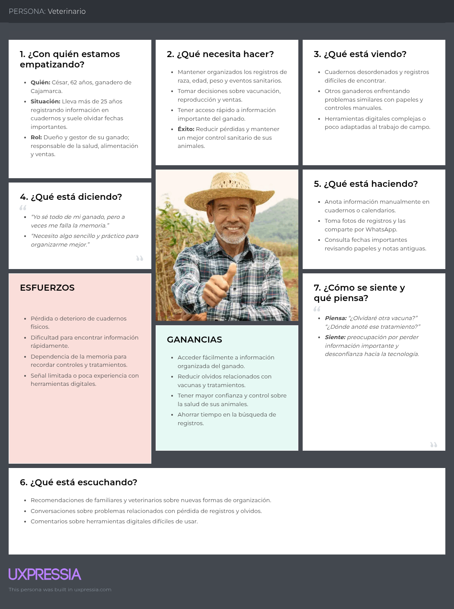

User Veterinario:

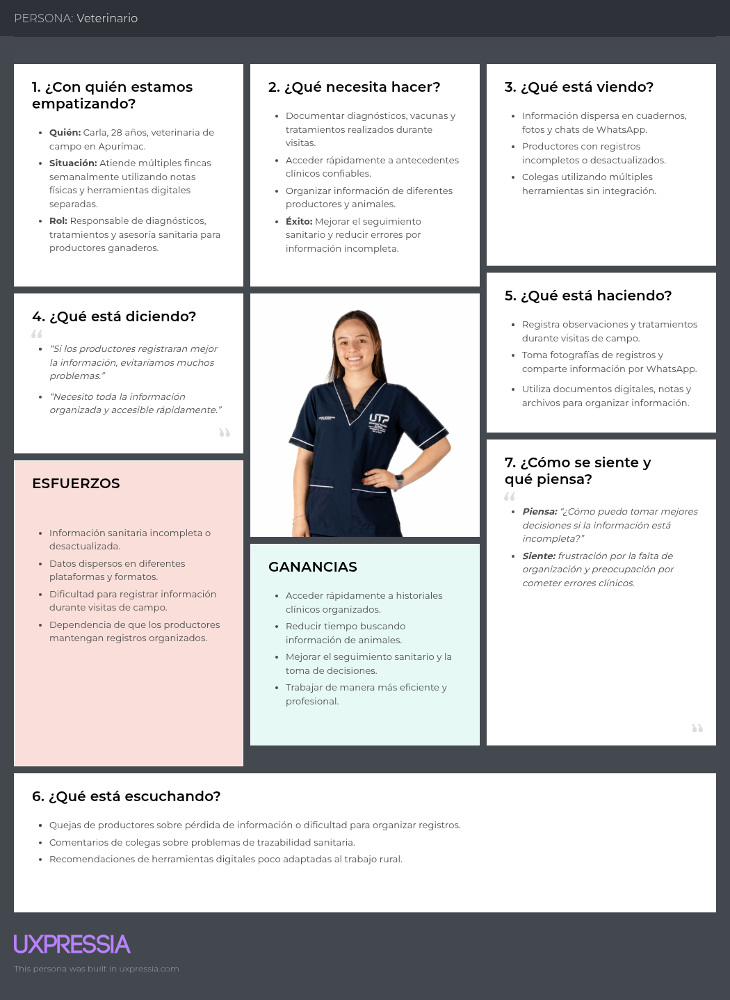

## 2.3.5. Big Picture EventStorming.

El presente Big Picture Event Storming se ha desarrollado de manera colaborativa utilizando la plataforma Miro, siguiendo la metodología de Philippe Bourgau para explorar el dominio del negocio de forma holística y establecer un entendimiento compartido. A través de un proceso iterativo en este entorno digital, que incluyó la generación de eventos de dominio, el ordenamiento cronológico y la identificación de puntos críticos dentro de los procesos, se ha logrado mapear la complejidad del sector ganadero en una narrativa visual coherente. Este artefacto no solo permitió identificar riesgos y oportunidades de mejora en la gestión de AniTec, sino que también sentó las bases para la comprensión del dominio y el diseño posterior de la arquitectura del sistema alineada con la realidad operativa de los ganaderos y veterinarios.

**Paso 1:** Unstructured Exploration (Exploración no estructurada) consiste en una lluvia de ideas colaborativa donde los participantes identifican y registran domain events, que son sucesos relevantes ocurridos dentro del negocio. Estos eventos deben redactarse obligatoriamente en tiempo pasado (por ejemplo, "Livestock registered") y se colocan en notas adhesivas de color naranja sobre la superficie de modelado. En esta etapa inicial, se prioriza el descubrimiento de conceptos y procesos importantes del dominio sobre el orden o la jerarquía, permitiendo identificar eventos relacionados con la autenticación de usuarios, gestión de ganado, procesos sanitarios, operaciones financieras, generación de reportes y envío de notificaciones.

**Paso 2:** Timelines, los participantes revisan los eventos de dominio generados y los organizan cronológicamente para reflejar la secuencia real de los procesos empresariales. La construcción inicia organizando el flujo principal del negocio y posteriormente incorporando relaciones, ramificaciones y dependencias entre eventos. Este paso permitió construir una narrativa visual coherente del comportamiento del sistema AniTec, facilitando la identificación de secuencias operativas, conexiones entre procesos y posibles inconsistencias dentro del dominio.

**Paso 3:** Pain Points, los participantes utilizan la línea de tiempo recién organizada para identificar los puntos críticos, riesgos o ineficiencias presentes dentro de los procesos modelados. Estos problemas se representan mediante notas adhesivas rosadas colocadas cerca de los eventos relacionados, permitiendo visualizar dificultades operativas y oportunidades de mejora dentro del sistema. Entre los principales pain points identificados destacan posibles fallos de autenticación, registros duplicados de ganado, detección tardía de enfermedades, inconsistencias presupuestarias y fallos en la entrega de notificaciones. La identificación explícita de estas debilidades permitió comprender mejor los desafíos del dominio y considerar posibles automatizaciones o mejoras futuras en el diseño del sistema.

Enlace para acceder al miro: https://tinyurl.com/EventSorming

## 2.3.6. Ubiquitous Language.

Siguiendo los conceptos de **Ubiquitous Language** definidos por **Eric Evans (2003)** en su obra _Domain-Driven Design: Tackling Complexity in the Heart of Software_, se presenta el siguiente glosario. Este conjunto de términos constituye el lenguaje común del proyecto, eliminando ambigüedades entre el equipo de ingeniería y los expertos del dominio ganadero.

| Term (English)              | Término (Español)        | Definition (Definición)                                                                                                                                  |
| :-------------------------- | :----------------------- | :------------------------------------------------------------------------------------------------------------------------------------------------------- |
| **Livestock Owner**         | Ganadero                 | Usuario responsable de la administración operativa y financiera de la hacienda, encargado de registrar eventos diarios y tomar decisiones de producción. |
| **Veterinarian**            | Veterinario              | Profesional especializado encargado de la salud animal, responsable de emitir diagnósticos, prescribir tratamientos y validar historiales clínicos.      |
| **Herd**                    | Hato                     | Conjunto de animales agrupados dentro de una unidad productiva o finca para su control sanitario, productivo y administrativo.                          |
| **Farm**                    | Finca                    | Unidad productiva donde el ganadero organiza animales, actividades, registros sanitarios y movimientos financieros.                                     |
| **Animal**                  | Animal                   | Ejemplar individual registrado por el ganadero para mantener su trazabilidad sanitaria, productiva y económica.                                         |
| **Health Event**            | Evento Sanitario         | Registro de una vacuna, enfermedad, diagnóstico, tratamiento, incidencia o seguimiento relacionado con la salud de un animal.                           |
| **Veterinary Client**       | Cliente Veterinario      | Ganadero asignado a un veterinario para que este pueda revisar sus animales, consultar historiales y registrar atenciones sanitarias.                   |
| **Veterinary History**      | Historial Veterinario    | Expediente clínico consolidado que permite al especialista revisar antecedentes médicos antes de realizar una intervención.                              |
| **Treatment Protocol**      | Protocolo de Tratamiento | Conjunto de instrucciones médicas y fármacos asignados a un animal para tratar una afección diagnosticada por el veterinario.                            |
| **Traceability**            | Trazabilidad             | Capacidad de reconstruir el historial completo de un animal, incluyendo origen, salud, peso, actividades y cambios relevantes.                          |
| **IoT Device**              | Dispositivo IoT          | Equipo asociado a una finca o animal para apoyar el monitoreo de datos como peso, temperatura, humedad, ubicación o actividad.                         |
| **Metric**                  | Métrica                  | Lectura generada por un dispositivo o registro del sistema que permite analizar el estado de un animal, finca o proceso ganadero.                       |
| **Farm Activity**           | Actividad Ganadera       | Tarea productiva, sanitaria, financiera o veterinaria programada para organizar el trabajo dentro de la operación ganadera.                             |
| **Financial Movement**      | Movimiento Financiero    | Ingreso o egreso registrado por el ganadero para controlar la rentabilidad de su operación.                                                             |
| **Subscription Plan**       | Plan de Suscripción      | Opción de uso de la plataforma que define condiciones, beneficios y precio para el usuario.                                                              |
| **Payment**                 | Pago                     | Registro económico asociado a la activación o renovación de un plan de suscripción dentro de AniTec.                                                    |
| **Farm Management**         | Gestión de Hacienda      | Administración de los recursos, personal, animales, actividades y datos que ocurren dentro de la unidad productiva ganadera.                            |
| **Mobile Application**      | Aplicación Móvil         | Software instalado en un smartphone o tablet que permite al ganadero o veterinario gestionar información del ganado desde el campo.                     |
| **Native App**              | Aplicación Nativa        | Aplicación desarrollada específicamente para un sistema operativo móvil, como Android con Kotlin, aprovechando capacidades del dispositivo.             |
| **Cross-Platform App**      | Aplicación Multiplataforma | Aplicación móvil que se ejecuta en más de un sistema operativo a partir de una base de código compartida, manteniendo una experiencia coherente.     |
| **Push Notification**       | Notificación Push        | Mensaje enviado al dispositivo del usuario para alertar sobre vacunaciones, tratamientos, recordatorios o eventos sanitarios pendientes.                |
| **Offline Mode**            | Modo Sin Conexión        | Capacidad de la aplicación móvil para registrar o consultar información esencial aunque no exista conexión a internet estable.                          |
| **Local Persistence**       | Persistencia Local       | Almacenamiento de datos en el dispositivo móvil para conservar borradores, historiales básicos o registros pendientes de sincronización.                |
| **Synchronization**         | Sincronización           | Proceso mediante el cual los datos guardados en el dispositivo se actualizan con el servidor cuando se recupera la conectividad.                        |
| **Camera Capture**          | Captura con Cámara       | Uso de la cámara del dispositivo móvil para identificar animales, registrar evidencias o apoyar la búsqueda visual dentro de la aplicación.             |
| **Device Capability**       | Capacidad del Dispositivo | Función del hardware o sistema móvil utilizada por la app, como cámara, almacenamiento local, notificaciones o sensores.                               |
| **Mobile Session**          | Sesión Móvil             | Estado de autenticación del usuario dentro de la aplicación móvil que permite acceder a rutas protegidas y consumir la API de AniTec.                   |
| **Mobile Dashboard**        | Panel Móvil              | Vista resumida en la aplicación móvil que muestra indicadores, alertas y accesos rápidos para facilitar decisiones en campo.                            |
| **Responsive Navigation**   | Navegación Móvil         | Estructura de pantallas y menús adaptada a pantallas pequeñas para que el usuario complete tareas con pocos pasos desde el teléfono.                    |
| **API Consumption**         | Consumo de API           | Comunicación de la aplicación móvil con el backend mediante servicios REST para enviar o recibir datos del dominio ganadero.                            |
| **Draft Record**            | Borrador                 | Registro temporal guardado en el dispositivo cuando el usuario aún no puede completar o sincronizar una operación por falta de red o tiempo.            |
| **Accessibility**           | Accesibilidad            | Conjunto de prácticas de diseño móvil que facilitan el uso de la aplicación a personas con distintos niveles de experiencia digital o limitaciones.     |
| **Internationalization**    | Internacionalización     | Capacidad de la aplicación móvil para adaptar idioma, formatos y textos a diferentes contextos regionales sin cambiar la lógica del producto.           |

# 2.4. Requirements specification

Esta sección especifica los requisitos de la solución móvil de AniTec a partir de las entrevistas, los User Personas, el Needfinding y los supuestos Lean UX. El alcance comprende la landing page estática, la API REST propia, una aplicación Android nativa desarrollada con Kotlin y Jetpack Compose, y una aplicación multiplataforma desarrollada con Flutter y Dart. Los requisitos también incluyen almacenamiento local, uso de la cámara, notificaciones, integración con Stripe como servicio externo y un feature de aprendizaje autónomo basado en Google ML Kit Barcode Scanning.

La priorización utiliza MoSCoW: **Must Have** identifica capacidades necesarias para cumplir el alcance o completar los flujos core; **Should Have** corresponde a capacidades importantes que admiten una implementación posterior dentro del proyecto; **Could Have** representa capacidades complementarias cuya inclusión depende de la capacidad disponible. Todo elemento incluido en el Product Backlog deberá implementarse antes de la entrega final o retirarse formalmente del alcance.

### To-Be Scenario Mapping

El To-Be Scenario Mapping representa cómo realizarán sus tareas Jorge Luis Rivas, del segmento ganadero, y Valeria Mendoza, del segmento veterinario, cuando utilicen AniTec. Los escenarios incorporan el uso en campo, la conectividad intermitente, la identificación mediante cámara, los recordatorios y el acceso veterinario autorizado.

#### To-Be Scenario Mapping: pequeño o mediano ganadero

**User Persona:** Jorge Luis Rivas
**Escenario:** Registro y seguimiento móvil de un animal durante el trabajo de campo.

<table style="border-collapse: collapse; width: 100%;">
  <tr>
    <th style="background-color: #70AD47;">FASES</th>
    <th style="background-color: #70AD47;">Revisar actividades y seleccionar la finca</th>
    <th style="background-color: #70AD47;">Identificar al animal</th>
    <th style="background-color: #70AD47;">Registrar información en campo</th>
    <th style="background-color: #70AD47;">Programar el seguimiento</th>
    <th style="background-color: #70AD47;">Sincronizar y compartir el historial</th>
  </tr>
  <tr>
    <th style="background-color: #FFE699;">DOING</th>
    <td style="background-color: #DDEBF7;">Consulta sus actividades pendientes y los animales de la finca desde el teléfono.</td>
    <td style="background-color: #DDEBF7;">Escanea el código QR del animal o lo busca manualmente.</td>
    <td style="background-color: #DDEBF7;">Registra una incidencia, control o actualización; si no hay conexión, guarda el trabajo localmente.</td>
    <td style="background-color: #DDEBF7;">Define la próxima actividad y activa el recordatorio correspondiente.</td>
    <td style="background-color: #DDEBF7;">Revisa los cambios pendientes y permite que se sincronicen cuando vuelve la conexión.</td>
  </tr>
  <tr>
    <th style="background-color: #FFE699;">THINKING</th>
    <td style="background-color: #DDEBF7;">“Puedo saber qué debo atender antes de comenzar el recorrido”.</td>
    <td style="background-color: #DDEBF7;">“Necesito encontrar la ficha correcta sin perder tiempo”.</td>
    <td style="background-color: #DDEBF7;">“Quiero dejar el registro ahora para no olvidarlo después”.</td>
    <td style="background-color: #DDEBF7;">“El teléfono debe ayudarme a recordar la siguiente acción”.</td>
    <td style="background-color: #DDEBF7;">“Quiero confirmar que la información quedó guardada y disponible para el veterinario autorizado”.</td>
  </tr>
  <tr>
    <th style="background-color: #FFE699;">FEELING</th>
    <td style="background-color: #DDEBF7;">Orientado al tener una lista clara de pendientes.</td>
    <td style="background-color: #DDEBF7;">Confiado cuando identifica al animal correcto.</td>
    <td style="background-color: #DDEBF7;">Tranquilo al conservar el trabajo pese a la falta de conexión.</td>
    <td style="background-color: #DDEBF7;">Aliviado al delegar el recordatorio en la aplicación.</td>
    <td style="background-color: #DDEBF7;">Seguro cuando distingue los datos sincronizados de los pendientes.</td>
  </tr>
</table>

#### To-Be Scenario Mapping: veterinario de campo

**User Persona:** Valeria Mendoza
**Escenario:** Consulta de antecedentes, atención y seguimiento de un paciente autorizado.

<table style="border-collapse: collapse; width: 100%;">
  <tr>
    <th style="background-color: #70AD47;">FASES</th>
    <th style="background-color: #70AD47;">Seleccionar un cliente autorizado</th>
    <th style="background-color: #70AD47;">Identificar al paciente</th>
    <th style="background-color: #70AD47;">Consultar antecedentes</th>
    <th style="background-color: #70AD47;">Registrar la atención</th>
    <th style="background-color: #70AD47;">Programar y sincronizar el seguimiento</th>
  </tr>
  <tr>
    <th style="background-color: #FFE699;">DOING</th>
    <td style="background-color: #DDEBF7;">Consulta los ganaderos que mantienen una autorización vigente.</td>
    <td style="background-color: #DDEBF7;">Escanea el código QR o busca al animal dentro de los pacientes del cliente.</td>
    <td style="background-color: #DDEBF7;">Revisa el historial sanitario disponible y su última sincronización.</td>
    <td style="background-color: #DDEBF7;">Registra diagnóstico, tratamiento y recomendaciones, incluso si la conexión se interrumpe.</td>
    <td style="background-color: #DDEBF7;">Programa el próximo control y verifica la sincronización de la atención.</td>
  </tr>
  <tr>
    <th style="background-color: #FFE699;">THINKING</th>
    <td style="background-color: #DDEBF7;">“Debo consultar únicamente los clientes que me autorizaron”.</td>
    <td style="background-color: #DDEBF7;">“Necesito confirmar que atenderé al paciente correcto”.</td>
    <td style="background-color: #DDEBF7;">“Los antecedentes me ayudarán a sustentar la decisión clínica”.</td>
    <td style="background-color: #DDEBF7;">“La atención debe quedar registrada con mi autoría”.</td>
    <td style="background-color: #DDEBF7;">“El ganadero debe poder consultar las indicaciones y la próxima fecha”.</td>
  </tr>
  <tr>
    <th style="background-color: #FFE699;">FEELING</th>
    <td style="background-color: #DDEBF7;">Seguro al reconocer el alcance de su autorización.</td>
    <td style="background-color: #DDEBF7;">Confiado al verificar la identidad del animal.</td>
    <td style="background-color: #DDEBF7;">Preparado al disponer de antecedentes ordenados.</td>
    <td style="background-color: #DDEBF7;">Responsable al dejar un registro trazable.</td>
    <td style="background-color: #DDEBF7;">Satisfecho al mantener continuidad entre visitas.</td>
  </tr>
</table>

> **Placeholder de captura:** Insertar aquí la captura de los To-Be Scenario Mapping elaborados en la herramienta seleccionada.

> **Placeholder de enlace público:** Agregar aquí la URL pública de los To-Be Scenario Mapping.

## 2.4.1. User Stories

Las Epics y las historias siguientes describen resultados esperados para la landing page, las aplicaciones móviles y los servicios. Las User Stories evitan decisiones de interfaz en sus criterios de aceptación; las Technical Stories describen capacidades sin interacción directa y utilizan el rol Developer. Cada historia incluye escenarios comprobables en presente y tercera persona mediante Given-When-Then.

### Epics

<table>
  <thead><tr><th>Epic ID</th><th>Title</th><th>Description</th></tr></thead>
  <tbody>
    <tr><td>EP-001</td><td>Landing Page</td><td>Comunica la propuesta de valor, los segmentos atendidos y los canales de acceso a las aplicaciones móviles de AniTec.</td></tr>
    <tr><td>EP-002</td><td>Identity and Access Management</td><td>Gestiona el registro, la autenticación, la sesión y la autorización de ganaderos y veterinarios.</td></tr>
    <tr><td>EP-003</td><td>Farm and Livestock Management</td><td>Permite organizar fincas y registrar, consultar, actualizar y archivar animales desde las aplicaciones móviles.</td></tr>
    <tr><td>EP-004</td><td>Sanitary Management</td><td>Centraliza incidencias, diagnósticos, tratamientos, controles e historiales sanitarios de los animales.</td></tr>
    <tr><td>EP-005</td><td>Veterinary Collaboration</td><td>Gestiona la relación autorizada entre ganaderos y veterinarios para el seguimiento de clientes y pacientes.</td></tr>
    <tr><td>EP-006</td><td>Activities and Notifications</td><td>Organiza actividades ganaderas y sanitarias y genera recordatorios en los dispositivos móviles.</td></tr>
    <tr><td>EP-007</td><td>Offline Storage and Synchronization</td><td>Mantiene información esencial y trabajo pendiente en el dispositivo y lo sincroniza cuando vuelve la conexión.</td></tr>
    <tr><td>EP-008</td><td>Animal Identification and Autonomous Feature</td><td>Identifica animales mediante códigos QR y la cámara, incorporando una tecnología investigada de forma autónoma.</td></tr>
    <tr><td>EP-009</td><td>Analytics and Reports</td><td>Presenta indicadores sanitarios y operativos relevantes para ganaderos y veterinarios.</td></tr>
    <tr><td>EP-010</td><td>Financial and Subscription Management</td><td>Permite consultar finanzas, planes, pagos y el estado de la suscripción mediante un servicio externo.</td></tr>
    <tr><td>EP-011</td><td>Accessibility, Internationalization and Resilience</td><td>Asegura una experiencia comprensible, accesible, internacionalizada y tolerante a errores.</td></tr>
    <tr><td>EP-012</td><td>Mobile Platforms and Services</td><td>Agrupa la arquitectura y las integraciones técnicas de Android nativo, Flutter, API REST, almacenamiento y distribución.</td></tr>
  </tbody>
</table>

### User Stories

<table>
  <tr>
    <th>Story ID</th>
    <th>User</th>
    <th>Priority</th>
    <th>Epic</th>
  </tr>
  <tr>
    <td>US-001</td>
    <td>Visitante</td>
    <td>Must Have</td>
    <td>EP-001</td>
  </tr>
  <tr>
    <th>Title</th>
    <td colspan="3">Comprender la propuesta de valor de AniTec</td>
  </tr>
  <tr>
    <th colspan="4">Description</th>
  </tr>
  <tr>
    <td colspan="4">Como visitante, quiero conocer el problema que resuelve AniTec y sus beneficios para determinar si la solución se relaciona con mis necesidades.</td>
  </tr>
  <tr>
    <th colspan="4">Acceptance Criteria</th>
  </tr>
  <tr>
    <td colspan="4"><b>Scenario 1: Propuesta disponible</b> <b>Given</b> el contenido público de AniTec está publicado <b>When</b> el visitante accede a la dirección de la landing page <b>Then</b> el sistema presenta la propuesta de valor y los beneficios principales para la gestión ganadera  <b>Scenario 2: Contenido verificable</b> <b>Given</b> la startup todavía no dispone de resultados comerciales validados <b>When</b> el visitante consulta cifras o testimonios <b>Then</b> el sistema diferencia las metas y testimonios reales de cualquier información todavía no validada</td>
  </tr>
</table>

<table>
  <tr>
    <th>Story ID</th>
    <th>User</th>
    <th>Priority</th>
    <th>Epic</th>
  </tr>
  <tr>
    <td>US-002</td>
    <td>Visitante</td>
    <td>Must Have</td>
    <td>EP-001</td>
  </tr>
  <tr>
    <th>Title</th>
    <td colspan="3">Conocer las soluciones para cada segmento</td>
  </tr>
  <tr>
    <th colspan="4">Description</th>
  </tr>
  <tr>
    <td colspan="4">Como visitante, quiero conocer cómo AniTec ayuda a ganaderos y veterinarios para identificar la aplicación móvil adecuada para mi perfil.</td>
  </tr>
  <tr>
    <th colspan="4">Acceptance Criteria</th>
  </tr>
  <tr>
    <td colspan="4"><b>Scenario 1: Información para ganaderos</b> <b>Given</b> el visitante pertenece al segmento ganadero <b>When</b> el visitante consulta la información dirigida a su segmento <b>Then</b> el sistema explica las capacidades móviles destinadas a la gestión del hato  <b>Scenario 2: Información para veterinarios</b> <b>Given</b> el visitante pertenece al segmento veterinario <b>When</b> el visitante consulta la información dirigida a su segmento <b>Then</b> el sistema explica las capacidades de seguimiento de clientes y pacientes</td>
  </tr>
</table>

<table>
  <tr>
    <th>Story ID</th>
    <th>User</th>
    <th>Priority</th>
    <th>Epic</th>
  </tr>
  <tr>
    <td>US-003</td>
    <td>Visitante</td>
    <td>Should Have</td>
    <td>EP-001</td>
  </tr>
  <tr>
    <th>Title</th>
    <td colspan="3">Acceder a una landing page adaptable e internacionalizada</td>
  </tr>
  <tr>
    <th colspan="4">Description</th>
  </tr>
  <tr>
    <td colspan="4">Como visitante, quiero consultar la landing page desde distintos dispositivos y en un idioma disponible para comprender la información y acceder a los canales de contacto o descarga.</td>
  </tr>
  <tr>
    <th colspan="4">Acceptance Criteria</th>
  </tr>
  <tr>
    <td colspan="4"><b>Scenario 1: Adaptación al dispositivo</b> <b>Given</b> el visitante utiliza un teléfono, una tableta o una computadora <b>When</b> el visitante accede a la landing page <b>Then</b> el contenido conserva su legibilidad y permite completar las acciones principales  <b>Scenario 2: Idioma disponible</b> <b>Given</b> la landing page ofrece más de un idioma <b>When</b> el visitante selecciona un idioma <b>Then</b> el sistema muestra el contenido traducido y conserva la preferencia durante la navegación</td>
  </tr>
</table>

<table>
  <tr>
    <th>Story ID</th>
    <th>User</th>
    <th>Priority</th>
    <th>Epic</th>
  </tr>
  <tr>
    <td>US-004</td>
    <td>Ganadero o veterinario</td>
    <td>Must Have</td>
    <td>EP-002</td>
  </tr>
  <tr>
    <th>Title</th>
    <td colspan="3">Registrar una cuenta según el rol</td>
  </tr>
  <tr>
    <th colspan="4">Description</th>
  </tr>
  <tr>
    <td colspan="4">Como ganadero o veterinario, quiero crear una cuenta con mi rol para acceder a las capacidades que corresponden a mi actividad.</td>
  </tr>
  <tr>
    <th colspan="4">Acceptance Criteria</th>
  </tr>
  <tr>
    <td colspan="4"><b>Scenario 1: Registro válido</b> <b>Given</b> la persona proporciona datos válidos y selecciona un rol permitido <b>When</b> la persona solicita crear su cuenta <b>Then</b> el sistema registra la cuenta y asocia el rol seleccionado  <b>Scenario 2: Datos duplicados o inválidos</b> <b>Given</b> ya existe una cuenta con el mismo correo o los datos incumplen una regla <b>When</b> la persona solicita crear su cuenta <b>Then</b> el sistema rechaza el registro e informa la causa sin exponer información sensible</td>
  </tr>
</table>

<table>
  <tr>
    <th>Story ID</th>
    <th>User</th>
    <th>Priority</th>
    <th>Epic</th>
  </tr>
  <tr>
    <td>US-005</td>
    <td>Usuario registrado</td>
    <td>Must Have</td>
    <td>EP-002</td>
  </tr>
  <tr>
    <th>Title</th>
    <td colspan="3">Iniciar sesión</td>
  </tr>
  <tr>
    <th colspan="4">Description</th>
  </tr>
  <tr>
    <td colspan="4">Como usuario registrado, quiero autenticarme con mis credenciales para consultar de manera segura mi información en AniTec.</td>
  </tr>
  <tr>
    <th colspan="4">Acceptance Criteria</th>
  </tr>
  <tr>
    <td colspan="4"><b>Scenario 1: Credenciales válidas</b> <b>Given</b> existe una cuenta activa con las credenciales proporcionadas <b>When</b> el usuario solicita iniciar sesión <b>Then</b> el sistema autentica al usuario y habilita las capacidades de su rol  <b>Scenario 2: Credenciales inválidas</b> <b>Given</b> las credenciales no corresponden a una cuenta activa <b>When</b> el usuario solicita iniciar sesión <b>Then</b> el sistema rechaza el acceso mediante un mensaje que no revela qué dato es incorrecto</td>
  </tr>
</table>

<table>
  <tr>
    <th>Story ID</th>
    <th>User</th>
    <th>Priority</th>
    <th>Epic</th>
  </tr>
  <tr>
    <td>US-006</td>
    <td>Usuario autenticado</td>
    <td>Must Have</td>
    <td>EP-002</td>
  </tr>
  <tr>
    <th>Title</th>
    <td colspan="3">Mantener y finalizar la sesión móvil</td>
  </tr>
  <tr>
    <th colspan="4">Description</th>
  </tr>
  <tr>
    <td colspan="4">Como usuario autenticado, quiero conservar mi sesión de manera segura y poder finalizarla para evitar accesos no autorizados a mis datos.</td>
  </tr>
  <tr>
    <th colspan="4">Acceptance Criteria</th>
  </tr>
  <tr>
    <td colspan="4"><b>Scenario 1: Sesión vigente</b> <b>Given</b> el usuario tiene una sesión válida almacenada de forma segura <b>When</b> el usuario vuelve a abrir la aplicación <b>Then</b> el sistema recupera la sesión y valida su vigencia antes de entregar información protegida  <b>Scenario 2: Cierre de sesión</b> <b>Given</b> el usuario mantiene una sesión activa <b>When</b> el usuario solicita finalizarla <b>Then</b> el sistema elimina las credenciales locales y bloquea el acceso a la información protegida</td>
  </tr>
</table>

<table>
  <tr>
    <th>Story ID</th>
    <th>User</th>
    <th>Priority</th>
    <th>Epic</th>
  </tr>
  <tr>
    <td>US-007</td>
    <td>Usuario autenticado</td>
    <td>Must Have</td>
    <td>EP-002</td>
  </tr>
  <tr>
    <th>Title</th>
    <td colspan="3">Acceder únicamente a información autorizada</td>
  </tr>
  <tr>
    <th colspan="4">Description</th>
  </tr>
  <tr>
    <td colspan="4">Como usuario autenticado, quiero acceder solamente a los datos permitidos para mi rol y relaciones vigentes para proteger la información ganadera y clínica.</td>
  </tr>
  <tr>
    <th colspan="4">Acceptance Criteria</th>
  </tr>
  <tr>
    <td colspan="4"><b>Scenario 1: Acceso permitido</b> <b>Given</b> el usuario posee el rol y la relación requeridos por una operación <b>When</b> el usuario solicita consultar o modificar información <b>Then</b> el sistema procesa la operación dentro del alcance autorizado  <b>Scenario 2: Acceso denegado</b> <b>Given</b> el usuario no posee el rol o la relación requeridos <b>When</b> el usuario solicita consultar o modificar información protegida <b>Then</b> el sistema rechaza la operación y registra el resultado de autorización</td>
  </tr>
</table>

<table>
  <tr>
    <th>Story ID</th>
    <th>User</th>
    <th>Priority</th>
    <th>Epic</th>
  </tr>
  <tr>
    <td>US-008</td>
    <td>Ganadero</td>
    <td>Must Have</td>
    <td>EP-003</td>
  </tr>
  <tr>
    <th>Title</th>
    <td colspan="3">Consultar las fincas registradas</td>
  </tr>
  <tr>
    <th colspan="4">Description</th>
  </tr>
  <tr>
    <td colspan="4">Como ganadero, quiero consultar mis fincas para organizar los animales según su unidad productiva.</td>
  </tr>
  <tr>
    <th colspan="4">Acceptance Criteria</th>
  </tr>
  <tr>
    <td colspan="4"><b>Scenario 1: Fincas existentes</b> <b>Given</b> el ganadero tiene una o más fincas registradas <b>When</b> el ganadero consulta sus fincas <b>Then</b> el sistema devuelve únicamente las fincas que le pertenecen  <b>Scenario 2: Sin fincas</b> <b>Given</b> el ganadero todavía no registra fincas <b>When</b> el ganadero consulta sus fincas <b>Then</b> el sistema informa que no existen unidades productivas registradas</td>
  </tr>
</table>

<table>
  <tr>
    <th>Story ID</th>
    <th>User</th>
    <th>Priority</th>
    <th>Epic</th>
  </tr>
  <tr>
    <td>US-009</td>
    <td>Ganadero</td>
    <td>Must Have</td>
    <td>EP-003</td>
  </tr>
  <tr>
    <th>Title</th>
    <td colspan="3">Registrar y actualizar una finca</td>
  </tr>
  <tr>
    <th colspan="4">Description</th>
  </tr>
  <tr>
    <td colspan="4">Como ganadero, quiero registrar y mantener los datos de una finca para asociar correctamente mis animales y actividades.</td>
  </tr>
  <tr>
    <th colspan="4">Acceptance Criteria</th>
  </tr>
  <tr>
    <td colspan="4"><b>Scenario 1: Registro válido</b> <b>Given</b> el ganadero proporciona los datos obligatorios de una nueva finca <b>When</b> el ganadero solicita registrarla <b>Then</b> el sistema crea la finca y la deja disponible para asociar animales  <b>Scenario 2: Actualización válida</b> <b>Given</b> existe una finca perteneciente al ganadero <b>When</b> el ganadero modifica información permitida <b>Then</b> el sistema conserva los cambios y la relación con sus animales</td>
  </tr>
</table>

<table>
  <tr>
    <th>Story ID</th>
    <th>User</th>
    <th>Priority</th>
    <th>Epic</th>
  </tr>
  <tr>
    <td>US-010</td>
    <td>Ganadero</td>
    <td>Must Have</td>
    <td>EP-003</td>
  </tr>
  <tr>
    <th>Title</th>
    <td colspan="3">Consultar y buscar animales</td>
  </tr>
  <tr>
    <th colspan="4">Description</th>
  </tr>
  <tr>
    <td colspan="4">Como ganadero, quiero consultar y buscar los animales de mis fincas para localizar rápidamente el registro que necesito.</td>
  </tr>
  <tr>
    <th colspan="4">Acceptance Criteria</th>
  </tr>
  <tr>
    <td colspan="4"><b>Scenario 1: Consulta autorizada</b> <b>Given</b> el ganadero tiene animales registrados <b>When</b> el ganadero consulta sus animales <b>Then</b> el sistema devuelve únicamente animales asociados a sus fincas  <b>Scenario 2: Búsqueda</b> <b>Given</b> existen animales que coinciden con un código, nombre, especie o raza <b>When</b> el ganadero realiza una búsqueda <b>Then</b> el sistema devuelve los animales coincidentes</td>
  </tr>
</table>

<table>
  <tr>
    <th>Story ID</th>
    <th>User</th>
    <th>Priority</th>
    <th>Epic</th>
  </tr>
  <tr>
    <td>US-011</td>
    <td>Ganadero</td>
    <td>Must Have</td>
    <td>EP-003</td>
  </tr>
  <tr>
    <th>Title</th>
    <td colspan="3">Registrar un animal</td>
  </tr>
  <tr>
    <th colspan="4">Description</th>
  </tr>
  <tr>
    <td colspan="4">Como ganadero, quiero registrar un animal en una de mis fincas para iniciar su trazabilidad sanitaria y productiva.</td>
  </tr>
  <tr>
    <th colspan="4">Acceptance Criteria</th>
  </tr>
  <tr>
    <td colspan="4"><b>Scenario 1: Registro válido</b> <b>Given</b> el ganadero tiene una finca y proporciona los datos obligatorios del animal <b>When</b> el ganadero solicita registrar el animal <b>Then</b> el sistema crea un identificador único y asocia el animal con la finca  <b>Scenario 2: Código duplicado</b> <b>Given</b> ya existe un animal del ganadero con el mismo código de identificación <b>When</b> el ganadero solicita registrar otro animal con ese código <b>Then</b> el sistema rechaza la operación e informa la duplicidad</td>
  </tr>
</table>

<table>
  <tr>
    <th>Story ID</th>
    <th>User</th>
    <th>Priority</th>
    <th>Epic</th>
  </tr>
  <tr>
    <td>US-012</td>
    <td>Ganadero</td>
    <td>Must Have</td>
    <td>EP-003</td>
  </tr>
  <tr>
    <th>Title</th>
    <td colspan="3">Actualizar o archivar un animal</td>
  </tr>
  <tr>
    <th colspan="4">Description</th>
  </tr>
  <tr>
    <td colspan="4">Como ganadero, quiero actualizar o archivar un animal para mantener vigente el inventario sin perder su historial.</td>
  </tr>
  <tr>
    <th colspan="4">Acceptance Criteria</th>
  </tr>
  <tr>
    <td colspan="4"><b>Scenario 1: Actualización válida</b> <b>Given</b> el animal pertenece al ganadero <b>When</b> el ganadero modifica datos permitidos <b>Then</b> el sistema conserva los cambios y mantiene el historial asociado  <b>Scenario 2: Archivado</b> <b>Given</b> el animal ya no forma parte del hato activo <b>When</b> el ganadero solicita archivarlo <b>Then</b> el sistema lo excluye del inventario activo y conserva su historial para consulta</td>
  </tr>
</table>

<table>
  <tr>
    <th>Story ID</th>
    <th>User</th>
    <th>Priority</th>
    <th>Epic</th>
  </tr>
  <tr>
    <td>US-013</td>
    <td>Usuario autorizado</td>
    <td>Must Have</td>
    <td>EP-003</td>
  </tr>
  <tr>
    <th>Title</th>
    <td colspan="3">Consultar el detalle de un animal</td>
  </tr>
  <tr>
    <th colspan="4">Description</th>
  </tr>
  <tr>
    <td colspan="4">Como usuario autorizado, quiero consultar la ficha de un animal para conocer sus datos e historial relevante antes de realizar una acción.</td>
  </tr>
  <tr>
    <th colspan="4">Acceptance Criteria</th>
  </tr>
  <tr>
    <td colspan="4"><b>Scenario 1: Detalle autorizado</b> <b>Given</b> el usuario está autorizado para consultar el animal <b>When</b> el usuario solicita su detalle <b>Then</b> el sistema devuelve los datos generales y las referencias a su historial  <b>Scenario 2: Animal no autorizado</b> <b>Given</b> el usuario no tiene relación autorizada con el animal <b>When</b> el usuario solicita su detalle <b>Then</b> el sistema rechaza la consulta sin revelar información del animal</td>
  </tr>
</table>

<table>
  <tr>
    <th>Story ID</th>
    <th>User</th>
    <th>Priority</th>
    <th>Epic</th>
  </tr>
  <tr>
    <td>US-014</td>
    <td>Usuario autorizado</td>
    <td>Must Have</td>
    <td>EP-004</td>
  </tr>
  <tr>
    <th>Title</th>
    <td colspan="3">Consultar eventos sanitarios</td>
  </tr>
  <tr>
    <th colspan="4">Description</th>
  </tr>
  <tr>
    <td colspan="4">Como usuario autorizado, quiero consultar los eventos sanitarios de los animales a mi alcance para conocer su situación de salud.</td>
  </tr>
  <tr>
    <th colspan="4">Acceptance Criteria</th>
  </tr>
  <tr>
    <td colspan="4"><b>Scenario 1: Eventos existentes</b> <b>Given</b> existen eventos sanitarios de animales autorizados <b>When</b> el usuario consulta los eventos <b>Then</b> el sistema devuelve la fecha, el tipo, el animal y el responsable de cada registro  <b>Scenario 2: Sin eventos</b> <b>Given</b> no existen eventos sanitarios dentro del alcance autorizado <b>When</b> el usuario realiza la consulta <b>Then</b> el sistema informa que no existen registros disponibles</td>
  </tr>
</table>

<table>
  <tr>
    <th>Story ID</th>
    <th>User</th>
    <th>Priority</th>
    <th>Epic</th>
  </tr>
  <tr>
    <td>US-015</td>
    <td>Ganadero</td>
    <td>Must Have</td>
    <td>EP-004</td>
  </tr>
  <tr>
    <th>Title</th>
    <td colspan="3">Registrar una incidencia sanitaria</td>
  </tr>
  <tr>
    <th colspan="4">Description</th>
  </tr>
  <tr>
    <td colspan="4">Como ganadero, quiero registrar una incidencia observada en uno de mis animales para dejar evidencia y solicitar seguimiento oportuno.</td>
  </tr>
  <tr>
    <th colspan="4">Acceptance Criteria</th>
  </tr>
  <tr>
    <td colspan="4"><b>Scenario 1: Incidencia válida</b> <b>Given</b> el animal pertenece al ganadero y los datos obligatorios están completos <b>When</b> el ganadero registra la incidencia <b>Then</b> el sistema incorpora el evento al historial del animal  <b>Scenario 2: Animal ajeno</b> <b>Given</b> el animal no pertenece al ganadero <b>When</b> el ganadero intenta registrar una incidencia <b>Then</b> el sistema rechaza la operación</td>
  </tr>
</table>

<table>
  <tr>
    <th>Story ID</th>
    <th>User</th>
    <th>Priority</th>
    <th>Epic</th>
  </tr>
  <tr>
    <td>US-016</td>
    <td>Veterinario</td>
    <td>Must Have</td>
    <td>EP-004</td>
  </tr>
  <tr>
    <th>Title</th>
    <td colspan="3">Registrar diagnóstico y tratamiento</td>
  </tr>
  <tr>
    <th colspan="4">Description</th>
  </tr>
  <tr>
    <td colspan="4">Como veterinario, quiero registrar el diagnóstico, tratamiento y recomendaciones de un paciente autorizado para documentar la atención realizada.</td>
  </tr>
  <tr>
    <th colspan="4">Acceptance Criteria</th>
  </tr>
  <tr>
    <td colspan="4"><b>Scenario 1: Atención autorizada</b> <b>Given</b> el paciente pertenece a un cliente que autorizó al veterinario <b>When</b> el veterinario registra una atención con datos válidos <b>Then</b> el sistema incorpora el registro al historial e identifica al profesional responsable  <b>Scenario 2: Atención no autorizada</b> <b>Given</b> el veterinario no tiene acceso vigente al paciente <b>When</b> el veterinario intenta registrar una atención <b>Then</b> el sistema rechaza la operación</td>
  </tr>
</table>

<table>
  <tr>
    <th>Story ID</th>
    <th>User</th>
    <th>Priority</th>
    <th>Epic</th>
  </tr>
  <tr>
    <td>US-017</td>
    <td>Usuario autorizado</td>
    <td>Must Have</td>
    <td>EP-004</td>
  </tr>
  <tr>
    <th>Title</th>
    <td colspan="3">Consultar el historial sanitario de un animal</td>
  </tr>
  <tr>
    <th colspan="4">Description</th>
  </tr>
  <tr>
    <td colspan="4">Como usuario autorizado, quiero consultar cronológicamente el historial sanitario de un animal para tomar decisiones con base en sus antecedentes.</td>
  </tr>
  <tr>
    <th colspan="4">Acceptance Criteria</th>
  </tr>
  <tr>
    <td colspan="4"><b>Scenario 1: Historial disponible</b> <b>Given</b> el animal tiene eventos sanitarios y el usuario posee acceso <b>When</b> el usuario consulta el historial <b>Then</b> el sistema devuelve los eventos ordenados y con su responsable  <b>Scenario 2: Conectividad interrumpida</b> <b>Given</b> existe una copia local vigente del historial autorizado <b>When</b> el usuario consulta el historial sin conexión <b>Then</b> el sistema entrega la información disponible e indica cuándo fue actualizada</td>
  </tr>
</table>

<table>
  <tr>
    <th>Story ID</th>
    <th>User</th>
    <th>Priority</th>
    <th>Epic</th>
  </tr>
  <tr>
    <td>US-018</td>
    <td>Autor de un registro sanitario</td>
    <td>Should Have</td>
    <td>EP-004</td>
  </tr>
  <tr>
    <th>Title</th>
    <td colspan="3">Corregir un registro sanitario con trazabilidad</td>
  </tr>
  <tr>
    <th colspan="4">Description</th>
  </tr>
  <tr>
    <td colspan="4">Como autor de un registro sanitario, quiero corregir información incorrecta dejando constancia del cambio para preservar la confiabilidad del historial.</td>
  </tr>
  <tr>
    <th colspan="4">Acceptance Criteria</th>
  </tr>
  <tr>
    <td colspan="4"><b>Scenario 1: Corrección permitida</b> <b>Given</b> el usuario es autor del registro y proporciona el motivo <b>When</b> el usuario solicita corregir información permitida <b>Then</b> el sistema guarda la nueva versión e identifica la fecha, el autor y el motivo  <b>Scenario 2: Eliminación no permitida</b> <b>Given</b> el registro clínico ya forma parte del historial <b>When</b> el usuario intenta eliminarlo definitivamente <b>Then</b> el sistema conserva el registro y ofrece el mecanismo de corrección o anulación trazable</td>
  </tr>
</table>

<table>
  <tr>
    <th>Story ID</th>
    <th>User</th>
    <th>Priority</th>
    <th>Epic</th>
  </tr>
  <tr>
    <td>US-019</td>
    <td>Veterinario</td>
    <td>Should Have</td>
    <td>EP-004</td>
  </tr>
  <tr>
    <th>Title</th>
    <td colspan="3">Programar un control sanitario posterior</td>
  </tr>
  <tr>
    <th colspan="4">Description</th>
  </tr>
  <tr>
    <td colspan="4">Como veterinario, quiero programar el próximo control de un paciente para dar continuidad al tratamiento indicado.</td>
  </tr>
  <tr>
    <th colspan="4">Acceptance Criteria</th>
  </tr>
  <tr>
    <td colspan="4"><b>Scenario 1: Control programado</b> <b>Given</b> el veterinario registra una atención autorizada <b>When</b> el veterinario establece una fecha futura de control <b>Then</b> el sistema crea la actividad asociada al paciente y al cliente  <b>Scenario 2: Fecha inválida</b> <b>Given</b> la fecha propuesta no es posterior a la atención <b>When</b> el veterinario solicita programar el control <b>Then</b> el sistema rechaza la programación e informa la regla incumplida</td>
  </tr>
</table>

<table>
  <tr>
    <th>Story ID</th>
    <th>User</th>
    <th>Priority</th>
    <th>Epic</th>
  </tr>
  <tr>
    <td>US-020</td>
    <td>Ganadero</td>
    <td>Must Have</td>
    <td>EP-005</td>
  </tr>
  <tr>
    <th>Title</th>
    <td colspan="3">Recibir una solicitud de seguimiento veterinario</td>
  </tr>
  <tr>
    <th colspan="4">Description</th>
  </tr>
  <tr>
    <td colspan="4">Como ganadero, quiero recibir solicitudes de veterinarios para decidir quién puede consultar y registrar información sanitaria de mis animales.</td>
  </tr>
  <tr>
    <th colspan="4">Acceptance Criteria</th>
  </tr>
  <tr>
    <td colspan="4"><b>Scenario 1: Solicitud válida</b> <b>Given</b> un veterinario registrado solicita relacionarse con el ganadero <b>When</b> el sistema procesa la solicitud <b>Then</b> el ganadero recibe la solicitud con la identidad del profesional y su estado pendiente  <b>Scenario 2: Solicitud duplicada</b> <b>Given</b> ya existe una solicitud pendiente o una relación vigente <b>When</b> el mismo veterinario envía otra solicitud <b>Then</b> el sistema evita crear una relación duplicada</td>
  </tr>
</table>

<table>
  <tr>
    <th>Story ID</th>
    <th>User</th>
    <th>Priority</th>
    <th>Epic</th>
  </tr>
  <tr>
    <td>US-021</td>
    <td>Ganadero</td>
    <td>Must Have</td>
    <td>EP-005</td>
  </tr>
  <tr>
    <th>Title</th>
    <td colspan="3">Aceptar o rechazar acceso veterinario</td>
  </tr>
  <tr>
    <th colspan="4">Description</th>
  </tr>
  <tr>
    <td colspan="4">Como ganadero, quiero aceptar o rechazar una solicitud veterinaria para controlar el acceso a la información de mis animales.</td>
  </tr>
  <tr>
    <th colspan="4">Acceptance Criteria</th>
  </tr>
  <tr>
    <td colspan="4"><b>Scenario 1: Solicitud aceptada</b> <b>Given</b> existe una solicitud pendiente <b>When</b> el ganadero la acepta <b>Then</b> el sistema activa la relación y autoriza al veterinario dentro del alcance definido  <b>Scenario 2: Solicitud rechazada</b> <b>Given</b> existe una solicitud pendiente <b>When</b> el ganadero la rechaza <b>Then</b> el sistema cierra la solicitud sin conceder acceso</td>
  </tr>
</table>

<table>
  <tr>
    <th>Story ID</th>
    <th>User</th>
    <th>Priority</th>
    <th>Epic</th>
  </tr>
  <tr>
    <td>US-022</td>
    <td>Ganadero</td>
    <td>Must Have</td>
    <td>EP-005</td>
  </tr>
  <tr>
    <th>Title</th>
    <td colspan="3">Revocar el acceso de un veterinario</td>
  </tr>
  <tr>
    <th colspan="4">Description</th>
  </tr>
  <tr>
    <td colspan="4">Como ganadero, quiero revocar una autorización veterinaria para impedir futuras consultas o registros sobre mis animales.</td>
  </tr>
  <tr>
    <th colspan="4">Acceptance Criteria</th>
  </tr>
  <tr>
    <td colspan="4"><b>Scenario 1: Revocación válida</b> <b>Given</b> existe una relación veterinaria vigente <b>When</b> el ganadero revoca la autorización <b>Then</b> el sistema impide nuevas operaciones del veterinario y conserva la autoría de registros anteriores  <b>Scenario 2: Relación inexistente</b> <b>Given</b> no existe una relación vigente con el veterinario <b>When</b> el ganadero solicita revocarla <b>Then</b> el sistema informa que no existe acceso activo</td>
  </tr>
</table>

<table>
  <tr>
    <th>Story ID</th>
    <th>User</th>
    <th>Priority</th>
    <th>Epic</th>
  </tr>
  <tr>
    <td>US-023</td>
    <td>Veterinario</td>
    <td>Must Have</td>
    <td>EP-005</td>
  </tr>
  <tr>
    <th>Title</th>
    <td colspan="3">Consultar clientes y pacientes autorizados</td>
  </tr>
  <tr>
    <th colspan="4">Description</th>
  </tr>
  <tr>
    <td colspan="4">Como veterinario, quiero consultar mis clientes y sus pacientes autorizados para organizar las atenciones de campo.</td>
  </tr>
  <tr>
    <th colspan="4">Acceptance Criteria</th>
  </tr>
  <tr>
    <td colspan="4"><b>Scenario 1: Clientes autorizados</b> <b>Given</b> el veterinario tiene relaciones vigentes <b>When</b> el veterinario consulta sus clientes <b>Then</b> el sistema devuelve únicamente los ganaderos y pacientes autorizados  <b>Scenario 2: Sin clientes</b> <b>Given</b> el veterinario no tiene relaciones vigentes <b>When</b> el veterinario consulta sus clientes <b>Then</b> el sistema informa que no existen clientes autorizados</td>
  </tr>
</table>

<table>
  <tr>
    <th>Story ID</th>
    <th>User</th>
    <th>Priority</th>
    <th>Epic</th>
  </tr>
  <tr>
    <td>US-024</td>
    <td>Veterinario</td>
    <td>Must Have</td>
    <td>EP-005</td>
  </tr>
  <tr>
    <th>Title</th>
    <td colspan="3">Consultar antecedentes de un paciente autorizado</td>
  </tr>
  <tr>
    <th colspan="4">Description</th>
  </tr>
  <tr>
    <td colspan="4">Como veterinario, quiero consultar los antecedentes de un paciente autorizado para sustentar el diagnóstico y seguimiento.</td>
  </tr>
  <tr>
    <th colspan="4">Acceptance Criteria</th>
  </tr>
  <tr>
    <td colspan="4"><b>Scenario 1: Acceso vigente</b> <b>Given</b> el ganadero mantiene autorización vigente <b>When</b> el veterinario consulta los antecedentes del paciente <b>Then</b> el sistema devuelve la información sanitaria permitida  <b>Scenario 2: Acceso revocado</b> <b>Given</b> el ganadero revocó la autorización <b>When</b> el veterinario vuelve a solicitar los antecedentes <b>Then</b> el sistema rechaza la consulta</td>
  </tr>
</table>

<table>
  <tr>
    <th>Story ID</th>
    <th>User</th>
    <th>Priority</th>
    <th>Epic</th>
  </tr>
  <tr>
    <td>US-025</td>
    <td>Usuario autenticado</td>
    <td>Must Have</td>
    <td>EP-006</td>
  </tr>
  <tr>
    <th>Title</th>
    <td colspan="3">Consultar actividades programadas</td>
  </tr>
  <tr>
    <th colspan="4">Description</th>
  </tr>
  <tr>
    <td colspan="4">Como usuario autenticado, quiero consultar mis actividades ganaderas o sanitarias para organizar el trabajo pendiente.</td>
  </tr>
  <tr>
    <th colspan="4">Acceptance Criteria</th>
  </tr>
  <tr>
    <td colspan="4"><b>Scenario 1: Actividades existentes</b> <b>Given</b> el usuario tiene actividades dentro de un periodo <b>When</b> el usuario consulta su programación <b>Then</b> el sistema devuelve las actividades ordenadas por fecha y prioridad  <b>Scenario 2: Actividades por rol</b> <b>Given</b> existen actividades de distintos propietarios o profesionales <b>When</b> el usuario realiza la consulta <b>Then</b> el sistema devuelve solamente las actividades dentro de su alcance</td>
  </tr>
</table>

<table>
  <tr>
    <th>Story ID</th>
    <th>User</th>
    <th>Priority</th>
    <th>Epic</th>
  </tr>
  <tr>
    <td>US-026</td>
    <td>Usuario autenticado</td>
    <td>Must Have</td>
    <td>EP-006</td>
  </tr>
  <tr>
    <th>Title</th>
    <td colspan="3">Gestionar una actividad o recordatorio</td>
  </tr>
  <tr>
    <th colspan="4">Description</th>
  </tr>
  <tr>
    <td colspan="4">Como usuario autenticado, quiero crear, actualizar o cancelar una actividad para mantener vigente mi planificación.</td>
  </tr>
  <tr>
    <th colspan="4">Acceptance Criteria</th>
  </tr>
  <tr>
    <td colspan="4"><b>Scenario 1: Actividad válida</b> <b>Given</b> el usuario proporciona una fecha y datos válidos <b>When</b> el usuario guarda una actividad <b>Then</b> el sistema registra la actividad y programa el recordatorio cuando corresponde  <b>Scenario 2: Cancelación</b> <b>Given</b> existe una actividad pendiente perteneciente al usuario <b>When</b> el usuario solicita cancelarla <b>Then</b> el sistema cambia su estado y evita recordatorios posteriores</td>
  </tr>
</table>

<table>
  <tr>
    <th>Story ID</th>
    <th>User</th>
    <th>Priority</th>
    <th>Epic</th>
  </tr>
  <tr>
    <td>US-027</td>
    <td>Usuario autenticado</td>
    <td>Must Have</td>
    <td>EP-006</td>
  </tr>
  <tr>
    <th>Title</th>
    <td colspan="3">Recibir una notificación de actividad</td>
  </tr>
  <tr>
    <th colspan="4">Description</th>
  </tr>
  <tr>
    <td colspan="4">Como usuario autenticado, quiero recibir notificaciones de actividades próximas para reducir olvidos de controles y tareas importantes.</td>
  </tr>
  <tr>
    <th colspan="4">Acceptance Criteria</th>
  </tr>
  <tr>
    <td colspan="4"><b>Scenario 1: Permiso concedido</b> <b>Given</b> existe una actividad pendiente y el dispositivo permite notificaciones <b>When</b> llega el momento configurado <b>Then</b> el sistema entrega una notificación relacionada con la actividad  <b>Scenario 2: Permiso denegado</b> <b>Given</b> el dispositivo no permite notificaciones <b>When</b> se aproxima una actividad <b>Then</b> el sistema conserva la actividad para consulta y comunica que las notificaciones están deshabilitadas</td>
  </tr>
</table>

<table>
  <tr>
    <th>Story ID</th>
    <th>User</th>
    <th>Priority</th>
    <th>Epic</th>
  </tr>
  <tr>
    <td>US-028</td>
    <td>Usuario autenticado</td>
    <td>Should Have</td>
    <td>EP-006</td>
  </tr>
  <tr>
    <th>Title</th>
    <td colspan="3">Atender o reprogramar una actividad</td>
  </tr>
  <tr>
    <th colspan="4">Description</th>
  </tr>
  <tr>
    <td colspan="4">Como usuario autenticado, quiero marcar una actividad como atendida o reprogramarla para mantener actualizado su seguimiento.</td>
  </tr>
  <tr>
    <th colspan="4">Acceptance Criteria</th>
  </tr>
  <tr>
    <td colspan="4"><b>Scenario 1: Actividad atendida</b> <b>Given</b> existe una actividad pendiente <b>When</b> el usuario registra que fue atendida <b>Then</b> el sistema actualiza su estado y conserva la fecha de atención  <b>Scenario 2: Actividad reprogramada</b> <b>Given</b> existe una actividad pendiente <b>When</b> el usuario establece una nueva fecha válida <b>Then</b> el sistema actualiza la programación y reemplaza el recordatorio anterior</td>
  </tr>
</table>

<table>
  <tr>
    <th>Story ID</th>
    <th>User</th>
    <th>Priority</th>
    <th>Epic</th>
  </tr>
  <tr>
    <td>US-029</td>
    <td>Usuario autenticado</td>
    <td>Must Have</td>
    <td>EP-007</td>
  </tr>
  <tr>
    <th>Title</th>
    <td colspan="3">Consultar información esencial sin conexión</td>
  </tr>
  <tr>
    <th colspan="4">Description</th>
  </tr>
  <tr>
    <td colspan="4">Como usuario autenticado, quiero consultar información esencial previamente sincronizada cuando no tengo conexión para continuar mi trabajo en campo.</td>
  </tr>
  <tr>
    <th colspan="4">Acceptance Criteria</th>
  </tr>
  <tr>
    <td colspan="4"><b>Scenario 1: Datos locales disponibles</b> <b>Given</b> el dispositivo conserva datos autorizados y no existe conexión <b>When</b> el usuario consulta fincas, animales, actividades o historiales disponibles <b>Then</b> el sistema entrega la copia local e informa su última sincronización  <b>Scenario 2: Datos locales inexistentes</b> <b>Given</b> no existe conexión ni una copia local de la información solicitada <b>When</b> el usuario realiza la consulta <b>Then</b> el sistema informa que los datos requieren una sincronización inicial</td>
  </tr>
</table>

<table>
  <tr>
    <th>Story ID</th>
    <th>User</th>
    <th>Priority</th>
    <th>Epic</th>
  </tr>
  <tr>
    <td>US-030</td>
    <td>Usuario autenticado</td>
    <td>Must Have</td>
    <td>EP-007</td>
  </tr>
  <tr>
    <th>Title</th>
    <td colspan="3">Guardar trabajo pendiente sin conexión</td>
  </tr>
  <tr>
    <th colspan="4">Description</th>
  </tr>
  <tr>
    <td colspan="4">Como usuario autenticado, quiero guardar localmente un registro pendiente cuando no tengo conexión para evitar perder la información ingresada.</td>
  </tr>
  <tr>
    <th colspan="4">Acceptance Criteria</th>
  </tr>
  <tr>
    <td colspan="4"><b>Scenario 1: Guardado local</b> <b>Given</b> la conexión no está disponible y los datos cumplen las reglas locales <b>When</b> el usuario guarda un animal, incidencia, atención o actividad <b>Then</b> el sistema conserva la operación como pendiente de sincronización  <b>Scenario 2: Datos inválidos</b> <b>Given</b> los datos incumplen una regla que puede validarse localmente <b>When</b> el usuario intenta guardar la operación <b>Then</b> el sistema no la incorpora a la cola y explica la corrección necesaria</td>
  </tr>
</table>

<table>
  <tr>
    <th>Story ID</th>
    <th>User</th>
    <th>Priority</th>
    <th>Epic</th>
  </tr>
  <tr>
    <td>US-031</td>
    <td>Usuario autenticado</td>
    <td>Must Have</td>
    <td>EP-007</td>
  </tr>
  <tr>
    <th>Title</th>
    <td colspan="3">Sincronizar operaciones pendientes</td>
  </tr>
  <tr>
    <th colspan="4">Description</th>
  </tr>
  <tr>
    <td colspan="4">Como usuario autenticado, quiero sincronizar el trabajo pendiente al recuperar la conexión para mantener consistentes el dispositivo y el servidor.</td>
  </tr>
  <tr>
    <th colspan="4">Acceptance Criteria</th>
  </tr>
  <tr>
    <td colspan="4"><b>Scenario 1: Sincronización exitosa</b> <b>Given</b> existen operaciones locales pendientes y la conexión vuelve a estar disponible <b>When</b> el sistema inicia la sincronización <b>Then</b> el servidor procesa cada operación una sola vez y el dispositivo actualiza su estado  <b>Scenario 2: Sincronización parcial</b> <b>Given</b> una operación es rechazada y otras son válidas <b>When</b> el sistema procesa la cola <b>Then</b> el sistema conserva como pendiente solo la operación rechazada e informa su causa</td>
  </tr>
</table>

<table>
  <tr>
    <th>Story ID</th>
    <th>User</th>
    <th>Priority</th>
    <th>Epic</th>
  </tr>
  <tr>
    <td>US-032</td>
    <td>Usuario autenticado</td>
    <td>Should Have</td>
    <td>EP-007</td>
  </tr>
  <tr>
    <th>Title</th>
    <td colspan="3">Resolver errores o conflictos de sincronización</td>
  </tr>
  <tr>
    <th colspan="4">Description</th>
  </tr>
  <tr>
    <td colspan="4">Como usuario autenticado, quiero conocer y resolver los conflictos de sincronización para evitar sobrescribir información válida.</td>
  </tr>
  <tr>
    <th colspan="4">Acceptance Criteria</th>
  </tr>
  <tr>
    <td colspan="4"><b>Scenario 1: Conflicto detectado</b> <b>Given</b> el registro local y el remoto fueron modificados después de la última sincronización <b>When</b> el sistema intenta sincronizarlos <b>Then</b> el sistema conserva ambas referencias y solicita aplicar una regla de resolución válida  <b>Scenario 2: Reintento seguro</b> <b>Given</b> una operación falló por una causa temporal <b>When</b> el usuario o el sistema reintenta la sincronización <b>Then</b> el servidor evita duplicar la operación ya procesada</td>
  </tr>
</table>

<table>
  <tr>
    <th>Story ID</th>
    <th>User</th>
    <th>Priority</th>
    <th>Epic</th>
  </tr>
  <tr>
    <td>US-033</td>
    <td>Usuario autorizado</td>
    <td>Must Have</td>
    <td>EP-008</td>
  </tr>
  <tr>
    <th>Title</th>
    <td colspan="3">Identificar un animal mediante código QR</td>
  </tr>
  <tr>
    <th colspan="4">Description</th>
  </tr>
  <tr>
    <td colspan="4">Como usuario autorizado, quiero escanear el código QR de un animal con la cámara para abrir rápidamente su ficha.</td>
  </tr>
  <tr>
    <th colspan="4">Acceptance Criteria</th>
  </tr>
  <tr>
    <td colspan="4"><b>Scenario 1: Código reconocido</b> <b>Given</b> el dispositivo concede acceso a la cámara y el código pertenece a un animal autorizado <b>When</b> el usuario realiza el escaneo <b>Then</b> el sistema identifica al animal y recupera su información disponible  <b>Scenario 2: Código no autorizado</b> <b>Given</b> el código corresponde a un animal fuera del alcance del usuario <b>When</b> el usuario realiza el escaneo <b>Then</b> el sistema rechaza la consulta sin revelar datos del animal</td>
  </tr>
</table>

<table>
  <tr>
    <th>Story ID</th>
    <th>User</th>
    <th>Priority</th>
    <th>Epic</th>
  </tr>
  <tr>
    <td>US-034</td>
    <td>Usuario autorizado</td>
    <td>Must Have</td>
    <td>EP-008</td>
  </tr>
  <tr>
    <th>Title</th>
    <td colspan="3">Identificar un animal sin utilizar la cámara</td>
  </tr>
  <tr>
    <th colspan="4">Description</th>
  </tr>
  <tr>
    <td colspan="4">Como usuario autorizado, quiero buscar manualmente un animal cuando la cámara o el código QR no estén disponibles para continuar la tarea.</td>
  </tr>
  <tr>
    <th colspan="4">Acceptance Criteria</th>
  </tr>
  <tr>
    <td colspan="4"><b>Scenario 1: Permiso de cámara denegado</b> <b>Given</b> el dispositivo no concede acceso a la cámara <b>When</b> el usuario intenta iniciar la identificación <b>Then</b> el sistema mantiene disponible la búsqueda por código o nombre  <b>Scenario 2: Código ilegible</b> <b>Given</b> la cámara no reconoce un código válido <b>When</b> el usuario concluye el intento de escaneo <b>Then</b> el sistema informa el resultado y permite identificar el animal manualmente</td>
  </tr>
</table>

<table>
  <tr>
    <th>Story ID</th>
    <th>User</th>
    <th>Priority</th>
    <th>Epic</th>
  </tr>
  <tr>
    <td>US-035</td>
    <td>Ganadero</td>
    <td>Should Have</td>
    <td>EP-009</td>
  </tr>
  <tr>
    <th>Title</th>
    <td colspan="3">Consultar indicadores del hato</td>
  </tr>
  <tr>
    <th colspan="4">Description</th>
  </tr>
  <tr>
    <td colspan="4">Como ganadero, quiero consultar indicadores de mis animales, actividades y eventos sanitarios para priorizar decisiones de manejo.</td>
  </tr>
  <tr>
    <th colspan="4">Acceptance Criteria</th>
  </tr>
  <tr>
    <td colspan="4"><b>Scenario 1: Indicadores con datos</b> <b>Given</b> el ganadero tiene información registrada <b>When</b> el ganadero consulta sus indicadores <b>Then</b> el sistema calcula resultados únicamente con datos de sus fincas y comunica el periodo considerado  <b>Scenario 2: Indicadores sin datos suficientes</b> <b>Given</b> no existen datos suficientes para calcular un indicador <b>When</b> el ganadero realiza la consulta <b>Then</b> el sistema informa la falta de información sin presentar resultados engañosos</td>
  </tr>
</table>

<table>
  <tr>
    <th>Story ID</th>
    <th>User</th>
    <th>Priority</th>
    <th>Epic</th>
  </tr>
  <tr>
    <td>US-036</td>
    <td>Veterinario</td>
    <td>Should Have</td>
    <td>EP-009</td>
  </tr>
  <tr>
    <th>Title</th>
    <td colspan="3">Consultar indicadores sanitarios de clientes</td>
  </tr>
  <tr>
    <th colspan="4">Description</th>
  </tr>
  <tr>
    <td colspan="4">Como veterinario, quiero consultar indicadores sanitarios de mis clientes autorizados para priorizar pacientes y controles pendientes.</td>
  </tr>
  <tr>
    <th colspan="4">Acceptance Criteria</th>
  </tr>
  <tr>
    <td colspan="4"><b>Scenario 1: Indicadores autorizados</b> <b>Given</b> el veterinario tiene clientes vigentes con información sanitaria <b>When</b> el veterinario consulta los indicadores <b>Then</b> el sistema calcula resultados únicamente con los datos autorizados  <b>Scenario 2: Autorización revocada</b> <b>Given</b> un cliente deja de autorizar al veterinario <b>When</b> el veterinario actualiza la consulta <b>Then</b> el sistema excluye los datos de ese cliente</td>
  </tr>
</table>

<table>
  <tr>
    <th>Story ID</th>
    <th>User</th>
    <th>Priority</th>
    <th>Epic</th>
  </tr>
  <tr>
    <td>US-037</td>
    <td>Ganadero</td>
    <td>Could Have</td>
    <td>EP-010</td>
  </tr>
  <tr>
    <th>Title</th>
    <td colspan="3">Registrar y consultar movimientos financieros</td>
  </tr>
  <tr>
    <th colspan="4">Description</th>
  </tr>
  <tr>
    <td colspan="4">Como ganadero, quiero registrar ingresos y egresos y consultar mi balance para conocer el resultado económico de mi operación.</td>
  </tr>
  <tr>
    <th colspan="4">Acceptance Criteria</th>
  </tr>
  <tr>
    <td colspan="4"><b>Scenario 1: Movimiento válido</b> <b>Given</b> el ganadero proporciona tipo, monto, categoría y fecha válidos <b>When</b> el ganadero registra el movimiento <b>Then</b> el sistema incorpora el movimiento y actualiza el balance correspondiente  <b>Scenario 2: Consulta por periodo</b> <b>Given</b> existen movimientos del ganadero en distintos periodos <b>When</b> el ganadero consulta un periodo <b>Then</b> el sistema calcula ingresos, egresos y balance únicamente con sus movimientos</td>
  </tr>
</table>

<table>
  <tr>
    <th>Story ID</th>
    <th>User</th>
    <th>Priority</th>
    <th>Epic</th>
  </tr>
  <tr>
    <td>US-038</td>
    <td>Usuario autenticado</td>
    <td>Must Have</td>
    <td>EP-010</td>
  </tr>
  <tr>
    <th>Title</th>
    <td colspan="3">Consultar planes de suscripción</td>
  </tr>
  <tr>
    <th colspan="4">Description</th>
  </tr>
  <tr>
    <td colspan="4">Como usuario autenticado, quiero comparar los planes vigentes para seleccionar una alternativa acorde con mi operación.</td>
  </tr>
  <tr>
    <th colspan="4">Acceptance Criteria</th>
  </tr>
  <tr>
    <td colspan="4"><b>Scenario 1: Planes disponibles</b> <b>Given</b> existen planes activos definidos por AniTec <b>When</b> el usuario consulta las alternativas <b>Then</b> el sistema devuelve precio, moneda, periodicidad, límites y capacidades de cada plan  <b>Scenario 2: Precio por validar</b> <b>Given</b> la startup todavía no aprueba un precio comercial <b>When</b> el usuario consulta un entorno de validación <b>Then</b> el sistema identifica claramente la información como propuesta o prueba</td>
  </tr>
</table>

<table>
  <tr>
    <th>Story ID</th>
    <th>User</th>
    <th>Priority</th>
    <th>Epic</th>
  </tr>
  <tr>
    <td>US-039</td>
    <td>Usuario autenticado</td>
    <td>Must Have</td>
    <td>EP-010</td>
  </tr>
  <tr>
    <th>Title</th>
    <td colspan="3">Iniciar un pago mediante un proveedor externo</td>
  </tr>
  <tr>
    <th colspan="4">Description</th>
  </tr>
  <tr>
    <td colspan="4">Como usuario autenticado, quiero iniciar el pago de un plan mediante un proveedor externo para contratar una suscripción sin entregar datos bancarios directamente a AniTec.</td>
  </tr>
  <tr>
    <th colspan="4">Acceptance Criteria</th>
  </tr>
  <tr>
    <td colspan="4"><b>Scenario 1: Sesión de pago creada</b> <b>Given</b> el usuario selecciona un plan activo <b>When</b> el usuario solicita continuar con el pago <b>Then</b> el sistema crea una sesión asociada al usuario y transfiere el proceso al proveedor externo  <b>Scenario 2: Solicitud repetida</b> <b>Given</b> ya existe una operación en proceso para la misma referencia <b>When</b> el usuario repite la solicitud <b>Then</b> el sistema evita registrar cobros duplicados</td>
  </tr>
</table>

<table>
  <tr>
    <th>Story ID</th>
    <th>User</th>
    <th>Priority</th>
    <th>Epic</th>
  </tr>
  <tr>
    <td>US-040</td>
    <td>Usuario autenticado</td>
    <td>Must Have</td>
    <td>EP-010</td>
  </tr>
  <tr>
    <th>Title</th>
    <td colspan="3">Consultar el resultado del pago y la suscripción</td>
  </tr>
  <tr>
    <th colspan="4">Description</th>
  </tr>
  <tr>
    <td colspan="4">Como usuario autenticado, quiero consultar el resultado de mis pagos y el estado de mi suscripción para conocer las capacidades disponibles en mi cuenta.</td>
  </tr>
  <tr>
    <th colspan="4">Acceptance Criteria</th>
  </tr>
  <tr>
    <td colspan="4"><b>Scenario 1: Pago confirmado</b> <b>Given</b> el proveedor externo confirma una operación válida <b>When</b> el sistema procesa la confirmación <b>Then</b> el sistema activa o actualiza la suscripción una sola vez y conserva la referencia del pago  <b>Scenario 2: Pago cancelado o fallido</b> <b>Given</b> el proveedor externo no confirma la operación <b>When</b> el usuario vuelve a AniTec <b>Then</b> el sistema conserva la suscripción anterior e informa el estado sin registrar un pago exitoso</td>
  </tr>
</table>

<table>
  <tr>
    <th>Story ID</th>
    <th>User</th>
    <th>Priority</th>
    <th>Epic</th>
  </tr>
  <tr>
    <td>US-041</td>
    <td>Usuario</td>
    <td>Should Have</td>
    <td>EP-011</td>
  </tr>
  <tr>
    <th>Title</th>
    <td colspan="3">Cambiar el idioma de la aplicación</td>
  </tr>
  <tr>
    <th colspan="4">Description</th>
  </tr>
  <tr>
    <td colspan="4">Como usuario, quiero elegir un idioma disponible para comprender la información y realizar mis tareas con términos consistentes.</td>
  </tr>
  <tr>
    <th colspan="4">Acceptance Criteria</th>
  </tr>
  <tr>
    <td colspan="4"><b>Scenario 1: Cambio de idioma</b> <b>Given</b> la aplicación dispone de las traducciones requeridas <b>When</b> el usuario selecciona otro idioma <b>Then</b> el sistema actualiza los textos y formatos localizables  <b>Scenario 2: Preferencia conservada</b> <b>Given</b> el usuario eligió un idioma <b>When</b> el usuario vuelve a abrir la aplicación <b>Then</b> el sistema aplica la preferencia almacenada</td>
  </tr>
</table>

<table>
  <tr>
    <th>Story ID</th>
    <th>User</th>
    <th>Priority</th>
    <th>Epic</th>
  </tr>
  <tr>
    <td>US-042</td>
    <td>Usuario</td>
    <td>Must Have</td>
    <td>EP-011</td>
  </tr>
  <tr>
    <th>Title</th>
    <td colspan="3">Utilizar la aplicación con necesidades de accesibilidad</td>
  </tr>
  <tr>
    <th colspan="4">Description</th>
  </tr>
  <tr>
    <td colspan="4">Como usuario con necesidades de accesibilidad, quiero percibir y comprender el contenido para completar las tareas principales de manera autónoma.</td>
  </tr>
  <tr>
    <th colspan="4">Acceptance Criteria</th>
  </tr>
  <tr>
    <td colspan="4"><b>Scenario 1: Escalado de texto</b> <b>Given</b> el dispositivo utiliza un tamaño de fuente mayor <b>When</b> el usuario accede a una tarea principal <b>Then</b> el contenido mantiene su legibilidad y no oculta información necesaria  <b>Scenario 2: Tecnología de asistencia</b> <b>Given</b> el usuario utiliza un lector de pantalla <b>When</b> el usuario recorre la información y las acciones principales <b>Then</b> el sistema comunica nombres, estados y propósitos comprensibles</td>
  </tr>
</table>

<table>
  <tr>
    <th>Story ID</th>
    <th>User</th>
    <th>Priority</th>
    <th>Epic</th>
  </tr>
  <tr>
    <td>US-043</td>
    <td>Usuario</td>
    <td>Must Have</td>
    <td>EP-011</td>
  </tr>
  <tr>
    <th>Title</th>
    <td colspan="3">Comprender errores y estados de conectividad</td>
  </tr>
  <tr>
    <th colspan="4">Description</th>
  </tr>
  <tr>
    <td colspan="4">Como usuario, quiero recibir información clara ante errores o cambios de conectividad para decidir cómo continuar sin perder mi trabajo.</td>
  </tr>
  <tr>
    <th colspan="4">Acceptance Criteria</th>
  </tr>
  <tr>
    <td colspan="4"><b>Scenario 1: Error recuperable</b> <b>Given</b> una operación falla por una causa temporal <b>When</b> el sistema recibe el error <b>Then</b> el sistema conserva el trabajo posible y comunica una acción de recuperación  <b>Scenario 2: Cambio de conectividad</b> <b>Given</b> el dispositivo pierde o recupera la conexión <b>When</b> el sistema detecta el cambio <b>Then</b> el sistema actualiza el estado de trabajo local y sincronización sin afirmar que una operación terminó antes de confirmarla</td>
  </tr>
</table>

### Technical Stories

<table>
  <tr>
    <th>Story ID</th>
    <th>User</th>
    <th>Priority</th>
    <th>Epic</th>
  </tr>
  <tr>
    <td>TS-001</td>
    <td>Developer</td>
    <td>Must Have</td>
    <td>EP-012</td>
  </tr>
  <tr>
    <th>Title</th>
    <td colspan="3">Configurar la aplicación Android nativa</td>
  </tr>
  <tr>
    <th colspan="4">Description</th>
  </tr>
  <tr>
    <td colspan="4">Como Developer, quiero configurar el proyecto Android con Kotlin y Jetpack Compose para implementar una aplicación nativa mantenible y ejecutable en dispositivos físicos.</td>
  </tr>
  <tr>
    <th colspan="4">Acceptance Criteria</th>
  </tr>
  <tr>
    <td colspan="4"><b>Scenario 1: Proyecto reproducible</b> <b>Given</b> el repositorio contiene la configuración documentada <b>When</b> el Developer compila el proyecto en un ambiente limpio <b>Then</b> el sistema genera una aplicación instalable sin depender de archivos locales no versionados  <b>Scenario 2: Dispositivo físico</b> <b>Given</b> existe una compilación de desarrollo válida <b>When</b> el Developer instala y ejecuta la aplicación en un dispositivo Android compatible <b>Then</b> las funciones base inician sin errores bloqueantes</td>
  </tr>
</table>

<table>
  <tr>
    <th>Story ID</th>
    <th>User</th>
    <th>Priority</th>
    <th>Epic</th>
  </tr>
  <tr>
    <td>TS-002</td>
    <td>Developer</td>
    <td>Must Have</td>
    <td>EP-012</td>
  </tr>
  <tr>
    <th>Title</th>
    <td colspan="3">Configurar la aplicación multiplataforma con Flutter</td>
  </tr>
  <tr>
    <th colspan="4">Description</th>
  </tr>
  <tr>
    <td colspan="4">Como Developer, quiero configurar un proyecto Flutter con Dart para entregar una experiencia multiplataforma coherente con la aplicación Android nativa.</td>
  </tr>
  <tr>
    <th colspan="4">Acceptance Criteria</th>
  </tr>
  <tr>
    <td colspan="4"><b>Scenario 1: Proyecto reproducible</b> <b>Given</b> el repositorio contiene las versiones y dependencias documentadas <b>When</b> el Developer ejecuta la compilación desde un ambiente limpio <b>Then</b> el sistema genera una aplicación para las plataformas objetivo definidas  <b>Scenario 2: Consistencia funcional</b> <b>Given</b> existe un flujo core implementado en Android nativo <b>When</b> el Developer implementa el mismo flujo en Flutter <b>Then</b> ambas aplicaciones aplican las mismas reglas de negocio y contrato de servicio</td>
  </tr>
</table>

<table>
  <tr>
    <th>Story ID</th>
    <th>User</th>
    <th>Priority</th>
    <th>Epic</th>
  </tr>
  <tr>
    <td>TS-003</td>
    <td>Developer</td>
    <td>Must Have</td>
    <td>EP-012</td>
  </tr>
  <tr>
    <th>Title</th>
    <td colspan="3">Definir la arquitectura móvil por capas y bounded contexts</td>
  </tr>
  <tr>
    <th colspan="4">Description</th>
  </tr>
  <tr>
    <td colspan="4">Como Developer, quiero definir una arquitectura móvil alineada con Domain-Driven Design para separar presentación, aplicación, dominio e infraestructura.</td>
  </tr>
  <tr>
    <th colspan="4">Acceptance Criteria</th>
  </tr>
  <tr>
    <td colspan="4"><b>Scenario 1: Límites definidos</b> <b>Given</b> se conocen los bounded contexts y dependencias permitidas <b>When</b> el equipo documenta la arquitectura móvil <b>Then</b> cada módulo identifica sus responsabilidades y evita dependencias contrarias a la dirección acordada  <b>Scenario 2: Regla de dominio aislada</b> <b>Given</b> existe una regla que no depende del sistema operativo <b>When</b> el Developer implementa y prueba la regla <b>Then</b> la regla se ejecuta sin requerir componentes de interfaz o infraestructura</td>
  </tr>
</table>

<table>
  <tr>
    <th>Story ID</th>
    <th>User</th>
    <th>Priority</th>
    <th>Epic</th>
  </tr>
  <tr>
    <td>TS-004</td>
    <td>Developer</td>
    <td>Must Have</td>
    <td>EP-012</td>
  </tr>
  <tr>
    <th>Title</th>
    <td colspan="3">Integrar las aplicaciones con la API REST interna</td>
  </tr>
  <tr>
    <th colspan="4">Description</th>
  </tr>
  <tr>
    <td colspan="4">Como Developer, quiero implementar clientes HTTP autenticados en Android y Flutter para consumir de forma consistente la API REST de AniTec.</td>
  </tr>
  <tr>
    <th colspan="4">Acceptance Criteria</th>
  </tr>
  <tr>
    <td colspan="4"><b>Scenario 1: Respuesta exitosa</b> <b>Given</b> la API devuelve una respuesta válida <b>When</b> la aplicación solicita un recurso <b>Then</b> el cliente transforma la respuesta al modelo correspondiente sin exponer el formato de transporte al dominio  <b>Scenario 2: Respuesta de error</b> <b>Given</b> la API devuelve un código de error o no responde <b>When</b> la aplicación procesa la solicitud <b>Then</b> el cliente clasifica el resultado para que la aplicación pueda informar o reintentar de forma segura</td>
  </tr>
</table>

<table>
  <tr>
    <th>Story ID</th>
    <th>User</th>
    <th>Priority</th>
    <th>Epic</th>
  </tr>
  <tr>
    <td>TS-005</td>
    <td>Developer</td>
    <td>Must Have</td>
    <td>EP-007</td>
  </tr>
  <tr>
    <th>Title</th>
    <td colspan="3">Implementar persistencia local segura en Android</td>
  </tr>
  <tr>
    <th colspan="4">Description</th>
  </tr>
  <tr>
    <td colspan="4">Como Developer, quiero implementar persistencia local con Room para almacenar información esencial y operaciones pendientes en la aplicación Android.</td>
  </tr>
  <tr>
    <th colspan="4">Acceptance Criteria</th>
  </tr>
  <tr>
    <td colspan="4"><b>Scenario 1: Persistencia</b> <b>Given</b> la aplicación recibe información autorizada <b>When</b> el repositorio local la almacena <b>Then</b> los datos permanecen disponibles después de reiniciar la aplicación  <b>Scenario 2: Protección y limpieza</b> <b>Given</b> el usuario finaliza la sesión o cambia de cuenta <b>When</b> la aplicación procesa el cambio <b>Then</b> los datos protegidos que no deben compartirse se eliminan o aíslan según la política definida</td>
  </tr>
</table>

<table>
  <tr>
    <th>Story ID</th>
    <th>User</th>
    <th>Priority</th>
    <th>Epic</th>
  </tr>
  <tr>
    <td>TS-006</td>
    <td>Developer</td>
    <td>Must Have</td>
    <td>EP-007</td>
  </tr>
  <tr>
    <th>Title</th>
    <td colspan="3">Implementar persistencia local en Flutter</td>
  </tr>
  <tr>
    <th colspan="4">Description</th>
  </tr>
  <tr>
    <td colspan="4">Como Developer, quiero implementar una base local compatible con Flutter para ofrecer el mismo comportamiento offline en la aplicación multiplataforma.</td>
  </tr>
  <tr>
    <th colspan="4">Acceptance Criteria</th>
  </tr>
  <tr>
    <td colspan="4"><b>Scenario 1: Esquema equivalente</b> <b>Given</b> Android y Flutter comparten las reglas de datos offline <b>When</b> el Developer configura el almacenamiento local de Flutter <b>Then</b> los registros esenciales y operaciones pendientes conservan los campos necesarios para sincronizarse  <b>Scenario 2: Migración local</b> <b>Given</b> existe una versión anterior del esquema en el dispositivo <b>When</b> la aplicación se actualiza <b>Then</b> la migración conserva los datos compatibles sin bloquear el inicio</td>
  </tr>
</table>

<table>
  <tr>
    <th>Story ID</th>
    <th>User</th>
    <th>Priority</th>
    <th>Epic</th>
  </tr>
  <tr>
    <td>TS-007</td>
    <td>Developer</td>
    <td>Must Have</td>
    <td>EP-007</td>
  </tr>
  <tr>
    <th>Title</th>
    <td colspan="3">Implementar sincronización idempotente</td>
  </tr>
  <tr>
    <th colspan="4">Description</th>
  </tr>
  <tr>
    <td colspan="4">Como Developer, quiero implementar una cola de sincronización idempotente para enviar operaciones pendientes sin duplicarlas ni perderlas.</td>
  </tr>
  <tr>
    <th colspan="4">Acceptance Criteria</th>
  </tr>
  <tr>
    <td colspan="4"><b>Scenario 1: Operación identificada</b> <b>Given</b> una operación local pendiente posee un identificador único <b>When</b> el cliente la envía más de una vez por un fallo temporal <b>Then</b> el servidor produce un único efecto y devuelve el resultado correspondiente  <b>Scenario 2: Conflicto</b> <b>Given</b> el servidor detecta una versión incompatible <b>When</b> el cliente intenta sincronizar <b>Then</b> el sistema conserva el conflicto y aplica la estrategia documentada antes de reemplazar información</td>
  </tr>
</table>

<table>
  <tr>
    <th>Story ID</th>
    <th>User</th>
    <th>Priority</th>
    <th>Epic</th>
  </tr>
  <tr>
    <td>TS-008</td>
    <td>Developer</td>
    <td>Must Have</td>
    <td>EP-002</td>
  </tr>
  <tr>
    <th>Title</th>
    <td colspan="3">Proteger credenciales y datos de sesión</td>
  </tr>
  <tr>
    <th colspan="4">Description</th>
  </tr>
  <tr>
    <td colspan="4">Como Developer, quiero almacenar tokens mediante mecanismos seguros de cada plataforma para reducir la exposición de credenciales.</td>
  </tr>
  <tr>
    <th colspan="4">Acceptance Criteria</th>
  </tr>
  <tr>
    <td colspan="4"><b>Scenario 1: Almacenamiento seguro</b> <b>Given</b> el servidor entrega un token válido <b>When</b> la aplicación conserva la sesión <b>Then</b> el token se almacena mediante el mecanismo seguro definido para la plataforma  <b>Scenario 2: Token vencido</b> <b>Given</b> el servidor rechaza un token por expiración <b>When</b> el cliente recibe la respuesta <b>Then</b> la aplicación invalida la sesión o ejecuta la renovación autorizada sin reutilizar credenciales inválidas</td>
  </tr>
</table>

<table>
  <tr>
    <th>Story ID</th>
    <th>User</th>
    <th>Priority</th>
    <th>Epic</th>
  </tr>
  <tr>
    <td>TS-009</td>
    <td>Developer</td>
    <td>Must Have</td>
    <td>EP-006</td>
  </tr>
  <tr>
    <th>Title</th>
    <td colspan="3">Implementar notificaciones móviles</td>
  </tr>
  <tr>
    <th colspan="4">Description</th>
  </tr>
  <tr>
    <td colspan="4">Como Developer, quiero integrar notificaciones locales o push para entregar recordatorios sanitarios respetando los permisos del sistema operativo.</td>
  </tr>
  <tr>
    <th colspan="4">Acceptance Criteria</th>
  </tr>
  <tr>
    <td colspan="4"><b>Scenario 1: Programación</b> <b>Given</b> existe una actividad válida y el permiso correspondiente <b>When</b> la aplicación programa el recordatorio <b>Then</b> el sistema operativo recibe una notificación con una referencia válida a la actividad  <b>Scenario 2: Permiso ausente</b> <b>Given</b> el permiso no fue concedido <b>When</b> la aplicación procesa una actividad con recordatorio <b>Then</b> la actividad permanece registrada y la aplicación informa que no puede entregar la notificación</td>
  </tr>
</table>

<table>
  <tr>
    <th>Story ID</th>
    <th>User</th>
    <th>Priority</th>
    <th>Epic</th>
  </tr>
  <tr>
    <td>TS-010</td>
    <td>Developer</td>
    <td>Must Have</td>
    <td>EP-008</td>
  </tr>
  <tr>
    <th>Title</th>
    <td colspan="3">Integrar identificación QR mediante Google ML Kit</td>
  </tr>
  <tr>
    <th colspan="4">Description</th>
  </tr>
  <tr>
    <td colspan="4">Como Developer, quiero integrar Google ML Kit Barcode Scanning y una alternativa compatible en Flutter para identificar animales mediante códigos QR usando la cámara.</td>
  </tr>
  <tr>
    <th colspan="4">Acceptance Criteria</th>
  </tr>
  <tr>
    <td colspan="4"><b>Scenario 1: Código compatible</b> <b>Given</b> la cámara recibe un código QR válido <b>When</b> la biblioteca procesa la imagen <b>Then</b> la aplicación obtiene el identificador sin almacenar imágenes innecesarias  <b>Scenario 2: Lectura fallida</b> <b>Given</b> la biblioteca no reconoce un código válido <b>When</b> finaliza el intento configurado <b>Then</b> la aplicación devuelve un resultado controlado y conserva la alternativa manual</td>
  </tr>
</table>

<table>
  <tr>
    <th>Story ID</th>
    <th>User</th>
    <th>Priority</th>
    <th>Epic</th>
  </tr>
  <tr>
    <td>TS-011</td>
    <td>Developer</td>
    <td>Must Have</td>
    <td>EP-010</td>
  </tr>
  <tr>
    <th>Title</th>
    <td colspan="3">Integrar el checkout externo de Stripe</td>
  </tr>
  <tr>
    <th colspan="4">Description</th>
  </tr>
  <tr>
    <td colspan="4">Como Developer, quiero integrar el checkout de Stripe mediante el backend y enlaces seguros para procesar pagos de prueba desde las aplicaciones móviles.</td>
  </tr>
  <tr>
    <th colspan="4">Acceptance Criteria</th>
  </tr>
  <tr>
    <td colspan="4"><b>Scenario 1: Creación de checkout</b> <b>Given</b> el cliente solicita pagar un plan activo <b>When</b> el backend valida la solicitud <b>Then</b> el servicio crea una sesión de Stripe y devuelve una URL permitida  <b>Scenario 2: Confirmación idempotente</b> <b>Given</b> Stripe informa el resultado mediante el mecanismo configurado <b>When</b> el backend procesa el evento <b>Then</b> el pago y la suscripción se actualizan una sola vez</td>
  </tr>
</table>

<table>
  <tr>
    <th>Story ID</th>
    <th>User</th>
    <th>Priority</th>
    <th>Epic</th>
  </tr>
  <tr>
    <td>TS-012</td>
    <td>Developer</td>
    <td>Must Have</td>
    <td>EP-011</td>
  </tr>
  <tr>
    <th>Title</th>
    <td colspan="3">Aplicar internacionalización y accesibilidad móvil</td>
  </tr>
  <tr>
    <th colspan="4">Description</th>
  </tr>
  <tr>
    <td colspan="4">Como Developer, quiero centralizar recursos traducibles y aplicar prácticas de accesibilidad para mantener una experiencia coherente en Android y Flutter.</td>
  </tr>
  <tr>
    <th colspan="4">Acceptance Criteria</th>
  </tr>
  <tr>
    <td colspan="4"><b>Scenario 1: Recursos traducibles</b> <b>Given</b> existen idiomas soportados <b>When</b> el Developer agrega o modifica contenido <b>Then</b> los textos visibles provienen de recursos localizables y no quedan cadenas funcionales sin traducir  <b>Scenario 2: Verificación accesible</b> <b>Given</b> existen flujos core implementados <b>When</b> el equipo ejecuta verificaciones con escalado de texto y lector de pantalla <b>Then</b> los problemas encontrados se documentan y los bloqueantes se corrigen</td>
  </tr>
</table>

<table>
  <tr>
    <th>Story ID</th>
    <th>User</th>
    <th>Priority</th>
    <th>Epic</th>
  </tr>
  <tr>
    <td>TS-013</td>
    <td>Developer</td>
    <td>Must Have</td>
    <td>EP-012</td>
  </tr>
  <tr>
    <th>Title</th>
    <td colspan="3">Adaptar y documentar los servicios backend para móviles</td>
  </tr>
  <tr>
    <th colspan="4">Description</th>
  </tr>
  <tr>
    <td colspan="4">Como Developer, quiero adaptar los endpoints existentes y documentarlos con OpenAPI para soportar los flujos móviles y las reglas de autorización.</td>
  </tr>
  <tr>
    <th colspan="4">Acceptance Criteria</th>
  </tr>
  <tr>
    <td colspan="4"><b>Scenario 1: Contrato documentado</b> <b>Given</b> un endpoint forma parte del alcance móvil <b>When</b> el Developer publica la documentación OpenAPI <b>Then</b> el contrato describe autenticación, parámetros, respuestas exitosas y errores  <b>Scenario 2: Autorización</b> <b>Given</b> una solicitud autenticada intenta acceder a un recurso ajeno <b>When</b> la API evalúa el rol y la relación <b>Then</b> la API rechaza la operación mediante el código HTTP correspondiente</td>
  </tr>
</table>

<table>
  <tr>
    <th>Story ID</th>
    <th>User</th>
    <th>Priority</th>
    <th>Epic</th>
  </tr>
  <tr>
    <td>TS-014</td>
    <td>Developer</td>
    <td>Should Have</td>
    <td>EP-012</td>
  </tr>
  <tr>
    <th>Title</th>
    <td colspan="3">Automatizar pruebas de los flujos móviles críticos</td>
  </tr>
  <tr>
    <th colspan="4">Description</th>
  </tr>
  <tr>
    <td colspan="4">Como Developer, quiero automatizar pruebas unitarias y de integración para detectar regresiones en dominio, persistencia, sincronización y consumo de servicios.</td>
  </tr>
  <tr>
    <th colspan="4">Acceptance Criteria</th>
  </tr>
  <tr>
    <td colspan="4"><b>Scenario 1: Pruebas de dominio</b> <b>Given</b> existen reglas críticas de autorización, estado o sincronización <b>When</b> el equipo ejecuta la suite <b>Then</b> las pruebas verifican resultados exitosos y alternativos de manera determinista  <b>Scenario 2: Integración controlada</b> <b>Given</b> existen repositorios locales y clientes de servicio <b>When</b> el equipo ejecuta pruebas con dobles o ambientes controlados <b>Then</b> la suite comprueba persistencia, mapeo y tratamiento de errores</td>
  </tr>
</table>

<table>
  <tr>
    <th>Story ID</th>
    <th>User</th>
    <th>Priority</th>
    <th>Epic</th>
  </tr>
  <tr>
    <td>TS-015</td>
    <td>Developer</td>
    <td>Must Have</td>
    <td>EP-012</td>
  </tr>
  <tr>
    <th>Title</th>
    <td colspan="3">Configurar compilación y distribución de versiones móviles</td>
  </tr>
  <tr>
    <th colspan="4">Description</th>
  </tr>
  <tr>
    <td colspan="4">Como Developer, quiero automatizar compilaciones firmadas y distribuir versiones mediante Firebase App Distribution para probarlas en dispositivos físicos.</td>
  </tr>
  <tr>
    <th colspan="4">Acceptance Criteria</th>
  </tr>
  <tr>
    <td colspan="4"><b>Scenario 1: Compilación versionada</b> <b>Given</b> el repositorio alcanza un hito de entrega <b>When</b> el pipeline genera la versión <b>Then</b> el artefacto incluye un número de versión trazable y una configuración válida  <b>Scenario 2: Distribución</b> <b>Given</b> existe un artefacto aprobado para pruebas <b>When</b> el equipo publica la versión en Firebase App Distribution <b>Then</b> los evaluadores autorizados pueden instalarla y se registra la versión distribuida</td>
  </tr>
</table>

### Spike Stories

La siguiente Spike Story sustenta el feature de aprendizaje autónomo. Su resultado deberá documentar la investigación y determinar la viabilidad antes de cerrar la implementación definitiva.

<table>
  <tr>
    <th>Story ID</th>
    <th>User</th>
    <th>Priority</th>
    <th>Epic</th>
  </tr>
  <tr>
    <td>SP-001</td>
    <td>Developer</td>
    <td>Must Have</td>
    <td>EP-008</td>
  </tr>
  <tr>
    <th>Title</th>
    <td colspan="3">Investigar identificación de animales con Google ML Kit</td>
  </tr>
  <tr>
    <th colspan="4">Description</th>
  </tr>
  <tr>
    <td colspan="4">Como Developer, quiero investigar y prototipar Google ML Kit Barcode Scanning en Android y una integración compatible en Flutter para determinar su viabilidad como feature de aprendizaje autónomo e identificación mediante cámara.</td>
  </tr>
  <tr>
    <th colspan="4">Acceptance Criteria</th>
  </tr>
  <tr>
    <td colspan="4"><b>Scenario 1: Investigación documentada</b> <b>Given</b> el equipo definió el caso de identificación mediante QR <b>When</b> el Developer compara compatibilidad, permisos, operación offline, licencias, privacidad y esfuerzo en ambas plataformas <b>Then</b> el equipo documenta fuentes, alternativas, riesgos y criterios de selección  <b>Scenario 2: Prototipo y conclusión</b> <b>Given</b> existen códigos de prueba y al menos un dispositivo físico <b>When</b> el equipo prueba el prototipo bajo distintas condiciones de iluminación y códigos inválidos <b>Then</b> el equipo registra resultados, limita el tratamiento de imágenes y concluye si la tecnología es viable o qué alternativa debe utilizarse</td>
  </tr>
</table>

### Matriz de coherencia con el alcance móvil y los requisitos del curso

La siguiente matriz hace trazable cada condición tecnológica obligatoria con una decisión verificable y con los elementos del backlog que permiten implementarla. Ambas aplicaciones consumen el mismo dominio y la misma API REST, pero conservan implementaciones y pruebas propias para demostrar el desarrollo Android nativo y el desarrollo multiplataforma.

<table>
  <thead>
    <tr>
      <th>Aspecto requerido</th>
      <th>Decisión para AniTec</th>
      <th>Evidencia esperada</th>
      <th>Historias relacionadas</th>
    </tr>
  </thead>
  <tbody>
    <tr><td>Aplicación Android nativa</td><td>Kotlin y Jetpack Compose, con arquitectura por capas y funcionalidades core de ganaderos y veterinarios.</td><td>Proyecto Android compilable, ejecución y pruebas en un dispositivo Android físico.</td><td>TS-001, TS-003, TS-004 y US-004 a US-043.</td></tr>
    <tr><td>Aplicación multiplataforma</td><td>Flutter y Dart, con el mismo alcance funcional y contratos de servicio que la aplicación Android.</td><td>Proyecto Flutter compilable y comparación de los flujos core en las plataformas objetivo definidas por el equipo.</td><td>TS-002, TS-003, TS-004, TS-006 y US-004 a US-043.</td></tr>
    <tr><td>Almacenamiento local</td><td>Room en Android y una base de datos local compatible en Flutter para caché, operaciones pendientes y estado de sincronización.</td><td>Consulta y registro de información esencial sin conexión, seguidos por una sincronización idempotente.</td><td>US-029 a US-032 y TS-005 a TS-007.</td></tr>
    <tr><td>Recurso interno del dispositivo</td><td>Cámara del teléfono para leer el código QR que identifica al animal, con alternativa de búsqueda manual.</td><td>Prueba con permiso concedido, permiso denegado, código válido, código inválido y condiciones reales de iluminación.</td><td>US-033, US-034, TS-010 y SP-001.</td></tr>
    <tr><td>Servicio REST interno</td><td>API REST propia de AniTec, documentada con OpenAPI y protegida mediante autenticación y autorización por rol y relación.</td><td>Backend público al 70 % en Sprint 1 y al 100 % desde Sprint 2, con documentación accesible.</td><td>US-004 a US-040, TS-004, TS-008 y TS-013.</td></tr>
    <tr><td>Servicio externo</td><td>Stripe Checkout para iniciar pagos y confirmar el estado de la suscripción sin almacenar datos de tarjeta en AniTec.</td><td>Flujos de pago aprobado, rechazado o cancelado y validación del resultado desde el backend.</td><td>US-038 a US-040 y TS-011.</td></tr>
    <tr><td>Feature de aprendizaje autónomo</td><td>Investigación, prototipo e integración de Google ML Kit Barcode Scanning para reconocer códigos QR en el dispositivo.</td><td>Informe del Spike, fuentes consultadas, alternativas, riesgos, prueba física y conclusión de viabilidad.</td><td>US-033, TS-010 y SP-001.</td></tr>
    <tr><td>Notificaciones móviles</td><td>Recordatorios locales o remotos asociados con actividades ganaderas y sanitarias.</td><td>Recepción, atención y reprogramación de recordatorios con permisos habilitados o denegados.</td><td>US-025 a US-028 y TS-009.</td></tr>
    <tr><td>Despliegue y validación física</td><td>Versiones firmadas y distribuidas mediante Firebase App Distribution o un servicio equivalente.</td><td>Instalación trazable en dispositivos físicos y registro de versión para la Release Review.</td><td>TS-014 y TS-015.</td></tr>
  </tbody>
</table>

## 2.4.2. Impact Mapping

El Impact Mapping conecta objetivos SMART del piloto con los User Personas, los cambios de comportamiento esperados, los entregables y las historias que los habilitan. Los objetivos se medirán con analítica de uso, registros de sincronización y pruebas moderadas antes de concluir el Sprint 3.

<table>
  <thead>
    <tr>
      <th>Business Goal</th>
      <th>Actor / User Persona</th>
      <th>Impact</th>
      <th>Deliverable</th>
      <th>User Stories</th>
    </tr>
  </thead>
  <tbody>
    <tr>
      <td rowspan="2"><b>BG-01:</b> Lograr que al menos 8 de 10 ganaderos participantes registren tres animales y dos eventos desde una aplicación móvil durante un piloto de cuatro semanas, antes del cierre del Sprint 3.</td>
      <td>Jorge Luis Rivas — Ganadero</td>
      <td>Registra la información en el lugar donde ocurre y deja de postergarla por falta de una computadora.</td>
      <td>Gestión móvil de fincas y animales.</td>
      <td>Como ganadero, deseo registrar y consultar mis animales desde el teléfono para mantener su trazabilidad. US-008 a US-013.</td>
    </tr>
    <tr>
      <td>Jorge Luis Rivas — Ganadero</td>
      <td>Continúa trabajando durante interrupciones de red y confirma después la sincronización.</td>
      <td>Persistencia local, cola de operaciones y estados de sincronización.</td>
      <td>Como ganadero, deseo guardar y sincronizar registros sin repetirlos para trabajar con conectividad intermitente. US-029 a US-032.</td>
    </tr>
    <tr>
      <td rowspan="2"><b>BG-02:</b> Conseguir que al menos el 70 % de los recordatorios sanitarios creados durante el piloto se marquen como atendidos o reprogramados dentro de su plazo, antes del cierre del Sprint 3.</td>
      <td>Jorge Luis Rivas — Ganadero</td>
      <td>Registra incidencias y consulta actividades pendientes con mayor frecuencia.</td>
      <td>Historial sanitario, calendario y notificaciones móviles.</td>
      <td>Como ganadero, deseo registrar incidencias y recibir recordatorios para cumplir actividades sanitarias. US-014, US-015 y US-025 a US-028.</td>
    </tr>
    <tr>
      <td>Valeria Mendoza — Veterinaria</td>
      <td>Programa el control posterior como parte de la atención.</td>
      <td>Registro clínico trazable y actividad de seguimiento.</td>
      <td>Como veterinaria, deseo registrar tratamientos y próximos controles para mantener continuidad clínica. US-016 a US-019.</td>
    </tr>
    <tr>
      <td rowspan="2"><b>BG-03:</b> Lograr que al menos 4 de 5 veterinarios participantes consulten antecedentes y registren una atención autorizada en menos de cinco minutos y sin ayuda, durante la validación previa al cierre del Sprint 3.</td>
      <td>Valeria Mendoza — Veterinaria</td>
      <td>Consulta únicamente clientes y pacientes autorizados antes de atenderlos.</td>
      <td>Gestión de relaciones, clientes, pacientes e historiales.</td>
      <td>Como veterinaria, deseo consultar clientes y pacientes autorizados para preparar y documentar la atención. US-023 y US-024.</td>
    </tr>
    <tr>
      <td>Jorge Luis Rivas — Ganadero</td>
      <td>Controla quién puede consultar y registrar información sanitaria.</td>
      <td>Solicitudes, aceptación y revocación de acceso.</td>
      <td>Como ganadero, deseo conceder o revocar acceso veterinario para proteger los datos de mis animales. US-020 a US-022.</td>
    </tr>
    <tr>
      <td><b>BG-04:</b> Conseguir que al menos el 80 % de los participantes identifique correctamente un animal mediante QR o la alternativa manual en menos de 30 segundos, durante las pruebas del Sprint 2.</td>
      <td>Jorge Luis Rivas y Valeria Mendoza</td>
      <td>Localizan la ficha correcta con menos tiempo y mantienen una alternativa cuando la cámara falla.</td>
      <td>Escaneo QR con Google ML Kit y búsqueda manual.</td>
      <td>Como usuario autorizado, deseo identificar un animal mediante cámara o búsqueda para acceder rápidamente a su ficha. US-033 y US-034.</td>
    </tr>
  </tbody>
</table>

> **Placeholder de captura:** Insertar aquí la captura actualizada del Impact Mapping en la herramienta indicada.

> **Placeholder de enlace público:** Agregar aquí la URL pública del Impact Mapping.

## 2.4.3. Product Backlog

El Product Backlog contiene todas las User Stories, Technical Stories y Spike Stories definidas en esta sección. El orden comienza con la landing page, como exige el statement, y continúa con incrementos verticales de valor móvil. Las historias técnicas se ubican cerca del resultado que habilitan y todas las estimaciones utilizan la escala 1, 2, 3, 5 u 8.

La distribución considera los hitos del curso:

- **Sprint 1 — TB1, semana 7:** landing page desplegada, backend al 70 %, bases de Android y Flutter y pantallas core de acceso y gestión de animales.
- **Sprint 2 — AV2, semana 12:** backend al 100 % y principales funciones core de sanidad, colaboración veterinaria, notificaciones, trabajo offline e identificación mediante cámara.
- **Sprint 3 — TB2, semana 15:** cierre de trazabilidad sanitaria y sincronización, reportes, pagos, accesibilidad, pruebas, distribución y aplicación completa según el backlog.

<table>
  <thead>
    <tr>
      <th># Orden</th>
      <th>User Story Id</th>
      <th>Título</th>
      <th>Story Points (1 / 2 / 3 / 5 / 8)</th>
      <th>Sprint</th>
    </tr>
  </thead>
  <tbody>
    <tr><td>1</td><td>US-001</td><td>Comprender la propuesta de valor de AniTec</td><td>3</td><td>Sprint 1</td></tr>
    <tr><td>2</td><td>US-002</td><td>Conocer las soluciones para cada segmento</td><td>3</td><td>Sprint 1</td></tr>
    <tr><td>3</td><td>US-003</td><td>Acceder a una landing page adaptable e internacionalizada</td><td>5</td><td>Sprint 1</td></tr>
    <tr><td>4</td><td>TS-001</td><td>Configurar la aplicación Android nativa</td><td>5</td><td>Sprint 1</td></tr>
    <tr><td>5</td><td>TS-002</td><td>Configurar la aplicación multiplataforma con Flutter</td><td>5</td><td>Sprint 1</td></tr>
    <tr><td>6</td><td>TS-003</td><td>Definir la arquitectura móvil por capas y bounded contexts</td><td>5</td><td>Sprint 1</td></tr>
    <tr><td>7</td><td>TS-013</td><td>Adaptar y documentar los servicios backend para móviles</td><td>8</td><td>Sprint 1</td></tr>
    <tr><td>8</td><td>US-004</td><td>Registrar una cuenta según el rol</td><td>5</td><td>Sprint 1</td></tr>
    <tr><td>9</td><td>US-005</td><td>Iniciar sesión</td><td>3</td><td>Sprint 1</td></tr>
    <tr><td>10</td><td>US-006</td><td>Mantener y finalizar la sesión móvil</td><td>3</td><td>Sprint 1</td></tr>
    <tr><td>11</td><td>US-007</td><td>Acceder únicamente a información autorizada</td><td>5</td><td>Sprint 1</td></tr>
    <tr><td>12</td><td>TS-008</td><td>Proteger credenciales y datos de sesión</td><td>5</td><td>Sprint 1</td></tr>
    <tr><td>13</td><td>US-008</td><td>Consultar las fincas registradas</td><td>3</td><td>Sprint 1</td></tr>
    <tr><td>14</td><td>US-009</td><td>Registrar y actualizar una finca</td><td>5</td><td>Sprint 1</td></tr>
    <tr><td>15</td><td>US-010</td><td>Consultar y buscar animales</td><td>5</td><td>Sprint 1</td></tr>
    <tr><td>16</td><td>US-011</td><td>Registrar un animal</td><td>5</td><td>Sprint 1</td></tr>
    <tr><td>17</td><td>US-012</td><td>Actualizar o archivar un animal</td><td>5</td><td>Sprint 1</td></tr>
    <tr><td>18</td><td>US-013</td><td>Consultar el detalle de un animal</td><td>3</td><td>Sprint 1</td></tr>
    <tr><td>19</td><td>TS-004</td><td>Integrar las aplicaciones con la API REST interna</td><td>5</td><td>Sprint 1</td></tr>
    <tr><td>20</td><td>TS-005</td><td>Implementar persistencia local segura en Android</td><td>5</td><td>Sprint 1</td></tr>
    <tr><td>21</td><td>TS-006</td><td>Implementar persistencia local en Flutter</td><td>5</td><td>Sprint 2</td></tr>
    <tr><td>22</td><td>SP-001</td><td>Investigar identificación de animales con Google ML Kit</td><td>5</td><td>Sprint 1</td></tr>
    <tr><td>23</td><td>US-014</td><td>Consultar eventos sanitarios</td><td>3</td><td>Sprint 2</td></tr>
    <tr><td>24</td><td>US-015</td><td>Registrar una incidencia sanitaria</td><td>5</td><td>Sprint 2</td></tr>
    <tr><td>25</td><td>US-016</td><td>Registrar diagnóstico y tratamiento</td><td>5</td><td>Sprint 2</td></tr>
    <tr><td>26</td><td>US-017</td><td>Consultar el historial sanitario de un animal</td><td>5</td><td>Sprint 2</td></tr>
    <tr><td>27</td><td>US-018</td><td>Corregir un registro sanitario con trazabilidad</td><td>5</td><td>Sprint 3</td></tr>
    <tr><td>28</td><td>US-019</td><td>Programar un control sanitario posterior</td><td>3</td><td>Sprint 3</td></tr>
    <tr><td>29</td><td>US-020</td><td>Recibir una solicitud de seguimiento veterinario</td><td>3</td><td>Sprint 2</td></tr>
    <tr><td>30</td><td>US-021</td><td>Aceptar o rechazar acceso veterinario</td><td>3</td><td>Sprint 2</td></tr>
    <tr><td>31</td><td>US-022</td><td>Revocar el acceso de un veterinario</td><td>3</td><td>Sprint 2</td></tr>
    <tr><td>32</td><td>US-023</td><td>Consultar clientes y pacientes autorizados</td><td>5</td><td>Sprint 2</td></tr>
    <tr><td>33</td><td>US-024</td><td>Consultar antecedentes de un paciente autorizado</td><td>3</td><td>Sprint 2</td></tr>
    <tr><td>34</td><td>US-025</td><td>Consultar actividades programadas</td><td>3</td><td>Sprint 2</td></tr>
    <tr><td>35</td><td>US-026</td><td>Gestionar una actividad o recordatorio</td><td>5</td><td>Sprint 2</td></tr>
    <tr><td>36</td><td>US-027</td><td>Recibir una notificación de actividad</td><td>5</td><td>Sprint 2</td></tr>
    <tr><td>37</td><td>US-028</td><td>Atender o reprogramar una actividad</td><td>3</td><td>Sprint 3</td></tr>
    <tr><td>38</td><td>TS-009</td><td>Implementar notificaciones móviles</td><td>5</td><td>Sprint 2</td></tr>
    <tr><td>39</td><td>US-029</td><td>Consultar información esencial sin conexión</td><td>5</td><td>Sprint 2</td></tr>
    <tr><td>40</td><td>US-030</td><td>Guardar trabajo pendiente sin conexión</td><td>5</td><td>Sprint 2</td></tr>
    <tr><td>41</td><td>US-031</td><td>Sincronizar operaciones pendientes</td><td>8</td><td>Sprint 2</td></tr>
    <tr><td>42</td><td>US-032</td><td>Resolver errores o conflictos de sincronización</td><td>8</td><td>Sprint 3</td></tr>
    <tr><td>43</td><td>TS-007</td><td>Implementar sincronización idempotente</td><td>8</td><td>Sprint 2</td></tr>
    <tr><td>44</td><td>US-033</td><td>Identificar un animal mediante código QR</td><td>5</td><td>Sprint 2</td></tr>
    <tr><td>45</td><td>US-034</td><td>Identificar un animal sin utilizar la cámara</td><td>3</td><td>Sprint 2</td></tr>
    <tr><td>46</td><td>TS-010</td><td>Integrar identificación QR mediante Google ML Kit</td><td>5</td><td>Sprint 2</td></tr>
    <tr><td>47</td><td>US-035</td><td>Consultar indicadores del hato</td><td>5</td><td>Sprint 3</td></tr>
    <tr><td>48</td><td>US-036</td><td>Consultar indicadores sanitarios de clientes</td><td>5</td><td>Sprint 3</td></tr>
    <tr><td>49</td><td>US-037</td><td>Registrar y consultar movimientos financieros</td><td>5</td><td>Sprint 3</td></tr>
    <tr><td>50</td><td>US-038</td><td>Consultar planes de suscripción</td><td>3</td><td>Sprint 3</td></tr>
    <tr><td>51</td><td>US-039</td><td>Iniciar un pago mediante un proveedor externo</td><td>5</td><td>Sprint 3</td></tr>
    <tr><td>52</td><td>US-040</td><td>Consultar el resultado del pago y la suscripción</td><td>5</td><td>Sprint 3</td></tr>
    <tr><td>53</td><td>TS-011</td><td>Integrar el checkout externo de Stripe</td><td>8</td><td>Sprint 3</td></tr>
    <tr><td>54</td><td>US-041</td><td>Cambiar el idioma de la aplicación</td><td>3</td><td>Sprint 3</td></tr>
    <tr><td>55</td><td>US-042</td><td>Utilizar la aplicación con necesidades de accesibilidad</td><td>5</td><td>Sprint 3</td></tr>
    <tr><td>56</td><td>US-043</td><td>Comprender errores y estados de conectividad</td><td>3</td><td>Sprint 3</td></tr>
    <tr><td>57</td><td>TS-012</td><td>Aplicar internacionalización y accesibilidad móvil</td><td>5</td><td>Sprint 3</td></tr>
    <tr><td>58</td><td>TS-014</td><td>Automatizar pruebas de los flujos móviles críticos</td><td>8</td><td>Sprint 3</td></tr>
    <tr><td>59</td><td>TS-015</td><td>Configurar compilación y distribución de versiones móviles</td><td>5</td><td>Sprint 3</td></tr>
  </tbody>
</table>

> **Placeholder de captura:** Insertar aquí la captura del Product Backlog actualizado en Jira, YouTrack o Trello.

> **Placeholder de enlace público:** Agregar aquí la URL pública del Product Backlog.

# 2.5. Strategic-Level Domain-Driven Design

El diseño estratégico de AniTec utiliza Domain-Driven Design para separar el dominio ganadero en modelos con responsabilidades, reglas y lenguaje propios. El proceso parte del Big Picture EventStorming de la sección 2.3.5, lo contrasta con los User Personas, entrevistas y requisitos de la sección 2.4, y concluye con bounded contexts y relaciones que pueden mantenerse de forma coherente en el backend y en las aplicaciones móviles.

La revisión recupera la evidencia del trabajo anterior —especialmente los pasos 4 al 10 del EventStorming, los canvases de Livestock, Sanitary, Financial y Analytics, y la estructura modular del backend— y la adapta al alcance actual: una aplicación Android nativa, una aplicación multiplataforma, operación offline, identificación QR, colaboración veterinaria, notificaciones y pagos mediante Stripe.

## 2.5.1. EventStorming

El equipo utilizó Miro para construir una narrativa compartida del dominio de AniTec. La sesión identificó actores, comandos, eventos de dominio, políticas, read models, sistemas externos, agregados, puntos problemáticos y eventos pivote. El análisis se organizó en bloques de trabajo acotados para evitar que la exploración se convirtiera en un inventario de funcionalidades sin secuencia de negocio.

<table>
  <thead>
    <tr><th>Dato de la sesión</th><th>Registro</th></tr>
  </thead>
  <tbody>
    <tr><td>Herramienta</td><td>Miro</td></tr>
    <tr><td>Participantes</td><td>Equipo de AniTec</td></tr>
    <tr><td>Fecha real</td><td><b>Placeholder:</b> completar con la fecha de la sesión registrada por el equipo.</td></tr>
    <tr><td>Duración real</td><td><b>Placeholder:</b> completar con la duración de la sesión; el time-box recomendado es de una a dos horas.</td></tr>
    <tr><td>Entradas</td><td>Entrevistas, User Personas, Needfinding, Ubiquitous Language y Product Backlog móvil.</td></tr>
    <tr><td>Resultados</td><td>Flujo actualizado del dominio, eventos pivote, nueve bounded contexts candidatos, Domain Stories y dependencias.</td></tr>
  </tbody>
</table>

### Convención visual

<table>
  <thead>
    <tr><th>Elemento</th><th>Color utilizado</th><th>Propósito</th></tr>
  </thead>
  <tbody>
    <tr><td>Domain Event</td><td>Naranja</td><td>Hecho relevante del negocio redactado en pasado.</td></tr>
    <tr><td>Command</td><td>Azul</td><td>Intención que puede producir un evento.</td></tr>
    <tr><td>Actor</td><td>Amarillo</td><td>Persona o rol que ejecuta una acción.</td></tr>
    <tr><td>Policy</td><td>Morado</td><td>Regla que reacciona ante un evento y puede generar otro comando.</td></tr>
    <tr><td>Read Model</td><td>Verde</td><td>Información que un actor consulta antes de tomar una decisión.</td></tr>
    <tr><td>External System</td><td>Rosado</td><td>Sistema ajeno a AniTec que participa en el flujo.</td></tr>
    <tr><td>Hotspot</td><td>Rojo o rosado intenso</td><td>Duda, riesgo, conflicto o decisión todavía abierta.</td></tr>
    <tr><td>Aggregate</td><td>Amarillo amplio</td><td>Frontera de consistencia que recibe comandos y produce eventos.</td></tr>
  </tbody>
</table>

### Proceso de exploración y refinamiento

**Paso 1 — Unstructured Exploration.** Los participantes registraron hechos relevantes sin imponer inicialmente una estructura. Se identificaron eventos relacionados con autenticación, fincas, animales, sanidad, finanzas, analítica, actividades y suscripciones.

  
  
<i>Figura 2.5.1. Exploración no estructurada del dominio. Fuente: elaboración propia.</i>

**Paso 2 — Timeline.** Los eventos fueron ordenados para formar secuencias de negocio. El orden permitió distinguir el acceso al sistema, la gestión del hato, la atención sanitaria, el trabajo de campo y la obtención de indicadores.

  
  
<i>Figura 2.5.2. Línea de tiempo inicial. Fuente: elaboración propia.</i>

**Paso 3 — Pain Points.** Se marcaron problemas como credenciales inválidas, animales duplicados, detección tardía de enfermedades, registros financieros incompletos y fallos de notificación. Para el alcance móvil se añadieron conectividad intermitente, conflictos de sincronización, cámara no disponible, QR ilegible, autorización veterinaria vencida y pago no confirmado.

  
  
<i>Figura 2.5.3. Pain points identificados. Fuente: elaboración propia.</i>

**Paso 4 — Pivotal Events.** Se buscaron hechos que cambian el estado o la responsabilidad del proceso. Los principales eventos pivote son UserRegistered, AnimalRegistered, AnimalIdentified, VeterinaryAccessGranted, HealthEventRecorded, DataSynchronized, PaymentConfirmed y SubscriptionActivated. Estos eventos ayudaron a proponer límites entre modelos.

  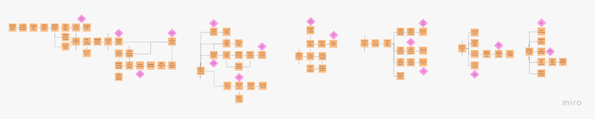
  
<i>Figura 2.5.4. Identificación de eventos pivote. Fuente: elaboración propia.</i>

**Paso 5 — Commands and Actors.** Cada evento se relacionó con el comando que lo origina y con el actor correspondiente. Por ejemplo, el ganadero ejecuta RegisterAnimal, mientras que el veterinario ejecuta RecordVeterinaryCare únicamente cuando existe una autorización vigente.

  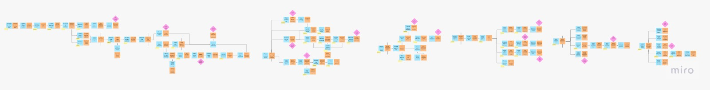
  
<i>Figura 2.5.5. Incorporación de comandos y actores. Fuente: elaboración propia.</i>

**Paso 6 — Policies.** Se representaron reglas reactivas. Cuando una atención requiere seguimiento, se solicita programar una actividad; cuando la conexión vuelve, se solicita sincronizar operaciones pendientes; cuando Stripe confirma un pago válido, se solicita activar la suscripción.

  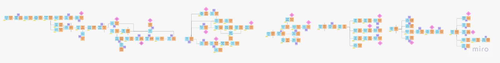
  
<i>Figura 2.5.6. Políticas y automatizaciones. Fuente: elaboración propia.</i>

**Paso 7 — Read Models.** Se incorporó la información necesaria para decidir: lista de fincas, ficha del animal, historial sanitario, clientes autorizados, actividades pendientes, resumen financiero, indicadores y estado de suscripción. En la aplicación móvil, cada read model debe indicar si procede del servidor o de una copia local y cuándo fue actualizado.

  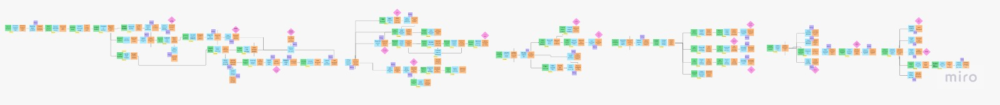
  
<i>Figura 2.5.7. Read models del dominio. Fuente: elaboración propia.</i>

**Paso 8 — External Systems.** Stripe participa en el checkout y la confirmación de pagos. El proveedor de notificaciones entrega recordatorios cuando se utiliza notificación remota. Google ML Kit se trata como una dependencia técnica ejecutada en el dispositivo para decodificar el QR y no como parte del modelo de negocio.

  
  
<i>Figura 2.5.8. Sistemas externos. Fuente: elaboración propia.</i>

**Paso 9 — Aggregates.** Los comandos y eventos se agruparon alrededor de agregados con consistencia propia: User, Profile, Farm, Animal, HealthHistory, VeterinaryAuthorization, FarmActivity, FinancialRecord, Subscription y las proyecciones de analítica.

  
  
<i>Figura 2.5.9. Agregados candidatos. Fuente: elaboración propia.</i>

La siguiente síntesis actualiza el resultado anterior con las capacidades móviles del Product Backlog. Su propósito es mantener visibles los cambios de estado del negocio sin convertir Room, Flutter, Android, sincronización o ML Kit en conceptos del dominio.

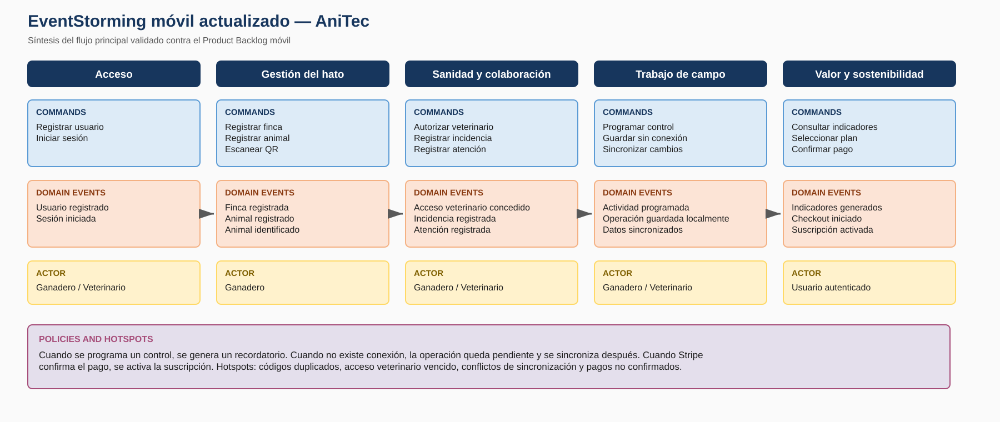

<i>Figura 2.5.10. Síntesis actualizada del EventStorming móvil. Fuente: elaboración propia.</i>

**Enlace del tablero de trabajo:** https://tinyurl.com/EventSorming

El equipo debe actualizar en ese tablero las notas correspondientes a QR, autorización veterinaria, offline, sincronización, Stripe y aplicaciones móviles para que la evidencia pública coincida con esta versión del informe.

### Decisiones derivadas del EventStorming

- La gestión del hato, la sanidad y la colaboración veterinaria concentran el valor diferencial y se clasifican como Core Domain.
- La autorización veterinaria posee reglas y ciclo de vida propios, por lo que no se modela como un simple atributo del perfil.
- La suscripción y los movimientos financieros representan conceptos distintos: una suscripción controla el acceso a un plan; un movimiento financiero describe la operación económica del ganadero.
- La analítica consume información de otros contextos mediante proyecciones y no modifica sus agregados.
- La sincronización offline pertenece a la infraestructura móvil. El contexto propietario mantiene las reglas para aceptar, rechazar o detectar conflictos.
- La lectura QR es una forma de identificar un animal; el dominio continúa trabajando con AnimalId y AnimalCode aunque cambie la tecnología de escaneo.

### 2.5.1.1. Candidate Context Discovery

El Candidate Context Discovery aplicó dos técnicas complementarias. **Start-with-Value** permitió separar las capacidades que generan el valor principal para ganaderos y veterinarios. **Look-for-Pivotal-Events** permitió ubicar cambios de estado y de responsabilidad en la línea de tiempo. Después se contrastaron los candidatos con el Ubiquitous Language, el Product Backlog y los módulos existentes del backend.

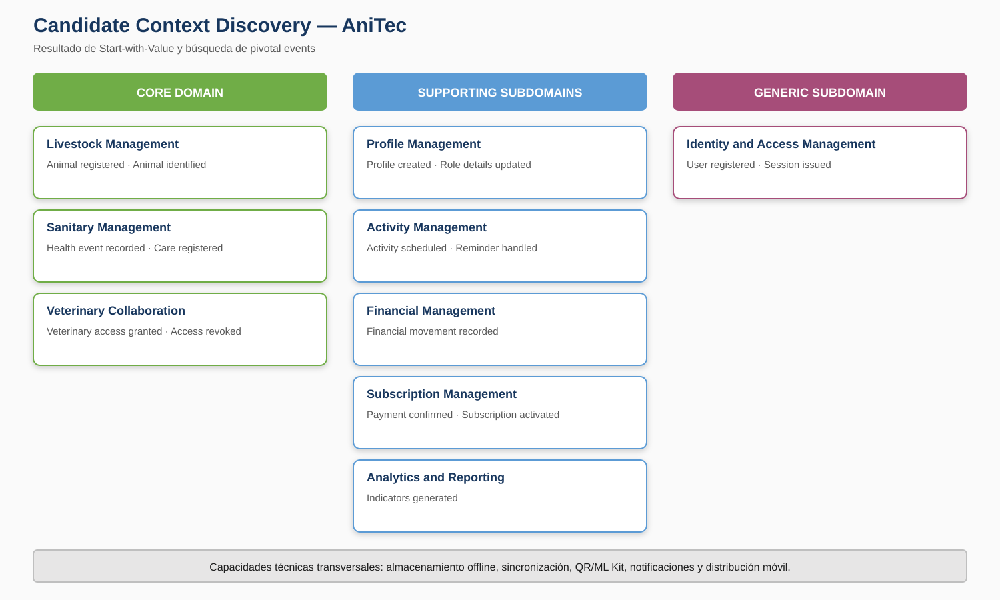

<i>Figura 2.5.11. Clasificación de los bounded contexts candidatos. Fuente: elaboración propia.</i>

<table>
  <thead>
    <tr><th>Bounded Context</th><th>Clasificación</th><th>Responsabilidad y eventos pivote</th><th>Correspondencia técnica actual</th></tr>
  </thead>
  <tbody>
    <tr><td>Identity and Access Management</td><td>Generic</td><td>Identidad, credenciales, sesiones y roles. UserRegistered, SessionIssued.</td><td>Iam</td></tr>
    <tr><td>Profile Management</td><td>Supporting</td><td>Datos personales y profesionales. ProfileCreated, ProfileUpdated.</td><td>Profiles</td></tr>
    <tr><td>Livestock Management</td><td>Core</td><td>Fincas, hatos, animales e identificación. AnimalRegistered, AnimalIdentified.</td><td>Livestock</td></tr>
    <tr><td>Sanitary Management</td><td>Core</td><td>Incidencias, diagnósticos, tratamientos e historial. HealthEventRecorded, VeterinaryCareRecorded.</td><td>Sanitary</td></tr>
    <tr><td>Veterinary Collaboration</td><td>Core</td><td>Solicitudes y autorizaciones entre ganaderos y veterinarios. VeterinaryAccessGranted, VeterinaryAccessRevoked.</td><td>Clients, que deberá adoptar el lenguaje de colaboración.</td></tr>
    <tr><td>Activity Management</td><td>Supporting</td><td>Actividades, controles y recordatorios. ActivityScheduled, ReminderDue.</td><td>Activities</td></tr>
    <tr><td>Financial Management</td><td>Supporting</td><td>Ingresos, egresos y resumen financiero. FinancialMovementRecorded.</td><td>Financial</td></tr>
    <tr><td>Subscription Management</td><td>Supporting</td><td>Planes, checkout, pago confirmado y suscripción. PaymentConfirmed, SubscriptionActivated.</td><td>Subscriptions</td></tr>
    <tr><td>Analytics and Reporting</td><td>Supporting</td><td>Indicadores y read models para cada rol. IndicatorsGenerated.</td><td>Analytics</td></tr>
  </tbody>
</table>

#### Decisiones sobre los límites

<table>
  <thead>
    <tr><th>Elemento analizado</th><th>Decisión</th><th>Justificación</th></tr>
  </thead>
  <tbody>
    <tr><td>Offline Storage and Synchronization</td><td>No constituye bounded context.</td><td>Es una capacidad técnica de Android y Flutter. Cada operación sigue perteneciendo al contexto que define sus reglas.</td></tr>
    <tr><td>Animal Identification con QR</td><td>Capability de Livestock Management.</td><td>ML Kit traduce una imagen a un código; Livestock resuelve el animal y verifica autorización.</td></tr>
    <tr><td>Notifications</td><td>Capability técnica de Activity Management.</td><td>Activities decide cuándo existe un recordatorio; el proveedor solo lo entrega.</td></tr>
    <tr><td>Landing Page</td><td>Producto informativo, no bounded context.</td><td>No contiene reglas relevantes del dominio ganadero.</td></tr>
    <tr><td>Shared</td><td>Infraestructura compartida, no subdominio.</td><td>Repositorio base, Unit of Work y manejo de errores son mecanismos técnicos.</td></tr>
    <tr><td>Devices y Metrics</td><td>Fuera del alcance actual.</td><td>Pertenecen a la propuesta IoT anterior y no están respaldados por el Product Backlog móvil vigente.</td></tr>
  </tbody>
</table>

El resultado corrige la diferencia existente entre la lista anterior de cinco contextos, los cuatro canvases históricos y los contextos adicionales utilizados en los Domain Stories. Los nueve contextos seleccionados serán la referencia única para Context Mapping, Software Architecture y Tactical-Level DDD.

### 2.5.1.2. Domain Message Flows Modeling

Los Domain Message Flows aplican Domain Storytelling para mostrar cómo los actores, aplicaciones móviles y bounded contexts colaboran en los escenarios principales. Cada historia identifica quién inicia el flujo, qué comando se transmite, quién aplica las reglas y qué evento informa el resultado. Los términos Android, Flutter, base local y ML Kit aparecen únicamente cuando explican el transporte o la interacción con el dispositivo.

<table>
  <thead>
    <tr><th>Domain Story</th><th>Objetivo</th><th>Requisitos relacionados</th></tr>
  </thead>
  <tbody>
    <tr><td>DS-01</td><td>Registrar un animal con conectividad disponible o interrumpida.</td><td>US-008 a US-013, US-029 a US-031, TS-005 a TS-007.</td></tr>
    <tr><td>DS-02</td><td>Identificar un animal mediante QR y conservar búsqueda manual.</td><td>US-033, US-034, TS-010 y SP-001.</td></tr>
    <tr><td>DS-03</td><td>Registrar una incidencia y programar seguimiento.</td><td>US-014 a US-019 y US-025 a US-028.</td></tr>
    <tr><td>DS-04</td><td>Autorizar al veterinario y registrar una atención trazable.</td><td>US-016 a US-024.</td></tr>
    <tr><td>DS-05</td><td>Sincronizar operaciones idempotentes y comunicar conflictos.</td><td>US-029 a US-032 y TS-007.</td></tr>
    <tr><td>DS-06</td><td>Procesar una suscripción mediante Stripe.</td><td>US-038 a US-040 y TS-011.</td></tr>
  </tbody>
</table>

#### DS-01. Registro móvil de un animal

El ganadero registra un animal en la finca seleccionada. La aplicación guarda un comando identificado de forma única. Con conexión, el comando se envía inmediatamente; sin conexión, permanece pendiente. Livestock Management valida la propiedad de la finca y la unicidad del código antes de producir AnimalRegistered.

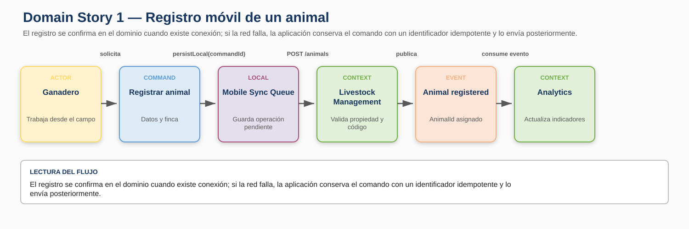

<i>Figura 2.5.12. Domain Story del registro móvil de un animal. Fuente: elaboración propia.</i>

#### DS-02. Identificación mediante QR

La cámara proporciona la imagen y ML Kit decodifica el QR dentro del dispositivo. El código resultante se envía a Livestock Management, que resuelve AnimalId y comprueba que el usuario pueda consultar la ficha. Si no se obtiene un código válido, la búsqueda manual mantiene el resultado de negocio disponible.

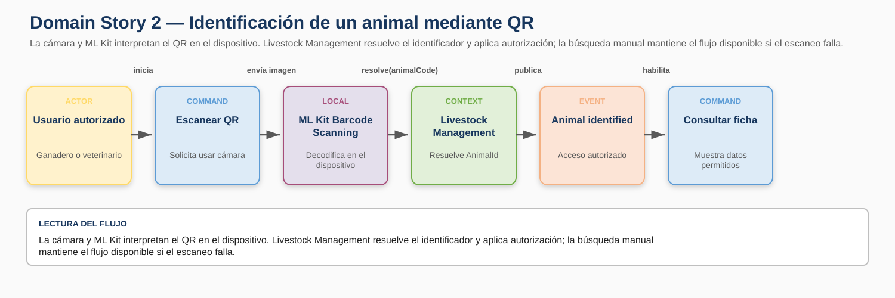

<i>Figura 2.5.13. Domain Story de identificación mediante QR. Fuente: elaboración propia.</i>

#### DS-03. Incidencia y seguimiento sanitario

Sanitary Management incorpora la incidencia al historial del animal. Cuando el evento requiere seguimiento, publica FollowUpRequired; Activity Management lo transforma en una actividad con fecha y produce ReminderScheduled para que el mecanismo móvil correspondiente programe la notificación.

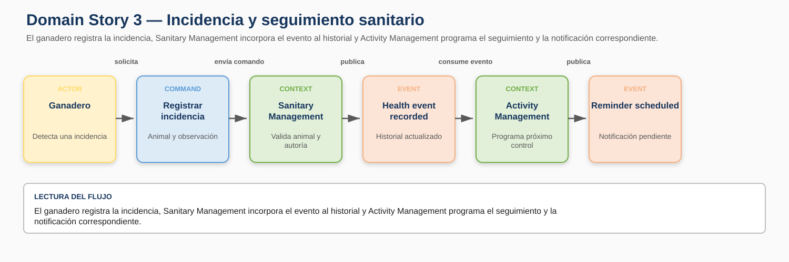

<i>Figura 2.5.14. Domain Story de incidencia y seguimiento sanitario. Fuente: elaboración propia.</i>

#### DS-04. Autorización y atención veterinaria

Veterinary Collaboration administra la relación entre el ganadero y el veterinario. Sanitary Management consulta ese contrato antes de exponer antecedentes o registrar una atención. El evento final conserva la identidad profesional para asegurar trazabilidad.

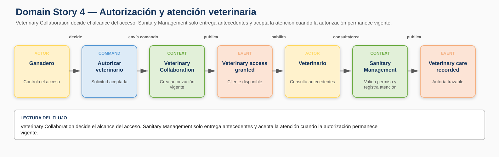

<i>Figura 2.5.15. Domain Story de autorización y atención veterinaria. Fuente: elaboración propia.</i>

#### DS-05. Sincronización y resolución de conflictos

La base local y el Sync Worker pertenecen a la infraestructura móvil. El comando conserva CommandId, versión y fecha. El contexto propietario comprueba idempotencia y concurrencia y responde con Synced, Rejected o Conflict; la aplicación muestra el estado sin duplicar la operación.

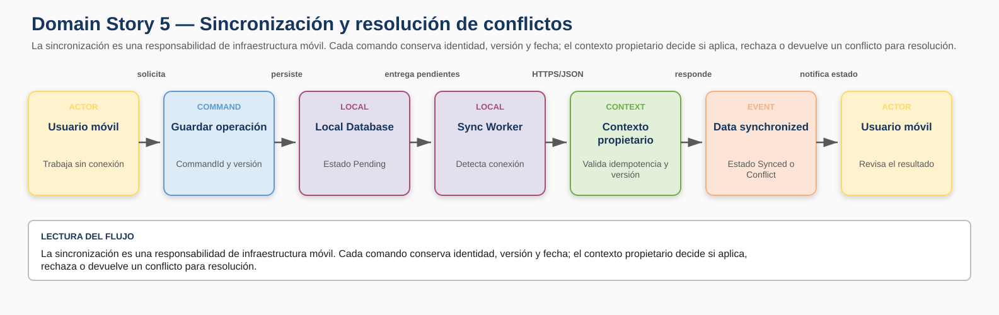

<i>Figura 2.5.16. Domain Story de sincronización y resolución de conflictos. Fuente: elaboración propia.</i>

#### DS-06. Suscripción mediante Stripe

Subscription Management crea el checkout para el plan seleccionado. La Anti-Corruption Layer transforma el modelo interno al contrato de Stripe y valida la respuesta. La suscripción solo cambia a activa después de que el backend comprueba el pago; una redirección del cliente por sí sola no confirma la operación.

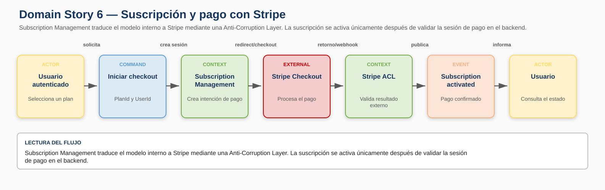

<i>Figura 2.5.17. Domain Story de suscripción mediante Stripe. Fuente: elaboración propia.</i>

#### Tipos de colaboración identificados

- Las consultas directas desde Android y Flutter utilizan JSON sobre HTTPS mediante la API REST.
- Los eventos como AnimalRegistered, HealthEventRecorded o FollowUpRequired representan mensajes del dominio y permiten desacoplar consumidores.
- Los comandos offline se procesan con idempotencia para que una retransmisión no genere duplicados.
- Analytics utiliza read models y no consulta ni modifica directamente los agregados de otros contextos.
- Stripe y el proveedor de notificaciones se aíslan mediante Anti-Corruption Layers.

### 2.5.1.3. Bounded Context Canvases

Los canvases de Livestock Management, Animal Health, Financial Control y Analytics del trabajo anterior se utilizaron como punto de partida. La revisión actual normaliza sus nombres, actualiza reglas según el Product Backlog y agrega los contextos ausentes. Cada canvas se elaboró siguiendo este ciclo:

1. **Context Overview Definition:** propósito y clasificación estratégica.
2. **Business Rules Distillation and Ubiquitous Language Capture:** reglas y términos exclusivos.
3. **Capability Analysis:** comandos, consultas y eventos principales.
4. **Capability Layering:** distinción entre dominio, soporte e infraestructura.
5. **Dependencies Capture:** comunicaciones entrantes, salientes y contextos relacionados.
6. **Design Critique:** supuestos, métricas, preguntas abiertas y revisión de límites.

<table>
  <thead>
    <tr><th>Bounded Context</th><th>Resultado de la revisión</th></tr>
  </thead>
  <tbody>
    <tr><td>IAM</td><td>Se separaron credenciales y sesiones de los datos del perfil.</td></tr>
    <tr><td>Profiles</td><td>Se delimitó la identidad descriptiva de ganaderos y veterinarios.</td></tr>
    <tr><td>Livestock</td><td>Se incorporaron finca, identificación QR y alternativa manual.</td></tr>
    <tr><td>Sanitary</td><td>Se añadieron autorización, autoría y correcciones trazables.</td></tr>
    <tr><td>Veterinary Collaboration</td><td>Se formalizó como modelo con ciclo de vida propio.</td></tr>
    <tr><td>Activities</td><td>Se relacionaron controles, estados y recordatorios.</td></tr>
    <tr><td>Financial</td><td>Se separó la operación financiera de los pagos de suscripción.</td></tr>
    <tr><td>Subscriptions</td><td>Se reemplazó el pago simulado por Stripe y una ACL.</td></tr>
    <tr><td>Analytics</td><td>Se limitó a indicadores respaldados por historias vigentes.</td></tr>
  </tbody>
</table>

#### Capability Analysis and Layering

La revisión separa capacidades del dominio de mecanismos de aplicación e infraestructura. Esta separación evita crear bounded contexts para cada librería, pantalla o recurso del dispositivo.

<table>
  <thead>
    <tr><th>Bounded Context</th><th>Capacidades del dominio</th><th>Capacidades de aplicación o infraestructura</th></tr>
  </thead>
  <tbody>
    <tr><td>IAM</td><td>Registro, autenticación, sesión y autorización.</td><td>JWT, BCrypt y almacenamiento seguro del token.</td></tr>
    <tr><td>Profiles</td><td>Creación y actualización de datos personales y profesionales.</td><td>Validación, localización y exposición REST del perfil.</td></tr>
    <tr><td>Livestock</td><td>Fincas, animales, códigos e identificación.</td><td>Cámara, ML Kit, caché local y adaptadores REST.</td></tr>
    <tr><td>Sanitary</td><td>Historial, incidencia, atención, tratamiento y corrección.</td><td>Persistencia local, sincronización y control de versiones.</td></tr>
    <tr><td>Veterinary Collaboration</td><td>Solicitud, concesión, alcance y revocación del acceso.</td><td>Consulta REST y aplicación de políticas de autorización.</td></tr>
    <tr><td>Activities</td><td>Programación, atención y reprogramación.</td><td>Scheduler y adaptador del proveedor de notificaciones.</td></tr>
    <tr><td>Financial</td><td>Ingresos, egresos, categorías y balance.</td><td>Caché local y exposición REST.</td></tr>
    <tr><td>Subscriptions</td><td>Planes, estado de suscripción y confirmación de pago.</td><td>Stripe Checkout y Anti-Corruption Layer.</td></tr>
    <tr><td>Analytics</td><td>Definición de indicadores por rol y periodo.</td><td>Proyecciones, agregación y caché de read models.</td></tr>
  </tbody>
</table>

#### Identity and Access Management

Gestiona cuentas, credenciales, sesiones y autorización. Publica un identificador estable y el rol; no administra los datos personales del perfil.

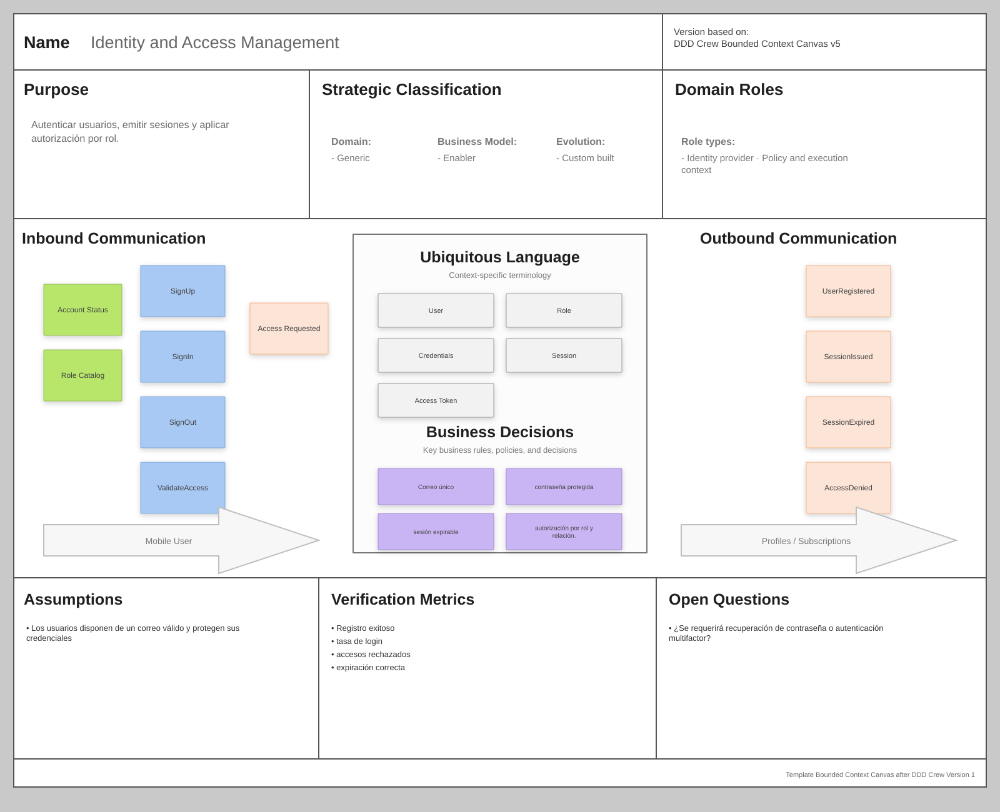

<i>Figura 2.5.18. Bounded Context Canvas de IAM. Fuente: elaboración propia.</i>

#### Profile Management

Mantiene la información personal y profesional asociada con la identidad. Su separación evita que los cambios del perfil alteren el modelo de autenticación.

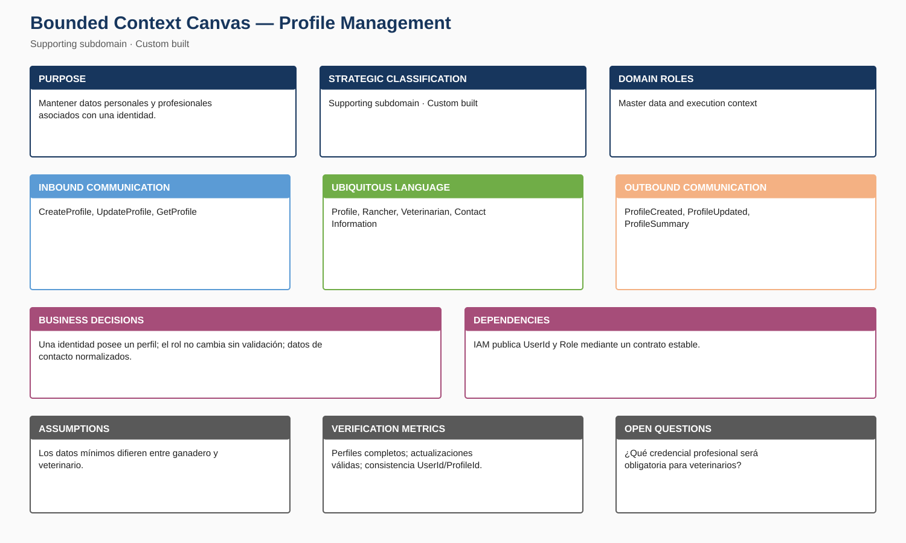

<i>Figura 2.5.19. Bounded Context Canvas de Profile Management. Fuente: elaboración propia.</i>

#### Livestock Management

Concentra el registro de fincas, hatos y animales. El QR es un medio de identificación y no sustituye el identificador estable del animal.

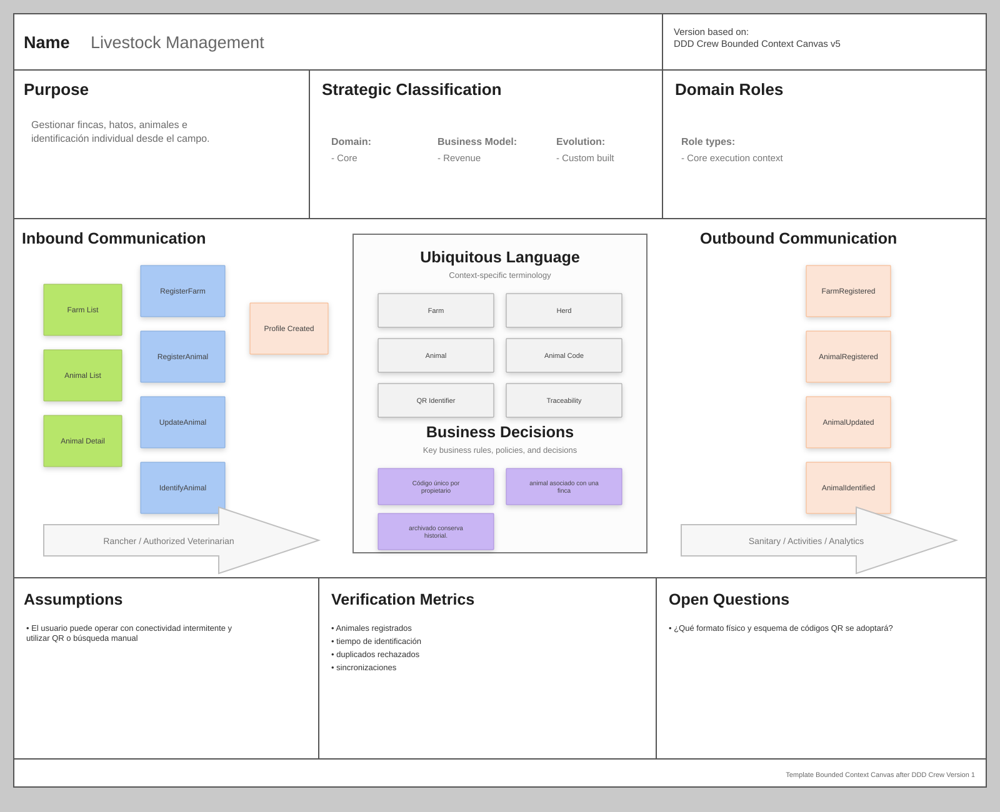

<i>Figura 2.5.20. Bounded Context Canvas de Livestock Management. Fuente: elaboración propia.</i>

#### Sanitary Management

Mantiene el historial sanitario, las atenciones y la trazabilidad clínica. Depende de Livestock para reconocer el animal y de Veterinary Collaboration para validar al profesional.

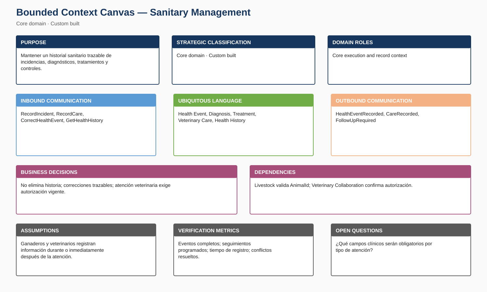

<i>Figura 2.5.21. Bounded Context Canvas de Sanitary Management. Fuente: elaboración propia.</i>

#### Veterinary Collaboration

Define solicitudes, autorizaciones, revocaciones, clientes y pacientes. La autorización es temporal y delimita qué información puede consultar o modificar el veterinario.

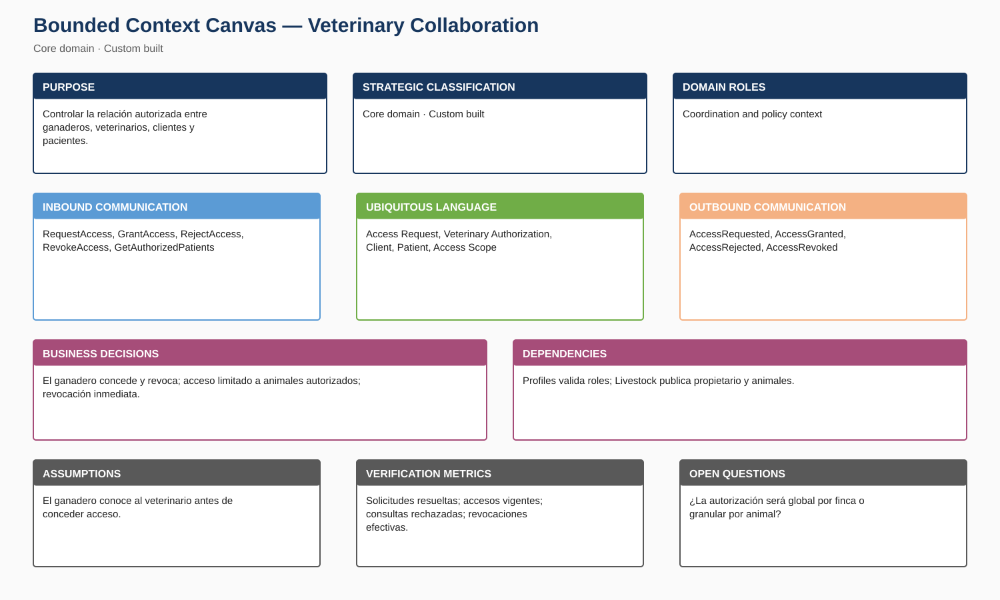

<i>Figura 2.5.22. Bounded Context Canvas de Veterinary Collaboration. Fuente: elaboración propia.</i>

#### Activity Management

Administra actividades, fechas, responsables, estados y reprogramaciones. El mecanismo de notificación ejecuta la entrega, mientras Activity Management conserva la decisión de negocio sobre cuándo corresponde recordar.

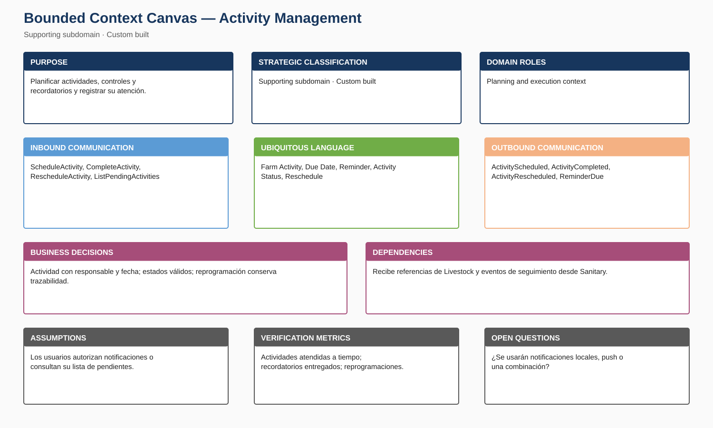

<i>Figura 2.5.23. Bounded Context Canvas de Activity Management. Fuente: elaboración propia.</i>

#### Financial Management

Registra ingresos y egresos operativos del ganadero. Su alcance inicial proporciona visibilidad económica básica y no reemplaza un sistema contable o tributario.

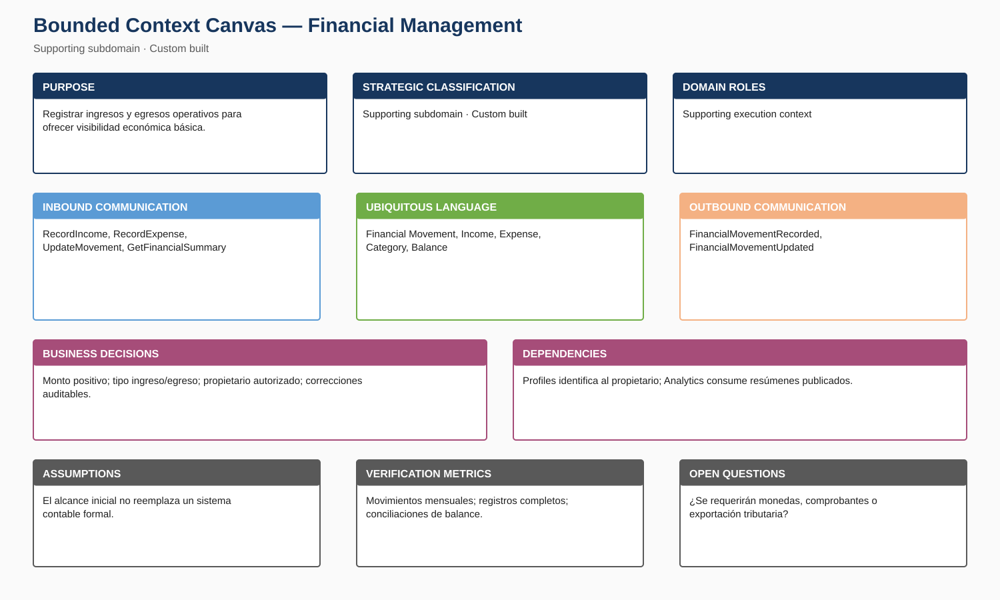

<i>Figura 2.5.24. Bounded Context Canvas de Financial Management. Fuente: elaboración propia.</i>

#### Subscription Management

Administra planes, checkout, pagos confirmados y estado de suscripción. Stripe permanece fuera del modelo y se traduce mediante una Anti-Corruption Layer.

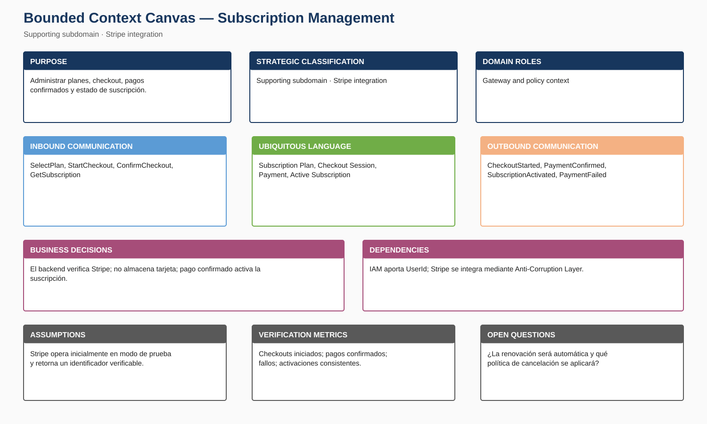

<i>Figura 2.5.25. Bounded Context Canvas de Subscription Management. Fuente: elaboración propia.</i>

#### Analytics and Reporting

Construye read models para indicadores de ganaderos y veterinarios. Consume información publicada por los contextos fuente y no adquiere propiedad sobre sus reglas o registros.

<i>Figura 2.5.26. Bounded Context Canvas de Analytics and Reporting. Fuente: elaboración propia.</i>

Las preguntas abiertas de cada canvas forman parte del Design Critique y deberán resolverse durante los sprints sin modificar silenciosamente el lenguaje o los límites. Cualquier decisión que cambie responsabilidades deberá reflejarse primero en el Context Map y después en el diseño táctico.

## 2.5.2. Context Mapping

El Context Mapping compara las relaciones estructurales entre los bounded contexts y explicita qué modelo actúa como proveedor, qué modelo consume sus contratos y qué patrón reduce el acoplamiento. Antes de seleccionar el mapa final se evaluaron tres alternativas.

<table>
  <thead>
    <tr><th>Alternativa</th><th>Descripción</th><th>Evaluación</th></tr>
  </thead>
  <tbody>
    <tr><td>A. Contextos amplios</td><td>Unir perfiles, colaboración, sanidad y actividades dentro de un único contexto de gestión ganadera.</td><td>Rechazada porque mezcla ciclos de vida, vocabularios y reglas de autorización; también dificulta la evolución independiente.</td></tr>
    <tr><td>B. Replicar todos los módulos anteriores</td><td>Considerar como contextos todos los módulos del backend, incluidos Devices, Metrics y Shared.</td><td>Rechazada porque confunde infraestructura con subdominios y conserva capacidades IoT fuera del backlog actual.</td></tr>
    <tr><td>C. Nueve contextos alineados con valor</td><td>Separar IAM, Profiles, Livestock, Sanitary, Veterinary Collaboration, Activities, Financial, Subscriptions y Analytics.</td><td>Seleccionada porque mantiene reglas cohesivas, coincide con el alcance móvil y aprovecha la modularidad existente del backend.</td></tr>
  </tbody>
</table>

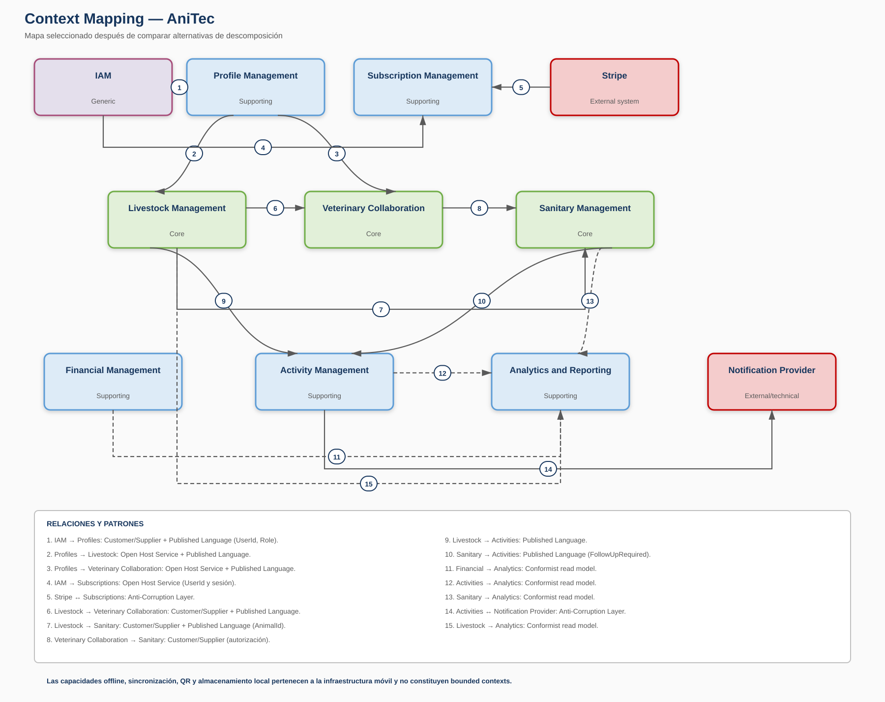

<i>Figura 2.5.27. Context Map seleccionado para AniTec. Fuente: elaboración propia.</i>

### Relaciones entre bounded contexts

<table>
  <thead>
    <tr><th>Upstream / proveedor</th><th>Downstream / consumidor</th><th>Patrón</th><th>Contrato principal</th></tr>
  </thead>
  <tbody>
    <tr><td>IAM</td><td>Profiles</td><td>Customer/Supplier y Published Language</td><td>UserId, Role, UserRegistered.</td></tr>
    <tr><td>IAM</td><td>Subscription Management</td><td>Open Host Service</td><td>Identidad y sesión autenticada.</td></tr>
    <tr><td>Profile Management</td><td>Livestock Management</td><td>Open Host Service y Published Language</td><td>Resumen del propietario.</td></tr>
    <tr><td>Profile Management</td><td>Veterinary Collaboration</td><td>Open Host Service y Published Language</td><td>Identidad y rol de las partes.</td></tr>
    <tr><td>Livestock Management</td><td>Veterinary Collaboration</td><td>Customer/Supplier y Published Language</td><td>Propietario, finca y animales.</td></tr>
    <tr><td>Livestock Management</td><td>Sanitary Management</td><td>Customer/Supplier y Published Language</td><td>AnimalId, estado y propiedad.</td></tr>
    <tr><td>Veterinary Collaboration</td><td>Sanitary Management</td><td>Customer/Supplier</td><td>Estado y alcance de la autorización.</td></tr>
    <tr><td>Livestock Management</td><td>Activity Management</td><td>Published Language</td><td>Referencia de animal y finca.</td></tr>
    <tr><td>Sanitary Management</td><td>Activity Management</td><td>Published Language</td><td>FollowUpRequired.</td></tr>
    <tr><td>Livestock, Sanitary, Activities y Financial</td><td>Analytics and Reporting</td><td>Conformist read models</td><td>Eventos y resúmenes publicados para proyecciones.</td></tr>
    <tr><td>Stripe</td><td>Subscription Management</td><td>Anti-Corruption Layer</td><td>Checkout Session y resultado de pago traducidos al modelo interno.</td></tr>
    <tr><td>Notification Provider</td><td>Activity Management</td><td>Anti-Corruption Layer</td><td>Solicitud de entrega y resultado de notificación.</td></tr>
  </tbody>
</table>

### Design Critique del Context Map

- **Coherencia con el negocio:** cada contexto contiene conceptos que cambian por las mismas reglas y razones.
- **Protección del Core Domain:** Livestock, Sanitary y Veterinary Collaboration no dependen del modelo externo de Stripe ni del proveedor de notificaciones.
- **Autonomía de Analytics:** sus proyecciones pueden reconstruirse sin modificar los datos fuente.
- **Movilidad:** Android y Flutter consumen contratos publicados por la API; no introducen un segundo modelo del dominio.
- **Offline:** los clientes almacenan comandos y read models locales, mientras las reglas de aceptación siguen en el contexto propietario.
- **Evolución:** reemplazar ML Kit, Stripe o el proveedor de notificaciones no obliga a cambiar el Ubiquitous Language.
- **Trazabilidad:** los mismos nueve contextos deberán utilizarse en el capítulo 2.6 y en los futuros diagramas C4.

El mapa seleccionado será la base de 2.5.3 Software Architecture. En esa sección se representarán la landing page, Android, Flutter, almacenamiento local, API REST, MySQL, Stripe, ML Kit, notificaciones y Firebase App Distribution sin convertir los contenedores técnicos en bounded contexts adicionales.

## 2.5.3. Software Architecture

La arquitectura de AniTec se documenta con el modelo C4 para representar la solución con distintos niveles de detalle. Las tres vistas se construyen desde un único modelo en Structurizr DSL, de modo que los actores, dependencias, tecnologías y relaciones conserven el mismo significado. El archivo fuente se encuentra en [anitec-software-architecture.dsl](markdown/assets/codefordiagrams/anitec-software-architecture.dsl).

La solución reutiliza la API REST y la persistencia desarrolladas en el proyecto anterior, pero reemplaza el frontend web como canal operativo por una aplicación Android nativa y una aplicación multiplataforma. La landing page mantiene una función informativa. Los nueve bounded contexts definidos en las secciones anteriores pertenecen al backend y no se modelan como contenedores independientes en este nivel; su estructura interna se desarrollará en el diseño táctico del punto 2.6.

### 2.5.3.1. Software Architecture Context Level Diagrams

El Context Level Diagram delimita a AniTec como un único sistema de software y muestra quién lo usa y de qué servicios externos depende. El **Rancher** administra su operación ganadera; el **Veterinarian** consulta pacientes autorizados y registra atenciones; el **Visitor** conoce la propuesta mediante la landing page; y el **Evaluator / Tester** instala las versiones móviles distribuidas para la validación del curso.

Stripe procesa el checkout de las suscripciones, Firebase Cloud Messaging entrega notificaciones push, Google ML Kit reconoce códigos QR en el dispositivo y Firebase App Distribution distribuye compilaciones firmadas. Estos servicios permanecen fuera del límite de AniTec y se integran mediante contratos que evitan trasladar sus modelos al dominio.

<table>
  <thead>
    <tr><th>Elemento externo</th><th>Relación con AniTec</th><th>Resultado esperado</th></tr>
  </thead>
  <tbody>
    <tr><td>Visitor</td><td>Consulta la landing page.</td><td>Comprende la propuesta de valor y encuentra el canal de acceso al producto.</td></tr>
    <tr><td>Rancher</td><td>Usa las aplicaciones móviles.</td><td>Gestiona fincas, animales, sanidad, actividades y finanzas.</td></tr>
    <tr><td>Veterinarian</td><td>Usa las aplicaciones móviles con autorización del ganadero.</td><td>Consulta clientes y pacientes y mantiene la trazabilidad sanitaria permitida.</td></tr>
    <tr><td>Evaluator / Tester</td><td>Recibe e instala builds mediante Firebase App Distribution.</td><td>Valida la aplicación en un dispositivo físico y una versión identificable.</td></tr>
    <tr><td>Stripe</td><td>Recibe solicitudes de checkout y devuelve resultados de pago.</td><td>AniTec activa o conserva la suscripción según una confirmación válida.</td></tr>
    <tr><td>Firebase Cloud Messaging</td><td>Recibe solicitudes de entrega de notificaciones.</td><td>El dispositivo presenta recordatorios definidos por Activity Management.</td></tr>
    <tr><td>Google ML Kit</td><td>Procesa imágenes de la cámara localmente.</td><td>La aplicación obtiene el código que Livestock Management resuelve como un animal.</td></tr>
    <tr><td>Firebase App Distribution</td><td>Publica builds firmadas para usuarios autorizados.</td><td>Las versiones de prueba y entrega se distribuyen con trazabilidad.</td></tr>
  </tbody>
</table>

  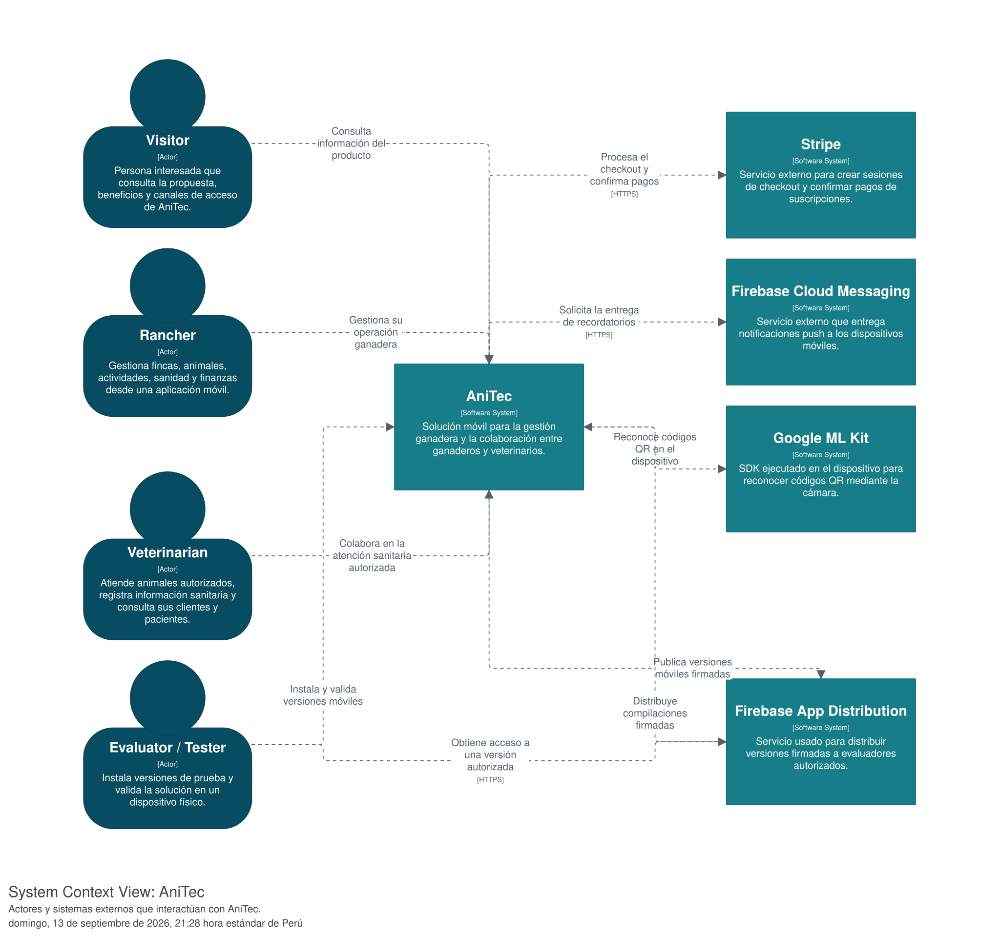
  
<i>Figura 2.5.28. Software Architecture Context Level Diagram de AniTec. Fuente: elaboración propia con Structurizr DSL.</i>

### 2.5.3.2. Software Architecture Container Level Diagrams

El Container Level Diagram descompone AniTec en unidades ejecutables o de almacenamiento. La landing page comunica el producto; las dos aplicaciones móviles implementan la experiencia de los roles; cada cliente mantiene almacenamiento local para caché y operaciones pendientes; la API centraliza autenticación, autorización y reglas de negocio; y MySQL conserva la fuente de verdad compartida.

Android y Flutter consumen los mismos contratos JSON sobre HTTPS y se autentican con JWT. La persistencia local mejora la continuidad ante conectividad limitada, pero las reglas de aceptación continúan bajo el bounded context propietario en la API. La cámara y ML Kit actúan como capacidades del dispositivo: decodifican un QR, mientras Livestock Management determina qué animal representa y si el usuario puede consultarlo.

<table>
  <thead>
    <tr><th>Contenedor</th><th>Responsabilidad</th><th>Tecnología</th></tr>
  </thead>
  <tbody>
    <tr><td>Landing Page</td><td>Presenta la propuesta de valor, segmentos, características y acceso a versiones autorizadas.</td><td>HTML, CSS y JavaScript.</td></tr>
    <tr><td>Native Android Application</td><td>Implementa los flujos móviles nativos, utiliza cámara y notificaciones y sincroniza datos.</td><td>Kotlin y Jetpack Compose.</td></tr>
    <tr><td>Android Local Database</td><td>Almacena caché, read models y operaciones pendientes de sincronización.</td><td>Room sobre SQLite.</td></tr>
    <tr><td>Cross-Platform Mobile Application</td><td>Implementa el mismo alcance funcional mediante una base de código multiplataforma.</td><td>Flutter y Dart.</td></tr>
    <tr><td>Flutter Local Database</td><td>Proporciona persistencia local equivalente para la aplicación multiplataforma.</td><td>SQLite mediante una biblioteca compatible con Flutter.</td></tr>
    <tr><td>AniTec REST API</td><td>Expone casos de uso, aplica reglas de negocio y autorización y coordina integraciones externas.</td><td>C#, ASP.NET Core, Entity Framework Core, JWT y OpenAPI.</td></tr>
    <tr><td>AniTec Database</td><td>Persiste la información transaccional y las proyecciones de los bounded contexts.</td><td>MySQL.</td></tr>
  </tbody>
</table>

  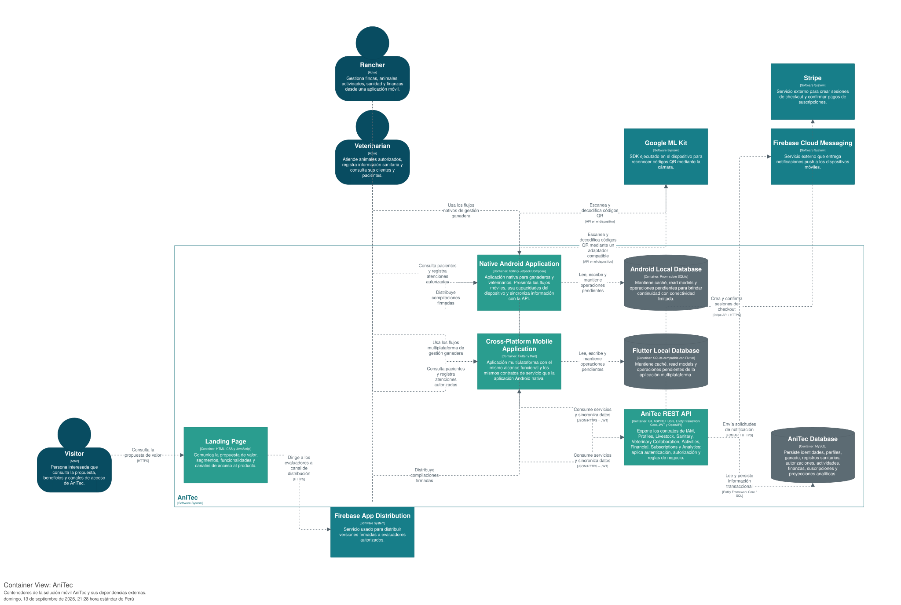
  
<i>Figura 2.5.29. Software Architecture Container Level Diagram de AniTec. Fuente: elaboración propia con Structurizr DSL.</i>

### 2.5.3.3. Software Architecture Deployment Diagrams

El Deployment Diagram representa la topología objetivo para las entregas del curso. La aplicación Android nativa se instala en un dispositivo Android físico y conserva su base Room dentro del mismo dispositivo. La aplicación Flutter se instala en el dispositivo físico correspondiente a la plataforma objetivo definida por el equipo y mantiene su propia base SQLite local. En ambos casos, la cámara y el reconocimiento QR se ejecutan dentro del dispositivo.

La landing page se publica como contenido estático en GitHub Pages. La API ASP.NET Core se ejecuta como Web Service en Render y accede a MySQL administrado en Filess.io, destinos recuperados del despliegue funcional del proyecto anterior. Stripe, Firebase Cloud Messaging y Firebase App Distribution se mantienen como servicios externos. Esta topología deberá actualizarse si durante los sprints cambia algún proveedor, sin alterar las responsabilidades de los contenedores.

<table>
  <thead>
    <tr><th>Nodo de despliegue</th><th>Artefacto o instancia</th><th>Comunicación principal</th></tr>
  </thead>
  <tbody>
    <tr><td>Physical Android Device</td><td>Native Android Application, Room/SQLite, cámara y ML Kit.</td><td>HTTPS con la API; almacenamiento y reconocimiento local.</td></tr>
    <tr><td>Cross-Platform Target Device</td><td>Flutter Application, SQLite, cámara y adaptador de reconocimiento QR.</td><td>HTTPS con la API; almacenamiento y reconocimiento local.</td></tr>
    <tr><td>GitHub Pages</td><td>Landing Page.</td><td>HTTPS con visitantes y acceso al canal de distribución.</td></tr>
    <tr><td>Render</td><td>AniTec REST API sobre el runtime de .NET.</td><td>JSON/HTTPS con clientes móviles; SQL con MySQL; HTTPS con servicios externos.</td></tr>
    <tr><td>Filess.io</td><td>AniTec Database sobre MySQL.</td><td>Conexión restringida desde la API.</td></tr>
    <tr><td>Firebase App Distribution</td><td>Builds móviles firmadas y versionadas.</td><td>Distribución a evaluadores autorizados.</td></tr>
    <tr><td>Firebase Cloud Messaging</td><td>Servicio de entrega de notificaciones.</td><td>Solicitudes desde el backend y entrega al dispositivo.</td></tr>
    <tr><td>Stripe Cloud</td><td>Checkout y confirmación de pago.</td><td>Stripe API sobre HTTPS.</td></tr>
  </tbody>
</table>

  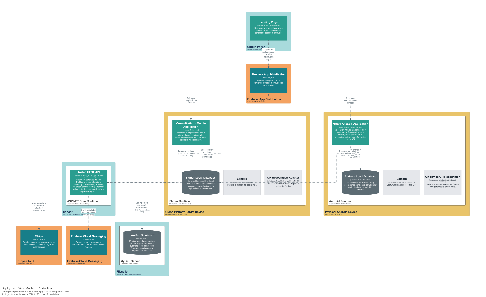
  
<i>Figura 2.5.30. Software Architecture Deployment Diagram de AniTec. Fuente: elaboración propia con Structurizr DSL.</i>

Las tres imágenes deben exportarse desde el mismo archivo DSL. Los nombres y rutas requeridos se detallan en [codefordiagrams/README.md](markdown/assets/codefordiagrams/README.md), de modo que al copiar los PNG exportados los placeholders del informe se resuelvan sin modificar nuevamente el contenido.

# 2.6. Tactical-Level Domain-Driven Design

Esta sección describe cómo los nueve bounded contexts identificados en el diseño estratégico se materializan en clases, capas, componentes y estructuras de persistencia. La propuesta utiliza un enfoque híbrido trazable: conserva nombres y responsabilidades del backend heredado y marca como no implementados los elementos requeridos para Android, Flutter y la evolución del dominio que todavía no existen en el código.

Para todos los contextos se aplican las siguientes convenciones:

- La **Domain Layer** mantiene entidades, aggregates, value objects, servicios de dominio e interfaces de repositorio.
- La **Application Layer** orquesta comandos, consultas, eventos y casos de uso sin depender de frameworks de presentación.
- La **Interface Layer** traduce HTTP o acciones de la interfaz móvil hacia los casos de uso.
- La **Infrastructure Layer** implementa persistencia, red, seguridad, sincronización e integraciones externas.
- MySQL es la fuente autoritativa; Room y SQLite mantienen caché y un outbox idempotente.
- Las reglas de negocio permanecen en la API y el dominio; Android y Flutter reutilizan los mismos contratos y lenguaje ubicuo.

Para mantener el informe legible, las fichas individuales se reservan para aggregates, entidades, servicios, handlers, controladores y adaptadores que explican decisiones relevantes de arquitectura. Los DTO, resources, mappers, comandos simples, configuraciones y adaptadores repetitivos se omiten del diccionario detallado y permanecen representados en el código o en los diagramas correspondientes cuando resulta necesario.

<table>
  <thead>
    <tr><th>Sección</th><th>Bounded Context</th><th>Módulo heredado</th><th>Propósito</th></tr>
  </thead>
  <tbody>
    <tr><td>2.6.1</td><td><a href="#toc-2-6-1-bounded-context-identity-and-access-management">Identity and Access Management</a></td><td>Iam</td><td>Administrar identidades, credenciales, roles y sesiones para que cada operación de AniTec se ejecute con una identidad autenticada y autorizada.</td></tr>
    <tr><td>2.6.2</td><td><a href="#toc-2-6-2-bounded-context-profile-management">Profile Management</a></td><td>Profiles</td><td>Mantener la información personal y de contacto asociada con una identidad sin mezclarla con credenciales o reglas de autenticación.</td></tr>
    <tr><td>2.6.3</td><td><a href="#toc-2-6-3-bounded-context-livestock-management">Livestock Management</a></td><td>Livestock</td><td>Gestionar fincas, hatos, animales e identificadores QR como fuente de referencia para los demás procesos ganaderos.</td></tr>
    <tr><td>2.6.4</td><td><a href="#toc-2-6-4-bounded-context-sanitary-management">Sanitary Management</a></td><td>Sanitary</td><td>Conservar la historia sanitaria del animal y controlar el registro de diagnósticos, tratamientos, prescripciones y seguimientos autorizados.</td></tr>
    <tr><td>2.6.5</td><td><a href="#toc-2-6-5-bounded-context-veterinary-collaboration">Veterinary Collaboration</a></td><td>Clients</td><td>Administrar solicitudes y autorizaciones entre ganaderos y veterinarios, delimitando clientes, pacientes y alcance de acceso.</td></tr>
    <tr><td>2.6.6</td><td><a href="#toc-2-6-6-bounded-context-activity-management">Activity Management</a></td><td>Activities</td><td>Planificar actividades ganaderas y sanitarias, controlar su estado y decidir cuándo corresponde generar un recordatorio.</td></tr>
    <tr><td>2.6.7</td><td><a href="#toc-2-6-7-bounded-context-financial-management">Financial Management</a></td><td>Financial</td><td>Registrar ingresos y egresos operativos y producir resúmenes económicos básicos para apoyar decisiones del ganadero.</td></tr>
    <tr><td>2.6.8</td><td><a href="#toc-2-6-8-bounded-context-subscription-management">Subscription Management</a></td><td>Subscriptions</td><td>Administrar planes, vigencia de suscripciones y pagos confirmados sin introducir conceptos propios de Stripe en el dominio.</td></tr>
    <tr><td>2.6.9</td><td><a href="#toc-2-6-9-bounded-context-analytics-and-reporting">Analytics and Reporting</a></td><td>Analytics</td><td>Construir proyecciones y métricas de consulta para los dashboards sin adquirir propiedad sobre los registros de los contextos fuente.</td></tr>
  </tbody>
</table>

# 2.6.1. Bounded Context: Identity and Access Management

Administrar identidades, credenciales, roles y sesiones para que cada operación de AniTec se ejecute con una identidad autenticada y autorizada.

La base implementada se encuentra en el módulo Iam de la API ASP.NET Core. El diseño móvil de Android y Flutter se documenta como **no implementado** porque esos clientes todavía no existen en el workspace. Los tres productos comparten contratos REST y lenguaje ubicuo, mientras la API conserva las reglas autoritativas.

## 2.6.1.1. Domain Layer

Esta capa documenta el modelo que representa el núcleo de **Identity and Access Management**. Las reglas autoritativas se ejecutan en la API; Android y Flutter mantienen modelos equivalentes para presentación, validación inmediata y trabajo offline. La columna de estado distingue el código heredado de la arquitectura objetivo.

### Aggregate Root: User

| Campo | Detalle |
|---|---|
| **Producto y estado** | Backend; modelo equivalente en Android y Flutter — **Implementado** |
| **Propósito** | Mantener identidad, credenciales protegidas y rol del usuario. |
| **Relaciones** | User se relaciona con UserRole : has; AuthenticatedSession se relaciona con User : belongs to; CredentialPolicy depende de User : validates; IUserRepository depende de User : persists |

**Atributos o dependencias**

| Nombre | Tipo |
|---|---|
| id | int |
| username | string |
| passwordHash | string |
| fullName | string |
| role | UserRole |

**Métodos u operaciones**

| Firma | Retorno |
|---|---|
| UpdateUsername(username: string) | User |
| UpdatePasswordHash(hash: string) | User |
| UpdateProfile(fullName: string, role: UserRole) | User |

### Enumeration: UserRole

| Campo | Detalle |
|---|---|
| **Producto y estado** | Backend, Android y Flutter (modelo canónico) — **No implementado** |
| **Propósito** | Definir los valores válidos de UserRole. |
| **Relaciones** | User se relaciona con UserRole : has |

**Atributos o dependencias**

| Nombre | Tipo |
|---|---|
| Rancher | No especificado |
| Veterinarian | No especificado |
| Administrator | No especificado |

**Métodos u operaciones**

No aplica.

### Entity: AuthenticatedSession

| Campo | Detalle |
|---|---|
| **Producto y estado** | Backend, Android y Flutter (modelo canónico) — **No implementado** |
| **Propósito** | Controlar vigencia y revocación de una sesión autenticada. |
| **Relaciones** | AuthenticatedSession se relaciona con User : belongs to |

**Atributos o dependencias**

| Nombre | Tipo |
|---|---|
| userId | int |
| tokenReference | string |
| expiresAt | DateTime |

**Métodos u operaciones**

| Firma | Retorno |
|---|---|
| IsExpired(now: DateTime) | bool |
| Revoke() | void |

### Domain Service: CredentialPolicy

| Campo | Detalle |
|---|---|
| **Producto y estado** | Backend, Android y Flutter (modelo canónico) — **No implementado** |
| **Propósito** | Validar reglas de nombre de usuario y contraseña. |
| **Relaciones** | CredentialPolicy depende de User : validates |

**Atributos o dependencias**

No aplica.

**Métodos u operaciones**

| Firma | Retorno |
|---|---|
| ValidateUsername(username: string) | bool |
| ValidatePassword(password: string) | bool |

### Repository Interface: IUserRepository

| Campo | Detalle |
|---|---|
| **Producto y estado** | Backend; modelo equivalente en Android y Flutter — **Implementado** |
| **Propósito** | Abstraer la persistencia de User. |
| **Relaciones** | IUserRepository depende de User : persists |

**Atributos o dependencias**

No aplica.

**Métodos u operaciones**

| Firma | Retorno |
|---|---|
| FindById(id: int) | User? |
| FindByUsername(username: string) | User? |
| Add(user: User) | void |

## 2.6.1.2. Interface Layer

Esta capa recibe las acciones relacionadas con **registro de cuentas, autenticación, consulta de identidad y control de sesión** y las traduce a casos de uso. Los controllers y resources corresponden a la API; las pantallas y controladores de estado representan la presentación objetivo en Android y Flutter. Ninguna de estas clases implementa reglas de negocio.

### REST Controller: AuthenticationController

| Campo | Detalle |
|---|---|
| **Producto y estado** | Backend ASP.NET Core — **Implementado** |
| **Propósito** | Publicar por HTTP las capacidades de Identity and Access Management. |
| **Relaciones** | Recibe resources, invoca servicios de aplicación y devuelve resources HTTP. |

**Atributos o dependencias**

| Nombre | Tipo |
|---|---|
| userCommandService | IUserCommandService |
| errorLocalizer | IStringLocalizer<ErrorMessages> |
| iamLocalizer | IStringLocalizer<IamMessages> |
| problemDetailsFactory | ProblemDetailsFactory |

**Métodos u operaciones**

| Firma | Retorno |
|---|---|
| SignIn(SignInResource signInResource, CancellationToken cancellationToken) | No especificado |
| SignUp(SignUpResource signUpResource, CancellationToken cancellationToken) | No especificado |

### Presentation Model: UserViewModel

| Campo | Detalle |
|---|---|
| **Producto y estado** | Android / Kotlin — **No implementado** |
| **Propósito** | Mantener el estado observable y traducir acciones de Android a casos de uso. |
| **Relaciones** | Invoca casos de uso de Application Layer y publica un UI State inmutable. |

**Atributos o dependencias**

| Nombre | Tipo |
|---|---|
| state | No especificado |
| observeUseCase | No especificado |
| syncUseCase | No especificado |

**Métodos u operaciones**

| Firma | Retorno |
|---|---|
| Load() | No especificado |
| Submit(action) | No especificado |
| RetrySync() | No especificado |

### State Controller: UserController

| Campo | Detalle |
|---|---|
| **Producto y estado** | Flutter / Dart — **No implementado** |
| **Propósito** | Mantener el estado de presentación de Flutter y coordinar casos de uso. |
| **Relaciones** | Invoca Application Layer y publica estados de carga, éxito y error. |

**Atributos o dependencias**

| Nombre | Tipo |
|---|---|
| state | No especificado |
| observeUseCase | No especificado |
| syncUseCase | No especificado |

**Métodos u operaciones**

| Firma | Retorno |
|---|---|
| load() | No especificado |
| submit(action) | No especificado |
| retrySync() | No especificado |

## 2.6.1.3. Application Layer

Esta capa coordina las capacidades de **registro de cuentas, autenticación, consulta de identidad y control de sesión**. Los commands y queries expresan intenciones; los handlers cargan aggregates, aplican reglas, persisten cambios y reaccionan a eventos. Los casos de uso móviles coordinan lectura local, actualización remota y sincronización idempotente.

### Application Service: UserCommandService

| Campo | Detalle |
|---|---|
| **Producto y estado** | Backend ASP.NET Core — **Implementado** |
| **Propósito** | Orquestar registro de cuentas, autenticación, consulta de identidad y control de sesión sin contener reglas del dominio. |
| **Relaciones** | Invoca agregados y repositories; confirma la transacción mediante Unit of Work. |

**Atributos o dependencias**

| Nombre | Tipo |
|---|---|
| userRepository | IUserRepository |
| tokenService | ITokenService |
| hashingService | IHashingService |
| unitOfWork | IUnitOfWork |
| localizer | IStringLocalizer<ErrorMessages> |

**Métodos u operaciones**

| Firma | Retorno |
|---|---|
| Handle(SignInCommand command, CancellationToken cancellationToken) | No especificado |
| Handle(SignUpCommand command, CancellationToken cancellationToken) | No especificado |

### Use Case: ObserveUserUseCase

| Campo | Detalle |
|---|---|
| **Producto y estado** | Android y Flutter — **No implementado** |
| **Propósito** | Entregar primero datos locales y actualizar la consulta cuando exista conectividad. |
| **Relaciones** | Es invocado por ViewModel/Controller y coordina repositorios móviles. |

**Atributos o dependencias**

| Nombre | Tipo |
|---|---|
| localRepository | No especificado |
| remoteRepository | No especificado |
| connectivityMonitor | No especificado |

**Métodos u operaciones**

| Firma | Retorno |
|---|---|
| Execute(criteria) | Stream<Result> |

### Command Handler: SignUpCommandHandler

| Campo | Detalle |
|---|---|
| **Producto y estado** | Backend ASP.NET Core — **No implementado** |
| **Propósito** | Ejecutar una intención concreta, aplicar reglas del agregado y confirmar la transacción. |
| **Relaciones** | Consume un Command, carga el aggregate mediante su repository y puede publicar un Domain Event. |

**Atributos o dependencias**

| Nombre | Tipo |
|---|---|
| repository | No especificado |
| unitOfWork | No especificado |
| domainPolicy | No especificado |

**Métodos u operaciones**

| Firma | Retorno |
|---|---|
| Handle(command) | Result |

### Event Handler: UserAuthenticatedEventHandler

| Campo | Detalle |
|---|---|
| **Producto y estado** | Backend ASP.NET Core — **No implementado** |
| **Propósito** | Reaccionar al evento confirmado y actualizar proyecciones o integraciones. |
| **Relaciones** | Consume un Domain Event y utiliza puertos de infraestructura sin modificar directamente el agregado. |

**Atributos o dependencias**

| Nombre | Tipo |
|---|---|
| projectionRepository | No especificado |
| notificationPort | No especificado |
| unitOfWork | No especificado |

**Métodos u operaciones**

| Firma | Retorno |
|---|---|
| Handle(domainEvent) | Task |

## 2.6.1.4. Infrastructure Layer

Esta capa implementa los puertos definidos hacia el interior de **Identity and Access Management** y concentra acceso a base de datos, red, almacenamiento local e integraciones externas. Las clases de infraestructura traducen errores y contratos técnicos antes de devolver resultados a Application Layer.

### Repository Adapter: UserRepository

| Campo | Detalle |
|---|---|
| **Producto y estado** | Backend / Entity Framework Core — **Implementado** |
| **Propósito** | Implementar el puerto de persistencia definido por Domain Layer. |
| **Relaciones** | Implementa IUserRepository; utiliza AppDbContext/MySQL y reconstruye el aggregate. |

**Atributos o dependencias**

| Nombre | Tipo |
|---|---|
| context | AppDbContext |

**Métodos u operaciones**

| Firma | Retorno |
|---|---|
| FindByUsernameAsync(string username, CancellationToken cancellationToken) | No especificado |
| ExistsByUsernameAsync(string username, CancellationToken cancellationToken) | No especificado |

### Room Adapter: UserDao

| Campo | Detalle |
|---|---|
| **Producto y estado** | Android / Room — **No implementado** |
| **Propósito** | Implementar persistencia local y observación reactiva en Android. |
| **Relaciones** | Implementa el puerto local mediante Room y participa en la estrategia de caché/outbox. |

**Atributos o dependencias**

| Nombre | Tipo |
|---|---|
| roomDatabase | No especificado |
| entityMapper | No especificado |

**Métodos u operaciones**

| Firma | Retorno |
|---|---|
| Observe(criteria) | No especificado |
| Upsert(entity) | No especificado |
| Delete(id) | No especificado |
| Pending() | No especificado |

### SQLite Adapter: UserLocalDataSource

| Campo | Detalle |
|---|---|
| **Producto y estado** | Flutter / Dart — **No implementado** |
| **Propósito** | Implementar persistencia local equivalente en Flutter. |
| **Relaciones** | Implementa el puerto local mediante SQLite y participa en la estrategia de caché/outbox. |

**Atributos o dependencias**

| Nombre | Tipo |
|---|---|
| sqliteDatabase | No especificado |
| entityMapper | No especificado |

**Métodos u operaciones**

| Firma | Retorno |
|---|---|
| watch(criteria) | No especificado |
| upsert(entity) | No especificado |
| delete(id) | No especificado |
| pending() | No especificado |

### Token Adapter: TokenService

| Campo | Detalle |
|---|---|
| **Producto y estado** | Backend ASP.NET Core — **Implementado** |
| **Propósito** | Aislar una dependencia externa detrás de un puerto explícito. |
| **Relaciones** | Implementa el puerto de tokens y utiliza JWT. |

**Atributos o dependencias**

| Nombre | Tipo |
|---|---|
| expiration | issuer, audience, signingKey, |

**Métodos u operaciones**

| Firma | Retorno |
|---|---|
| GenerateToken(user) | string |
| ValidateToken(token) | Task<int?> |

### Secure Storage Adapter: SecureSessionStore

| Campo | Detalle |
|---|---|
| **Producto y estado** | Android y Flutter — **No implementado** |
| **Propósito** | Aislar una dependencia externa detrás de un puerto explícito. |
| **Relaciones** | Implementa el puerto local de sesión sobre Keystore/EncryptedSharedPreferences o Secure Storage. |

**Atributos o dependencias**

| Nombre | Tipo |
|---|---|
| expiresAt | tokenReference, |

**Métodos u operaciones**

| Firma | Retorno |
|---|---|
| Save(session) | No especificado |
| Read() | No especificado |
| Clear() | No especificado |

## 2.6.1.5. Bounded Context Software Architecture Component Level Diagrams

El archivo [component-level.dsl](<markdown/assets/codefordiagrams/2-6-1-Bounded-Context-Identity-and-Access-Management/component-level.dsl>) contiene las vistas BC1-ApiComponents, BC1-AndroidComponents y BC1-FlutterComponents. Las tres parten del mismo modelo C4 y muestran la separación entre presentación, aplicación, dominio y adaptadores.

  
  
<i>Figura 2.6.1.1. Componentes de la API para Identity and Access Management. Fuente: elaboración propia con Structurizr DSL.</i>

  
  
<i>Figura 2.6.1.2. Componentes Android para Identity and Access Management. Fuente: elaboración propia con Structurizr DSL.</i>

  
  
<i>Figura 2.6.1.3. Componentes Flutter para Identity and Access Management. Fuente: elaboración propia con Structurizr DSL.</i>

## 2.6.1.6. Bounded Context Software Architecture Code Level Diagrams

Los diagramas de código detallan el modelo del dominio y los objetos de persistencia. El UML diferencia los elementos existentes de las incorporaciones objetivo, mientras los esquemas SQL señalan mediante comentarios las columnas propuestas. Los archivos ERD quedan disponibles para completar la importación manual.

### 2.6.1.6.1. Bounded Context Domain Layer Class Diagrams

El Class Diagram incluye agregados, entidades, value objects, enumeraciones, servicios de dominio e interfaces de repositorio con atributos, operaciones, visibilidad y multiplicidades.

  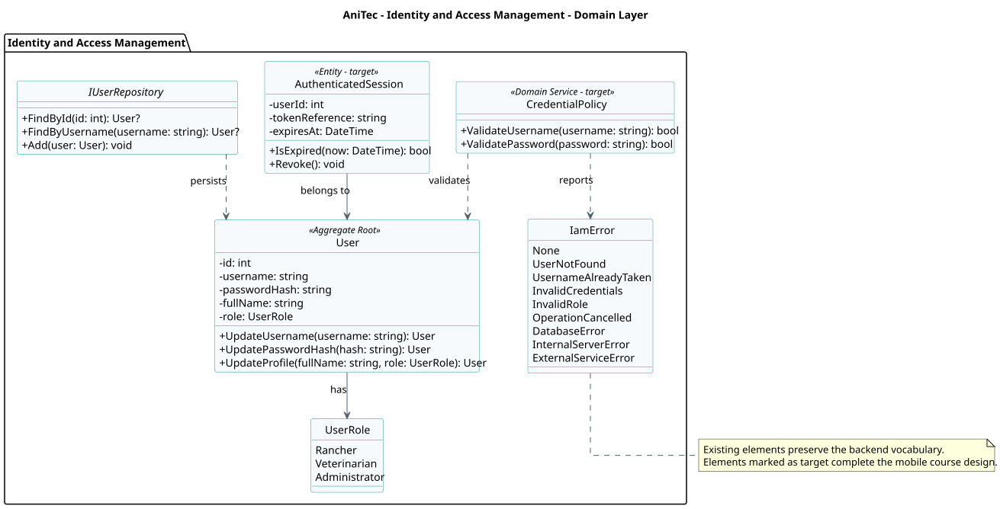
  
<i>Figura 2.6.1.4. Domain Layer Class Diagram de Identity and Access Management. Fuente: elaboración propia con PlantUML.</i>

### 2.6.1.6.2. Bounded Context Database Design Diagram

MySQL mantiene la persistencia autoritativa. Room y SQLite contienen únicamente caché, metadatos de sincronización y operaciones pendientes; no sustituyen las reglas ni la fuente de verdad del backend. En IAM, las credenciales y tokens permanecen fuera de las tablas locales y se almacenan mediante mecanismos seguros del sistema operativo.

  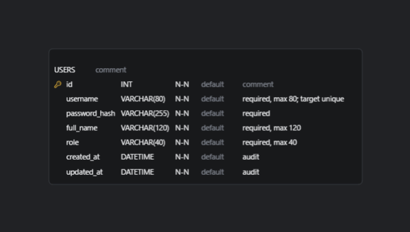
  
<i>Figura 2.6.1.5. MySQL Database Design de Identity and Access Management. Fuente: elaboración propia a partir del esquema SQL.</i>

  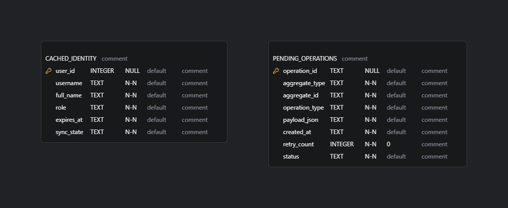
  
<i>Figura 2.6.1.6. Android Room Database Design de Identity and Access Management. Fuente: elaboración propia a partir del esquema SQL.</i>

# 2.6.2. Bounded Context: Profile Management

Mantener la información personal y de contacto asociada con una identidad sin mezclarla con credenciales o reglas de autenticación.

La base implementada se encuentra en el módulo Profiles de la API ASP.NET Core. El diseño móvil de Android y Flutter se documenta como **no implementado** porque esos clientes todavía no existen en el workspace. Los tres productos comparten contratos REST y lenguaje ubicuo, mientras la API conserva las reglas autoritativas.

## 2.6.2.1. Domain Layer

Esta capa documenta el modelo que representa el núcleo de **Profile Management**. Las reglas autoritativas se ejecutan en la API; Android y Flutter mantienen modelos equivalentes para presentación, validación inmediata y trabajo offline. La columna de estado distingue el código heredado de la arquitectura objetivo.

### Aggregate Root: Profile

| Campo | Detalle |
|---|---|
| **Producto y estado** | Backend; modelo equivalente en Android y Flutter — **Implementado** |
| **Propósito** | Mantener la información personal y de contacto de un propietario. |
| **Relaciones** | Profile compone PersonName; Profile compone EmailAddress; Profile compone StreetAddress; IProfileRepository depende de Profile : persists |

**Atributos o dependencias**

| Nombre | Tipo |
|---|---|
| id | int |
| ownerId | int |
| name | PersonName |
| email | EmailAddress |
| address | StreetAddress |

**Métodos u operaciones**

| Firma | Retorno |
|---|---|
| FullName() | string |
| ChangeEmail(email: EmailAddress) | void |
| ChangeAddress(address: StreetAddress) | void |

### Value Object: PersonName

| Campo | Detalle |
|---|---|
| **Producto y estado** | Backend; modelo equivalente en Android y Flutter — **Implementado** |
| **Propósito** | Representar un nombre personal válido. |
| **Relaciones** | Profile compone PersonName |

**Atributos o dependencias**

| Nombre | Tipo |
|---|---|
| firstName | string |
| lastName | string |

**Métodos u operaciones**

| Firma | Retorno |
|---|---|
| FullName() | string |

### Value Object: EmailAddress

| Campo | Detalle |
|---|---|
| **Producto y estado** | Backend; modelo equivalente en Android y Flutter — **Implementado** |
| **Propósito** | Representar y validar un correo electrónico. |
| **Relaciones** | Profile compone EmailAddress |

**Atributos o dependencias**

| Nombre | Tipo |
|---|---|
| address | string |

**Métodos u operaciones**

| Firma | Retorno |
|---|---|
| IsValid() | bool |

### Value Object: StreetAddress

| Campo | Detalle |
|---|---|
| **Producto y estado** | Backend; modelo equivalente en Android y Flutter — **Implementado** |
| **Propósito** | Representar una dirección postal completa. |
| **Relaciones** | Profile compone StreetAddress |

**Atributos o dependencias**

| Nombre | Tipo |
|---|---|
| street | string |
| number | string |
| city | string |
| postalCode | string |
| country | string |

**Métodos u operaciones**

| Firma | Retorno |
|---|---|
| FullAddress() | string |

### Repository Interface: IProfileRepository

| Campo | Detalle |
|---|---|
| **Producto y estado** | Backend; modelo equivalente en Android y Flutter — **Implementado** |
| **Propósito** | Abstraer la persistencia de Profile. |
| **Relaciones** | IProfileRepository depende de Profile : persists |

**Atributos o dependencias**

No aplica.

**Métodos u operaciones**

| Firma | Retorno |
|---|---|
| FindById(id: int) | Profile? |
| FindByOwnerId(ownerId: int) | Profile? |
| Add(profile: Profile) | void |
| Update(profile: Profile) | void |

## 2.6.2.2. Interface Layer

Esta capa recibe las acciones relacionadas con **creación, actualización y consulta de perfiles** y las traduce a casos de uso. Los controllers y resources corresponden a la API; las pantallas y controladores de estado representan la presentación objetivo en Android y Flutter. Ninguna de estas clases implementa reglas de negocio.

### REST Controller: ProfilesController

| Campo | Detalle |
|---|---|
| **Producto y estado** | Backend ASP.NET Core — **Implementado** |
| **Propósito** | Publicar por HTTP las capacidades de Profile Management. |
| **Relaciones** | Recibe resources, invoca servicios de aplicación y devuelve resources HTTP. |

**Atributos o dependencias**

| Nombre | Tipo |
|---|---|
| profileCommandService | IProfileCommandService |
| profileQueryService | IProfileQueryService |
| errorLocalizer | IStringLocalizer<ErrorMessages> |
| problemDetailsFactory | ProblemDetailsFactory |

**Métodos u operaciones**

| Firma | Retorno |
|---|---|
| GetProfileById(int profileId, CancellationToken cancellationToken) | No especificado |
| CreateProfile(CreateProfileResource resource, CancellationToken cancellationToken) | No especificado |
| GetAllProfiles(CancellationToken cancellationToken) | No especificado |

### Presentation Model: ProfileViewModel

| Campo | Detalle |
|---|---|
| **Producto y estado** | Android / Kotlin — **No implementado** |
| **Propósito** | Mantener el estado observable y traducir acciones de Android a casos de uso. |
| **Relaciones** | Invoca casos de uso de Application Layer y publica un UI State inmutable. |

**Atributos o dependencias**

| Nombre | Tipo |
|---|---|
| state | No especificado |
| observeUseCase | No especificado |
| syncUseCase | No especificado |

**Métodos u operaciones**

| Firma | Retorno |
|---|---|
| Load() | No especificado |
| Submit(action) | No especificado |
| RetrySync() | No especificado |

### State Controller: ProfileController

| Campo | Detalle |
|---|---|
| **Producto y estado** | Flutter / Dart — **No implementado** |
| **Propósito** | Mantener el estado de presentación de Flutter y coordinar casos de uso. |
| **Relaciones** | Invoca Application Layer y publica estados de carga, éxito y error. |

**Atributos o dependencias**

| Nombre | Tipo |
|---|---|
| state | No especificado |
| observeUseCase | No especificado |
| syncUseCase | No especificado |

**Métodos u operaciones**

| Firma | Retorno |
|---|---|
| load() | No especificado |
| submit(action) | No especificado |
| retrySync() | No especificado |

## 2.6.2.3. Application Layer

Esta capa coordina las capacidades de **creación, actualización y consulta de perfiles**. Los commands y queries expresan intenciones; los handlers cargan aggregates, aplican reglas, persisten cambios y reaccionan a eventos. Los casos de uso móviles coordinan lectura local, actualización remota y sincronización idempotente.

### Application Service: ProfileCommandService

| Campo | Detalle |
|---|---|
| **Producto y estado** | Backend ASP.NET Core — **Implementado** |
| **Propósito** | Orquestar creación, actualización y consulta de perfiles sin contener reglas del dominio. |
| **Relaciones** | Invoca agregados y repositories; confirma la transacción mediante Unit of Work. |

**Atributos o dependencias**

| Nombre | Tipo |
|---|---|
| profileRepository | IProfileRepository |
| unitOfWork | IUnitOfWork |
| localizer | IStringLocalizer<ErrorMessages> |

**Métodos u operaciones**

| Firma | Retorno |
|---|---|
| Handle(CreateProfileCommand command, CancellationToken cancellationToken) | No especificado |

### Use Case: ObserveProfileUseCase

| Campo | Detalle |
|---|---|
| **Producto y estado** | Android y Flutter — **No implementado** |
| **Propósito** | Entregar primero datos locales y actualizar la consulta cuando exista conectividad. |
| **Relaciones** | Es invocado por ViewModel/Controller y coordina repositorios móviles. |

**Atributos o dependencias**

| Nombre | Tipo |
|---|---|
| localRepository | No especificado |
| remoteRepository | No especificado |
| connectivityMonitor | No especificado |

**Métodos u operaciones**

| Firma | Retorno |
|---|---|
| Execute(criteria) | Stream<Result> |

### Command Handler: CreateProfileCommandHandler

| Campo | Detalle |
|---|---|
| **Producto y estado** | Backend ASP.NET Core — **No implementado** |
| **Propósito** | Ejecutar una intención concreta, aplicar reglas del agregado y confirmar la transacción. |
| **Relaciones** | Consume un Command, carga el aggregate mediante su repository y puede publicar un Domain Event. |

**Atributos o dependencias**

| Nombre | Tipo |
|---|---|
| repository | No especificado |
| unitOfWork | No especificado |
| domainPolicy | No especificado |

**Métodos u operaciones**

| Firma | Retorno |
|---|---|
| Handle(command) | Result |

### Event Handler: ProfileUpdatedEventHandler

| Campo | Detalle |
|---|---|
| **Producto y estado** | Backend ASP.NET Core — **No implementado** |
| **Propósito** | Reaccionar al evento confirmado y actualizar proyecciones o integraciones. |
| **Relaciones** | Consume un Domain Event y utiliza puertos de infraestructura sin modificar directamente el agregado. |

**Atributos o dependencias**

| Nombre | Tipo |
|---|---|
| projectionRepository | No especificado |
| notificationPort | No especificado |
| unitOfWork | No especificado |

**Métodos u operaciones**

| Firma | Retorno |
|---|---|
| Handle(domainEvent) | Task |

## 2.6.2.4. Infrastructure Layer

Esta capa implementa los puertos definidos hacia el interior de **Profile Management** y concentra acceso a base de datos, red, almacenamiento local e integraciones externas. Las clases de infraestructura traducen errores y contratos técnicos antes de devolver resultados a Application Layer.

### Repository Adapter: ProfileRepository

| Campo | Detalle |
|---|---|
| **Producto y estado** | Backend / Entity Framework Core — **Implementado** |
| **Propósito** | Implementar el puerto de persistencia definido por Domain Layer. |
| **Relaciones** | Implementa IProfileRepository; utiliza AppDbContext/MySQL y reconstruye el aggregate. |

**Atributos o dependencias**

| Nombre | Tipo |
|---|---|
| context | AppDbContext |

**Métodos u operaciones**

| Firma | Retorno |
|---|---|
| FindProfileByEmailAsync(EmailAddress email, CancellationToken cancellationToken) | No especificado |

### Room Adapter: ProfileDao

| Campo | Detalle |
|---|---|
| **Producto y estado** | Android / Room — **No implementado** |
| **Propósito** | Implementar persistencia local y observación reactiva en Android. |
| **Relaciones** | Implementa el puerto local mediante Room y participa en la estrategia de caché/outbox. |

**Atributos o dependencias**

| Nombre | Tipo |
|---|---|
| roomDatabase | No especificado |
| entityMapper | No especificado |

**Métodos u operaciones**

| Firma | Retorno |
|---|---|
| Observe(criteria) | No especificado |
| Upsert(entity) | No especificado |
| Delete(id) | No especificado |
| Pending() | No especificado |

### SQLite Adapter: ProfileLocalDataSource

| Campo | Detalle |
|---|---|
| **Producto y estado** | Flutter / Dart — **No implementado** |
| **Propósito** | Implementar persistencia local equivalente en Flutter. |
| **Relaciones** | Implementa el puerto local mediante SQLite y participa en la estrategia de caché/outbox. |

**Atributos o dependencias**

| Nombre | Tipo |
|---|---|
| sqliteDatabase | No especificado |
| entityMapper | No especificado |

**Métodos u operaciones**

| Firma | Retorno |
|---|---|
| watch(criteria) | No especificado |
| upsert(entity) | No especificado |
| delete(id) | No especificado |
| pending() | No especificado |

### Context Adapter: IamProfileOwnerAdapter

| Campo | Detalle |
|---|---|
| **Producto y estado** | Backend ASP.NET Core — **No implementado** |
| **Propósito** | Aislar una dependencia externa detrás de un puerto explícito. |
| **Relaciones** | Implementa el puerto de verificación del propietario y consume IAM Context Facade. |

**Atributos o dependencias**

| Nombre | Tipo |
|---|---|
| iamFacade | No especificado |

**Métodos u operaciones**

| Firma | Retorno |
|---|---|
| Exists(ownerId) | bool |

## 2.6.2.5. Bounded Context Software Architecture Component Level Diagrams

El archivo [component-level.dsl](<markdown/assets/codefordiagrams/2-6-2-Bounded-Context-Profile-Management/component-level.dsl>) contiene las vistas BC2-ApiComponents, BC2-AndroidComponents y BC2-FlutterComponents. Las tres parten del mismo modelo C4 y muestran la separación entre presentación, aplicación, dominio y adaptadores.

  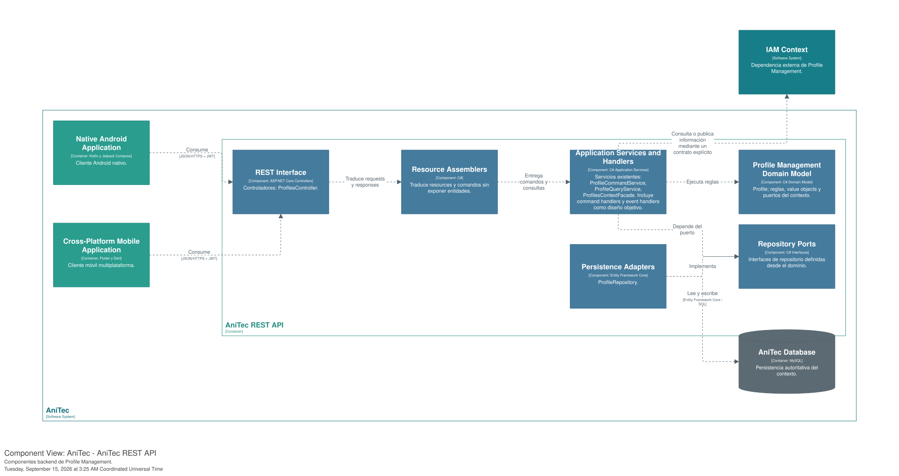
  
<i>Figura 2.6.2.1. Componentes de la API para Profile Management. Fuente: elaboración propia con Structurizr DSL.</i>

  
  
<i>Figura 2.6.2.2. Componentes Android para Profile Management. Fuente: elaboración propia con Structurizr DSL.</i>

  
  
<i>Figura 2.6.2.3. Componentes Flutter para Profile Management. Fuente: elaboración propia con Structurizr DSL.</i>

## 2.6.2.6. Bounded Context Software Architecture Code Level Diagrams

Los diagramas de código detallan el modelo del dominio y los objetos de persistencia. El UML diferencia los elementos existentes de las incorporaciones objetivo, mientras los esquemas SQL señalan mediante comentarios las columnas propuestas. Los archivos ERD quedan disponibles para completar la importación manual.

### 2.6.2.6.1. Bounded Context Domain Layer Class Diagrams

El Class Diagram incluye agregados, entidades, value objects, enumeraciones, servicios de dominio e interfaces de repositorio con atributos, operaciones, visibilidad y multiplicidades.

  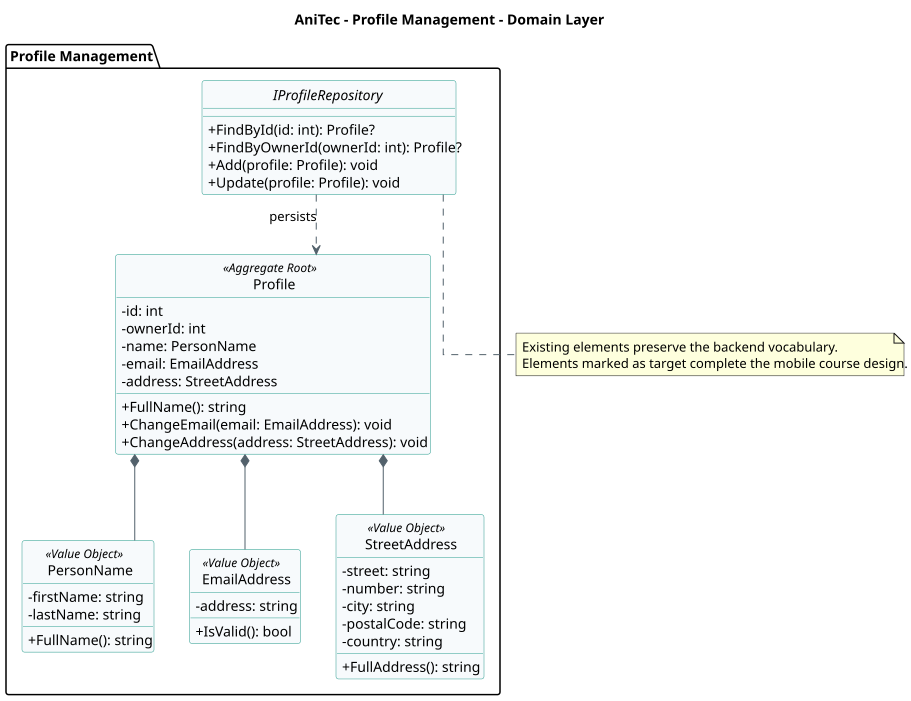
  
<i>Figura 2.6.2.4. Domain Layer Class Diagram de Profile Management. Fuente: elaboración propia con PlantUML.</i>

### 2.6.2.6.2. Bounded Context Database Design Diagram

MySQL mantiene la persistencia autoritativa. Room y SQLite contienen únicamente caché, metadatos de sincronización y operaciones pendientes; no sustituyen las reglas ni la fuente de verdad del backend. En IAM, las credenciales y tokens permanecen fuera de las tablas locales y se almacenan mediante mecanismos seguros del sistema operativo.

  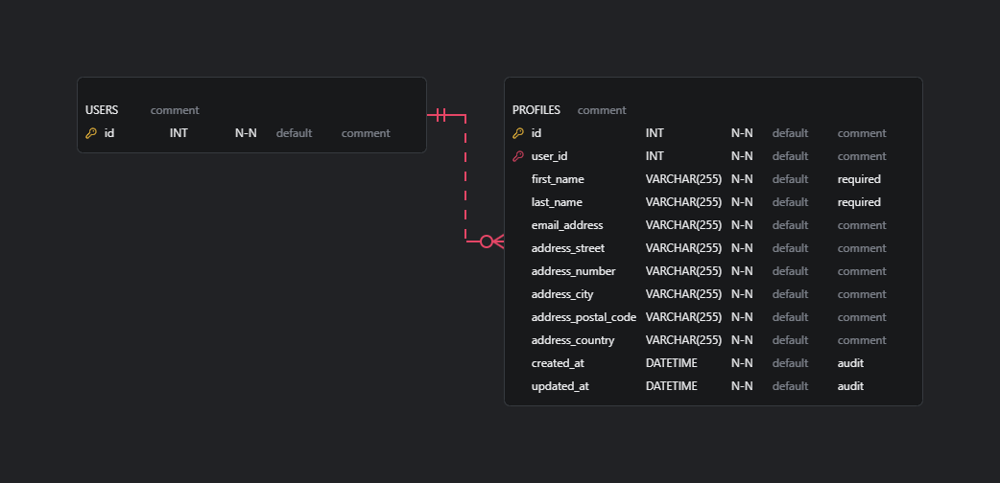
  
<i>Figura 2.6.2.5. MySQL Database Design de Profile Management. Fuente: elaboración propia a partir del esquema SQL.</i>

  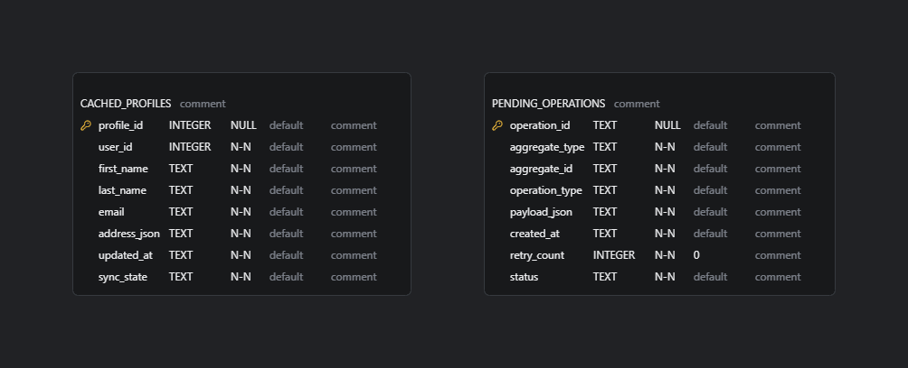
  
<i>Figura 2.6.2.6. Android Room Database Design de Profile Management. Fuente: elaboración propia a partir del esquema SQL.</i>

# 2.6.3. Bounded Context: Livestock Management

Gestionar fincas, hatos, animales e identificadores QR como fuente de referencia para los demás procesos ganaderos.

La base implementada se encuentra en el módulo Livestock de la API ASP.NET Core. El diseño móvil de Android y Flutter se documenta como **no implementado** porque esos clientes todavía no existen en el workspace. Los tres productos comparten contratos REST y lenguaje ubicuo, mientras la API conserva las reglas autoritativas.

## 2.6.3.1. Domain Layer

Esta capa documenta el modelo que representa el núcleo de **Livestock Management**. Las reglas autoritativas se ejecutan en la API; Android y Flutter mantienen modelos equivalentes para presentación, validación inmediata y trabajo offline. La columna de estado distingue el código heredado de la arquitectura objetivo.

### Aggregate Root: Farm

| Campo | Detalle |
|---|---|
| **Producto y estado** | Backend, Android y Flutter (modelo canónico) — **No implementado** |
| **Propósito** | Agrupar los hatos de un propietario. |
| **Relaciones** | Farm compone Herd |

**Atributos o dependencias**

| Nombre | Tipo |
|---|---|
| id | int |
| ownerId | int |
| name | string |
| location | string |

**Métodos u operaciones**

| Firma | Retorno |
|---|---|
| RegisterHerd(herd: Herd) | void |
| BelongsTo(ownerId: int) | bool |

### Entity: Herd

| Campo | Detalle |
|---|---|
| **Producto y estado** | Backend; modelo equivalente en Android y Flutter — **Implementado** |
| **Propósito** | Administrar un conjunto de animales dentro de una finca. |
| **Relaciones** | Farm compone Herd; Herd compone Animal; IHerdRepository depende de Herd |

**Atributos o dependencias**

| Nombre | Tipo |
|---|---|
| id | int |
| farmId | int |
| name | string |
| mainType | string |
| veterinarianId | int? |

**Métodos u operaciones**

| Firma | Retorno |
|---|---|
| AssignVeterinarian(id: int) | void |
| AddAnimal(animal: Animal) | void |

### Entity: Animal

| Campo | Detalle |
|---|---|
| **Producto y estado** | Backend; modelo equivalente en Android y Flutter — **Implementado** |
| **Propósito** | Mantener identificación y estado productivo de un animal. |
| **Relaciones** | Herd compone Animal; Animal compone AnimalTag; Animal compone QrIdentifier; Animal se relaciona con AnimalStatus; IAnimalRepository depende de Animal |

**Atributos o dependencias**

| Nombre | Tipo |
|---|---|
| id | int |
| herdId | int |
| tag | AnimalTag |
| qrIdentifier | QrIdentifier |
| name | string |
| species | string |
| breed | string |
| status | AnimalStatus |

**Métodos u operaciones**

| Firma | Retorno |
|---|---|
| UpdateWeight(weight: decimal) | void |
| ChangeStatus(status: AnimalStatus) | void |

### Value Object: QrIdentifier

| Campo | Detalle |
|---|---|
| **Producto y estado** | Backend, Android y Flutter (modelo canónico) — **No implementado** |
| **Propósito** | Representar la carga QR que identifica un animal. |
| **Relaciones** | Animal compone QrIdentifier |

**Atributos o dependencias**

| Nombre | Tipo |
|---|---|
| value | string |

**Métodos u operaciones**

| Firma | Retorno |
|---|---|
| AsPayload() | string |

### Enumeration: AnimalStatus

| Campo | Detalle |
|---|---|
| **Producto y estado** | Backend y modelos equivalentes Android/Flutter — **Implementado** |
| **Propósito** | Definir los valores válidos de AnimalStatus. |
| **Relaciones** | Animal se relaciona con AnimalStatus |

**Atributos o dependencias**

| Nombre | Tipo |
|---|---|
| Active | No especificado |
| Sold | No especificado |
| Deceased | No especificado |

**Métodos u operaciones**

No aplica.

### Repository Interface: IAnimalRepository

| Campo | Detalle |
|---|---|
| **Producto y estado** | Backend; modelo equivalente en Android y Flutter — **Implementado** |
| **Propósito** | Abstraer la persistencia de Animal. |
| **Relaciones** | IAnimalRepository depende de Animal |

**Atributos o dependencias**

No aplica.

**Métodos u operaciones**

| Firma | Retorno |
|---|---|
| FindById(id: int) | Animal? |
| FindByQr(code: string) | Animal? |
| Add(animal: Animal) | void |

## 2.6.3.2. Interface Layer

Esta capa recibe las acciones relacionadas con **gestión de fincas, hatos, animales e identificación QR** y las traduce a casos de uso. Los controllers y resources corresponden a la API; las pantallas y controladores de estado representan la presentación objetivo en Android y Flutter. Ninguna de estas clases implementa reglas de negocio.

### REST Controller: HerdsController

| Campo | Detalle |
|---|---|
| **Producto y estado** | Backend ASP.NET Core — **Implementado** |
| **Propósito** | Publicar por HTTP las capacidades de Livestock Management. |
| **Relaciones** | Recibe resources, invoca servicios de aplicación y devuelve resources HTTP. |

**Atributos o dependencias**

| Nombre | Tipo |
|---|---|
| commandService | IHerdCommandService |
| queryService | IHerdQueryService |

**Métodos u operaciones**

| Firma | Retorno |
|---|---|
| GetAll(CancellationToken cancellationToken) | No especificado |
| GetById(int id, CancellationToken cancellationToken) | No especificado |
| Create(CreateHerdResource resource, CancellationToken cancellationToken) | No especificado |
| Update(int id, CreateHerdResource resource, CancellationToken cancellationToken) | No especificado |
| Delete(int id, CancellationToken cancellationToken) | No especificado |

### REST Controller: AnimalsController

| Campo | Detalle |
|---|---|
| **Producto y estado** | Backend ASP.NET Core — **Implementado** |
| **Propósito** | Publicar por HTTP las capacidades de Livestock Management. |
| **Relaciones** | Recibe resources, invoca servicios de aplicación y devuelve resources HTTP. |

**Atributos o dependencias**

| Nombre | Tipo |
|---|---|
| commandService | IAnimalCommandService |
| queryService | IAnimalQueryService |

**Métodos u operaciones**

| Firma | Retorno |
|---|---|
| GetAll(CancellationToken cancellationToken) | No especificado |
| GetById(int id, CancellationToken cancellationToken) | No especificado |
| Create(CreateAnimalResource resource, CancellationToken cancellationToken) | No especificado |
| Update(int id, CreateAnimalResource resource, CancellationToken cancellationToken) | No especificado |
| Delete(int id, CancellationToken cancellationToken) | No especificado |

### Presentation Model: FarmHerdYAnimalViewModel

| Campo | Detalle |
|---|---|
| **Producto y estado** | Android / Kotlin — **No implementado** |
| **Propósito** | Mantener el estado observable y traducir acciones de Android a casos de uso. |
| **Relaciones** | Invoca casos de uso de Application Layer y publica un UI State inmutable. |

**Atributos o dependencias**

| Nombre | Tipo |
|---|---|
| state | No especificado |
| observeUseCase | No especificado |
| syncUseCase | No especificado |

**Métodos u operaciones**

| Firma | Retorno |
|---|---|
| Load() | No especificado |
| Submit(action) | No especificado |
| RetrySync() | No especificado |

### State Controller: FarmHerdYAnimalController

| Campo | Detalle |
|---|---|
| **Producto y estado** | Flutter / Dart — **No implementado** |
| **Propósito** | Mantener el estado de presentación de Flutter y coordinar casos de uso. |
| **Relaciones** | Invoca Application Layer y publica estados de carga, éxito y error. |

**Atributos o dependencias**

| Nombre | Tipo |
|---|---|
| state | No especificado |
| observeUseCase | No especificado |
| syncUseCase | No especificado |

**Métodos u operaciones**

| Firma | Retorno |
|---|---|
| load() | No especificado |
| submit(action) | No especificado |
| retrySync() | No especificado |

## 2.6.3.3. Application Layer

Esta capa coordina las capacidades de **gestión de fincas, hatos, animales e identificación QR**. Los commands y queries expresan intenciones; los handlers cargan aggregates, aplican reglas, persisten cambios y reaccionan a eventos. Los casos de uso móviles coordinan lectura local, actualización remota y sincronización idempotente.

### Application Service: AnimalCommandService

| Campo | Detalle |
|---|---|
| **Producto y estado** | Backend ASP.NET Core — **Implementado** |
| **Propósito** | Orquestar gestión de fincas, hatos, animales e identificación QR sin contener reglas del dominio. |
| **Relaciones** | Invoca agregados y repositories; confirma la transacción mediante Unit of Work. |

**Atributos o dependencias**

| Nombre | Tipo |
|---|---|
| repository | IAnimalRepository |
| unitOfWork | IUnitOfWork |

**Métodos u operaciones**

| Firma | Retorno |
|---|---|
| Handle(CreateAnimalCommand command, CancellationToken cancellationToken) | No especificado |
| Handle(UpdateAnimalCommand command, CancellationToken cancellationToken) | No especificado |
| Handle(DeleteAnimalCommand command, CancellationToken cancellationToken) | No especificado |

### Use Case: ObserveFarmHerdYAnimalUseCase

| Campo | Detalle |
|---|---|
| **Producto y estado** | Android y Flutter — **No implementado** |
| **Propósito** | Entregar primero datos locales y actualizar la consulta cuando exista conectividad. |
| **Relaciones** | Es invocado por ViewModel/Controller y coordina repositorios móviles. |

**Atributos o dependencias**

| Nombre | Tipo |
|---|---|
| localRepository | No especificado |
| remoteRepository | No especificado |
| connectivityMonitor | No especificado |

**Métodos u operaciones**

| Firma | Retorno |
|---|---|
| Execute(criteria) | Stream<Result> |

### Command Handler: CreateAnimalCommandHandler

| Campo | Detalle |
|---|---|
| **Producto y estado** | Backend ASP.NET Core — **No implementado** |
| **Propósito** | Ejecutar una intención concreta, aplicar reglas del agregado y confirmar la transacción. |
| **Relaciones** | Consume un Command, carga el aggregate mediante su repository y puede publicar un Domain Event. |

**Atributos o dependencias**

| Nombre | Tipo |
|---|---|
| repository | No especificado |
| unitOfWork | No especificado |
| domainPolicy | No especificado |

**Métodos u operaciones**

| Firma | Retorno |
|---|---|
| Handle(command) | Result |

### Event Handler: AnimalRegisteredEventHandler

| Campo | Detalle |
|---|---|
| **Producto y estado** | Backend ASP.NET Core — **No implementado** |
| **Propósito** | Reaccionar al evento confirmado y actualizar proyecciones o integraciones. |
| **Relaciones** | Consume un Domain Event y utiliza puertos de infraestructura sin modificar directamente el agregado. |

**Atributos o dependencias**

| Nombre | Tipo |
|---|---|
| projectionRepository | No especificado |
| notificationPort | No especificado |
| unitOfWork | No especificado |

**Métodos u operaciones**

| Firma | Retorno |
|---|---|
| Handle(domainEvent) | Task |

## 2.6.3.4. Infrastructure Layer

Esta capa implementa los puertos definidos hacia el interior de **Livestock Management** y concentra acceso a base de datos, red, almacenamiento local e integraciones externas. Las clases de infraestructura traducen errores y contratos técnicos antes de devolver resultados a Application Layer.

### Repository Adapter: HerdRepository / AnimalRepository

| Campo | Detalle |
|---|---|
| **Producto y estado** | Backend / Entity Framework Core — **Implementado** |
| **Propósito** | Implementar el puerto de persistencia definido por Domain Layer. |
| **Relaciones** | Implementa IHerdRepository / IAnimalRepository; utiliza AppDbContext/MySQL y reconstruye el aggregate. |

**Atributos o dependencias**

| Nombre | Tipo |
|---|---|
| HerdRepository | AppDbContext context |
| AnimalRepository | AppDbContext context |

**Métodos u operaciones**

| Firma | Retorno |
|---|---|
| FindById(id) | No especificado |
| Add(entity) | No especificado |
| Update(entity) | No especificado |
| Delete(entity) | No especificado |

### Room Adapter: FarmHerdYAnimalDao

| Campo | Detalle |
|---|---|
| **Producto y estado** | Android / Room — **No implementado** |
| **Propósito** | Implementar persistencia local y observación reactiva en Android. |
| **Relaciones** | Implementa el puerto local mediante Room y participa en la estrategia de caché/outbox. |

**Atributos o dependencias**

| Nombre | Tipo |
|---|---|
| roomDatabase | No especificado |
| entityMapper | No especificado |

**Métodos u operaciones**

| Firma | Retorno |
|---|---|
| Observe(criteria) | No especificado |
| Upsert(entity) | No especificado |
| Delete(id) | No especificado |
| Pending() | No especificado |

### SQLite Adapter: FarmHerdYAnimalLocalDataSource

| Campo | Detalle |
|---|---|
| **Producto y estado** | Flutter / Dart — **No implementado** |
| **Propósito** | Implementar persistencia local equivalente en Flutter. |
| **Relaciones** | Implementa el puerto local mediante SQLite y participa en la estrategia de caché/outbox. |

**Atributos o dependencias**

| Nombre | Tipo |
|---|---|
| sqliteDatabase | No especificado |
| entityMapper | No especificado |

**Métodos u operaciones**

| Firma | Retorno |
|---|---|
| watch(criteria) | No especificado |
| upsert(entity) | No especificado |
| delete(id) | No especificado |
| pending() | No especificado |

### Device Adapter: MlKitQrScanner

| Campo | Detalle |
|---|---|
| **Producto y estado** | Android / ML Kit — **No implementado** |
| **Propósito** | Aislar una dependencia externa detrás de un puerto explícito. |
| **Relaciones** | Implementa el puerto de lectura QR mediante la cámara y Google ML Kit. |

**Atributos o dependencias**

| Nombre | Tipo |
|---|---|
| scannerClient | No especificado |

**Métodos u operaciones**

| Firma | Retorno |
|---|---|
| Scan(image) | QrIdentifier |

## 2.6.3.5. Bounded Context Software Architecture Component Level Diagrams

El archivo [component-level.dsl](<markdown/assets/codefordiagrams/2-6-3-Bounded-Context-Livestock-Management/component-level.dsl>) contiene las vistas BC3-ApiComponents, BC3-AndroidComponents y BC3-FlutterComponents. Las tres parten del mismo modelo C4 y muestran la separación entre presentación, aplicación, dominio y adaptadores.

  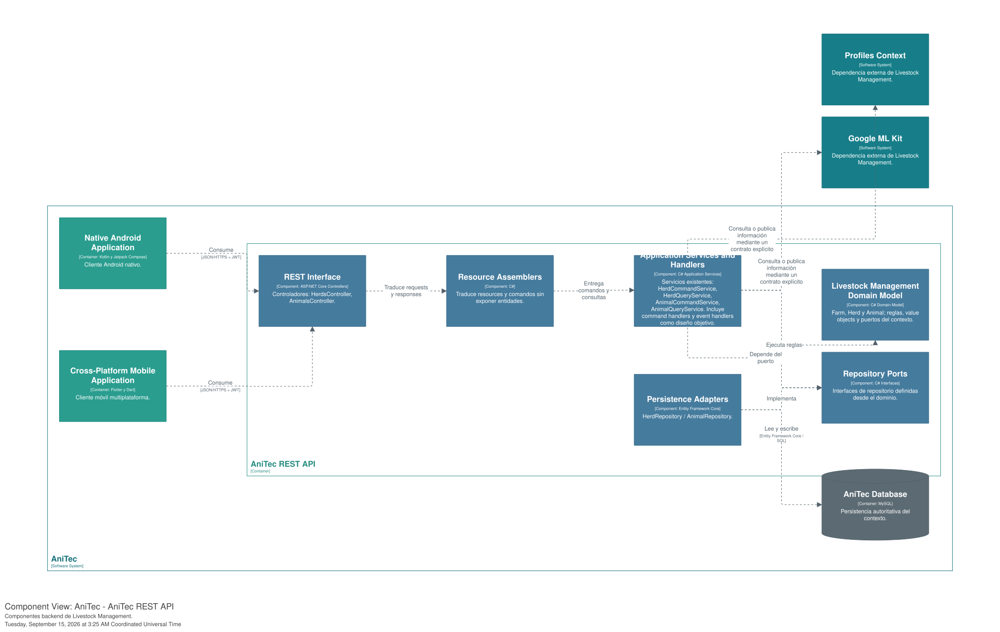
  
<i>Figura 2.6.3.1. Componentes de la API para Livestock Management. Fuente: elaboración propia con Structurizr DSL.</i>

  
  
<i>Figura 2.6.3.2. Componentes Android para Livestock Management. Fuente: elaboración propia con Structurizr DSL.</i>

  
  
<i>Figura 2.6.3.3. Componentes Flutter para Livestock Management. Fuente: elaboración propia con Structurizr DSL.</i>

## 2.6.3.6. Bounded Context Software Architecture Code Level Diagrams

Los diagramas de código detallan el modelo del dominio y los objetos de persistencia. El UML diferencia los elementos existentes de las incorporaciones objetivo, mientras los esquemas SQL señalan mediante comentarios las columnas propuestas. Los archivos ERD quedan disponibles para completar la importación manual.

### 2.6.3.6.1. Bounded Context Domain Layer Class Diagrams

El Class Diagram incluye agregados, entidades, value objects, enumeraciones, servicios de dominio e interfaces de repositorio con atributos, operaciones, visibilidad y multiplicidades.

  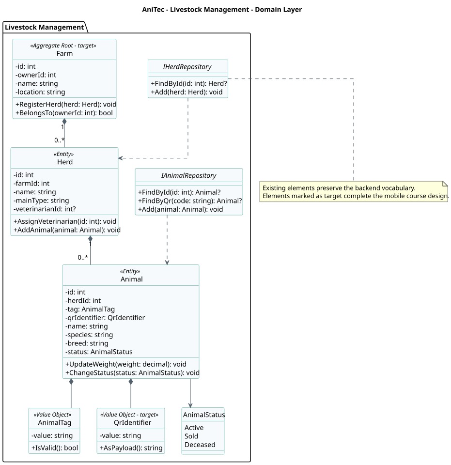
  
<i>Figura 2.6.3.4. Domain Layer Class Diagram de Livestock Management. Fuente: elaboración propia con PlantUML.</i>

### 2.6.3.6.2. Bounded Context Database Design Diagram

MySQL mantiene la persistencia autoritativa. Room y SQLite contienen únicamente caché, metadatos de sincronización y operaciones pendientes; no sustituyen las reglas ni la fuente de verdad del backend. En IAM, las credenciales y tokens permanecen fuera de las tablas locales y se almacenan mediante mecanismos seguros del sistema operativo.

  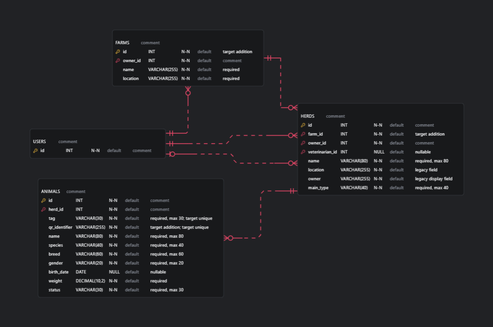
  
<i>Figura 2.6.3.5. MySQL Database Design de Livestock Management. Fuente: elaboración propia a partir del esquema SQL.</i>

  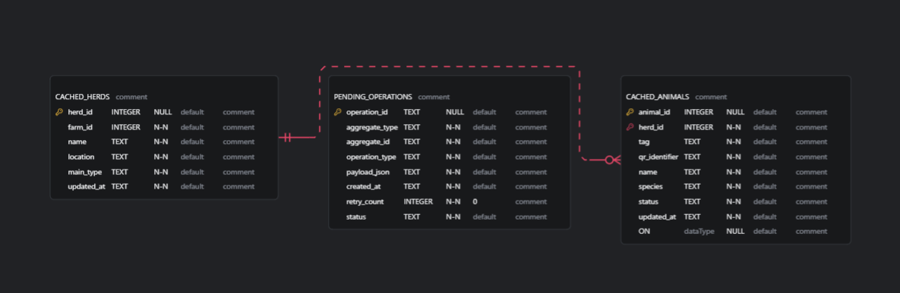
  
<i>Figura 2.6.3.6. Android Room Database Design de Livestock Management. Fuente: elaboración propia a partir del esquema SQL.</i>

# 2.6.4. Bounded Context: Sanitary Management

Conservar la historia sanitaria del animal y controlar el registro de diagnósticos, tratamientos, prescripciones y seguimientos autorizados.

La base implementada se encuentra en el módulo Sanitary de la API ASP.NET Core. El diseño móvil de Android y Flutter se documenta como **no implementado** porque esos clientes todavía no existen en el workspace. Los tres productos comparten contratos REST y lenguaje ubicuo, mientras la API conserva las reglas autoritativas.

## 2.6.4.1. Domain Layer

Esta capa documenta el modelo que representa el núcleo de **Sanitary Management**. Las reglas autoritativas se ejecutan en la API; Android y Flutter mantienen modelos equivalentes para presentación, validación inmediata y trabajo offline. La columna de estado distingue el código heredado de la arquitectura objetivo.

### Aggregate Root: HealthEvent

| Campo | Detalle |
|---|---|
| **Producto y estado** | Backend; modelo equivalente en Android y Flutter — **Implementado** |
| **Propósito** | Mantener un acontecimiento clínico dentro de la historia sanitaria. |
| **Relaciones** | HealthEvent compone Diagnosis; HealthEvent compone Treatment; HealthEvent compone Prescription; HealthEvent se relaciona con HealthEventType; SanitaryAuthorizationPolicy depende de HealthEvent; IHealthEventRepository depende de HealthEvent |

**Atributos o dependencias**

| Nombre | Tipo |
|---|---|
| id | int |
| animalId | int |
| type | HealthEventType |
| date | Date |
| veterinarianId | int? |
| description | string |
| diagnosis | Diagnosis |
| treatment | Treatment |
| prescription | Prescription |
| nextDueDate | Date? |

**Métodos u operaciones**

| Firma | Retorno |
|---|---|
| RescheduleFollowUp(date: Date) | void |
| UpdateClinicalData(diagnosis: Diagnosis, treatment: Treatment) | void |

### Value Object: Diagnosis

| Campo | Detalle |
|---|---|
| **Producto y estado** | Backend, Android y Flutter (modelo canónico) — **No implementado** |
| **Propósito** | Representar el diagnóstico clínico. |
| **Relaciones** | HealthEvent compone Diagnosis |

**Atributos o dependencias**

| Nombre | Tipo |
|---|---|
| description | string |

**Métodos u operaciones**

| Firma | Retorno |
|---|---|
| IsEmpty() | bool |

### Value Object: Treatment

| Campo | Detalle |
|---|---|
| **Producto y estado** | Backend, Android y Flutter (modelo canónico) — **No implementado** |
| **Propósito** | Representar instrucciones de tratamiento. |
| **Relaciones** | HealthEvent compone Treatment |

**Atributos o dependencias**

| Nombre | Tipo |
|---|---|
| instructions | string |

**Métodos u operaciones**

| Firma | Retorno |
|---|---|
| IsValid() | bool |

### Value Object: Prescription

| Campo | Detalle |
|---|---|
| **Producto y estado** | Backend, Android y Flutter (modelo canónico) — **No implementado** |
| **Propósito** | Representar la prescripción asociada a un evento sanitario. |
| **Relaciones** | HealthEvent compone Prescription |

**Atributos o dependencias**

| Nombre | Tipo |
|---|---|
| details | string |

**Métodos u operaciones**

| Firma | Retorno |
|---|---|
| IsRequired() | bool |

### Domain Service: SanitaryAuthorizationPolicy

| Campo | Detalle |
|---|---|
| **Producto y estado** | Backend, Android y Flutter (modelo canónico) — **No implementado** |
| **Propósito** | Decidir si un actor puede registrar información sanitaria. |
| **Relaciones** | SanitaryAuthorizationPolicy depende de HealthEvent |

**Atributos o dependencias**

No aplica.

**Métodos u operaciones**

| Firma | Retorno |
|---|---|
| CanRegister(actorId: int, animalId: int) | bool |

### Repository Interface: IHealthEventRepository

| Campo | Detalle |
|---|---|
| **Producto y estado** | Backend; modelo equivalente en Android y Flutter — **Implementado** |
| **Propósito** | Abstraer la persistencia de HealthEvent. |
| **Relaciones** | IHealthEventRepository depende de HealthEvent |

**Atributos o dependencias**

No aplica.

**Métodos u operaciones**

| Firma | Retorno |
|---|---|
| FindById(id: int) | HealthEvent? |
| FindByAnimal(animalId: int) | List~HealthEvent~ |
| Add(event: HealthEvent) | void |
| Update(event: HealthEvent) | void |

## 2.6.4.2. Interface Layer

Esta capa recibe las acciones relacionadas con **registro y seguimiento de eventos sanitarios, diagnósticos y tratamientos** y las traduce a casos de uso. Los controllers y resources corresponden a la API; las pantallas y controladores de estado representan la presentación objetivo en Android y Flutter. Ninguna de estas clases implementa reglas de negocio.

### REST Controller: HealthEventsController

| Campo | Detalle |
|---|---|
| **Producto y estado** | Backend ASP.NET Core — **Implementado** |
| **Propósito** | Publicar por HTTP las capacidades de Sanitary Management. |
| **Relaciones** | Recibe resources, invoca servicios de aplicación y devuelve resources HTTP. |

**Atributos o dependencias**

| Nombre | Tipo |
|---|---|
| commandService | IHealthEventCommandService |
| queryService | IHealthEventQueryService |

**Métodos u operaciones**

| Firma | Retorno |
|---|---|
| GetAll(CancellationToken cancellationToken) | No especificado |
| GetById(int id, CancellationToken cancellationToken) | No especificado |
| Create(CreateHealthEventResource resource, CancellationToken cancellationToken) | No especificado |
| Update(int id, CreateHealthEventResource resource, CancellationToken cancellationToken) | No especificado |
| Delete(int id, CancellationToken cancellationToken) | No especificado |

### Presentation Model: HealthEventViewModel

| Campo | Detalle |
|---|---|
| **Producto y estado** | Android / Kotlin — **No implementado** |
| **Propósito** | Mantener el estado observable y traducir acciones de Android a casos de uso. |
| **Relaciones** | Invoca casos de uso de Application Layer y publica un UI State inmutable. |

**Atributos o dependencias**

| Nombre | Tipo |
|---|---|
| state | No especificado |
| observeUseCase | No especificado |
| syncUseCase | No especificado |

**Métodos u operaciones**

| Firma | Retorno |
|---|---|
| Load() | No especificado |
| Submit(action) | No especificado |
| RetrySync() | No especificado |

### State Controller: HealthEventController

| Campo | Detalle |
|---|---|
| **Producto y estado** | Flutter / Dart — **No implementado** |
| **Propósito** | Mantener el estado de presentación de Flutter y coordinar casos de uso. |
| **Relaciones** | Invoca Application Layer y publica estados de carga, éxito y error. |

**Atributos o dependencias**

| Nombre | Tipo |
|---|---|
| state | No especificado |
| observeUseCase | No especificado |
| syncUseCase | No especificado |

**Métodos u operaciones**

| Firma | Retorno |
|---|---|
| load() | No especificado |
| submit(action) | No especificado |
| retrySync() | No especificado |

## 2.6.4.3. Application Layer

Esta capa coordina las capacidades de **registro y seguimiento de eventos sanitarios, diagnósticos y tratamientos**. Los commands y queries expresan intenciones; los handlers cargan aggregates, aplican reglas, persisten cambios y reaccionan a eventos. Los casos de uso móviles coordinan lectura local, actualización remota y sincronización idempotente.

### Application Service: HealthEventCommandService

| Campo | Detalle |
|---|---|
| **Producto y estado** | Backend ASP.NET Core — **Implementado** |
| **Propósito** | Orquestar registro y seguimiento de eventos sanitarios, diagnósticos y tratamientos sin contener reglas del dominio. |
| **Relaciones** | Invoca agregados y repositories; confirma la transacción mediante Unit of Work. |

**Atributos o dependencias**

| Nombre | Tipo |
|---|---|
| repository | IHealthEventRepository |
| unitOfWork | IUnitOfWork |

**Métodos u operaciones**

| Firma | Retorno |
|---|---|
| Handle(CreateHealthEventCommand command, CancellationToken cancellationToken) | No especificado |
| Handle(UpdateHealthEventCommand command, CancellationToken cancellationToken) | No especificado |
| Handle(DeleteHealthEventCommand command, CancellationToken cancellationToken) | No especificado |

### Use Case: ObserveHealthEventUseCase

| Campo | Detalle |
|---|---|
| **Producto y estado** | Android y Flutter — **No implementado** |
| **Propósito** | Entregar primero datos locales y actualizar la consulta cuando exista conectividad. |
| **Relaciones** | Es invocado por ViewModel/Controller y coordina repositorios móviles. |

**Atributos o dependencias**

| Nombre | Tipo |
|---|---|
| localRepository | No especificado |
| remoteRepository | No especificado |
| connectivityMonitor | No especificado |

**Métodos u operaciones**

| Firma | Retorno |
|---|---|
| Execute(criteria) | Stream<Result> |

### Command Handler: CreateHealthEventCommandHandler

| Campo | Detalle |
|---|---|
| **Producto y estado** | Backend ASP.NET Core — **No implementado** |
| **Propósito** | Ejecutar una intención concreta, aplicar reglas del agregado y confirmar la transacción. |
| **Relaciones** | Consume un Command, carga el aggregate mediante su repository y puede publicar un Domain Event. |

**Atributos o dependencias**

| Nombre | Tipo |
|---|---|
| repository | No especificado |
| unitOfWork | No especificado |
| domainPolicy | No especificado |

**Métodos u operaciones**

| Firma | Retorno |
|---|---|
| Handle(command) | Result |

### Event Handler: HealthEventRegisteredEventHandler

| Campo | Detalle |
|---|---|
| **Producto y estado** | Backend ASP.NET Core — **No implementado** |
| **Propósito** | Reaccionar al evento confirmado y actualizar proyecciones o integraciones. |
| **Relaciones** | Consume un Domain Event y utiliza puertos de infraestructura sin modificar directamente el agregado. |

**Atributos o dependencias**

| Nombre | Tipo |
|---|---|
| projectionRepository | No especificado |
| notificationPort | No especificado |
| unitOfWork | No especificado |

**Métodos u operaciones**

| Firma | Retorno |
|---|---|
| Handle(domainEvent) | Task |

## 2.6.4.4. Infrastructure Layer

Esta capa implementa los puertos definidos hacia el interior de **Sanitary Management** y concentra acceso a base de datos, red, almacenamiento local e integraciones externas. Las clases de infraestructura traducen errores y contratos técnicos antes de devolver resultados a Application Layer.

### Repository Adapter: HealthEventRepository

| Campo | Detalle |
|---|---|
| **Producto y estado** | Backend / Entity Framework Core — **Implementado** |
| **Propósito** | Implementar el puerto de persistencia definido por Domain Layer. |
| **Relaciones** | Implementa IHealthEventRepository; utiliza AppDbContext/MySQL y reconstruye el aggregate. |

**Atributos o dependencias**

| Nombre | Tipo |
|---|---|
| context | AppDbContext |

**Métodos u operaciones**

| Firma | Retorno |
|---|---|
| FindById(id) | No especificado |
| Add(entity) | No especificado |
| Update(entity) | No especificado |
| Delete(entity) | No especificado |

### Room Adapter: HealthEventDao

| Campo | Detalle |
|---|---|
| **Producto y estado** | Android / Room — **No implementado** |
| **Propósito** | Implementar persistencia local y observación reactiva en Android. |
| **Relaciones** | Implementa el puerto local mediante Room y participa en la estrategia de caché/outbox. |

**Atributos o dependencias**

| Nombre | Tipo |
|---|---|
| roomDatabase | No especificado |
| entityMapper | No especificado |

**Métodos u operaciones**

| Firma | Retorno |
|---|---|
| Observe(criteria) | No especificado |
| Upsert(entity) | No especificado |
| Delete(id) | No especificado |
| Pending() | No especificado |

### SQLite Adapter: HealthEventLocalDataSource

| Campo | Detalle |
|---|---|
| **Producto y estado** | Flutter / Dart — **No implementado** |
| **Propósito** | Implementar persistencia local equivalente en Flutter. |
| **Relaciones** | Implementa el puerto local mediante SQLite y participa en la estrategia de caché/outbox. |

**Atributos o dependencias**

| Nombre | Tipo |
|---|---|
| sqliteDatabase | No especificado |
| entityMapper | No especificado |

**Métodos u operaciones**

| Firma | Retorno |
|---|---|
| watch(criteria) | No especificado |
| upsert(entity) | No especificado |
| delete(id) | No especificado |
| pending() | No especificado |

### Offline Adapter: SanitaryOutboxStore

| Campo | Detalle |
|---|---|
| **Producto y estado** | Android y Flutter — **No implementado** |
| **Propósito** | Aislar una dependencia externa detrás de un puerto explícito. |
| **Relaciones** | Implementa el puerto de sincronización sanitaria sobre Room o SQLite. |

**Atributos o dependencias**

| Nombre | Tipo |
|---|---|
| serializer | database, |

**Métodos u operaciones**

| Firma | Retorno |
|---|---|
| Enqueue(event) | No especificado |
| Pending() | No especificado |
| MarkSynced(id) | No especificado |

## 2.6.4.5. Bounded Context Software Architecture Component Level Diagrams

El archivo [component-level.dsl](<markdown/assets/codefordiagrams/2-6-4-Bounded-Context-Sanitary-Management/component-level.dsl>) contiene las vistas BC4-ApiComponents, BC4-AndroidComponents y BC4-FlutterComponents. Las tres parten del mismo modelo C4 y muestran la separación entre presentación, aplicación, dominio y adaptadores.

  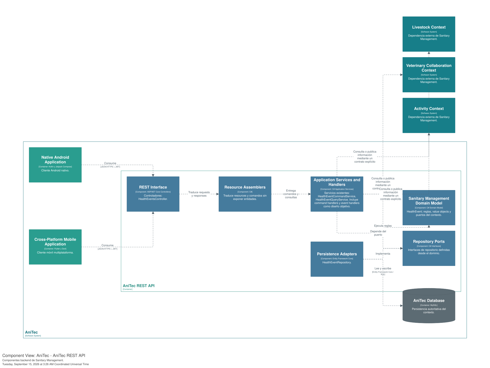
  
<i>Figura 2.6.4.1. Componentes de la API para Sanitary Management. Fuente: elaboración propia con Structurizr DSL.</i>

  
  
<i>Figura 2.6.4.2. Componentes Android para Sanitary Management. Fuente: elaboración propia con Structurizr DSL.</i>

  
  
<i>Figura 2.6.4.3. Componentes Flutter para Sanitary Management. Fuente: elaboración propia con Structurizr DSL.</i>

## 2.6.4.6. Bounded Context Software Architecture Code Level Diagrams

Los diagramas de código detallan el modelo del dominio y los objetos de persistencia. El UML diferencia los elementos existentes de las incorporaciones objetivo, mientras los esquemas SQL señalan mediante comentarios las columnas propuestas. Los archivos ERD quedan disponibles para completar la importación manual.

### 2.6.4.6.1. Bounded Context Domain Layer Class Diagrams

El Class Diagram incluye agregados, entidades, value objects, enumeraciones, servicios de dominio e interfaces de repositorio con atributos, operaciones, visibilidad y multiplicidades.

  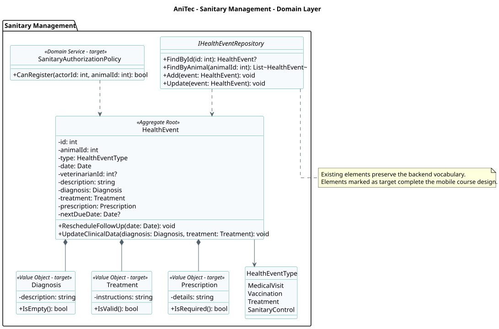
  
<i>Figura 2.6.4.4. Domain Layer Class Diagram de Sanitary Management. Fuente: elaboración propia con PlantUML.</i>

### 2.6.4.6.2. Bounded Context Database Design Diagram

MySQL mantiene la persistencia autoritativa. Room y SQLite contienen únicamente caché, metadatos de sincronización y operaciones pendientes; no sustituyen las reglas ni la fuente de verdad del backend. En IAM, las credenciales y tokens permanecen fuera de las tablas locales y se almacenan mediante mecanismos seguros del sistema operativo.

  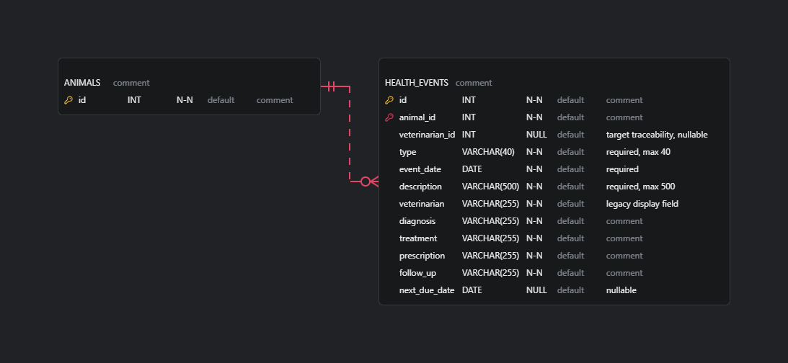
  
<i>Figura 2.6.4.5. MySQL Database Design de Sanitary Management. Fuente: elaboración propia a partir del esquema SQL.</i>

  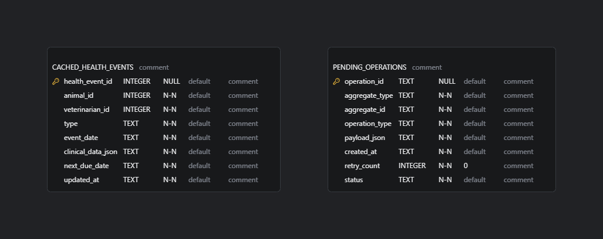
  
<i>Figura 2.6.4.6. Android Room Database Design de Sanitary Management. Fuente: elaboración propia a partir del esquema SQL.</i>

# 2.6.5. Bounded Context: Veterinary Collaboration

Administrar solicitudes y autorizaciones entre ganaderos y veterinarios, delimitando clientes, pacientes y alcance de acceso.

La base implementada se encuentra en el módulo Clients de la API ASP.NET Core. El diseño móvil de Android y Flutter se documenta como **no implementado** porque esos clientes todavía no existen en el workspace. Los tres productos comparten contratos REST y lenguaje ubicuo, mientras la API conserva las reglas autoritativas.

## 2.6.5.1. Domain Layer

Esta capa documenta el modelo que representa el núcleo de **Veterinary Collaboration**. Las reglas autoritativas se ejecutan en la API; Android y Flutter mantienen modelos equivalentes para presentación, validación inmediata y trabajo offline. La columna de estado distingue el código heredado de la arquitectura objetivo.

### Aggregate Root: VeterinarianClient

| Campo | Detalle |
|---|---|
| **Producto y estado** | Backend; modelo equivalente en Android y Flutter — **Implementado** |
| **Propósito** | Controlar la relación y autorización entre veterinario y ganadero. |
| **Relaciones** | VeterinarianClient se relaciona con CollaborationStatus; VeterinarianClient compone AuthorizationScope; CollaborationPolicy depende de VeterinarianClient; IVeterinarianClientRepository depende de VeterinarianClient |

**Atributos o dependencias**

| Nombre | Tipo |
|---|---|
| id | int |
| veterinarianId | int |
| rancherId | int |
| status | CollaborationStatus |
| requestedAt | DateTime |
| acceptedAt | DateTime? |
| revokedAt | DateTime? |
| scope | AuthorizationScope |

**Métodos u operaciones**

| Firma | Retorno |
|---|---|
| Accept(at: DateTime) | void |
| Reject() | void |
| Revoke(at: DateTime) | void |
| IsActive() | bool |

### Enumeration: CollaborationStatus

| Campo | Detalle |
|---|---|
| **Producto y estado** | Backend, Android y Flutter (modelo canónico) — **No implementado** |
| **Propósito** | Definir los valores válidos de CollaborationStatus. |
| **Relaciones** | VeterinarianClient se relaciona con CollaborationStatus |

**Atributos o dependencias**

| Nombre | Tipo |
|---|---|
| Pending | No especificado |
| Accepted | No especificado |
| Rejected | No especificado |
| Revoked | No especificado |

**Métodos u operaciones**

No aplica.

### Value Object: AuthorizationScope

| Campo | Detalle |
|---|---|
| **Producto y estado** | Backend, Android y Flutter (modelo canónico) — **No implementado** |
| **Propósito** | Delimitar fincas, animales y operaciones autorizadas. |
| **Relaciones** | VeterinarianClient compone AuthorizationScope |

**Atributos o dependencias**

| Nombre | Tipo |
|---|---|
| farmIds | Set~int~ |
| animalIds | Set~int~ |
| canWriteHealthRecords | bool |

**Métodos u operaciones**

| Firma | Retorno |
|---|---|
| AllowsAnimal(animalId: int) | bool |

### Domain Service: CollaborationPolicy

| Campo | Detalle |
|---|---|
| **Producto y estado** | Backend y modelos equivalentes Android/Flutter — **No implementado** |
| **Propósito** | Evaluar aceptación y acceso dentro de una colaboración. |
| **Relaciones** | CollaborationPolicy depende de VeterinarianClient |

**Atributos o dependencias**

No aplica.

**Métodos u operaciones**

| Firma | Retorno |
|---|---|
| CanAccept(rancherId: int, relation: VeterinarianClient) | bool |
| CanAccess(veterinarianId: int, animalId: int) | bool |

### Repository Interface: IVeterinarianClientRepository

| Campo | Detalle |
|---|---|
| **Producto y estado** | Backend; modelo equivalente en Android y Flutter — **Implementado** |
| **Propósito** | Abstraer la persistencia de VeterinarianClient. |
| **Relaciones** | IVeterinarianClientRepository depende de VeterinarianClient |

**Atributos o dependencias**

No aplica.

**Métodos u operaciones**

| Firma | Retorno |
|---|---|
| Find(veterinarianId: int, rancherId: int) | VeterinarianClient? |
| FindByVeterinarian(id: int) | List~VeterinarianClient~ |
| Add(relation: VeterinarianClient) | void |
| Update(relation: VeterinarianClient) | void |

## 2.6.5.2. Interface Layer

Esta capa recibe las acciones relacionadas con **solicitud, aceptación, revocación y consulta de colaboraciones veterinarias** y las traduce a casos de uso. Los controllers y resources corresponden a la API; las pantallas y controladores de estado representan la presentación objetivo en Android y Flutter. Ninguna de estas clases implementa reglas de negocio.

### REST Controller: VeterinarianClientsController

| Campo | Detalle |
|---|---|
| **Producto y estado** | Backend ASP.NET Core — **Implementado** |
| **Propósito** | Publicar por HTTP las capacidades de Veterinary Collaboration. |
| **Relaciones** | Recibe resources, invoca servicios de aplicación y devuelve resources HTTP. |

**Atributos o dependencias**

| Nombre | Tipo |
|---|---|
| commandService | IVeterinarianClientCommandService |
| queryService | IVeterinarianClientQueryService |
| userQueryService | IUserQueryService |
| herdQueryService | IHerdQueryService |
| animalQueryService | IAnimalQueryService |

**Métodos u operaciones**

| Firma | Retorno |
|---|---|
| GetClients(int veterinarianId, CancellationToken cancellationToken) | No especificado |
| GetAvailableRanchers(int veterinarianId, CancellationToken cancellationToken) | No especificado |
| AddClient(int veterinarianId, int rancherId, CancellationToken cancellationToken) | No especificado |
| RemoveClient(int veterinarianId, int rancherId, CancellationToken cancellationToken) | No especificado |

### Presentation Model: VeterinarianClientViewModel

| Campo | Detalle |
|---|---|
| **Producto y estado** | Android / Kotlin — **No implementado** |
| **Propósito** | Mantener el estado observable y traducir acciones de Android a casos de uso. |
| **Relaciones** | Invoca casos de uso de Application Layer y publica un UI State inmutable. |

**Atributos o dependencias**

| Nombre | Tipo |
|---|---|
| state | No especificado |
| observeUseCase | No especificado |
| syncUseCase | No especificado |

**Métodos u operaciones**

| Firma | Retorno |
|---|---|
| Load() | No especificado |
| Submit(action) | No especificado |
| RetrySync() | No especificado |

### State Controller: VeterinarianClientController

| Campo | Detalle |
|---|---|
| **Producto y estado** | Flutter / Dart — **No implementado** |
| **Propósito** | Mantener el estado de presentación de Flutter y coordinar casos de uso. |
| **Relaciones** | Invoca Application Layer y publica estados de carga, éxito y error. |

**Atributos o dependencias**

| Nombre | Tipo |
|---|---|
| state | No especificado |
| observeUseCase | No especificado |
| syncUseCase | No especificado |

**Métodos u operaciones**

| Firma | Retorno |
|---|---|
| load() | No especificado |
| submit(action) | No especificado |
| retrySync() | No especificado |

## 2.6.5.3. Application Layer

Esta capa coordina las capacidades de **solicitud, aceptación, revocación y consulta de colaboraciones veterinarias**. Los commands y queries expresan intenciones; los handlers cargan aggregates, aplican reglas, persisten cambios y reaccionan a eventos. Los casos de uso móviles coordinan lectura local, actualización remota y sincronización idempotente.

### Application Service: VeterinarianClientCommandService

| Campo | Detalle |
|---|---|
| **Producto y estado** | Backend ASP.NET Core — **Implementado** |
| **Propósito** | Orquestar solicitud, aceptación, revocación y consulta de colaboraciones veterinarias sin contener reglas del dominio. |
| **Relaciones** | Invoca agregados y repositories; confirma la transacción mediante Unit of Work. |

**Atributos o dependencias**

| Nombre | Tipo |
|---|---|
| repository | IVeterinarianClientRepository |
| unitOfWork | IUnitOfWork |

**Métodos u operaciones**

| Firma | Retorno |
|---|---|
| Handle(CreateVeterinarianClientCommand command, CancellationToken cancellationToken) | No especificado |
| Handle(DeleteVeterinarianClientCommand command, CancellationToken cancellationToken) | No especificado |

### Use Case: ObserveVeterinarianClientUseCase

| Campo | Detalle |
|---|---|
| **Producto y estado** | Android y Flutter — **No implementado** |
| **Propósito** | Entregar primero datos locales y actualizar la consulta cuando exista conectividad. |
| **Relaciones** | Es invocado por ViewModel/Controller y coordina repositorios móviles. |

**Atributos o dependencias**

| Nombre | Tipo |
|---|---|
| localRepository | No especificado |
| remoteRepository | No especificado |
| connectivityMonitor | No especificado |

**Métodos u operaciones**

| Firma | Retorno |
|---|---|
| Execute(criteria) | Stream<Result> |

### Command Handler: RequestCollaborationCommandHandler

| Campo | Detalle |
|---|---|
| **Producto y estado** | Backend ASP.NET Core — **No implementado** |
| **Propósito** | Ejecutar una intención concreta, aplicar reglas del agregado y confirmar la transacción. |
| **Relaciones** | Consume un Command, carga el aggregate mediante su repository y puede publicar un Domain Event. |

**Atributos o dependencias**

| Nombre | Tipo |
|---|---|
| repository | No especificado |
| unitOfWork | No especificado |
| domainPolicy | No especificado |

**Métodos u operaciones**

| Firma | Retorno |
|---|---|
| Handle(command) | Result |

### Event Handler: CollaborationAcceptedEventHandler

| Campo | Detalle |
|---|---|
| **Producto y estado** | Backend ASP.NET Core — **No implementado** |
| **Propósito** | Reaccionar al evento confirmado y actualizar proyecciones o integraciones. |
| **Relaciones** | Consume un Domain Event y utiliza puertos de infraestructura sin modificar directamente el agregado. |

**Atributos o dependencias**

| Nombre | Tipo |
|---|---|
| projectionRepository | No especificado |
| notificationPort | No especificado |
| unitOfWork | No especificado |

**Métodos u operaciones**

| Firma | Retorno |
|---|---|
| Handle(domainEvent) | Task |

## 2.6.5.4. Infrastructure Layer

Esta capa implementa los puertos definidos hacia el interior de **Veterinary Collaboration** y concentra acceso a base de datos, red, almacenamiento local e integraciones externas. Las clases de infraestructura traducen errores y contratos técnicos antes de devolver resultados a Application Layer.

### Repository Adapter: VeterinarianClientRepository

| Campo | Detalle |
|---|---|
| **Producto y estado** | Backend / Entity Framework Core — **Implementado** |
| **Propósito** | Implementar el puerto de persistencia definido por Domain Layer. |
| **Relaciones** | Implementa IVeterinarianClientRepository; utiliza AppDbContext/MySQL y reconstruye el aggregate. |

**Atributos o dependencias**

| Nombre | Tipo |
|---|---|
| context | AppDbContext |

**Métodos u operaciones**

| Firma | Retorno |
|---|---|
| FindByVeterinarianIdAsync(int veterinarianId, CancellationToken cancellationToken) | No especificado |
| FindByVeterinarianIdAndRancherIdAsync(int veterinarianId, int rancherId, CancellationToken cancellationToken) | No especificado |
| ExistsByVeterinarianIdAndRancherIdAsync(int veterinarianId, int rancherId, CancellationToken cancellationToken) | No especificado |

### Room Adapter: VeterinarianClientDao

| Campo | Detalle |
|---|---|
| **Producto y estado** | Android / Room — **No implementado** |
| **Propósito** | Implementar persistencia local y observación reactiva en Android. |
| **Relaciones** | Implementa el puerto local mediante Room y participa en la estrategia de caché/outbox. |

**Atributos o dependencias**

| Nombre | Tipo |
|---|---|
| roomDatabase | No especificado |
| entityMapper | No especificado |

**Métodos u operaciones**

| Firma | Retorno |
|---|---|
| Observe(criteria) | No especificado |
| Upsert(entity) | No especificado |
| Delete(id) | No especificado |
| Pending() | No especificado |

### SQLite Adapter: VeterinarianClientLocalDataSource

| Campo | Detalle |
|---|---|
| **Producto y estado** | Flutter / Dart — **No implementado** |
| **Propósito** | Implementar persistencia local equivalente en Flutter. |
| **Relaciones** | Implementa el puerto local mediante SQLite y participa en la estrategia de caché/outbox. |

**Atributos o dependencias**

| Nombre | Tipo |
|---|---|
| sqliteDatabase | No especificado |
| entityMapper | No especificado |

**Métodos u operaciones**

| Firma | Retorno |
|---|---|
| watch(criteria) | No especificado |
| upsert(entity) | No especificado |
| delete(id) | No especificado |
| pending() | No especificado |

### Context Adapter: ProfilesDirectoryAdapter

| Campo | Detalle |
|---|---|
| **Producto y estado** | Backend ASP.NET Core — **No implementado** |
| **Propósito** | Aislar una dependencia externa detrás de un puerto explícito. |
| **Relaciones** | Implementa el puerto de directorio y consume Profile Management. |

**Atributos o dependencias**

| Nombre | Tipo |
|---|---|
| profilesFacade | No especificado |

**Métodos u operaciones**

| Firma | Retorno |
|---|---|
| GetDisplayName(userId) | No especificado |
| FindRanchers() | No especificado |

## 2.6.5.5. Bounded Context Software Architecture Component Level Diagrams

El archivo [component-level.dsl](<markdown/assets/codefordiagrams/2-6-5-Bounded-Context-Veterinary-Collaboration/component-level.dsl>) contiene las vistas BC5-ApiComponents, BC5-AndroidComponents y BC5-FlutterComponents. Las tres parten del mismo modelo C4 y muestran la separación entre presentación, aplicación, dominio y adaptadores.

  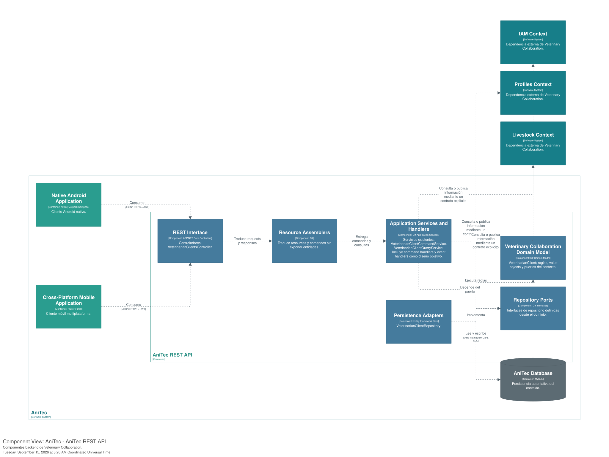
  
<i>Figura 2.6.5.1. Componentes de la API para Veterinary Collaboration. Fuente: elaboración propia con Structurizr DSL.</i>

  
  
<i>Figura 2.6.5.2. Componentes Android para Veterinary Collaboration. Fuente: elaboración propia con Structurizr DSL.</i>

  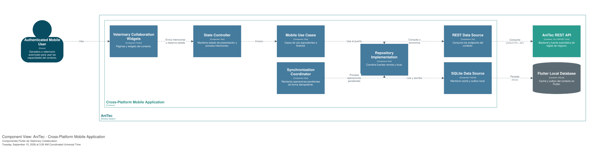
  
<i>Figura 2.6.5.3. Componentes Flutter para Veterinary Collaboration. Fuente: elaboración propia con Structurizr DSL.</i>

## 2.6.5.6. Bounded Context Software Architecture Code Level Diagrams

Los diagramas de código detallan el modelo del dominio y los objetos de persistencia. El UML diferencia los elementos existentes de las incorporaciones objetivo, mientras los esquemas SQL señalan mediante comentarios las columnas propuestas. Los archivos ERD quedan disponibles para completar la importación manual.

### 2.6.5.6.1. Bounded Context Domain Layer Class Diagrams

El Class Diagram incluye agregados, entidades, value objects, enumeraciones, servicios de dominio e interfaces de repositorio con atributos, operaciones, visibilidad y multiplicidades.

  
  
<i>Figura 2.6.5.4. Domain Layer Class Diagram de Veterinary Collaboration. Fuente: elaboración propia con PlantUML.</i>

### 2.6.5.6.2. Bounded Context Database Design Diagram

MySQL mantiene la persistencia autoritativa. Room y SQLite contienen únicamente caché, metadatos de sincronización y operaciones pendientes; no sustituyen las reglas ni la fuente de verdad del backend. En IAM, las credenciales y tokens permanecen fuera de las tablas locales y se almacenan mediante mecanismos seguros del sistema operativo.

  
  
<i>Figura 2.6.5.5. MySQL Database Design de Veterinary Collaboration. Fuente: elaboración propia a partir del esquema SQL.</i>

  
  
<i>Figura 2.6.5.6. Android Room Database Design de Veterinary Collaboration. Fuente: elaboración propia a partir del esquema SQL.</i>

# 2.6.6. Bounded Context: Activity Management

Planificar actividades ganaderas y sanitarias, controlar su estado y decidir cuándo corresponde generar un recordatorio.

La base implementada se encuentra en el módulo Activities de la API ASP.NET Core. El diseño móvil de Android y Flutter se documenta como **no implementado** porque esos clientes todavía no existen en el workspace. Los tres productos comparten contratos REST y lenguaje ubicuo, mientras la API conserva las reglas autoritativas.

## 2.6.6.1. Domain Layer

Esta capa documenta el modelo que representa el núcleo de **Activity Management**. Las reglas autoritativas se ejecutan en la API; Android y Flutter mantienen modelos equivalentes para presentación, validación inmediata y trabajo offline. La columna de estado distingue el código heredado de la arquitectura objetivo.

### Aggregate Root: FarmActivity

| Campo | Detalle |
|---|---|
| **Producto y estado** | Backend; modelo equivalente en Android y Flutter — **Implementado** |
| **Propósito** | Controlar el ciclo de vida de una actividad programada. |
| **Relaciones** | FarmActivity compone ActivitySchedule; FarmActivity se relaciona con ActivityPriority; FarmActivity se relaciona con ActivityStatus; ReminderPolicy depende de FarmActivity; IFarmActivityRepository depende de FarmActivity |

**Atributos o dependencias**

| Nombre | Tipo |
|---|---|
| id | int |
| ownerId | int? |
| veterinarianId | int? |
| animalId | int? |
| title | string |
| type | string |
| schedule | ActivitySchedule |
| priority | ActivityPriority |
| status | ActivityStatus |

**Métodos u operaciones**

| Firma | Retorno |
|---|---|
| Reschedule(schedule: ActivitySchedule) | void |
| Complete() | void |
| Cancel() | void |

### Value Object: ActivitySchedule

| Campo | Detalle |
|---|---|
| **Producto y estado** | Backend, Android y Flutter (modelo canónico) — **No implementado** |
| **Propósito** | Representar fecha programada y recordatorio. |
| **Relaciones** | FarmActivity compone ActivitySchedule |

**Atributos o dependencias**

| Nombre | Tipo |
|---|---|
| scheduledAt | DateTime |
| reminderAt | DateTime? |

**Métodos u operaciones**

| Firma | Retorno |
|---|---|
| IsUpcoming(now: DateTime) | bool |

### Enumeration: ActivityStatus

| Campo | Detalle |
|---|---|
| **Producto y estado** | Backend, Android y Flutter (modelo canónico) — **No implementado** |
| **Propósito** | Definir los valores válidos de ActivityStatus. |
| **Relaciones** | FarmActivity se relaciona con ActivityStatus |

**Atributos o dependencias**

| Nombre | Tipo |
|---|---|
| Pending | No especificado |
| InProgress | No especificado |
| Completed | No especificado |
| Cancelled | No especificado |

**Métodos u operaciones**

No aplica.

### Domain Service: ReminderPolicy

| Campo | Detalle |
|---|---|
| **Producto y estado** | Backend, Android y Flutter (modelo canónico) — **No implementado** |
| **Propósito** | Decidir cuándo debe emitirse una notificación. |
| **Relaciones** | ReminderPolicy depende de FarmActivity |

**Atributos o dependencias**

No aplica.

**Métodos u operaciones**

| Firma | Retorno |
|---|---|
| ShouldNotify(activity: FarmActivity, now: DateTime) | bool |

### Repository Interface: IFarmActivityRepository

| Campo | Detalle |
|---|---|
| **Producto y estado** | Backend; modelo equivalente en Android y Flutter — **Implementado** |
| **Propósito** | Abstraer la persistencia de FarmActivity. |
| **Relaciones** | IFarmActivityRepository depende de FarmActivity |

**Atributos o dependencias**

No aplica.

**Métodos u operaciones**

| Firma | Retorno |
|---|---|
| FindById(id: int) | FarmActivity? |
| FindUpcoming(userId: int) | List~FarmActivity~ |
| Add(activity: FarmActivity) | void |
| Update(activity: FarmActivity) | void |

## 2.6.6.2. Interface Layer

Esta capa recibe las acciones relacionadas con **programación, reprogramación, finalización y recordatorio de actividades** y las traduce a casos de uso. Los controllers y resources corresponden a la API; las pantallas y controladores de estado representan la presentación objetivo en Android y Flutter. Ninguna de estas clases implementa reglas de negocio.

### REST Controller: FarmActivitiesController

| Campo | Detalle |
|---|---|
| **Producto y estado** | Backend ASP.NET Core — **Implementado** |
| **Propósito** | Publicar por HTTP las capacidades de Activity Management. |
| **Relaciones** | Recibe resources, invoca servicios de aplicación y devuelve resources HTTP. |

**Atributos o dependencias**

| Nombre | Tipo |
|---|---|
| commandService | IFarmActivityCommandService |
| queryService | IFarmActivityQueryService |

**Métodos u operaciones**

| Firma | Retorno |
|---|---|
| GetAll(CancellationToken cancellationToken) | No especificado |
| GetById(int id, CancellationToken cancellationToken) | No especificado |
| Create(CreateFarmActivityResource resource, CancellationToken cancellationToken) | No especificado |
| Update(int id, CreateFarmActivityResource resource, CancellationToken cancellationToken) | No especificado |
| Delete(int id, CancellationToken cancellationToken) | No especificado |

### Presentation Model: FarmActivityViewModel

| Campo | Detalle |
|---|---|
| **Producto y estado** | Android / Kotlin — **No implementado** |
| **Propósito** | Mantener el estado observable y traducir acciones de Android a casos de uso. |
| **Relaciones** | Invoca casos de uso de Application Layer y publica un UI State inmutable. |

**Atributos o dependencias**

| Nombre | Tipo |
|---|---|
| state | No especificado |
| observeUseCase | No especificado |
| syncUseCase | No especificado |

**Métodos u operaciones**

| Firma | Retorno |
|---|---|
| Load() | No especificado |
| Submit(action) | No especificado |
| RetrySync() | No especificado |

### State Controller: FarmActivityController

| Campo | Detalle |
|---|---|
| **Producto y estado** | Flutter / Dart — **No implementado** |
| **Propósito** | Mantener el estado de presentación de Flutter y coordinar casos de uso. |
| **Relaciones** | Invoca Application Layer y publica estados de carga, éxito y error. |

**Atributos o dependencias**

| Nombre | Tipo |
|---|---|
| state | No especificado |
| observeUseCase | No especificado |
| syncUseCase | No especificado |

**Métodos u operaciones**

| Firma | Retorno |
|---|---|
| load() | No especificado |
| submit(action) | No especificado |
| retrySync() | No especificado |

## 2.6.6.3. Application Layer

Esta capa coordina las capacidades de **programación, reprogramación, finalización y recordatorio de actividades**. Los commands y queries expresan intenciones; los handlers cargan aggregates, aplican reglas, persisten cambios y reaccionan a eventos. Los casos de uso móviles coordinan lectura local, actualización remota y sincronización idempotente.

### Application Service: FarmActivityCommandService

| Campo | Detalle |
|---|---|
| **Producto y estado** | Backend ASP.NET Core — **Implementado** |
| **Propósito** | Orquestar programación, reprogramación, finalización y recordatorio de actividades sin contener reglas del dominio. |
| **Relaciones** | Invoca agregados y repositories; confirma la transacción mediante Unit of Work. |

**Atributos o dependencias**

| Nombre | Tipo |
|---|---|
| repository | IFarmActivityRepository |
| unitOfWork | IUnitOfWork |

**Métodos u operaciones**

| Firma | Retorno |
|---|---|
| Handle(CreateFarmActivityCommand command, CancellationToken cancellationToken) | No especificado |
| Handle(UpdateFarmActivityCommand command, CancellationToken cancellationToken) | No especificado |
| Handle(DeleteFarmActivityCommand command, CancellationToken cancellationToken) | No especificado |

### Use Case: ObserveFarmActivityUseCase

| Campo | Detalle |
|---|---|
| **Producto y estado** | Android y Flutter — **No implementado** |
| **Propósito** | Entregar primero datos locales y actualizar la consulta cuando exista conectividad. |
| **Relaciones** | Es invocado por ViewModel/Controller y coordina repositorios móviles. |

**Atributos o dependencias**

| Nombre | Tipo |
|---|---|
| localRepository | No especificado |
| remoteRepository | No especificado |
| connectivityMonitor | No especificado |

**Métodos u operaciones**

| Firma | Retorno |
|---|---|
| Execute(criteria) | Stream<Result> |

### Command Handler: CreateFarmActivityCommandHandler

| Campo | Detalle |
|---|---|
| **Producto y estado** | Backend ASP.NET Core — **No implementado** |
| **Propósito** | Ejecutar una intención concreta, aplicar reglas del agregado y confirmar la transacción. |
| **Relaciones** | Consume un Command, carga el aggregate mediante su repository y puede publicar un Domain Event. |

**Atributos o dependencias**

| Nombre | Tipo |
|---|---|
| repository | No especificado |
| unitOfWork | No especificado |
| domainPolicy | No especificado |

**Métodos u operaciones**

| Firma | Retorno |
|---|---|
| Handle(command) | Result |

### Event Handler: ActivityScheduledEventHandler

| Campo | Detalle |
|---|---|
| **Producto y estado** | Backend ASP.NET Core — **No implementado** |
| **Propósito** | Reaccionar al evento confirmado y actualizar proyecciones o integraciones. |
| **Relaciones** | Consume un Domain Event y utiliza puertos de infraestructura sin modificar directamente el agregado. |

**Atributos o dependencias**

| Nombre | Tipo |
|---|---|
| projectionRepository | No especificado |
| notificationPort | No especificado |
| unitOfWork | No especificado |

**Métodos u operaciones**

| Firma | Retorno |
|---|---|
| Handle(domainEvent) | Task |

## 2.6.6.4. Infrastructure Layer

Esta capa implementa los puertos definidos hacia el interior de **Activity Management** y concentra acceso a base de datos, red, almacenamiento local e integraciones externas. Las clases de infraestructura traducen errores y contratos técnicos antes de devolver resultados a Application Layer.

### Repository Adapter: FarmActivityRepository

| Campo | Detalle |
|---|---|
| **Producto y estado** | Backend / Entity Framework Core — **Implementado** |
| **Propósito** | Implementar el puerto de persistencia definido por Domain Layer. |
| **Relaciones** | Implementa IFarmActivityRepository; utiliza AppDbContext/MySQL y reconstruye el aggregate. |

**Atributos o dependencias**

| Nombre | Tipo |
|---|---|
| context | AppDbContext |

**Métodos u operaciones**

| Firma | Retorno |
|---|---|
| FindById(id) | No especificado |
| Add(entity) | No especificado |
| Update(entity) | No especificado |
| Delete(entity) | No especificado |

### Room Adapter: FarmActivityDao

| Campo | Detalle |
|---|---|
| **Producto y estado** | Android / Room — **No implementado** |
| **Propósito** | Implementar persistencia local y observación reactiva en Android. |
| **Relaciones** | Implementa el puerto local mediante Room y participa en la estrategia de caché/outbox. |

**Atributos o dependencias**

| Nombre | Tipo |
|---|---|
| roomDatabase | No especificado |
| entityMapper | No especificado |

**Métodos u operaciones**

| Firma | Retorno |
|---|---|
| Observe(criteria) | No especificado |
| Upsert(entity) | No especificado |
| Delete(id) | No especificado |
| Pending() | No especificado |

### SQLite Adapter: FarmActivityLocalDataSource

| Campo | Detalle |
|---|---|
| **Producto y estado** | Flutter / Dart — **No implementado** |
| **Propósito** | Implementar persistencia local equivalente en Flutter. |
| **Relaciones** | Implementa el puerto local mediante SQLite y participa en la estrategia de caché/outbox. |

**Atributos o dependencias**

| Nombre | Tipo |
|---|---|
| sqliteDatabase | No especificado |
| entityMapper | No especificado |

**Métodos u operaciones**

| Firma | Retorno |
|---|---|
| watch(criteria) | No especificado |
| upsert(entity) | No especificado |
| delete(id) | No especificado |
| pending() | No especificado |

### Messaging Adapter: FirebaseReminderPublisher

| Campo | Detalle |
|---|---|
| **Producto y estado** | Backend y Android — **No implementado** |
| **Propósito** | Aislar una dependencia externa detrás de un puerto explícito. |
| **Relaciones** | Implementa el puerto de notificaciones mediante FCM y notificaciones locales. |

**Atributos o dependencias**

| Nombre | Tipo |
|---|---|
| localNotifier | fcmClient, |

**Métodos u operaciones**

| Firma | Retorno |
|---|---|
| Publish(reminder) | No especificado |
| ScheduleLocal(reminder) | No especificado |

## 2.6.6.5. Bounded Context Software Architecture Component Level Diagrams

El archivo [component-level.dsl](<markdown/assets/codefordiagrams/2-6-6-Bounded-Context-Activity-Management/component-level.dsl>) contiene las vistas BC6-ApiComponents, BC6-AndroidComponents y BC6-FlutterComponents. Las tres parten del mismo modelo C4 y muestran la separación entre presentación, aplicación, dominio y adaptadores.

  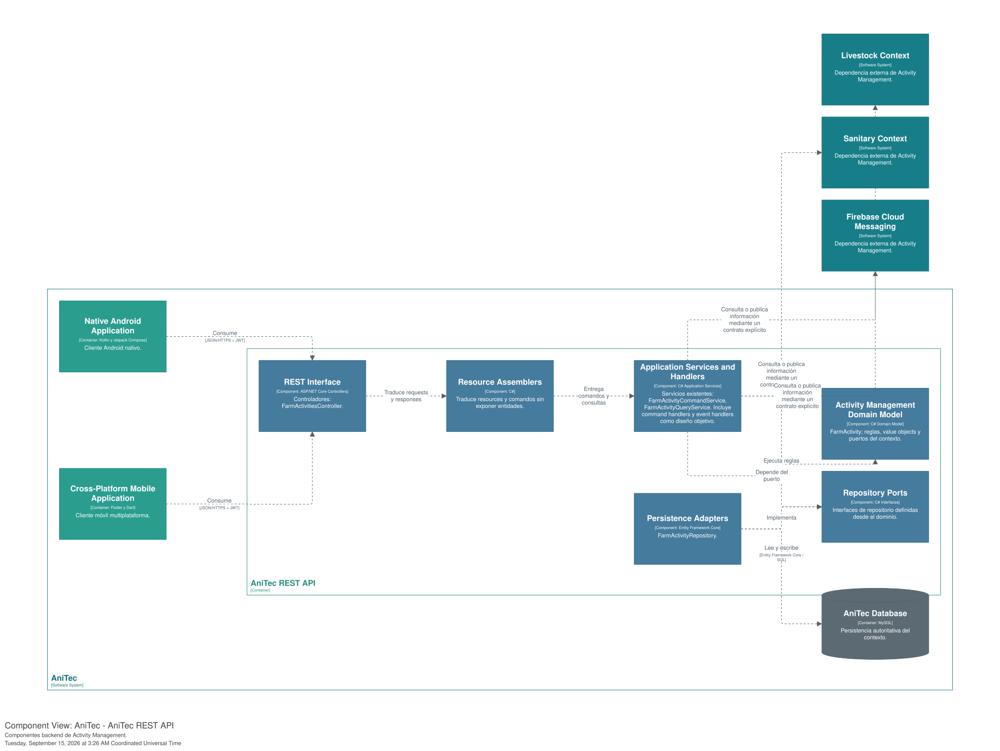
  
<i>Figura 2.6.6.1. Componentes de la API para Activity Management. Fuente: elaboración propia con Structurizr DSL.</i>

  
  
<i>Figura 2.6.6.2. Componentes Android para Activity Management. Fuente: elaboración propia con Structurizr DSL.</i>

  
  
<i>Figura 2.6.6.3. Componentes Flutter para Activity Management. Fuente: elaboración propia con Structurizr DSL.</i>

## 2.6.6.6. Bounded Context Software Architecture Code Level Diagrams

Los diagramas de código detallan el modelo del dominio y los objetos de persistencia. El UML diferencia los elementos existentes de las incorporaciones objetivo, mientras los esquemas SQL señalan mediante comentarios las columnas propuestas. Los archivos ERD quedan disponibles para completar la importación manual.

### 2.6.6.6.1. Bounded Context Domain Layer Class Diagrams

El Class Diagram incluye agregados, entidades, value objects, enumeraciones, servicios de dominio e interfaces de repositorio con atributos, operaciones, visibilidad y multiplicidades.

  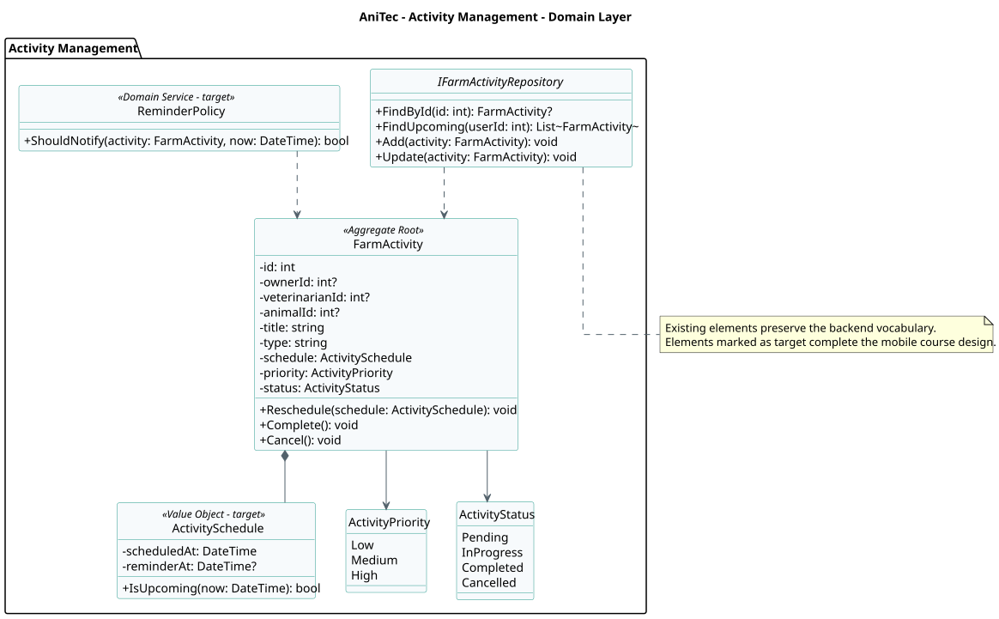
  
<i>Figura 2.6.6.4. Domain Layer Class Diagram de Activity Management. Fuente: elaboración propia con PlantUML.</i>

### 2.6.6.6.2. Bounded Context Database Design Diagram

MySQL mantiene la persistencia autoritativa. Room y SQLite contienen únicamente caché, metadatos de sincronización y operaciones pendientes; no sustituyen las reglas ni la fuente de verdad del backend. En IAM, las credenciales y tokens permanecen fuera de las tablas locales y se almacenan mediante mecanismos seguros del sistema operativo.

  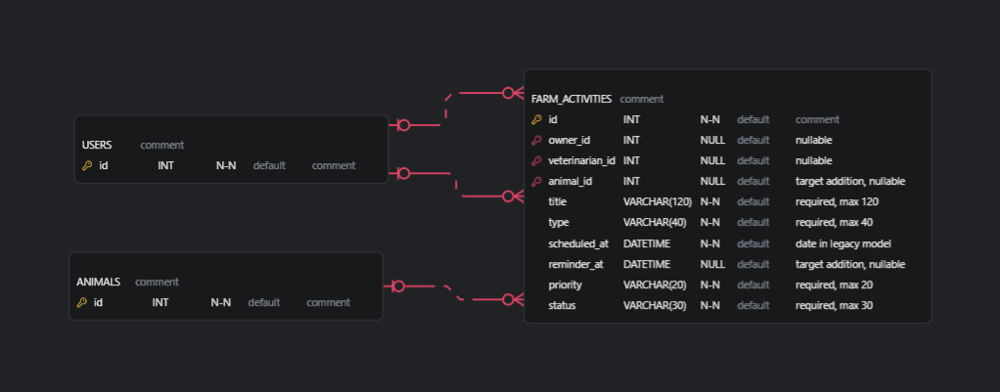
  
<i>Figura 2.6.6.5. MySQL Database Design de Activity Management. Fuente: elaboración propia a partir del esquema SQL.</i>

  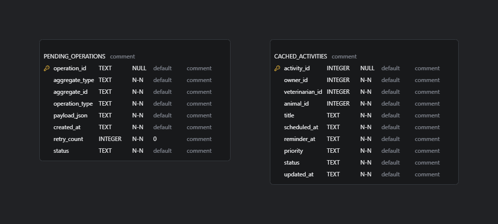
  
<i>Figura 2.6.6.6. Android Room Database Design de Activity Management. Fuente: elaboración propia a partir del esquema SQL.</i>

# 2.6.7. Bounded Context: Financial Management

Registrar ingresos y egresos operativos y producir resúmenes económicos básicos para apoyar decisiones del ganadero.

La base implementada se encuentra en el módulo Financial de la API ASP.NET Core. El diseño móvil de Android y Flutter se documenta como **no implementado** porque esos clientes todavía no existen en el workspace. Los tres productos comparten contratos REST y lenguaje ubicuo, mientras la API conserva las reglas autoritativas.

## 2.6.7.1. Domain Layer

Esta capa documenta el modelo que representa el núcleo de **Financial Management**. Las reglas autoritativas se ejecutan en la API; Android y Flutter mantienen modelos equivalentes para presentación, validación inmediata y trabajo offline. La columna de estado distingue el código heredado de la arquitectura objetivo.

### Aggregate Root: FinancialRecord

| Campo | Detalle |
|---|---|
| **Producto y estado** | Backend; modelo equivalente en Android y Flutter — **Implementado** |
| **Propósito** | Mantener un ingreso o egreso del ganadero. |
| **Relaciones** | FinancialRecord compone Money; FinancialRecord se relaciona con FinancialRecordType; FinancialRecord compone FinancialCategory; FinancialSummary depende de FinancialRecord; IFinancialRecordRepository depende de FinancialRecord |

**Atributos o dependencias**

| Nombre | Tipo |
|---|---|
| id | int |
| ownerId | int |
| type | FinancialRecordType |
| category | FinancialCategory |
| amount | Money |
| date | Date |
| description | string |

**Métodos u operaciones**

| Firma | Retorno |
|---|---|
| ChangeAmount(amount: Money) | void |
| ChangeCategory(category: FinancialCategory) | void |

### Value Object: Money

| Campo | Detalle |
|---|---|
| **Producto y estado** | Backend, Android y Flutter (modelo canónico) — **No implementado** |
| **Propósito** | Representar un importe junto con su moneda. |
| **Relaciones** | FinancialRecord compone Money |

**Atributos o dependencias**

| Nombre | Tipo |
|---|---|
| amount | decimal |
| currency | string |

**Métodos u operaciones**

| Firma | Retorno |
|---|---|
| Add(other: Money) | Money |
| IsPositive() | bool |

### Value Object: FinancialCategory

| Campo | Detalle |
|---|---|
| **Producto y estado** | Backend, Android y Flutter (modelo canónico) — **No implementado** |
| **Propósito** | Clasificar un movimiento financiero. |
| **Relaciones** | FinancialRecord compone FinancialCategory |

**Atributos o dependencias**

| Nombre | Tipo |
|---|---|
| name | string |

**Métodos u operaciones**

| Firma | Retorno |
|---|---|
| IsValid() | bool |

### Domain Service: FinancialSummary

| Campo | Detalle |
|---|---|
| **Producto y estado** | Backend, Android y Flutter (modelo canónico) — **No implementado** |
| **Propósito** | Calcular totales y balance para un conjunto de movimientos. |
| **Relaciones** | FinancialSummary depende de FinancialRecord |

**Atributos o dependencias**

No aplica.

**Métodos u operaciones**

| Firma | Retorno |
|---|---|
| Calculate(records: List~FinancialRecord~) | Money |

### Repository Interface: IFinancialRecordRepository

| Campo | Detalle |
|---|---|
| **Producto y estado** | Backend; modelo equivalente en Android y Flutter — **Implementado** |
| **Propósito** | Abstraer la persistencia de FinancialRecord. |
| **Relaciones** | IFinancialRecordRepository depende de FinancialRecord |

**Atributos o dependencias**

No aplica.

**Métodos u operaciones**

| Firma | Retorno |
|---|---|
| FindById(id: int) | FinancialRecord? |
| FindByOwner(ownerId: int) | List~FinancialRecord~ |
| Add(record: FinancialRecord) | void |
| Update(record: FinancialRecord) | void |

## 2.6.7.2. Interface Layer

Esta capa recibe las acciones relacionadas con **registro de ingresos y egresos, actualización y cálculo de resúmenes** y las traduce a casos de uso. Los controllers y resources corresponden a la API; las pantallas y controladores de estado representan la presentación objetivo en Android y Flutter. Ninguna de estas clases implementa reglas de negocio.

### REST Controller: FinancialRecordsController

| Campo | Detalle |
|---|---|
| **Producto y estado** | Backend ASP.NET Core — **Implementado** |
| **Propósito** | Publicar por HTTP las capacidades de Financial Management. |
| **Relaciones** | Recibe resources, invoca servicios de aplicación y devuelve resources HTTP. |

**Atributos o dependencias**

| Nombre | Tipo |
|---|---|
| commandService | IFinancialRecordCommandService |
| queryService | IFinancialRecordQueryService |

**Métodos u operaciones**

| Firma | Retorno |
|---|---|
| GetAll(CancellationToken cancellationToken) | No especificado |
| GetById(int id, CancellationToken cancellationToken) | No especificado |
| Create(CreateFinancialRecordResource resource, CancellationToken cancellationToken) | No especificado |
| Update(int id, CreateFinancialRecordResource resource, CancellationToken cancellationToken) | No especificado |
| Delete(int id, CancellationToken cancellationToken) | No especificado |

### Presentation Model: FinancialRecordViewModel

| Campo | Detalle |
|---|---|
| **Producto y estado** | Android / Kotlin — **No implementado** |
| **Propósito** | Mantener el estado observable y traducir acciones de Android a casos de uso. |
| **Relaciones** | Invoca casos de uso de Application Layer y publica un UI State inmutable. |

**Atributos o dependencias**

| Nombre | Tipo |
|---|---|
| state | No especificado |
| observeUseCase | No especificado |
| syncUseCase | No especificado |

**Métodos u operaciones**

| Firma | Retorno |
|---|---|
| Load() | No especificado |
| Submit(action) | No especificado |
| RetrySync() | No especificado |

### State Controller: FinancialRecordController

| Campo | Detalle |
|---|---|
| **Producto y estado** | Flutter / Dart — **No implementado** |
| **Propósito** | Mantener el estado de presentación de Flutter y coordinar casos de uso. |
| **Relaciones** | Invoca Application Layer y publica estados de carga, éxito y error. |

**Atributos o dependencias**

| Nombre | Tipo |
|---|---|
| state | No especificado |
| observeUseCase | No especificado |
| syncUseCase | No especificado |

**Métodos u operaciones**

| Firma | Retorno |
|---|---|
| load() | No especificado |
| submit(action) | No especificado |
| retrySync() | No especificado |

## 2.6.7.3. Application Layer

Esta capa coordina las capacidades de **registro de ingresos y egresos, actualización y cálculo de resúmenes**. Los commands y queries expresan intenciones; los handlers cargan aggregates, aplican reglas, persisten cambios y reaccionan a eventos. Los casos de uso móviles coordinan lectura local, actualización remota y sincronización idempotente.

### Application Service: FinancialRecordCommandService

| Campo | Detalle |
|---|---|
| **Producto y estado** | Backend ASP.NET Core — **Implementado** |
| **Propósito** | Orquestar registro de ingresos y egresos, actualización y cálculo de resúmenes sin contener reglas del dominio. |
| **Relaciones** | Invoca agregados y repositories; confirma la transacción mediante Unit of Work. |

**Atributos o dependencias**

| Nombre | Tipo |
|---|---|
| repository | IFinancialRecordRepository |
| unitOfWork | IUnitOfWork |

**Métodos u operaciones**

| Firma | Retorno |
|---|---|
| Handle(CreateFinancialRecordCommand command, CancellationToken cancellationToken) | No especificado |
| Handle(UpdateFinancialRecordCommand command, CancellationToken cancellationToken) | No especificado |
| Handle(DeleteFinancialRecordCommand command, CancellationToken cancellationToken) | No especificado |

### Use Case: ObserveFinancialRecordUseCase

| Campo | Detalle |
|---|---|
| **Producto y estado** | Android y Flutter — **No implementado** |
| **Propósito** | Entregar primero datos locales y actualizar la consulta cuando exista conectividad. |
| **Relaciones** | Es invocado por ViewModel/Controller y coordina repositorios móviles. |

**Atributos o dependencias**

| Nombre | Tipo |
|---|---|
| localRepository | No especificado |
| remoteRepository | No especificado |
| connectivityMonitor | No especificado |

**Métodos u operaciones**

| Firma | Retorno |
|---|---|
| Execute(criteria) | Stream<Result> |

### Command Handler: CreateFinancialRecordCommandHandler

| Campo | Detalle |
|---|---|
| **Producto y estado** | Backend ASP.NET Core — **No implementado** |
| **Propósito** | Ejecutar una intención concreta, aplicar reglas del agregado y confirmar la transacción. |
| **Relaciones** | Consume un Command, carga el aggregate mediante su repository y puede publicar un Domain Event. |

**Atributos o dependencias**

| Nombre | Tipo |
|---|---|
| repository | No especificado |
| unitOfWork | No especificado |
| domainPolicy | No especificado |

**Métodos u operaciones**

| Firma | Retorno |
|---|---|
| Handle(command) | Result |

### Event Handler: FinancialRecordRegisteredEventHandler

| Campo | Detalle |
|---|---|
| **Producto y estado** | Backend ASP.NET Core — **No implementado** |
| **Propósito** | Reaccionar al evento confirmado y actualizar proyecciones o integraciones. |
| **Relaciones** | Consume un Domain Event y utiliza puertos de infraestructura sin modificar directamente el agregado. |

**Atributos o dependencias**

| Nombre | Tipo |
|---|---|
| projectionRepository | No especificado |
| notificationPort | No especificado |
| unitOfWork | No especificado |

**Métodos u operaciones**

| Firma | Retorno |
|---|---|
| Handle(domainEvent) | Task |

## 2.6.7.4. Infrastructure Layer

Esta capa implementa los puertos definidos hacia el interior de **Financial Management** y concentra acceso a base de datos, red, almacenamiento local e integraciones externas. Las clases de infraestructura traducen errores y contratos técnicos antes de devolver resultados a Application Layer.

### Repository Adapter: FinancialRecordRepository

| Campo | Detalle |
|---|---|
| **Producto y estado** | Backend / Entity Framework Core — **Implementado** |
| **Propósito** | Implementar el puerto de persistencia definido por Domain Layer. |
| **Relaciones** | Implementa IFinancialRecordRepository; utiliza AppDbContext/MySQL y reconstruye el aggregate. |

**Atributos o dependencias**

| Nombre | Tipo |
|---|---|
| context | AppDbContext |

**Métodos u operaciones**

| Firma | Retorno |
|---|---|
| FindById(id) | No especificado |
| Add(entity) | No especificado |
| Update(entity) | No especificado |
| Delete(entity) | No especificado |

### Room Adapter: FinancialRecordDao

| Campo | Detalle |
|---|---|
| **Producto y estado** | Android / Room — **No implementado** |
| **Propósito** | Implementar persistencia local y observación reactiva en Android. |
| **Relaciones** | Implementa el puerto local mediante Room y participa en la estrategia de caché/outbox. |

**Atributos o dependencias**

| Nombre | Tipo |
|---|---|
| roomDatabase | No especificado |
| entityMapper | No especificado |

**Métodos u operaciones**

| Firma | Retorno |
|---|---|
| Observe(criteria) | No especificado |
| Upsert(entity) | No especificado |
| Delete(id) | No especificado |
| Pending() | No especificado |

### SQLite Adapter: FinancialRecordLocalDataSource

| Campo | Detalle |
|---|---|
| **Producto y estado** | Flutter / Dart — **No implementado** |
| **Propósito** | Implementar persistencia local equivalente en Flutter. |
| **Relaciones** | Implementa el puerto local mediante SQLite y participa en la estrategia de caché/outbox. |

**Atributos o dependencias**

| Nombre | Tipo |
|---|---|
| sqliteDatabase | No especificado |
| entityMapper | No especificado |

**Métodos u operaciones**

| Firma | Retorno |
|---|---|
| watch(criteria) | No especificado |
| upsert(entity) | No especificado |
| delete(id) | No especificado |
| pending() | No especificado |

### Offline Adapter: FinancialOutboxStore

| Campo | Detalle |
|---|---|
| **Producto y estado** | Android y Flutter — **No implementado** |
| **Propósito** | Aislar una dependencia externa detrás de un puerto explícito. |
| **Relaciones** | Implementa el puerto de sincronización financiera sobre Room o SQLite. |

**Atributos o dependencias**

| Nombre | Tipo |
|---|---|
| serializer | database, |

**Métodos u operaciones**

| Firma | Retorno |
|---|---|
| Enqueue(record) | No especificado |
| Pending() | No especificado |
| MarkSynced(id) | No especificado |

## 2.6.7.5. Bounded Context Software Architecture Component Level Diagrams

El archivo [component-level.dsl](<markdown/assets/codefordiagrams/2-6-7-Bounded-Context-Financial-Management/component-level.dsl>) contiene las vistas BC7-ApiComponents, BC7-AndroidComponents y BC7-FlutterComponents. Las tres parten del mismo modelo C4 y muestran la separación entre presentación, aplicación, dominio y adaptadores.

  
  
<i>Figura 2.6.7.1. Componentes de la API para Financial Management. Fuente: elaboración propia con Structurizr DSL.</i>

  
  
<i>Figura 2.6.7.2. Componentes Android para Financial Management. Fuente: elaboración propia con Structurizr DSL.</i>

  
  
<i>Figura 2.6.7.3. Componentes Flutter para Financial Management. Fuente: elaboración propia con Structurizr DSL.</i>

## 2.6.7.6. Bounded Context Software Architecture Code Level Diagrams

Los diagramas de código detallan el modelo del dominio y los objetos de persistencia. El UML diferencia los elementos existentes de las incorporaciones objetivo, mientras los esquemas SQL señalan mediante comentarios las columnas propuestas. Los archivos ERD quedan disponibles para completar la importación manual.

### 2.6.7.6.1. Bounded Context Domain Layer Class Diagrams

El Class Diagram incluye agregados, entidades, value objects, enumeraciones, servicios de dominio e interfaces de repositorio con atributos, operaciones, visibilidad y multiplicidades.

  
  
<i>Figura 2.6.7.4. Domain Layer Class Diagram de Financial Management. Fuente: elaboración propia con PlantUML.</i>

### 2.6.7.6.2. Bounded Context Database Design Diagram

MySQL mantiene la persistencia autoritativa. Room y SQLite contienen únicamente caché, metadatos de sincronización y operaciones pendientes; no sustituyen las reglas ni la fuente de verdad del backend. En IAM, las credenciales y tokens permanecen fuera de las tablas locales y se almacenan mediante mecanismos seguros del sistema operativo.

  
  
<i>Figura 2.6.7.5. MySQL Database Design de Financial Management. Fuente: elaboración propia a partir del esquema SQL.</i>

  
  
<i>Figura 2.6.7.6. Android Room Database Design de Financial Management. Fuente: elaboración propia a partir del esquema SQL.</i>

# 2.6.8. Bounded Context: Subscription Management

Administrar planes, vigencia de suscripciones y pagos confirmados sin introducir conceptos propios de Stripe en el dominio.

La base implementada se encuentra en el módulo Subscriptions de la API ASP.NET Core. El diseño móvil de Android y Flutter se documenta como **no implementado** porque esos clientes todavía no existen en el workspace. Los tres productos comparten contratos REST y lenguaje ubicuo, mientras la API conserva las reglas autoritativas.

## 2.6.8.1. Domain Layer

Esta capa documenta el modelo que representa el núcleo de **Subscription Management**. Las reglas autoritativas se ejecutan en la API; Android y Flutter mantienen modelos equivalentes para presentación, validación inmediata y trabajo offline. La columna de estado distingue el código heredado de la arquitectura objetivo.

### Entity: SubscriptionPlan

| Campo | Detalle |
|---|---|
| **Producto y estado** | Backend; modelo equivalente en Android y Flutter — **Implementado** |
| **Propósito** | Definir condiciones y límites de un plan comercial. |
| **Relaciones** | SubscriptionPlan compone Money |

**Atributos o dependencias**

| Nombre | Tipo |
|---|---|
| id | int |
| name | string |
| price | Money |
| providerPriceId | string |
| maxAnimals | int |
| isActive | bool |

**Métodos u operaciones**

| Firma | Retorno |
|---|---|
| Deactivate() | void |
| ChangePrice(price: Money) | void |

### Aggregate Root: Subscription

| Campo | Detalle |
|---|---|
| **Producto y estado** | Backend; modelo equivalente en Android y Flutter — **Implementado** |
| **Propósito** | Controlar vigencia y estado de la suscripción de un usuario. |
| **Relaciones** | Subscription compone Payment; Subscription se relaciona con SubscriptionStatus; ISubscriptionRepository depende de Subscription |

**Atributos o dependencias**

| Nombre | Tipo |
|---|---|
| id | int |
| userId | int |
| planId | int |
| status | SubscriptionStatus |
| startedAt | Date |
| endsAt | Date? |

**Métodos u operaciones**

| Firma | Retorno |
|---|---|
| Activate(start: Date, end: Date?) | void |
| Cancel(end: Date) | void |
| IsActive(on: Date) | bool |

### Entity: Payment

| Campo | Detalle |
|---|---|
| **Producto y estado** | Backend; modelo equivalente en Android y Flutter — **Implementado** |
| **Propósito** | Registrar el resultado de un pago. |
| **Relaciones** | Subscription compone Payment; Payment se relaciona con PaymentStatus; Payment compone Money |

**Atributos o dependencias**

| Nombre | Tipo |
|---|---|
| id | int |
| subscriptionId | int |
| userId | int |
| amount | Money |
| providerPaymentId | string |
| status | PaymentStatus |
| paidAt | DateTime |

**Métodos u operaciones**

| Firma | Retorno |
|---|---|
| Confirm(providerId: string, paidAt: DateTime) | void |
| Reject() | void |

### Value Object: Money

| Campo | Detalle |
|---|---|
| **Producto y estado** | Backend, Android y Flutter (modelo canónico) — **No implementado** |
| **Propósito** | Representar un importe junto con su moneda. |
| **Relaciones** | Payment compone Money; SubscriptionPlan compone Money |

**Atributos o dependencias**

| Nombre | Tipo |
|---|---|
| amount | decimal |
| currency | string |

**Métodos u operaciones**

| Firma | Retorno |
|---|---|
| IsPositive() | bool |

### Enumeration: SubscriptionStatus

| Campo | Detalle |
|---|---|
| **Producto y estado** | Backend, Android y Flutter (modelo canónico) — **No implementado** |
| **Propósito** | Definir los valores válidos de SubscriptionStatus. |
| **Relaciones** | Subscription se relaciona con SubscriptionStatus |

**Atributos o dependencias**

| Nombre | Tipo |
|---|---|
| Pending | No especificado |
| Active | No especificado |
| Cancelled | No especificado |
| Expired | No especificado |

**Métodos u operaciones**

No aplica.

### Repository Interface: ISubscriptionRepository

| Campo | Detalle |
|---|---|
| **Producto y estado** | Backend; modelo equivalente en Android y Flutter — **Implementado** |
| **Propósito** | Abstraer la persistencia de Subscription. |
| **Relaciones** | ISubscriptionRepository depende de Subscription |

**Atributos o dependencias**

No aplica.

**Métodos u operaciones**

| Firma | Retorno |
|---|---|
| FindById(id: int) | Subscription? |
| FindActiveByUser(userId: int) | Subscription? |
| Add(subscription: Subscription) | void |
| Update(subscription: Subscription) | void |

### Domain Port: PaymentGateway

| Campo | Detalle |
|---|---|
| **Producto y estado** | Backend; modelo equivalente en Android y Flutter — **No implementado** |
| **Propósito** | Abstraer el proveedor externo de cobros. |
| **Relaciones** | Es implementado por StripePaymentGateway en Infrastructure Layer. |

**Atributos o dependencias**

No aplica.

**Métodos u operaciones**

| Firma | Retorno |
|---|---|
| CreateCheckout(subscription, plan) | No especificado |
| ConfirmPayment(reference) | No especificado |

## 2.6.8.2. Interface Layer

Esta capa recibe las acciones relacionadas con **consulta de planes, contratación, pago y actualización de suscripciones** y las traduce a casos de uso. Los controllers y resources corresponden a la API; las pantallas y controladores de estado representan la presentación objetivo en Android y Flutter. Ninguna de estas clases implementa reglas de negocio.

### REST Controller: SubscriptionsController

| Campo | Detalle |
|---|---|
| **Producto y estado** | Backend ASP.NET Core — **Implementado** |
| **Propósito** | Publicar por HTTP las capacidades de Subscription Management. |
| **Relaciones** | Recibe resources, invoca servicios de aplicación y devuelve resources HTTP. |

**Atributos o dependencias**

| Nombre | Tipo |
|---|---|
| commandService | ISubscriptionCommandService |
| queryService | ISubscriptionQueryService |
| planQueryService | ISubscriptionPlanQueryService |
| paymentCommandService | IPaymentCommandService |
| paymentQueryService | IPaymentQueryService |
| configuration | IConfiguration |

**Métodos u operaciones**

| Firma | Retorno |
|---|---|
| GetAll(CancellationToken cancellationToken) | No especificado |
| GetById(int id, CancellationToken cancellationToken) | No especificado |
| Create(CreateSubscriptionResource resource, CancellationToken cancellationToken) | No especificado |
| GetActiveByUser(int userId, CancellationToken cancellationToken) | No especificado |
| GetPaymentsByUser(int userId, CancellationToken cancellationToken) | No especificado |
| MockCheckout(MockCheckoutResource resource, CancellationToken cancellationToken) | No especificado |
| CreateStripeCheckout(StripeCheckoutResource resource, CancellationToken cancellationToken) | No especificado |
| ConfirmStripeCheckout(string sessionId, CancellationToken cancellationToken) | No especificado |
| Update(int id, CreateSubscriptionResource resource, CancellationToken cancellationToken) | No especificado |
| Delete(int id, CancellationToken cancellationToken) | No especificado |

### Presentation Model: SubscriptionViewModel

| Campo | Detalle |
|---|---|
| **Producto y estado** | Android / Kotlin — **No implementado** |
| **Propósito** | Mantener el estado observable y traducir acciones de Android a casos de uso. |
| **Relaciones** | Invoca casos de uso de Application Layer y publica un UI State inmutable. |

**Atributos o dependencias**

| Nombre | Tipo |
|---|---|
| state | No especificado |
| observeUseCase | No especificado |
| syncUseCase | No especificado |

**Métodos u operaciones**

| Firma | Retorno |
|---|---|
| Load() | No especificado |
| Submit(action) | No especificado |
| RetrySync() | No especificado |

### State Controller: SubscriptionController

| Campo | Detalle |
|---|---|
| **Producto y estado** | Flutter / Dart — **No implementado** |
| **Propósito** | Mantener el estado de presentación de Flutter y coordinar casos de uso. |
| **Relaciones** | Invoca Application Layer y publica estados de carga, éxito y error. |

**Atributos o dependencias**

| Nombre | Tipo |
|---|---|
| state | No especificado |
| observeUseCase | No especificado |
| syncUseCase | No especificado |

**Métodos u operaciones**

| Firma | Retorno |
|---|---|
| load() | No especificado |
| submit(action) | No especificado |
| retrySync() | No especificado |

## 2.6.8.3. Application Layer

Esta capa coordina las capacidades de **consulta de planes, contratación, pago y actualización de suscripciones**. Los commands y queries expresan intenciones; los handlers cargan aggregates, aplican reglas, persisten cambios y reaccionan a eventos. Los casos de uso móviles coordinan lectura local, actualización remota y sincronización idempotente.

### Application Service: SubscriptionCommandService

| Campo | Detalle |
|---|---|
| **Producto y estado** | Backend ASP.NET Core — **Implementado** |
| **Propósito** | Orquestar consulta de planes, contratación, pago y actualización de suscripciones sin contener reglas del dominio. |
| **Relaciones** | Invoca agregados y repositories; confirma la transacción mediante Unit of Work. |

**Atributos o dependencias**

| Nombre | Tipo |
|---|---|
| repository | ISubscriptionRepository |
| unitOfWork | IUnitOfWork |

**Métodos u operaciones**

| Firma | Retorno |
|---|---|
| Handle(CreateSubscriptionCommand command, CancellationToken cancellationToken) | No especificado |
| Handle(UpdateSubscriptionCommand command, CancellationToken cancellationToken) | No especificado |
| Handle(DeleteSubscriptionCommand command, CancellationToken cancellationToken) | No especificado |

### Use Case: ObserveSubscriptionUseCase

| Campo | Detalle |
|---|---|
| **Producto y estado** | Android y Flutter — **No implementado** |
| **Propósito** | Entregar primero datos locales y actualizar la consulta cuando exista conectividad. |
| **Relaciones** | Es invocado por ViewModel/Controller y coordina repositorios móviles. |

**Atributos o dependencias**

| Nombre | Tipo |
|---|---|
| localRepository | No especificado |
| remoteRepository | No especificado |
| connectivityMonitor | No especificado |

**Métodos u operaciones**

| Firma | Retorno |
|---|---|
| Execute(criteria) | Stream<Result> |

### Command Handler: CreatePaymentCommandHandler

| Campo | Detalle |
|---|---|
| **Producto y estado** | Backend ASP.NET Core — **No implementado** |
| **Propósito** | Ejecutar una intención concreta, aplicar reglas del agregado y confirmar la transacción. |
| **Relaciones** | Consume un Command, carga el aggregate mediante su repository y puede publicar un Domain Event. |

**Atributos o dependencias**

| Nombre | Tipo |
|---|---|
| repository | No especificado |
| unitOfWork | No especificado |
| domainPolicy | No especificado |

**Métodos u operaciones**

| Firma | Retorno |
|---|---|
| Handle(command) | Result |

### Event Handler: PaymentConfirmedEventHandler

| Campo | Detalle |
|---|---|
| **Producto y estado** | Backend ASP.NET Core — **No implementado** |
| **Propósito** | Reaccionar al evento confirmado y actualizar proyecciones o integraciones. |
| **Relaciones** | Consume un Domain Event y utiliza puertos de infraestructura sin modificar directamente el agregado. |

**Atributos o dependencias**

| Nombre | Tipo |
|---|---|
| projectionRepository | No especificado |
| notificationPort | No especificado |
| unitOfWork | No especificado |

**Métodos u operaciones**

| Firma | Retorno |
|---|---|
| Handle(domainEvent) | Task |

## 2.6.8.4. Infrastructure Layer

Esta capa implementa los puertos definidos hacia el interior de **Subscription Management** y concentra acceso a base de datos, red, almacenamiento local e integraciones externas. Las clases de infraestructura traducen errores y contratos técnicos antes de devolver resultados a Application Layer.

### Repository Adapter: SubscriptionPlanRepository / SubscriptionRepository / PaymentRepository

| Campo | Detalle |
|---|---|
| **Producto y estado** | Backend / Entity Framework Core — **Implementado** |
| **Propósito** | Implementar el puerto de persistencia definido por Domain Layer. |
| **Relaciones** | Implementa ISubscriptionPlanRepository / ISubscriptionRepository / IPaymentRepository; utiliza AppDbContext/MySQL y reconstruye el aggregate. |

**Atributos o dependencias**

| Nombre | Tipo |
|---|---|
| SubscriptionPlanRepository | AppDbContext context |
| SubscriptionRepository | AppDbContext context |
| PaymentRepository | AppDbContext context |

**Métodos u operaciones**

| Firma | Retorno |
|---|---|
| PaymentRepository.FindByUserIdAsync(int userId, CancellationToken cancellationToken) | No especificado |
| PaymentRepository.FindByProviderPaymentIdAsync(string providerPaymentId, CancellationToken cancellationToken) | No especificado |

### Room Adapter: SubscriptionDao

| Campo | Detalle |
|---|---|
| **Producto y estado** | Android / Room — **No implementado** |
| **Propósito** | Implementar persistencia local y observación reactiva en Android. |
| **Relaciones** | Implementa el puerto local mediante Room y participa en la estrategia de caché/outbox. |

**Atributos o dependencias**

| Nombre | Tipo |
|---|---|
| roomDatabase | No especificado |
| entityMapper | No especificado |

**Métodos u operaciones**

| Firma | Retorno |
|---|---|
| Observe(criteria) | No especificado |
| Upsert(entity) | No especificado |
| Delete(id) | No especificado |
| Pending() | No especificado |

### SQLite Adapter: SubscriptionLocalDataSource

| Campo | Detalle |
|---|---|
| **Producto y estado** | Flutter / Dart — **No implementado** |
| **Propósito** | Implementar persistencia local equivalente en Flutter. |
| **Relaciones** | Implementa el puerto local mediante SQLite y participa en la estrategia de caché/outbox. |

**Atributos o dependencias**

| Nombre | Tipo |
|---|---|
| sqliteDatabase | No especificado |
| entityMapper | No especificado |

**Métodos u operaciones**

| Firma | Retorno |
|---|---|
| watch(criteria) | No especificado |
| upsert(entity) | No especificado |
| delete(id) | No especificado |
| pending() | No especificado |

### Anti-Corruption Layer: StripePaymentGateway

| Campo | Detalle |
|---|---|
| **Producto y estado** | Backend ASP.NET Core — **No implementado** |
| **Propósito** | Aislar una dependencia externa detrás de un puerto explícito. |
| **Relaciones** | Implementa PaymentGateway y traduce Stripe al lenguaje del dominio. |

**Atributos o dependencias**

| Nombre | Tipo |
|---|---|
| webhookSecret | stripeClient, |

**Métodos u operaciones**

| Firma | Retorno |
|---|---|
| CreateCheckout(command) | No especificado |
| ConfirmWebhook(payload) | No especificado |
| Refund(paymentId) | No especificado |

## 2.6.8.5. Bounded Context Software Architecture Component Level Diagrams

El archivo [component-level.dsl](<markdown/assets/codefordiagrams/2-6-8-Bounded-Context-Subscription-Management/component-level.dsl>) contiene las vistas BC8-ApiComponents, BC8-AndroidComponents y BC8-FlutterComponents. Las tres parten del mismo modelo C4 y muestran la separación entre presentación, aplicación, dominio y adaptadores.

  
  
<i>Figura 2.6.8.1. Componentes de la API para Subscription Management. Fuente: elaboración propia con Structurizr DSL.</i>

  
  
<i>Figura 2.6.8.2. Componentes Android para Subscription Management. Fuente: elaboración propia con Structurizr DSL.</i>

  
  
<i>Figura 2.6.8.3. Componentes Flutter para Subscription Management. Fuente: elaboración propia con Structurizr DSL.</i>

## 2.6.8.6. Bounded Context Software Architecture Code Level Diagrams

Los diagramas de código detallan el modelo del dominio y los objetos de persistencia. El UML diferencia los elementos existentes de las incorporaciones objetivo, mientras los esquemas SQL señalan mediante comentarios las columnas propuestas. Los archivos ERD quedan disponibles para completar la importación manual.

### 2.6.8.6.1. Bounded Context Domain Layer Class Diagrams

El Class Diagram incluye agregados, entidades, value objects, enumeraciones, servicios de dominio e interfaces de repositorio con atributos, operaciones, visibilidad y multiplicidades.

  
  
<i>Figura 2.6.8.4. Domain Layer Class Diagram de Subscription Management. Fuente: elaboración propia con PlantUML.</i>

### 2.6.8.6.2. Bounded Context Database Design Diagram

MySQL mantiene la persistencia autoritativa. Room y SQLite contienen únicamente caché, metadatos de sincronización y operaciones pendientes; no sustituyen las reglas ni la fuente de verdad del backend. En IAM, las credenciales y tokens permanecen fuera de las tablas locales y se almacenan mediante mecanismos seguros del sistema operativo.

  
  
<i>Figura 2.6.8.5. MySQL Database Design de Subscription Management. Fuente: elaboración propia a partir del esquema SQL.</i>

  
  
<i>Figura 2.6.8.6. Android Room Database Design de Subscription Management. Fuente: elaboración propia a partir del esquema SQL.</i>

# 2.6.9. Bounded Context: Analytics and Reporting

Construir proyecciones y métricas de consulta para los dashboards sin adquirir propiedad sobre los registros de los contextos fuente.

La base implementada se encuentra en el módulo Analytics de la API ASP.NET Core. El diseño móvil de Android y Flutter se documenta como **no implementado** porque esos clientes todavía no existen en el workspace. Los tres productos comparten contratos REST y lenguaje ubicuo, mientras la API conserva las reglas autoritativas.

## 2.6.9.1. Domain Layer

Esta capa documenta el modelo que representa el núcleo de **Analytics and Reporting**. Las reglas autoritativas se ejecutan en la API; Android y Flutter mantienen modelos equivalentes para presentación, validación inmediata y trabajo offline. La columna de estado distingue el código heredado de la arquitectura objetivo.

### Aggregate Root: DashboardProjection

| Campo | Detalle |
|---|---|
| **Producto y estado** | Backend, Android y Flutter (modelo canónico) — **No implementado** |
| **Propósito** | Agrupar métricas calculadas para una audiencia y periodo. |
| **Relaciones** | DashboardProjection compone ReportMetric; DashboardProjection compone MetricPeriod; ProjectionBuilder depende de DashboardProjection; IReportMetricRepository depende de DashboardProjection |

**Atributos o dependencias**

| Nombre | Tipo |
|---|---|
| id | int |
| ownerId | int |
| audience | string |
| period | MetricPeriod |
| generatedAt | DateTime |
| metrics | List~ReportMetric~ |

**Métodos u operaciones**

| Firma | Retorno |
|---|---|
| ReplaceMetrics(metrics: List~ReportMetric~) | void |
| IsStale(now: DateTime) | bool |

### Entity: ReportMetric

| Campo | Detalle |
|---|---|
| **Producto y estado** | Backend; modelo equivalente en Android y Flutter — **Implementado** |
| **Propósito** | Representar una métrica individual del dashboard. |
| **Relaciones** | DashboardProjection compone ReportMetric; ReportMetric compone MetricSlice |

**Atributos o dependencias**

| Nombre | Tipo |
|---|---|
| id | int |
| label | string |
| slice | MetricSlice |
| trend | string |
| sourceContext | string |

**Métodos u operaciones**

| Firma | Retorno |
|---|---|
| Update(slice: MetricSlice, trend: string) | void |

### Value Object: MetricSlice

| Campo | Detalle |
|---|---|
| **Producto y estado** | Backend, Android y Flutter (modelo canónico) — **No implementado** |
| **Propósito** | Representar un valor, unidad y etiqueta de una métrica. |
| **Relaciones** | ReportMetric compone MetricSlice |

**Atributos o dependencias**

| Nombre | Tipo |
|---|---|
| label | string |
| value | decimal |
| unit | string |

**Métodos u operaciones**

| Firma | Retorno |
|---|---|
| IsComparableTo(other: MetricSlice) | bool |

### Domain Service: ProjectionBuilder

| Campo | Detalle |
|---|---|
| **Producto y estado** | Backend, Android y Flutter (modelo canónico) — **No implementado** |
| **Propósito** | Construir proyecciones a partir de los contextos fuente. |
| **Relaciones** | ProjectionBuilder depende de DashboardProjection |

**Atributos o dependencias**

No aplica.

**Métodos u operaciones**

| Firma | Retorno |
|---|---|
| BuildRancher(ownerId: int, period: MetricPeriod) | DashboardProjection |
| BuildVeterinarian(id: int, period: MetricPeriod) | DashboardProjection |

### Repository Interface: IReportMetricRepository

| Campo | Detalle |
|---|---|
| **Producto y estado** | Backend; modelo equivalente en Android y Flutter — **Implementado** |
| **Propósito** | Abstraer la persistencia de ReportMetric. |
| **Relaciones** | IReportMetricRepository depende de DashboardProjection |

**Atributos o dependencias**

No aplica.

**Métodos u operaciones**

| Firma | Retorno |
|---|---|
| FindProjection(ownerId: int, period: MetricPeriod) | DashboardProjection? |
| Save(projection: DashboardProjection) | void |

## 2.6.9.2. Interface Layer

Esta capa recibe las acciones relacionadas con **construcción y consulta de dashboards, métricas y proyecciones** y las traduce a casos de uso. Los controllers y resources corresponden a la API; las pantallas y controladores de estado representan la presentación objetivo en Android y Flutter. Ninguna de estas clases implementa reglas de negocio.

### REST Controller: DashboardAnalyticsController

| Campo | Detalle |
|---|---|
| **Producto y estado** | Backend ASP.NET Core — **Implementado** |
| **Propósito** | Publicar por HTTP las capacidades de Analytics and Reporting. |
| **Relaciones** | Recibe resources, invoca servicios de aplicación y devuelve resources HTTP. |

**Atributos o dependencias**

| Nombre | Tipo |
|---|---|
| herdQueryService | IHerdQueryService |
| animalQueryService | IAnimalQueryService |
| healthEventQueryService | IHealthEventQueryService |
| financialRecordQueryService | IFinancialRecordQueryService |
| farmActivityQueryService | IFarmActivityQueryService |
| deviceQueryService | IDeviceQueryService |
| veterinarianClientQueryService | IVeterinarianClientQueryService |

**Métodos u operaciones**

| Firma | Retorno |
|---|---|
| GetRancherDashboard(int rancherId, CancellationToken cancellationToken) | No especificado |
| GetVeterinarianDashboard(int veterinarianId, CancellationToken cancellationToken) | No especificado |
| GetRancherHealthSummary(int rancherId, CancellationToken cancellationToken) | No especificado |
| GetRancherFinancialSummary(int rancherId, CancellationToken cancellationToken) | No especificado |

### Presentation Model: DashboardProjectionViewModel

| Campo | Detalle |
|---|---|
| **Producto y estado** | Android / Kotlin — **No implementado** |
| **Propósito** | Mantener el estado observable y traducir acciones de Android a casos de uso. |
| **Relaciones** | Invoca casos de uso de Application Layer y publica un UI State inmutable. |

**Atributos o dependencias**

| Nombre | Tipo |
|---|---|
| state | No especificado |
| observeUseCase | No especificado |
| syncUseCase | No especificado |

**Métodos u operaciones**

| Firma | Retorno |
|---|---|
| Load() | No especificado |
| Submit(action) | No especificado |
| RetrySync() | No especificado |

### State Controller: DashboardProjectionController

| Campo | Detalle |
|---|---|
| **Producto y estado** | Flutter / Dart — **No implementado** |
| **Propósito** | Mantener el estado de presentación de Flutter y coordinar casos de uso. |
| **Relaciones** | Invoca Application Layer y publica estados de carga, éxito y error. |

**Atributos o dependencias**

| Nombre | Tipo |
|---|---|
| state | No especificado |
| observeUseCase | No especificado |
| syncUseCase | No especificado |

**Métodos u operaciones**

| Firma | Retorno |
|---|---|
| load() | No especificado |
| submit(action) | No especificado |
| retrySync() | No especificado |

## 2.6.9.3. Application Layer

Esta capa coordina las capacidades de **construcción y consulta de dashboards, métricas y proyecciones**. Los commands y queries expresan intenciones; los handlers cargan aggregates, aplican reglas, persisten cambios y reaccionan a eventos. Los casos de uso móviles coordinan lectura local, actualización remota y sincronización idempotente.

### Application Service: ReportMetricQueryService

| Campo | Detalle |
|---|---|
| **Producto y estado** | Backend ASP.NET Core — **Implementado** |
| **Propósito** | Orquestar construcción y consulta de dashboards, métricas y proyecciones sin contener reglas del dominio. |
| **Relaciones** | Invoca agregados y repositories; confirma la transacción mediante Unit of Work. |

**Atributos o dependencias**

| Nombre | Tipo |
|---|---|
| repository | IReportMetricRepository |

**Métodos u operaciones**

| Firma | Retorno |
|---|---|
| Handle(GetReportMetricByIdQuery query, CancellationToken cancellationToken) | No especificado |
| Handle(GetAllReportMetricsQuery query, CancellationToken cancellationToken) | No especificado |

### Use Case: ObserveDashboardProjectionUseCase

| Campo | Detalle |
|---|---|
| **Producto y estado** | Android y Flutter — **No implementado** |
| **Propósito** | Entregar primero datos locales y actualizar la consulta cuando exista conectividad. |
| **Relaciones** | Es invocado por ViewModel/Controller y coordina repositorios móviles. |

**Atributos o dependencias**

| Nombre | Tipo |
|---|---|
| localRepository | No especificado |
| remoteRepository | No especificado |
| connectivityMonitor | No especificado |

**Métodos u operaciones**

| Firma | Retorno |
|---|---|
| Execute(criteria) | Stream<Result> |

### Query Handler: BuildDashboardQueryHandler

| Campo | Detalle |
|---|---|
| **Producto y estado** | Backend ASP.NET Core — **No implementado** |
| **Propósito** | Resolver una consulta de aplicación y construir el modelo de lectura requerido. |
| **Relaciones** | Consume una Query y consulta repositories o proyecciones. |

**Atributos o dependencias**

| Nombre | Tipo |
|---|---|
| queryRepository | No especificado |
| projectionBuilder | No especificado |

**Métodos u operaciones**

| Firma | Retorno |
|---|---|
| Handle(query) | Result |

### Event Handler: SourceRecordChangedEventHandler

| Campo | Detalle |
|---|---|
| **Producto y estado** | Backend ASP.NET Core — **No implementado** |
| **Propósito** | Reaccionar al evento confirmado y actualizar proyecciones o integraciones. |
| **Relaciones** | Consume un Domain Event y utiliza puertos de infraestructura sin modificar directamente el agregado. |

**Atributos o dependencias**

| Nombre | Tipo |
|---|---|
| projectionRepository | No especificado |
| notificationPort | No especificado |
| unitOfWork | No especificado |

**Métodos u operaciones**

| Firma | Retorno |
|---|---|
| Handle(domainEvent) | Task |

## 2.6.9.4. Infrastructure Layer

Esta capa implementa los puertos definidos hacia el interior de **Analytics and Reporting** y concentra acceso a base de datos, red, almacenamiento local e integraciones externas. Las clases de infraestructura traducen errores y contratos técnicos antes de devolver resultados a Application Layer.

### Repository Adapter: ReportMetricRepository

| Campo | Detalle |
|---|---|
| **Producto y estado** | Backend / Entity Framework Core — **Implementado** |
| **Propósito** | Implementar el puerto de persistencia definido por Domain Layer. |
| **Relaciones** | Implementa IReportMetricRepository; utiliza AppDbContext/MySQL y reconstruye el aggregate. |

**Atributos o dependencias**

| Nombre | Tipo |
|---|---|
| context | AppDbContext |

**Métodos u operaciones**

| Firma | Retorno |
|---|---|
| FindById(id) | No especificado |
| Add(entity) | No especificado |
| Update(entity) | No especificado |
| Delete(entity) | No especificado |

### Room Adapter: DashboardProjectionDao

| Campo | Detalle |
|---|---|
| **Producto y estado** | Android / Room — **No implementado** |
| **Propósito** | Implementar persistencia local y observación reactiva en Android. |
| **Relaciones** | Implementa el puerto local mediante Room y participa en la estrategia de caché/outbox. |

**Atributos o dependencias**

| Nombre | Tipo |
|---|---|
| roomDatabase | No especificado |
| entityMapper | No especificado |

**Métodos u operaciones**

| Firma | Retorno |
|---|---|
| Observe(criteria) | No especificado |
| Upsert(entity) | No especificado |
| Delete(id) | No especificado |
| Pending() | No especificado |

### SQLite Adapter: DashboardProjectionLocalDataSource

| Campo | Detalle |
|---|---|
| **Producto y estado** | Flutter / Dart — **No implementado** |
| **Propósito** | Implementar persistencia local equivalente en Flutter. |
| **Relaciones** | Implementa el puerto local mediante SQLite y participa en la estrategia de caché/outbox. |

**Atributos o dependencias**

| Nombre | Tipo |
|---|---|
| sqliteDatabase | No especificado |
| entityMapper | No especificado |

**Métodos u operaciones**

| Firma | Retorno |
|---|---|
| watch(criteria) | No especificado |
| upsert(entity) | No especificado |
| delete(id) | No especificado |
| pending() | No especificado |

### Projection Source Adapter: LivestockMetricsAdapter

| Campo | Detalle |
|---|---|
| **Producto y estado** | Backend ASP.NET Core — **No implementado** |
| **Propósito** | Aislar una dependencia externa detrás de un puerto explícito. |
| **Relaciones** | Implementa una fuente de proyección desde Livestock Management. |

**Atributos o dependencias**

| Nombre | Tipo |
|---|---|
| livestockQueries | No especificado |

**Métodos u operaciones**

| Firma | Retorno |
|---|---|
| ReadLivestockMetrics(ownerId, period) | No especificado |

## 2.6.9.5. Bounded Context Software Architecture Component Level Diagrams

El archivo [component-level.dsl](<markdown/assets/codefordiagrams/2-6-9-Bounded-Context-Analytics-and-Reporting/component-level.dsl>) contiene las vistas BC9-ApiComponents, BC9-AndroidComponents y BC9-FlutterComponents. Las tres parten del mismo modelo C4 y muestran la separación entre presentación, aplicación, dominio y adaptadores.

  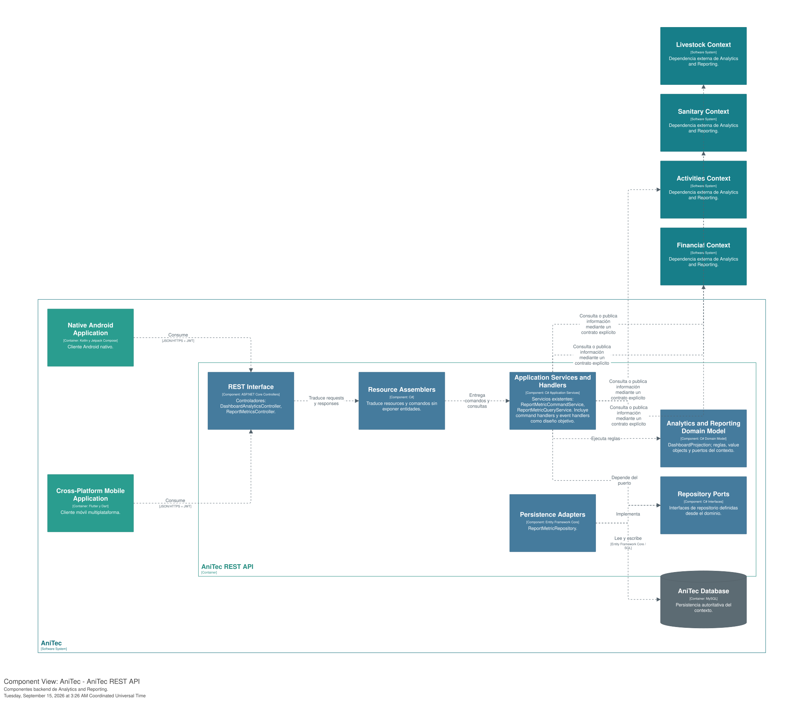
  
<i>Figura 2.6.9.1. Componentes de la API para Analytics and Reporting. Fuente: elaboración propia con Structurizr DSL.</i>

  
  
<i>Figura 2.6.9.2. Componentes Android para Analytics and Reporting. Fuente: elaboración propia con Structurizr DSL.</i>

  
  
<i>Figura 2.6.9.3. Componentes Flutter para Analytics and Reporting. Fuente: elaboración propia con Structurizr DSL.</i>

## 2.6.9.6. Bounded Context Software Architecture Code Level Diagrams

Los diagramas de código detallan el modelo del dominio y los objetos de persistencia. El UML diferencia los elementos existentes de las incorporaciones objetivo, mientras los esquemas SQL señalan mediante comentarios las columnas propuestas. Los archivos ERD quedan disponibles para completar la importación manual.

### 2.6.9.6.1. Bounded Context Domain Layer Class Diagrams

El Class Diagram incluye agregados, entidades, value objects, enumeraciones, servicios de dominio e interfaces de repositorio con atributos, operaciones, visibilidad y multiplicidades.

  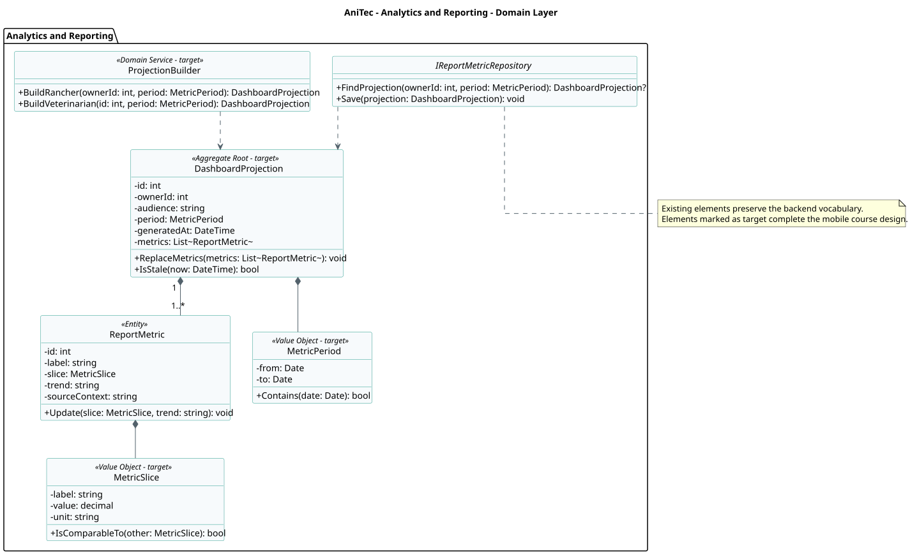
  
<i>Figura 2.6.9.4. Domain Layer Class Diagram de Analytics and Reporting. Fuente: elaboración propia con PlantUML.</i>

### 2.6.9.6.2. Bounded Context Database Design Diagram

MySQL mantiene la persistencia autoritativa. Room y SQLite contienen únicamente caché, metadatos de sincronización y operaciones pendientes; no sustituyen las reglas ni la fuente de verdad del backend. En IAM, las credenciales y tokens permanecen fuera de las tablas locales y se almacenan mediante mecanismos seguros del sistema operativo.

  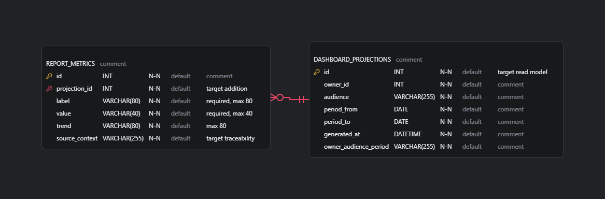
  
<i>Figura 2.6.9.5. MySQL Database Design de Analytics and Reporting. Fuente: elaboración propia a partir del esquema SQL.</i>

  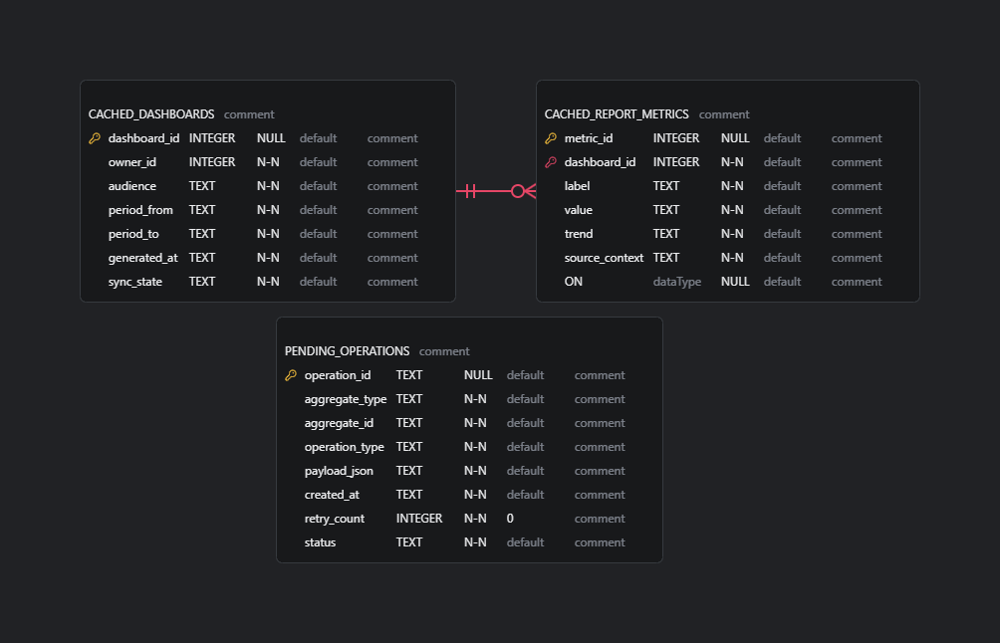
  
<i>Figura 2.6.9.6. Android Room Database Design de Analytics and Reporting. Fuente: elaboración propia a partir del esquema SQL.</i>

# Capítulo III: Solution UI/UX Design

# 3.1. Product design

## 3.1.1. Style Guidelines

### 3.1.1.1. General Style Guidelines

## 3.1.2. Information Architecture

### 3.1.2.1. Organization Systems

### 3.1.2.2. Labelling Systems

### 3.1.2.3. SEO Tags and Meta Tags

### 3.1.2.4. Searching Systems

### 3.1.2.5. Navigation Systems

## 3.1.3. Landing Page UI Design

### 3.1.3.1. Landing Page Wireframe

### 3.1.3.2. Landing Page Mock-up

## 3.1.4. Mobile Applications UX/UI Design

### 3.1.4.1. Mobile Applications Wireframes

### 3.1.4.2. Mobile Applications Wireflow Diagrams

### 3.1.4.3. Mobile Applications Mock-ups

### 3.1.4.4. Mobile Applications User Flow Diagrams

### 3.1.4.5. Mobile Applications Prototyping

# Capítulo IV: Product Implementation & Validation

# 4. Product Implementation & Validation

# 4.1. Software Configuration Management

## 4.1.1. Software Development Environment Configuration

## 4.1.2. Source Code Management

## 4.1.3. Source Code Style Guide & Conventions

## 4.1.4. Software Deployment Configuration

# 4.2. Landing Page & Mobile Application Implementation

## 4.2.1. Sprint n

### 4.2.1.1. Sprint Planning n

### 4.2.1.2. Aspect Leaders and Collaborators

### 4.2.1.3. Sprint Backlog n

### 4.2.1.4. Development Evidence for Sprint Review

### 4.2.1.5. Testing Suite Evidence for Sprint Review

### 4.2.1.6. Execution Evidence for Sprint Review

### 4.2.1.7. Services Documentation Evidence for Sprint Review

### 4.2.1.8. Software Deployment Evidence for Sprint Review

### 4.2.1.9. Team Collaboration Insights during Sprint

# 4.3. Validation Interviews

## 4.3.1. Diseño de Entrevistas

## 4.3.2. Registro de Entrevistas

## 4.3.3. Evaluaciones según heurísticas

# Conclusiones

## Conclusiones y recomendaciones

### Conclusiones

El proyecto AniTec permitio validar la necesidad de una solucion digital orientada a ganaderos y veterinarios, debido a que ambos segmentos requieren mayor orden, trazabilidad y disponibilidad de informacion sobre animales, fincas, actividades, sanidad y gastos. Las entrevistas y validaciones realizadas confirmaron que el problema identificado es real y que una plataforma web puede aportar valor si mantiene una experiencia simple, clara y cercana al contexto ganadero.

El diseño del sistema basado en Domain-Driven Design permitio organizar AniTec mediante bounded contexts como IAM, Profiles, Livestock, Sanitary, Financial, Activities, Analytics, Clients, Devices, Metrics y Subscriptions. Esta separacion favorece la mantenibilidad del sistema, facilita la asignacion de responsabilidades dentro del equipo y permite que cada modulo evolucione sin afectar innecesariamente al resto de la aplicacion.

Durante el Sprint 1 se logro establecer la presencia digital del producto mediante una landing page funcional desplegada en GitHub Pages. Este avance permitio comunicar la propuesta de valor de AniTec, presentar los beneficios principales para ganaderos y veterinarios, y generar una primera base de validacion frente a usuarios potenciales.

Durante el Sprint 2 se implemento la aplicacion web frontend con Vue, organizada por bounded contexts y conectada inicialmente a datos de prueba mediante my-json-server. Este sprint permitio construir las principales vistas funcionales de la plataforma, validar flujos de navegacion y preparar la estructura necesaria para reemplazar progresivamente los datos mock por servicios reales.

Durante el Sprint 3 se desarrollo el backend real de AniTec con ASP.NET Core, Entity Framework Core y MySQL. La API implementa autenticacion con JWT, gestion de usuarios, perfiles, hatos, animales, eventos sanitarios, actividades, registros financieros, clientes veterinarios, analiticas, dispositivos IoT, metricas, planes, suscripciones y pagos mock. Con ello, el proyecto dejo de depender solamente de datos simulados y paso a contar con una base de servicios persistentes.

La documentacion de servicios mediante Swagger/OpenAPI permitio verificar los endpoints implementados y facilitar las pruebas manuales del backend. Asimismo, las migraciones de Entity Framework Core permitieron mantener alineada la estructura de la base de datos con las entidades del dominio, reduciendo errores en la configuracion y mejorando la trazabilidad tecnica del sistema.

El despliegue del backend en Render representa un avance importante para el proyecto, ya que la API queda disponible desde internet y puede ser consumida por el frontend desplegado. Esto permite validar AniTec en un entorno mas cercano a produccion, comprobar la disponibilidad publica del servicio y preparar futuras pruebas de integracion entre frontend, backend y base de datos.

En relacion con el Student Outcome, el equipo evidencio trabajo colaborativo y liderazgo conjunto durante los tres avances. Cada integrante asumio responsabilidades claras por modulo o artefacto, participo en la planificacion de tareas, colaboro en la integracion del sistema y aporto a la documentacion del producto. Esto permitio cumplir los objetivos de cada sprint de forma progresiva y mantener coherencia entre la propuesta, el diseño, el frontend, el backend y el despliegue.

**Contraste con Lean UX y validaciones:**

El Problem Statement se mantiene vigente, ya que las validaciones confirmaron que ganaderos y veterinarios siguen enfrentando problemas de desorden, registros manuales y falta de trazabilidad. AniTec responde a una necesidad real al centralizar información sanitaria, productiva, económica y operativa en una sola plataforma.

Las Business Assumptions fueron validadas de forma general, debido a que los usuarios reconocieron valor en contar con una solución web para registrar animales, eventos sanitarios, actividades, finanzas, dispositivos IoT y clientes veterinarios. Sin embargo, todavía se requiere reforzar reportes, alertas y campos específicos para aumentar la utilidad percibida.

Las User Assumptions se confirmaron parcialmente, porque los entrevistados comprendieron la navegación por roles y consideraron útiles los dashboards y módulos principales. Aun así, la experiencia debe seguir simplificándose, especialmente en formularios, mensajes de error y explicación de funciones más técnicas como IoT.

Las Feature Assumptions resultaron pertinentes para una primera versión del producto, ya que los usuarios identificaron valor en el registro de animales, historial sanitario, actividades, finanzas y seguimiento veterinario. Como mejora futura, se deben ampliar los campos clínicos, datos del animal y métricas disponibles para apoyar mejores decisiones.

Las Hypothesis Statements fueron parcialmente validadas. Existe interés inicial y una percepción positiva sobre la utilidad de AniTec, especialmente por la centralización de información; no obstante, la adopción dependerá de fortalecer la confianza, mejorar recordatorios, optimizar reportes y facilitar el uso continuo de la plataforma.

Los criterios de éxito quedan planteados como metas para una siguiente etapa de validación con uso real de la aplicación desplegada. Las entrevistas permiten confirmar intención de uso y valor percibido, pero aún falta medir reducción de errores, mejora en precisión de registros y apoyo efectivo a decisiones basadas en datos.

### Recomendaciones

**Corto plazo:** Se recomienda continuar con la integracion completa entre el frontend desplegado en GitHub Pages y el backend desplegado en Render, asegurando que las variables de entorno del frontend apunten a la API real y que los flujos principales funcionen sin depender de my-json-server.

**Corto plazo:** Se recomienda fortalecer la autenticacion y autorizacion del sistema, definiendo permisos por rol para ganaderos, veterinarios y administradores. Esto permitiria proteger los endpoints sensibles y asegurar que cada usuario solo acceda a la informacion correspondiente a su perfil.

**Mediano plazo:** Se recomienda continuar la validacion con ganaderos y veterinarios usando la aplicacion desplegada, no solo prototipos. Esto permitira identificar problemas reales de uso, comprension del lenguaje, dificultad en formularios, utilidad de dashboards y necesidades adicionales en los modulos de sanidad, actividades, finanzas e IoT.

**Mediano plazo:** Se recomienda mejorar la experiencia de usuario del frontend en una siguiente iteracion, priorizando claridad en dashboards, simplificacion de formularios, estados visuales para dispositivos IoT y mejor organizacion del flujo veterinario por clientes asignados.

**Mediano plazo:** Se recomienda completar y fortalecer las pruebas del backend, incluyendo pruebas de endpoints, validacion de reglas de negocio, manejo de errores y pruebas de integracion con la base de datos. Esto ayudara a asegurar mayor estabilidad antes de seguir ampliando funcionalidades.

**Futuro roadmap:** Se recomienda mantener actualizada la documentacion tecnica, incluyendo endpoints, migraciones, evidencias de despliegue, diagramas C4 y decisiones de arquitectura. A medida que AniTec crezca, esta documentacion sera clave para sostener la colaboracion del equipo y facilitar futuras mejoras del producto.

---

## Video About The Team

El video About The Team presenta la participación de los integrantes del equipo Titan Team 4 durante el desarrollo de AniTec, destacando las actividades realizadas, los logros alcanzados en el curso y el desarrollo de competencias asociadas al trabajo colaborativo, liderazgo conjunto, planificación de tareas y cumplimiento de objetivos.

**Datos del video:**

| Elemento | Información |
| -------- | ----------- |
| Título | Video About The Team - AniTec |
| Duración | |
| Público objetivo | Docente del curso, visitantes del landing page e interesados en conocer el proceso de trabajo del equipo |
| URL publicado en Microsoft Stream |  |
| URL publicado en YouTube |  |
| Uso en landing page | El video de YouTube se utiliza como evidencia pública del proceso de trabajo del equipo. |

**URL del video publicado en Microsoft Stream:**

**URL del video publicado en YouTube:**

<!-- Captura del video About The Team pendiente de incorporación. -->

# Bibliografía

AgriWebb. (s. f.). _AgriWebb mobile app_. Recuperado el 13 de septiembre de 2026, de https://www.agriwebb.com/mobile-app/

AgriWebb. (s. f.). _Pricing_. Recuperado el 13 de septiembre de 2026, de https://www.agriwebb.com/us/pricing/

Android Developers. (s. f.). _Jetpack Compose_. Recuperado el 13 de septiembre de 2026, de https://developer.android.com/develop/ui/compose

Android Developers. (s. f.). _Save data in a local database using Room_. Recuperado el 13 de septiembre de 2026, de https://developer.android.com/training/data-storage/room

Bourgau, P. (2022, marzo 29). _Step by step guide to run your big picture event storming_. Philippe Bourgau's Blog. https://bit.ly/bpes-guide

Evans, E. (2003). _Domain-Driven Design: Tackling Complexity in the Heart of Software_. Addison-Wesley Professional.

Food and Agriculture Organization of the United Nations. (2022). _Digital agriculture: Technologies transforming agriculture and food systems_. https://www.fao.org/digital-agriculture/en/

Food and Agriculture Organization of the United Nations. (2023). _Livestock and the environment_. https://www.fao.org/livestock-environment/en/

Firebase. (s. f.). _Firebase App Distribution_. Recuperado el 13 de septiembre de 2026, de https://firebase.google.com/docs/app-distribution

Flutter. (s. f.). _Flutter documentation_. Recuperado el 13 de septiembre de 2026, de https://docs.flutter.dev/

Google for Developers. (s. f.). _Scan barcodes with ML Kit on Android_. Recuperado el 13 de septiembre de 2026, de https://developers.google.com/ml-kit/vision/barcode-scanning/android

Chandrasekaran, P. (2023, marzo 20). _Remote EventStorming in practice_. Domain-driven Design: A Practitioner's Guide. https://ddd-practitioners.com/2023/03/20/remote-eventstorming-workshop/

Cohn, M. (2006). _User stories applied: For agile software development_. Addison-Wesley Professional.

Ddd-By-Examples. (s. f.). library/docs/big-picture.md at master. GitHub. https://github.com/ddd-by-examples/library/blob/master/docs/big-picture.md

Ddd-By-Examples. (s. f.-b). library/docs/design-level.md at master. GitHub. https://github.com/ddd-by-examples/library/blob/master/docs/design-level.md

Gothelf, J., & Seiden, J. (2021). _Lean UX: Designing great products with agile teams_ (3rd ed.). O'Reilly Media.

Instituto Nacional de Estadística e Informática. (2014). _Características socioeconómicas del productor agropecuario en el Perú: IV Censo Nacional Agropecuario 2012_. https://www.inei.gob.pe/media/MenuRecursivo/publicaciones_digitales/Est/Lib1177/libro.pdf

Instituto Nacional de Estadística e Informática. (2025a). _Estadísticas de las tecnologías de información y comunicación en los hogares: Enero-febrero-marzo 2025_. https://www.inei.gob.pe/media/MenuRecursivo/boletines/informe-tecnico_tecnologiasdelainformacion_ene_feb_mar2025.pdf

Instituto Nacional de Estadística e Informática. (2026). _Estadísticas de las tecnologías de información y comunicación en los hogares: Octubre-noviembre-diciembre 2025_. https://www.inei.gob.pe/media/MenuRecursivo/boletines/boletin-tic-oct_dic2025.pdf

iLivestock. (s. f.). _Livestock management software for sheep and cattle farmers_. Recuperado el 13 de septiembre de 2026, de https://www.ilivestock.com/software

iLivestock. (s. f.). _iLivestock Argentina: Innovación y tecnología agrícola_. Recuperado el 13 de septiembre de 2026, de https://www.ilivestock.com/es-ar/ar

Livestock Manager. (s. f.). _Livestock Manager: Made by Pila_. Recuperado el 13 de septiembre de 2026, de https://app.livestockfarm.co/

Microsoft. (2026). _ASP.NET Core documentation_. https://learn.microsoft.com/aspnet/core/

Microsoft. (2026). _Entity Framework Core documentation_. https://learn.microsoft.com/ef/core/

MySQL. (2026). _MySQL 8.0 reference manual_. https://dev.mysql.com/doc/refman/8.0/en/

OpenAPI Initiative. (2026). _OpenAPI specification_. https://spec.openapis.org/oas/latest.html

Pressman, R. S. (2010). _Ingeniería de software: Un enfoque práctico_ (7a ed.). McGraw-Hill.

Scrum.org. (2020). _The Scrum Guide_. https://scrumguides.org/scrum-guide.html

Structurizr. (2026). _Structurizr documentation_. https://docs.structurizr.com/

Stripe. (s. f.). _Use a prebuilt Stripe-hosted payment page_. Recuperado el 13 de septiembre de 2026, de https://docs.stripe.com/payments/checkout

Vue.js. (2026). _Vue.js documentation_. https://vuejs.org/guide/

Weerakoon, S. (2020, 1 noviembre). How to Write a User Story for an API Product. Medium. https://sameera17w.medium.com/how-to-write-a-user-story-for-an-api-product-7af6abd4ad2e

# Anexos

Los siguientes anexos reúnen los enlaces disponibles hasta el AV1. Se incluyen únicamente evidencias utilizadas en los capítulos I y II, repositorios vigentes del curso y despliegues del producto web tomado como base. Los recursos correspondientes a validación de la aplicación móvil y a los siguientes sprints se incorporarán cuando sean elaborados.

## Anexo A. Videos de entrevistas

### Segmento de ganaderos

- [Entrevista 1 - Caterina Rodriguez](https://tinyurl.com/caterinarodri)
- [Entrevista 2 - Rebeca Noemi Quiroz Roldan](https://tinyurl.com/entrevista2RebecaQuiroz)
- [Entrevista 3 - Ursula Trigozo Salcedo](https://upcedupe-my.sharepoint.com/:v:/g/personal/u20231c019_upc_edu_pe/IQDw1Fks32sxQroa9TMJpBhPAffdaO--WIZy3fKexREgNhU?nav=eyJyZWZlcnJhbEluZm8iOnsicmVmZXJyYWxBcHAiOiJTdHJlYW1XZWJBcHAiLCJyZWZlcnJhbFZpZXciOiJTaGFyZURpYWxvZy1MaW5rIiwicmVmZXJyYWxBcHBQbGF0Zm9ybSI6IldlYiIsInJlZmVycmFsTW9kZSI6InZpZXcifX0%3D&e=H1KzAW)

### Segmento de veterinarios

- [Entrevista 4 - Angela Mendoza](https://tinyurl.com/entrevista4AngelaMendoza)
- [Entrevista 5 - Jeferson Castro Pariona](https://tinyurl.com/b3txtyh3)

## Anexo B. Materiales de investigación y diseño

- [Lean UX Canvas de AniTec](https://tinyurl.com/LeanUxCanvasMural)
- [Big Picture EventStorming y artefactos de Strategic-Level DDD](https://tinyurl.com/EventSorming)

Los enlaces públicos del Impact Mapping y del Product Backlog todavía no han sido incorporados al informe. Se añadirán cuando los tableros utilizados por el equipo estén disponibles públicamente.

## Anexo C. Repositorios del curso

- [Repositorio del informe](https://github.com/ADM-1ACC0238-2620-13975-Grupo01/Informe)
- [Repositorio de la landing page](https://github.com/ADM-1ACC0238-2620-13975-Grupo01/anitec-landing-page)
- [Repositorio del frontend web tomado como base](https://github.com/ADM-1ACC0238-2620-13975-Grupo01/anitec-frontend)
- [Repositorio del backend tomado como base](https://github.com/ADM-1ACC0238-2620-13975-Grupo01/anitec-backend)

Los repositorios de Android y Flutter se incorporarán cuando se creen los proyectos móviles correspondientes.

## Anexo D. Despliegues del producto web tomado como base

Estos enlaces corresponden al trabajo anterior que sirve como punto de partida. No constituyen todavía el despliegue de las aplicaciones móviles del curso actual.

- [Landing page de AniTec](https://upc-1asi0730-2610-12206-titan-team-4.github.io/anitec-landing-page/)
- [Aplicación web de AniTec](https://anitec-frontend.onrender.com/)
- [Documentación Swagger del backend](https://anitec-backend.onrender.com/swagger/index.html)

## Anexo E. Herramientas y documentación utilizadas hasta el AV1

### Investigación, requisitos y modelado

- [Miro](https://miro.com/), para Lean UX y EventStorming.
- [UXPressia](https://uxpressia.com/), para User Personas, Empathy Maps y User Journey Maps.
- [Gherkin](https://cucumber.io/docs/gherkin/), para expresar criterios de aceptación mediante Given, When y Then.
- [GitHub](https://github.com/), para control de versiones y colaboración.

### Arquitectura y diagramas

- [Structurizr](https://structurizr.com/), para los diagramas C4.
- [PlantUML](https://plantuml.com/), para los diagramas de clases del dominio.
- [Mermaid](https://mermaid.js.org/), como referencia para diagramas y modelos visuales.

### Tecnologías consideradas para la solución móvil

- [Jetpack Compose](https://developer.android.com/develop/ui/compose), para la interfaz de la aplicación Android nativa.
- [Room](https://developer.android.com/training/data-storage/room), para la persistencia local en Android.
- [Flutter](https://docs.flutter.dev/), para la aplicación multiplataforma.
- [Google ML Kit Barcode Scanning](https://developers.google.com/ml-kit/vision/barcode-scanning/android), para la investigación de identificación mediante códigos QR.
- [Firebase App Distribution](https://firebase.google.com/docs/app-distribution), para la distribución de versiones móviles durante la validación.
- [Stripe Checkout](https://docs.stripe.com/payments/checkout), para el flujo externo de pagos y suscripciones.

## Anexo F. Videos de exposición y validación

Hasta el AV1 no se han incorporado enlaces públicos para el video de exposición, las entrevistas de validación de la aplicación móvil, el video About the Product ni el video About the Team. Estos recursos se añadirán en los hitos que correspondan según el statement del curso.

